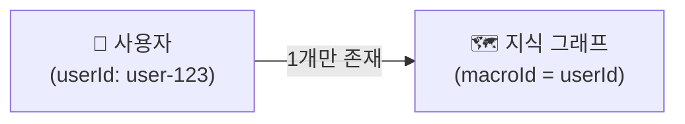
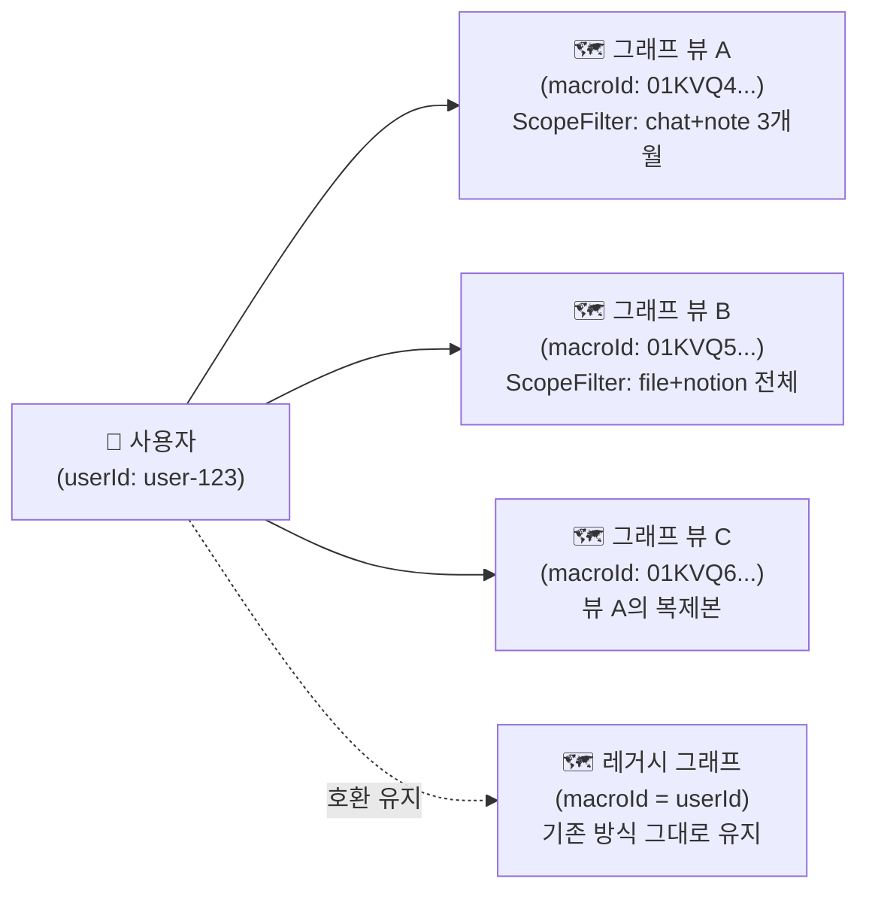

# Multi MacroGraph 리팩터링 — 팀 전체 공유 문서

## 📌 메타 (Meta)
- **작성일**: 2026-06-22 KST
- **스코프 태그**: [BE] [FE] [AI] [QA]
- **관련 커밋 범위**: `e3ad0fc` → `3bdba65` (총 12개 커밋, 2026-06-19 ~ 2026-06-22)
- **작성 배경**: 1:N 멀티 매크로 그래프 아키텍처 전환 완료에 따른 팀 공유 문서

---

## 📝 TL;DR

> **기존**: 사용자 1명 = 지식 그래프 1개 (macroId = userId 고정)  
> **변경**: 사용자 1명 = 지식 그래프 N개 (각 그래프마다 고유 ULID macroId 발급)

FE가 여러 개의 독립적인 지식 그래프 뷰를 생성하고, 각각을 다른 데이터 범위(`ScopeFilter`)로 구성할 수 있게 되었습니다. 기존 1:1 방식으로 생성된 그래프는 **레거시 모드로 그대로 동작**합니다.

---

## 🎯 왜 바꿨는가

| 기존 문제점 | 해결 방향 |
|---|---|
| 사용자가 서로 다른 주제의 그래프를 별도로 관리하고 싶어도 불가능했음 | 각 그래프를 독립적인 `macroId`로 구분하여 완전히 분리 |
| AI가 전체 데이터를 대상으로만 그래프를 생성 | `ScopeFilter`(데이터 유형·기간 필터)를 통해 생성 범위를 제한 가능 |
| 그래프를 복제해 다른 관점에서 편집하는 것이 불가능했음 | Clone API를 통해 기존 그래프를 독립 복사본으로 분기 가능 |

---

## 🔄 변경 전/후 비교

### 변경 전 (1:1 구조)


### 변경 후 (1:N 구조)


---

## 🆕 새로 생긴 핵심 개념

### macroId
- 각 지식 그래프 뷰를 식별하는 **ULID 문자열** (예: `01KVQ43RPDDHMMS8102TX5SZFX`)
- API 요청 시 `macroId` 파라미터를 통해 대상 뷰를 지정
- **없으면 레거시 모드**: `macroId`를 전달하지 않으면 `userId`를 macroId로 사용하는 기존 1:1 방식으로 폴백

### ScopeFilter (그래프 생성 범위 필터)
그래프 생성 시 어떤 데이터를 포함할지 결정하는 필터입니다.

| 모드 | 사용 시나리오 | 필수 필드 |
|---|---|---|
| `auto` | AI가 자율적으로 의미 있는 데이터를 선택 | `intent` (자연어 의도 설명) |
| `manual` | 사용자가 직접 데이터 유형·기간을 지정 | `filters.dataTypes` |

```json
// AUTO 예시
{ "mode": "auto", "intent": "RAG 아키텍처 연구 관련 내용만" }

// MANUAL 예시
{ "mode": "manual", "filters": { "dataTypes": ["chat", "file"], "createdPeriod": "3m" } }
```

### MacroView
그래프 뷰의 메타데이터 컨테이너입니다.

| 필드 | 설명 |
|---|---|
| `macroId` | 뷰 고유 식별자 (ULID) |
| `title` | 사용자가 지정한 뷰 이름 |
| `description` | 뷰 설명 |
| `scopeFilter` | 생성에 사용된 데이터 범위 필터 |
| `status` | 그래프 생성 상태 (`NOT_CREATED` / `CREATING` / `CREATED` / `UPDATING` / `UPDATED`) |
| `nodeCount` | 포함된 노드 수 |
| `deletedAt` | 소프트 삭제 시각 (없으면 활성 상태) |

---

## 🛠 신규 API 목록

### 그래프 뷰 관리 (`/v1/graph/graphs/`)

| 메서드 | 엔드포인트 | 설명 |
|---|---|---|
| `GET` | `/v1/graph/graphs` | 내 그래프 뷰 목록 조회 |
| `GET` | `/v1/graph/graphs/:macroId` | 특정 뷰 메타데이터 조회 |
| `PATCH` | `/v1/graph/graphs/:macroId` | 뷰 제목/설명/범위 수정 |
| `DELETE` | `/v1/graph/graphs/:macroId` | 뷰 소프트 삭제 (휴지통 이동) |
| `POST` | `/v1/graph/graphs/:macroId/clone` | 뷰 복제 (새 macroId 발급) |
| `POST` | `/v1/graph/graphs/:macroId/restore` | 소프트 삭제된 뷰 복원 |

### 그래프 AI 작업 (`/v1/graph-ai/`)

기존 엔드포인트에 **`macroId` 파라미터가 추가**되었습니다.

| 엔드포인트 | macroId 파라미터 위치 | 설명 |
|---|---|---|
| `POST /v1/graph-ai/generate` | Request Body | 특정 뷰에 그래프 생성 요청 |
| `POST /v1/graph-ai/add-node` | Query String | 특정 뷰에 노드 추가 요청 |
| `POST /v1/graph-ai/summary` | Query String | 특정 뷰 요약 생성 요청 |
| `GET /v1/graph-ai/summary` | Query String | 특정 뷰 요약 조회 |

---

## ♻️ 레거시 호환성 (1:1 그래프 사용자)

> [!NOTE]
> **기존 사용자는 아무것도 바꾸지 않아도 됩니다.**

- `macroId` 없이 기존과 똑같이 API를 호출하면, 백엔드가 자동으로 `userId`를 `macroId`로 사용합니다.
- 기존에 생성된 1:1 그래프 데이터는 그대로 유지됩니다.
- FE SDK도 `macroId` 인자를 전달하지 않으면 이전과 동일하게 동작합니다.

---

## 🧪 검증 범위 (E2E 테스트 시나리오)

이번 작업과 함께 E2E 테스트가 대폭 보강되었습니다.

| 시나리오 | 검증 내용 |
|---|---|
| Scenario 1: Graph Generation | macroId를 가진 신규 뷰 그래프 생성 전 과정 (CREATING → CREATED) |
| Scenario 2: Graph Summary | 특정 macroId 뷰의 요약 생성 및 내용 검증 |
| Scenario 3: Add Node | 기존 그래프에 신규 대화/노트 반영 (UPDATING → UPDATED) |
| Scenario 4: Soft Delete Node | 개별 노드 소프트 삭제 및 Neo4j 반영 확인 |
| Scenario 5: MacroView Clone | 그래프 복제 시 독립적인 macroId 발급 및 데이터 무결성 확인 |
| Scenario 6: MacroView Soft Delete | 뷰 소프트 삭제 및 휴지통 목록 반영 확인 |
| Scenario 7: Cascade Delete | 원본 대화 삭제 시 모든 macroId 뷰에 걸쳐 cascade 적용 |
| Scenario 8: Clone Deep-Copy Integrity | 복제된 뷰의 엣지·관계 필드 무결성 검증 |

---

## ⚠️ 후속 점검 필요 항목

> [!WARNING]
> 아래 항목들은 현재 동작에는 문제가 없으나, 향후 보강이 필요한 영역입니다.

1. **알림(Notification) macroId 전파 완성도**
   - `GRAPH_SUMMARY_REQUESTED`, `GRAPH_SUMMARY_COMPLETED`, `GRAPH_SUMMARY_FAILED` 이벤트에는 아직 `macroId`가 포함되지 않습니다.
   - 1:N 환경에서 FE가 요약 이벤트를 올바른 뷰와 연결하려면 추가 작업이 필요합니다.

2. **`AddConversationCompletedPayload`의 macroId 누락**
   - 성공 알림 페이로드에 `macroId`가 없어, FE에서 어떤 뷰의 업데이트가 완료된 것인지 식별이 어렵습니다.

3. **AI 서버의 `ADD_NODE_RESULT` macroId 미반환 문제**
   - 현재 AI 서버가 ADD_NODE_RESULT 페이로드에 `macroId`를 포함하지 않아, 백엔드가 Redis 캐시로 복구하는 우회 방식을 사용 중입니다.
   - AI 서버도 결과 페이로드에 `macroId`를 echo-back 하도록 수정하면 더 안정적입니다.
