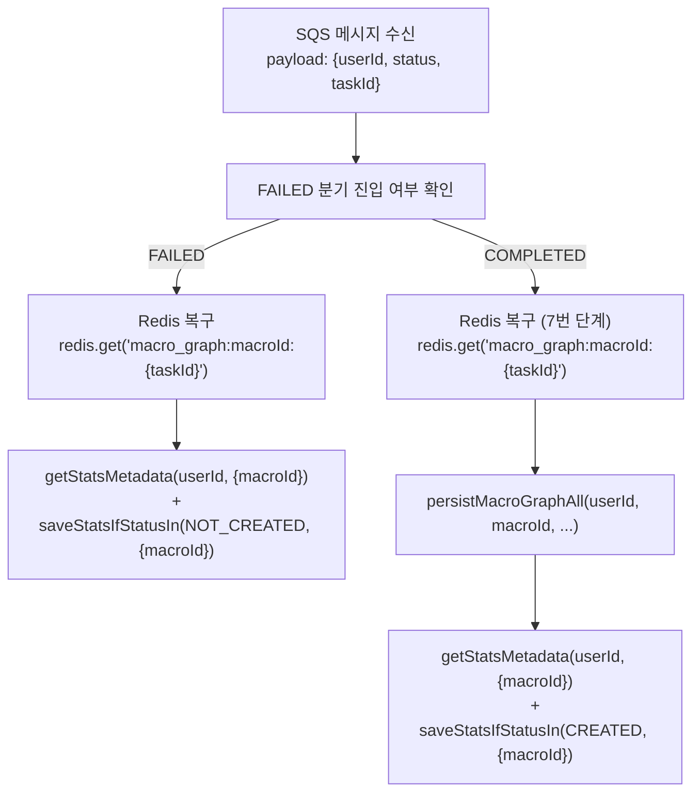
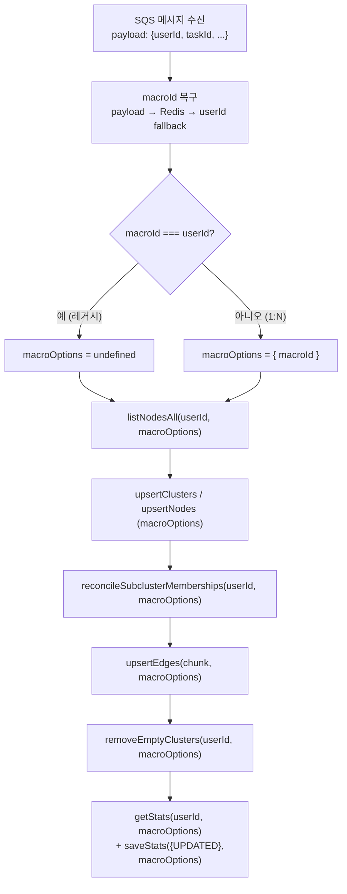

# Multi MacroGraph 1:N 리팩터링 — BE 개발자 상세 가이드

## 📌 메타 (Meta)
- **작성일**: 2026-06-22 KST
- **스코프 태그**: [BE]
- **관련 커밋 범위**: `e3ad0fc` → `3bdba65` (총 12개 커밋)
- **독자**: 백엔드 개발자 (신규 합류 포함)

---

## 📝 TL;DR

이 문서는 1:1 단일 그래프 구조에서 1:N 멀티 그래프(`macroId` 기반)로 전환하는 과정에서 **BE 코드베이스가 어떻게 변경되었는지**를 인프라 레벨까지 상세히 기술합니다.

**핵심 패턴 3가지:**
1. `RepoOptions.macroId` — 모든 DB 제어 함수에 macroId를 전파하는 계약
2. **Redis 브리지** — AI 서버가 결과에 macroId를 미포함할 때 요청 시점 값을 복구하는 패턴
3. **`macroOptions = undefined` 레거시 폴백** — macroId === userId이면 기존 동작과 동일하게 작동

---

## 🗂 커밋 타임라인

| 커밋 | 메시지 요약 | 핵심 변경 |
|---|---|---|
| `e3ad0fc` | FEAT: Neo4j 데이터 구조 및 API 구축 | MacroView CRUD API, Neo4j 노드 구조, ScopeFilter, MacroViewService 신설 |
| `54a83e7` | FEAT: FE SDK 메서드 추가 및 E2E 구축 | SDK graph/graphAi 메서드 추가, E2E 01/02 spec 작성 |
| `19ca8a7` | FIX: E2E 이미지 캐시 정책 변경 | CI/CD mode=min 캐시 정책 적용 |
| `1f85993` | FIX: E2E 이미지 캐시 정책 변경 | CI 파이프라인 안정화 |
| `e55876d` | FIX: BE-AI-flow-test.yml 업데이트 | E2E 워크플로우 구조 개선 |
| `85f4238` | FIX: Neo4j write 세션 충돌 수정 | 단일 세션 내 write 트랜잭션 분리 |
| `92b5cd5` | FIX: E2E 시나리오 1:N 대응 추가/수정 | Scenario 5~8 신규, macroId 폴링 로직 개선 |
| `c2f9269` | FIX: GraphGenerationService 책임 분리 | requestAddNodeViaQueue 분리, Redis 캐싱 추가 |
| `2c0d9ba` | FIX: Neo4j Transaction 중복 생성 오류 수정 | 트랜잭션 재사용 패턴 정립 |
| `4448869` | FIX: E2E 동시 실행 충돌 수정 | `--runInBand` 직렬 실행 강제 |
| `26ee311` | FIX: 레거시 호환성 보장, macroOptions 폴백 | macroId === userId → macroOptions = undefined |
| `3d7d05b` | FIX: 유닛 테스트 로직 오류 수정 | spec 파일 macroOptions 인자 Assertion 추가 |
| `3bdba65` | FIX: Redis macroId 보존 구축 | AddNodeResultHandler Redis 복구 패턴 적용 |

---

## 🗄 Neo4j 데이터 모델

### 노드(Node) 구조

```
(MacroGraph {userId, macroId, title, description, scopeFilter, createdAt, updatedAt, deletedAt})
    │ HAS_NODE
    ▼
(MacroNode {userId, macroId, id, origId, nodeType, fileType, clusterId, deletedAt, ...})
    │ BELONGS_TO
    ▼
(MacroCluster {userId, macroId, id, name, deletedAt, ...})
    │ HAS_SUBCLUSTER
    ▼
(MacroSubcluster {userId, macroId, id, ...})

(MacroRelation {userId, macroId, id, ...})
    │ RELATES_SOURCE ──► (MacroNode)
    │ RELATES_TARGET ──► (MacroNode)

(MacroNode) ──MACRO_RELATED──► (MacroNode)
(MacroSubcluster) ──CONTAINS──► (MacroNode)
(MacroSubcluster) ──REPRESENTS──► (MacroNode)
```

> [!IMPORTANT]
> **모든 엔티티에 `macroId`가 복합 키의 일부로 포함됩니다.**  
> Neo4j Unique Constraint는 `(userId, macroId, id)` 또는 `(userId, macroId, origId)` 조합으로 설정되어 있습니다.

### Clone 시 Cypher 패턴

클론 작업은 Cypher `SET newNode += n, newNode.macroId = $newMacroId` 패턴을 사용합니다. `+=` 연산자로 원본의 모든 프로퍼티를 복사한 뒤, `newMacroId`로 덮어써 새 뷰의 식별자를 부여합니다.

```cypher
-- cloneMacroGraphNodes 예시 --
MATCH (src:MacroGraph {userId: $userId, macroId: $sourceMacroId})
MATCH (dst:MacroGraph {userId: $userId, macroId: $newMacroId})
CALL {
  WITH src, dst
  MATCH (src)-[:HAS_NODE]->(n:MacroNode {userId: $userId})
  WHERE n.deletedAt IS NULL
  MERGE (newNode:MacroNode {userId: $userId, macroId: $newMacroId, id: n.id})
  SET newNode += n, newNode.macroId = $newMacroId  -- ← 핵심: 원본 복사 후 macroId 덮어쓰기
  MERGE (dst)-[:HAS_NODE]->(newNode)
}
```

---

## 🔧 RepoOptions / MacroGraphStoreOptions 패턴

### 인터페이스 정의 (위치: `src/core/ports/MacroGraphStore.ts`)

```typescript
export interface MacroGraphStoreOptions {
  transaction?: unknown;      // opaque Neo4j transaction 객체
  session?: unknown;          // opaque Neo4j session 객체
  afterCommit?: Array<() => Promise<void>>;
  includeDeleted?: boolean;   // soft delete 항목 포함 여부 (기본: false)
  macroId?: string;           // 대상 매크로 뷰 ID ← 1:N 핵심 필드
}
```

> [!IMPORTANT]
> **Core 계층은 Neo4j driver를 직접 import하지 않습니다.**  
> `transaction`, `session`은 Adapter 계층(`Neo4jMacroGraphAdapter`)이 해석하는 opaque 타입입니다.
> Core 서비스는 이 인터페이스를 통해 DB 접근 범위를 `macroId`로 스코프합니다.

### 사용 원칙

```typescript
// ✅ 올바른 사용 — 1:N 뷰 대상 (macroId가 userId와 다른 경우)
const macroOptions = macroId && macroId !== userId ? { macroId } : undefined;
await graphService.listNodesAll(userId, macroOptions);
await graphService.saveStats(stats, macroOptions);

// ✅ 올바른 사용 — 레거시 (macroId === userId 또는 없는 경우)
await graphService.listNodesAll(userId, undefined);  // 기존 동작과 동일

// ❌ 잘못된 사용 — macroId를 알고 있음에도 전달하지 않음
// 이 경우 다른 뷰(레거시)의 데이터를 덮어쓰는 데이터 오염이 발생함
await graphService.saveStats(stats);  // ← macroOptions 누락 → 데이터 오염 버그
```

---

## 🔴 Redis 브리지 패턴

### 도입 배경

AI 서버(`GraphNode_AI/server/worker.py`)는 다음 3가지 결과 메시지에 **`macroId`를 포함하지 않습니다**:
- `ADD_NODE_RESULT` — AI가 macroId를 echo-back 하지 않음
- (참고) `GRAPH_GENERATION_RESULT`, `GRAPH_SUMMARY_RESULT`는 AI가 처음부터 미포함

이를 해결하기 위해 **요청 시점에 Redis에 macroId를 캐싱**하고, **결과 처리 시점에 복구**하는 패턴을 채택했습니다.

### Redis 키 구조

| 키 패턴 | 저장 시점 | 조회 시점 | TTL |
|---|---|---|---|
| `macro_graph:macroId:{taskId}` | `GraphGenerationService.requestGraphGenerationViaQueue()` | `GraphGenerationResultHandler.handle()` | 86400초 (24h) |
| `graph-summary:macroId:{taskId}` | `GraphGenerationService.requestGraphSummary()` | `GraphSummaryResultHandler.handle()` | 86400초 (24h) |
| `add-node:macroId:{taskId}` | `GraphGenerationService.requestAddNodeViaQueue()` | `AddNodeResultHandler.handle()` | 86400초 (24h) |

### 구현 패턴 (모든 핸들러 공통)

```typescript
// 1. 요청 시점 저장 (GraphGenerationService.ts)
try {
  await redis.set(`add-node:macroId:${taskId}`, macroId ?? userId, 'EX', 86400);
} catch (cacheErr) {
  logger.warn({ err: cacheErr, userId, taskId }, 'Failed to cache macroId for add-node task');
}

// 2. 결과 처리 시점 복구 (AddNodeResultHandler.ts)
let macroId = payloadMacroId;          // payload에 있으면 우선 사용
if (!macroId) {
  try {
    macroId = (await redis.get(`add-node:macroId:${taskId}`)) ?? userId;
  } catch {
    macroId = userId;                  // Redis 장애 시 레거시 모드로 graceful fallback
  }
}
const macroOptions = macroId && macroId !== userId ? { macroId } : undefined;
```

### 우선순위 체계

```
payload.macroId (AI echo-back, 현재 없음)
    ↓ (없으면)
redis.get(`add-node:macroId:{taskId}`) (요청 시 저장)
    ↓ (없거나 Redis 장애 시)
userId (레거시 폴백)
```

---

## 🔄 워커 핸들러 macroId 처리 흐름

### GraphGenerationResultHandler



> [!WARNING]
> **FAILED 분기에서도 macroId 복구가 선행되어야 합니다.**  
> 이전 버전에서는 FAILED 경로가 상단에서 `let macroId`를 선언하기 전에 실행되어,  
> `userId` 기반 레거시 stats를 NOT_CREATED로 덮어쓰는 버그가 있었습니다.  
> 현재는 `let macroId = userId` 초기화를 함수 진입부로 호이스팅하여 해결했습니다.

### AddNodeResultHandler



---

## 🏗 GraphManagementService 신규 메서드

위치: `src/core/services/GraphManagementService.ts`

| 메서드 | 설명 |
|---|---|
| `listMacroViews(userId, query)` | 활성/삭제 뷰 목록 조회. `onlyDeleted` 플래그로 휴지통 조회 |
| `getMacroView(userId, macroId)` | 단일 뷰 메타데이터 조회 |
| `updateMacroView(userId, macroId, patch)` | 뷰 title/description/scopeFilter 수정 |
| `softDeleteMacroView(userId, macroId)` | deletedAt 타임스탬프 설정 (휴지통 이동) |
| `restoreMacroView(userId, macroId)` | deletedAt 제거 (휴지통에서 복원) |
| `cloneMacroView(userId, sourceMacroId)` | 새 ULID macroId 발급 후 Neo4j 전체 Deep Clone 수행 |

### cloneMacroView 내부 흐름

```typescript
async cloneMacroView(userId: string, sourceMacroId: string): Promise<MacroViewDto> {
  const newMacroId = ulid();         // 1. 새 ULID 발급
  // 2. Neo4j에 10개 쿼리 순차 실행:
  //    cloneMacroGraphRoot
  //    cloneMacroGraphNodes / Clusters / Relations / Subclusters
  //    cloneMacroGraphBelongsTo / RelatesSource / RelatesTarget
  //    cloneMacroGraphMacroRelated / Contains / Represents / HasSubcluster
  await this.repo.cloneMacroGraph(userId, sourceMacroId, newMacroId);
  return { macroId: newMacroId, userId, ... };
}
```

---

## 🧪 유닛 테스트 전략

### macroOptions 인자 추가 후 Assertion 패턴

1:N 전환으로 서비스 메서드가 `options?: RepoOptions`를 추가로 받게 되면서, 기존 유닛 테스트의 `toHaveBeenCalledWith` 검증도 업데이트되었습니다.

```typescript
// ❌ 이전 패턴 (macroOptions 누락, 테스트 실패)
expect(mockGraphService.saveStats).toHaveBeenCalledWith(
  expect.objectContaining({ status: 'UPDATED' })
);

// ✅ 현재 패턴 — macroId가 있는 경우
expect(mockGraphService.saveStats).toHaveBeenCalledWith(
  expect.objectContaining({ status: 'UPDATED' }),
  { macroId: 'some-macro-id' }
);

// ✅ 현재 패턴 — 레거시(macroId 없음, macroOptions = undefined)
expect(mockGraphService.saveStats).toHaveBeenCalledWith(
  expect.objectContaining({ status: 'UPDATED' }),
  undefined
);
```

> [!IMPORTANT]
> **유닛 테스트에서 macroOptions를 제거하거나 src 코드를 롤백하지 마세요.**  
> macroOptions 전파는 1:N 아키텍처의 핵심이며, E2E 테스트를 통해 검증된 정답입니다.

---

## 🔍 E2E 테스트 구조

### 파일 위치 및 역할

| 파일 | 역할 |
|---|---|
| `tests/e2e/specs/01-graph-flow.spec.ts` | 그래프 생성 전 과정 (Scenario 1~8) |
| `tests/e2e/specs/02-macro-view-flow.spec.ts` | 뷰 CRUD 전용 (생성, 수정, 삭제, 복원) |
| `tests/e2e/specs/02-graph-add-node-dedup.spec.ts` | AddNode 시 중복 방지 및 Ghost Cluster 정리 |
| `tests/e2e/utils/macro-stats-poll.ts` | `macroId` 기반 그래프 상태 폴링 유틸 |

### pollMacroStatsUntil 유틸

E2E 테스트에서 비동기 완료를 기다리기 위해 Neo4j에서 `MacroStats`의 `status` 필드를 주기적으로 폴링합니다.

```typescript
// 사용 예시
const isFinished = await pollMacroStatsUntil({
  neo4jDriver,
  userId: 'user-12345',
  macroId: '01KVQ43RPDDHMMS8102TX5SZFX',   // ← 반드시 대상 macroId 지정
  targetStatuses: ['UPDATED'],
  maxAttempts: 30,
  intervalMs: 60_000,
  label: 'Scenario 3 AddNode',
});
expect(isFinished).toBe(true);
```

---

## 🛡️ 인증 미들웨어 (internalOrSession) 및 E2E 테스트 대응

1:N 리팩터링과 더불어 E2E 테스트 스펙(특히 Scenario 7 Cascade Delete)이 안정적으로 동작하도록 `AiRouter`의 미들웨어를 교체했습니다.

### 변경 사항
- **이전**: `router.use(bindSessionUser, requireLogin)` (JWT 및 Signed Cookie 기반 인증만 허용)
- **변경 후**: `router.use(internalOrSession)` (`x-internal-token` + `x-user-id` 조합 허용)

### 도입 배경 (E2E 401 버그 해결)
E2E 테스트의 `apiClient`는 내부망 통신 시뮬레이션을 위해 `x-internal-token: ci-test-key`와 `x-user-id` 헤더를 사용합니다. 
기존 `AiRouter`는 JWT 기반 검증(`authJwt` = `bindSessionUser`)만 수행하여, 토큰이 만료되지 않았음에도 내부 토큰 헤더를 인식하지 못해 테스트 도중 `401 Unauthorized`를 반환하는 문제가 있었습니다.

이를 `GraphRouter` 및 `GraphAiRouter`와 동일한 패턴인 `internalOrSession`으로 교체하여, E2E 테스트 클라이언트가 보내는 내부 토큰을 정상적으로 허용하면서도, 일반 사용자(세션/JWT)의 보안 수준은 `bindSessionUser`로 폴백시켜 그대로 유지되도록 아키텍처 일관성을 확보했습니다.

---

## ⚠️ 후속 보강 필요 항목

> [!CAUTION]
> 아래는 현재 기능은 동작하나 기술 부채로 남아 있는 항목입니다.

### 1. AI 서버 결과 페이로드에 macroId 추가 (높음)

현재 `ADD_NODE_RESULT`, `GRAPH_GENERATION_RESULT`, `GRAPH_SUMMARY_RESULT` 모두 AI 서버가 macroId를 echo-back 하지 않아 Redis 브리지에 의존합니다. AI 서버(`GraphNode_AI/server/worker.py`)의 `GraphGenResultPayload`에 macroId를 포함하도록 수정하면 Redis 의존성을 제거할 수 있습니다.

### 2. 알림 완성도 (중간)

`GRAPH_SUMMARY_REQUESTED/COMPLETED/FAILED` 이벤트에 macroId가 없습니다. FE가 요약 이벤트를 올바른 뷰와 연결하려면 `NotificationService.sendGraphSummary*` 메서드 시그니처에도 `macroId?: string`을 추가해야 합니다.

### 3. `AddConversationCompletedPayload` macroId 누락 (중간)

성공 알림(`ADD_CONVERSATION_COMPLETED`)의 payload에 macroId가 없어 FE에서 어떤 뷰가 업데이트 완료된 것인지 특정할 수 없습니다.

### 4. Cascade Delete 로직 크로스-뷰 검증 (낮음)

Scenario 7 (Cascade Delete)에서 원본 대화를 삭제할 때 모든 macroId 뷰에 걸쳐 cascade가 올바르게 적용되는지 추가 엣지 케이스 테스트가 필요합니다.
