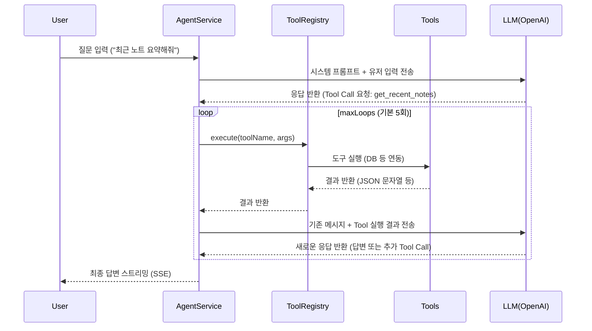

# AI Agent Architecture

> **작성일자:** 2026-05-17
> **버전:** 1.0.0

GraphNode의 AI Agent는 사용자의 채팅 요청을 분석하여 모드를 분류하고, 외부 데이터 저장소(DB, Graph DB, Microscope 등)와 연동해 최적의 답변을 생성하는 핵심 백엔드 기능입니다. **Function Calling (Tool Calling)**을 기반으로 **ReAct(Reasoning and Acting)** 루프를 구현하여 작동합니다.

## 1. Code Structure & Layer Design

에이전트 기능은 다음과 같은 계층(Layer) 구조로 설계되어 있습니다:

```mermaid
graph TD
    A[Client Request] --> B(AgentController)
    B -->|DTO Parsing & Routing| C(AgentService)
    
    C -->|1. Classifier Prompt| LLM_Classify((LLM: gpt-4o-mini))
    LLM_Classify -.->|Mode: chat, summary, note, irrelevant| C
    
    C -->|2. handleChatMode| D[ToolRegistry]
    D -->|Get Available Tools| C
    
    C -->|3. Tool Calling Loop| LLM_Chat((LLM: gpt-4o-mini))
    LLM_Chat -.->|Tool Request| C
    C -->|Execute Tool| D
    D -->|Tool Result| C
    
    subgraph "Tools (src/agent/tools/)"
        T1(SearchNotesTool)
        T2(MicroscopeContextTool)
        T3(GetGraphSummaryTool)
        T4(...)
    end
    
    D --> T1
    D --> T2
    D --> T3
    
    C -->|4. Final Answer (SSE)| A
```

### 디렉토리 구조 및 역할
- `src/app/controllers/AgentController.ts`: 진입점. Request Body 파싱, `microscopeGroupId` 추출 등.
- `src/core/services/AgentService.ts`: 메인 비즈니스 로직. 사용자의 의도를 분석(Classifier)하고 모드(`chat`, `note`, `summary`, `irrelevant`)에 따라 프롬프트를 조정하며 ReAct 루프를 관리합니다.
- `src/agent/ToolRegistry.ts`: 사용 가능한 Tool들을 중앙 집중식으로 등록하고 관리, 실행을 대행합니다.
- `src/agent/tools/*`: 실제 도구들의 비즈니스 구현체. `IAgentTool` 인터페이스를 상속받습니다.

---

## 2. Agent Logic Flow (ReAct Pattern)

현재 `handleChatMode`에서 구현된 AI 에이전트 동작 흐름(ReAct Pattern)입니다.



---

## 3. Implemented Tools

현재 버전을 기준으로 `ToolRegistry`에 등록된 도구 목록과 핵심 기능입니다.

| 도구 이름 | 클래스명 | 동작 로직 (요약) |
| :--- | :--- | :--- |
| `get_microscope_context` | `MicroscopeContextTool` | `microscopeGroupId`를 받아 해당 워크스페이스의 노드, 엣지, 원본 노트/대화를 텍스트로 합쳐서 LLM 컨텍스트로 주입. |
| `search_notes` | `SearchNotesTool` | 키워드로 사용자의 노트를 검색하여 제목과 ID, 요약을 반환. |
| `get_recent_notes` | `GetRecentNotesTool` | 시간순으로 가장 최근에 작성된 노트 목록 조회. |
| `get_note_content` | `GetNoteContentTool` | 특정 노트의 전체 원문 내용을 조회 (ID 기반). |
| `search_conversations` | `SearchConversationsTool` | Graph RAG 방식으로 이전 대화 내용을 벡터 유사도 + 1/2 홉 이웃 노드 확장 검색 수행. |
| `get_recent_conversations`| `GetRecentConversationsTool` | 최근 대화 목록 조회. |
| `get_conversation_messages`| `GetConversationMessagesTool` | 특정 대화(세션)의 상세 메시지 기록 조회. |
| `get_graph_summary` | `GetGraphSummaryTool` | 지식 그래프 전체 통계 및 주요 클러스터 정보를 제공. |

---

## 4. Deep Dive: MicroscopeContextTool & Future Extensibility

### 현재 MicroscopeContextTool의 역할
이 툴은 사용자가 특정 'Microscope View' 화면을 보고 있을 때 LLM이 화면 상의 데이터 컨텍스트를 이해할 수 있도록 돕습니다. 
1. 워크스페이스의 Graph Nodes & Edges를 가져옵니다.
2. 상태가 `COMPLETED`인 원본 문서 리스트를 조회합니다.
3. 문서의 `nodeType` (`note`, `conversation`)을 판별하여 `NoteService` 또는 `ConversationService`에서 텍스트(원문)를 긁어옵니다.

### 추후 데이터타입 확장 시 대응 방향성
만약 사용자의 데이터 타입이 `file`, `notion`, `obsidian` 등으로 확장된다면 에이전트 구조는 다음과 같이 수정/확장되어야 합니다.

1. **`MicroscopeContextTool.ts` 수정 사항**:
    - `fetchSourceText` 내부의 `switch(doc.nodeType)` 분기문에 `file`, `notion`, `obsidian` 케이스가 추가되어야 합니다.
    - 이를 위해 `AgentServiceDeps`에 `notionService`, `fileStorageService` 등 신규 도메인 서비스가 주입되어야 합니다.
    ```typescript
    case 'notion': {
        const notionDoc = await notionService.getPage(doc.nodeId, userId);
        return `[Notion: ${notionDoc.title}]\n${notionDoc.content}`;
    }
    ```

2. **새로운 개별 Tool들의 요구 (ToolRegistry 확장)**:
    - 현재의 `search_notes`나 `get_note_content`와 같이, **데이터 소스별 특화 도구**가 추가로 요구될 것입니다.
    - **예상되는 신규 Tools**:
        - `search_notion_pages` / `get_notion_content`
        - `search_files` / `extract_file_content` (PDF, Word 문서 내부 텍스트 파싱)
    - 도구가 너무 많아지면 LLM의 판단력이 저하될 수 있으므로, 향후에는 `search_all_documents` 처럼 내부적으로 ElasticSearch/VectorDB를 거쳐 통합 검색을 수행하는 **Unified Search Tool** 패턴으로의 리팩토링이 필요할 수 있습니다.

3. **System Prompt 동적 조정 (`AgentService.ts`)**:
    - `getChatSystemPrompt`에서 LLM에게 "Notion 문서가 있으니 `get_notion_content` 툴을 써라" 등 사용자의 활성 Integration 상태에 따라 사용 가능한 툴 설명을 동적으로 주입해 주어야 환각(Hallucination) 없이 도구를 적절히 선택할 수 있습니다.
