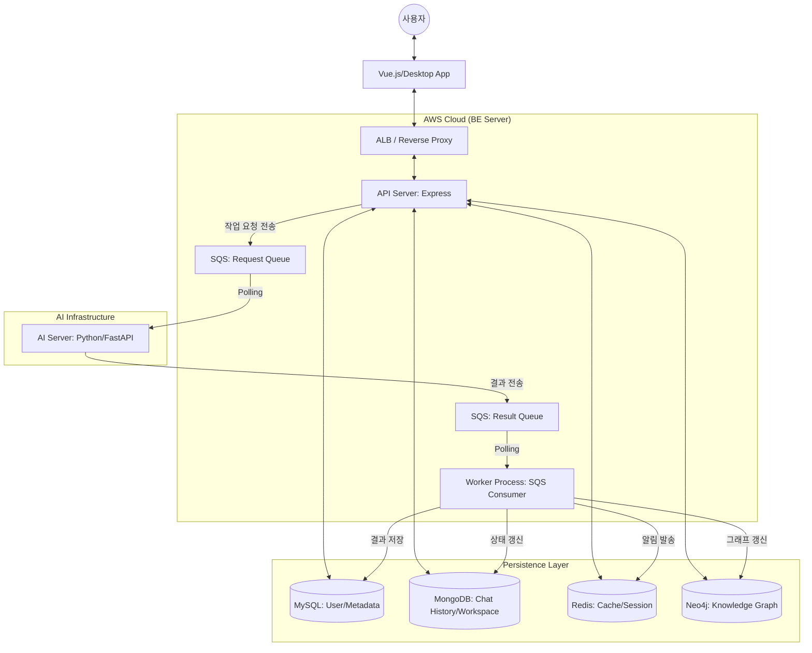

# System Architecture

GraphNode Backend는 확장성과 유지보수성을 극대화하기 위해 **계층형 아키텍처(Layered Architecture)**와 **이벤트 기반 비동기 처리(Event-Driven Asynchronous Processing)** 패턴을 채택하고 있습니다.

## 1. 개요 (Overview)

GraphNode 서비스는 사용자의 대화와 지식 간의 관계를 시각화하는 복잡한 연산을 수행합니다. 이를 위해 무거운 연산(AI 처리, 그래프 생성 등)을 API 서버의 주 스레드에서 분리하여 백그라운드 워커에서 처리하는 구조를 가집니다.

## 2. 주요 구성 요소 (Components)

### 2.1 API Server (Main Application)
- **책임**: 사용자의 HTTP 요청 처리, 권한 검증(JWT), CRUD 인터페이스 제공.
- **포트**: 3000 (ECS ALB를 통해 외부 노출)

### 2.2 Worker Process (Background Worker)
- **책임**: AI 서버로부터 돌아오는 분석 결과(SQS 메시지)를 수신하여 DB에 반영하고 알림을 처리.
- **특징**: 외부 HTTP 요청을 받지 않는 독립된 ECS 서비스로 구동됩니다.

### 2.3 SQS (Message Broker)
- **Request Queue**: API 서버가 AI 서버에 분석을 요청할 때 사용.
- **Result Queue**: AI 서버가 연산을 마치고 BE에 결과를 돌려줄 때 사용.
- **장점**: 서비스 간 결합도(Coupling)를 낮추고, 부하 발생 시 메시지를 버퍼링하여 시스템 안정성을 보장합니다.

## 3. 데이터 아키텍처 (Data Layer)

| 저장소 | 역할 | 이유 |
| :--- | :--- | :--- |
| **MySQL (Prisma)** | 사용자 정보, 메타데이터 연동 제어 | 관계형 데이터의 무결성 보호 |
| **MongoDB** | 대화/노트 데이터, Microscope 워크스페이스 구조화 상태 추적 | 비정형 문서 데이터의 유연한 확장성 확보 |
| **Neo4j** | 대화형/문서형 지식 그래프의 노드 간 관계 맵 및 클러스터링 보관 | 지식 구조의 명시적 관계 추적 및 시각적 탐색 효율성 |
| **Redis** | 세션 정보, 실시간 알림 큐, 캐시 | 빠른 읽기/쓰기 성능 및 TTL 기반 알림 제어 |

## 4. 확장 전략 (Scalability)

1.  **Horizontal Pod Autoscaling**: CPU/Memory 부하에 따라 ECS Service의 태스크 수를 자동으로 늘려 대응합니다.
2.  **Process Separation**: 무거운 연산은 별도의 Worker가 처리하므로, 사용자가 몰려도 API 서버의 반응 속도는 유지됩니다.
3.  **Database Decoupling**: 용도별로 DB를 분리하여 특정 저장소의 부하가 전체 시스템에 영향을 주지 않도록 설계되었습니다.
