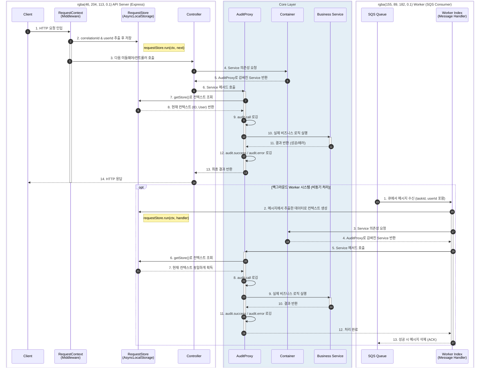

# 📝 Audit Logging & Context System

GraphNode Backend는 **누가(Who), 언제(When), 무엇을(What), 어떻게(How)** 수행했는지를 추적하기 위해 강력한 로깅 및 컨텍스트 관리 시스템을 갖추고 있습니다. API 서버는 물론, 백그라운드 Worker 프로세스까지 동일한 규격으로 작동하도록 설계되어 있습니다.

## 📊 시스템 전체 흐름도 (Flowchart)

## 1. Request Context (`src/shared/context/requestStore.ts`)

Node.js는 싱글 스레드 이벤트 루프 모델이므로, 요청 별 상태를 전역 변수에 저장할 수 없습니다. 대신 **AsyncLocalStorage**를 사용하여 요청의 생명주기 동안 유지되는 컨텍스트를 관리합니다.

### **역할 및 원리**
- **AsyncLocalStorage**: Node.js 내장 모듈로, 비동기 호출 체인 간에 데이터를 공유하는 "가상의 보관함(서랍)"을 만듭니다.
- **RequestContext 구성 요소**:
  - `correlationId`: 요청 고유 ID (Trace ID). 로그 트레이싱의 핵심 키. 만약 Worker에서 구동될 경우에는 SQS의 `taskId`가 대신 들어갑니다.
  - `userId`: 요청한 사용자 ID.
  - `ip`: 클라이언트 IP (API 웹 서버인 경우).

### **동작 흐름**
1. **API 서버 (Express)**: 모든 요청 진입 시 `request-context.ts` 미들웨어에서 `correlationId`를 생성(또는 헤더 추출)하고, 로그인된 유저가 있다면 `userId`를 함께 컨텍스트로 구성하여 `requestStore.run(context, next)`를 실행합니다.
2. **Worker 프로세스**: 큐(Queue)에서 메시지를 꺼내어 처리하는 `index.ts` 진입점에서, 메시지의 본문(Body)에 담긴 `taskId`와 `userId`를 바탕으로 컨텍스트를 구성한 후, 핸들러를 실행하기 직전에 `requestStore.run(context, handler)`를 실행합니다.
3. 이로 인해, 어떤 진입점(Web, Worker)에서 시작하든 비즈니스 로직(Service/Repository)에서는 `requestStore.getStore()`를 통해 자신을 호출한 최초의 요청 정보를 알 수 있게 됩니다.

---

## 2. Audit Proxy (`src/shared/audit/auditProxy.ts`)

비즈니스 로직(Service Layer)의 모든 메서드 호출을 가로채서(Intercept) 자동으로 에러/성능/추적 감사를 남기는 프록시 패턴을 사용합니다. 모든 서비스는 `container.ts`에서 의존성이 주입될 때 이 프록시로 감싸져서 반환됩니다.

### **동작 원리 (How it works)**
1. **의존성 래핑 (Wrap)**: `container.ts`에서 서비스 인스턴스를 요청하면 `createAuditProxy(new Service())` 로 감싼 객체가 반환됩니다.
2. **컨텍스트 획득 (Get Context)**: 외부에서 서비스의 메서드를 호출하려 하면 프록시가 먼저 가로채고, `requestStore.getStore()`를 통해 현재의 `correlationId`와 `userId`를 획득합니다.
3. **가로채기 (Intercept & Log)**:
   - **Before**: `audit.call` 이벤트 로깅 (무슨 메서드를, 어떤 인자로 호출했는지 등).
   - **Execution**: 실제 메서드 실행 및 소요 시간 정밀 측정.
   - **After (Success)**: `audit.success` 이벤트 로깅 (결과 요약 데이터, 성공 처리 소요 시간).
   - **After (Error)**: 발생한 예외를 잡아서 `audit.error` 이벤트 로깅 (실패 원인 스택, 실패하기까지의 소요 시간) 후, 에러를 다시 호출자에게 던집니다.

### **보안 최적화 (Masking & Summarization)**
로그에 민감한 정보가 남지 않도록 인자와 반환값을 처리합니다.
- **필터링 (Keywords)**: `password`, `token`, `secret`, `key` 등 민감한 키워드가 포함된 필드 값은 `***REDACTED***`로 자동 마스킹됩니다.
- **요약 (Summarization)**: 큰 크기의 배열이나 객체를 전달할 경우, 전체 데이터를 로그로 찍지 않고 길이(length)나 키(keys) 목록만 남겨 로그 스토리지 점유율과 성능을 최적화합니다.

---

## 3. Async Error Handling (`src/app/utils/asyncHandler.ts`)

Express 컨트롤러(Web 영역)에서 발생하는 비동기 에러를 놓치지 않고 전역 중앙 에러 핸들러로 전달하는 유틸리티입니다.

- **역할**: 라우터에서 비동기(`async/await`) 로직의 실패 처리를 수동으로 `try-catch` 하지 않아도, 실패한 Promise(Rejection)를 자동으로 낚아채어 `next(error)`로 넘겨줍니다.
- **효과**: 이를 통해 에러 발생 시 앱이 죽는 크래시가 방지되며, 항상 일관된 `application/problem+json` 응답으로 고객에게 문제 원인을 반환할 수 있도록 연결해 줍니다.
