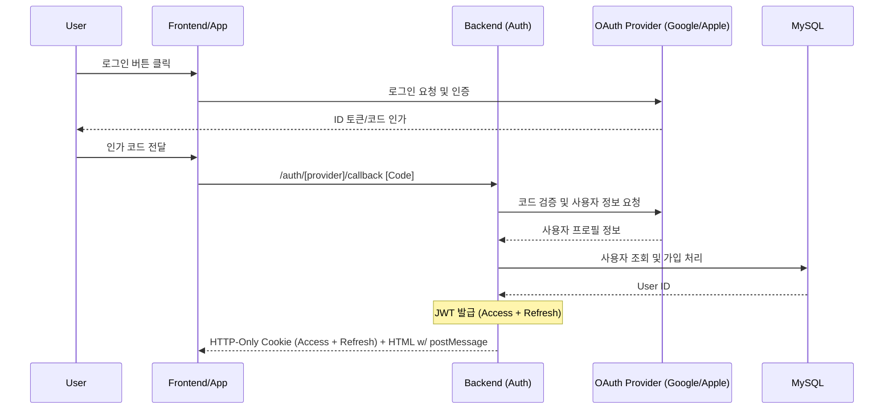

# Authentication & JWT Architecture

GraphNode는 소셜 로그인(OAuth 2.0)과 JWT(JSON Web Token)를 결합하여 보안과 편의성을 모두 갖춘 인증 시스템을 제공합니다.

## 1. 인증 흐름 (Auth Flow)

## 2. JWT 구조 및 전략

### 2.1 Access Token
- **용도**: 일반 API 요청 인증.
- **수명**: 1시간 (기본값).
- **저장**: **HTTP-Only Cookie** (보안성 강화, JS 접근 불가).

### 2.2 Refresh Token
- **용도**: Access Token 만료 시 재발급을 위한 토큰.
- **수명**: 7일 (기본값).
- **저장**: **HTTP-Only Cookie** (보안성 강화).
    - `Secure`, `HttpOnly`, `SameSite=Strict` 옵션을 적용하여 XSS 및 CSRF 공격을 방어합니다.

## 3. 소셜 로그인 구현 (OAuth Providers)

### 3.1 Google OAuth
- **방식**: 표준 OAuth 2.0 스택 사용.
- **범위(Scope)**: `profile`, `email`.

### 3.2 Apple OAuth
- **방식**: Apple ID 인증 서비스 사용.
- **특징**: `OAUTH_APPLE_PRIVATE_KEY`(.p8)를 사용한 클라이언트 시크릿 생성이 필요하며, Secrets Manager를 통해 안전하게 관리됩니다.

## 4. 보안 조치

1.  **Strict Validation**: `src/config/env.ts`에서 JWT 관련 Key가 설정되지 않으면 서버가 기동되지 않습니다.
2.  **Graceful Error Handling**: 인증 실패 시 `401 Unauthorized`와 함께 `Problem Details` 규격에 맞는 에러 응답을 반환합니다.
3.  **Secrets Management**: 모든 시크릿 키는 AWS Secrets Manager를 통해 관리되며, 코드나 설정 파일에 직접 노출되지 않습니다.

## 5. 관련 코드 위치
- **Routes**: `src/app/routes/auth.*.ts`
- **Controllers**: `src/app/controllers/auth.*.ts`
- **Middleware**: `src/app/middlewares/authJwt.ts`
- **Utility**: `src/shared/utils/jwt.ts`
