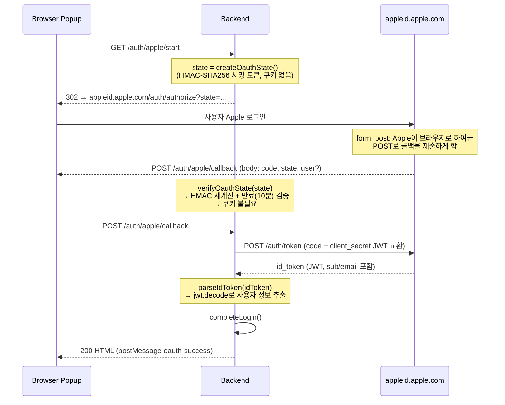

# Authentication & JWT Architecture

GraphNode는 소셜 로그인(OAuth 2.0)과 JWT(JSON Web Token)를 결합하여 보안과 편의성을 모두 갖춘 인증 시스템을 제공합니다.

---

## 1. 전체 인증 흐름 (High-Level)

두 OAuth 제공자(Google, Apple)는 콜백 방식이 구조적으로 다릅니다. 공통 후처리(`completeLogin`)는 동일합니다.

```
[Browser Popup]
      │
      ├─ GET /auth/google/start ─────────── 쿠키 state → accounts.google.com
      │                                     ↓ GET 리다이렉트
      │  GET /auth/google/callback?code=&state=  ← 브라우저 GET 네비게이션
      │
      └─ GET /auth/apple/start ──────────── HMAC state → appleid.apple.com
                                            ↓ form_post
         POST /auth/apple/callback (body: code, state)  ← 크로스사이트 POST
                                            │
                        ┌───────────────────┘ (공통)
                        ▼
              completeLogin()
                findOrCreate(DB)
                generateJWT()
                addSession(Redis)
                Set-Cookie: access_token, refresh_token
                        │
                        ▼
              postMessage → opener.close()
```

---

## 2. Google OAuth 로그인

### 2.1 흐름 상세

```mermaid
sequenceDiagram
    participant Popup as Browser Popup
    participant BE as Backend
    participant Google as accounts.google.com

    Popup->>BE: GET /auth/google/start
    Note over BE: state = randomUUID()<br/>Set-Cookie: oauth_state (SameSite=None; Secure; Signed)
    BE-->>Popup: 302 → accounts.google.com/o/oauth2/v2/auth?state=…

    Popup->>Google: 사용자 Google 로그인
    Google-->>Popup: 302 → /auth/google/callback?code=…&state=…

    Note over Popup: GET 네비게이션 → 브라우저가<br/>oauth_state 쿠키 자동 포함
    Popup->>BE: GET /auth/google/callback?code=&state=
    Note over BE: req.signedCookies['oauth_state'] === state → 검증 통과<br/>res.clearCookie('oauth_state')
    BE->>Google: POST /token (code 교환)
    Google-->>BE: access_token
    BE->>Google: GET /userinfo
    Google-->>BE: { sub, email, name, picture }
    BE->>BE: completeLogin()
    BE-->>Popup: 200 HTML (postMessage oauth-success)
```

### 2.2 CSRF 방어: 서명된 쿠키 (Signed Cookie)

| 항목 | 내용 |
|------|------|
| **state 저장 위치** | `oauth_state` — 서버 서명(HMAC) HTTP-Only 쿠키 |
| **쿠키 옵션** | `SameSite=None; Secure; HttpOnly; Signed; MaxAge=10분` |
| **검증 방식** | `req.signedCookies['oauth_state'] === req.query.state` |
| **콜백 HTTP 메서드** | **GET** (query string) |

**왜 쿠키로 동작하는가?**

Google의 콜백은 `response_mode=query`(기본값)를 사용합니다. Google이 브라우저를 `302 Location: /auth/google/callback?code=...&state=...`으로 리다이렉트하면, 브라우저는 **GET 탑레벨 네비게이션**으로 처리합니다.

`SameSite=None; Secure` 쿠키는 크로스사이트 GET 네비게이션에서 브라우저가 정상적으로 전송합니다. 추가로, `SameSite=Lax`조차 "탑레벨 GET 네비게이션"에서는 쿠키를 전송하도록 허용되어 있으므로 이중으로 안전합니다.

```
[accounts.google.com]
    ↓ 302 Location: https://taco4graphnode.online/auth/google/callback?code=…
[Browser] → GET /auth/google/callback
            Cookie: oauth_state=…  ← 브라우저가 자동 포함 (GET이므로 SameSite 제약 없음)
```

### 2.3 관련 파일

| 역할 | 경로 |
|------|------|
| 컨트롤러 | `src/app/controllers/AuthGoogle.ts` |
| 서비스 | `src/core/services/GoogleOAuthService.ts` |
| 라우터 | `src/app/routes/AuthGoogleRouter.ts` |

---

## 3. Apple OAuth 로그인

### 3.1 흐름 상세


```mermaid
sequenceDiagram
    participant Popup as Browser Popup
    participant BE as Backend
    participant Apple as appleid.apple.com

    Popup->>BE: GET /auth/apple/start
    Note over BE: state = createOauthState()<br/>(HMAC-SHA256 서명 토큰, 쿠키 없음)
    BE-->>Popup: 302 → appleid.apple.com/auth/authorize?state=…

    Popup->>Apple: 사용자 Apple 로그인
    Note over Apple: form_post: Apple이 브라우저로 하여금<br/>POST로 콜백을 제출하게 함
    Apple-->>Popup: POST /auth/apple/callback (body: code, state, user?)

    Note over BE: verifyOauthState(state)<br/>→ HMAC 재계산 + 만료(10분) 검증<br/>→ 쿠키 불필요
    Popup->>BE: POST /auth/apple/callback
    BE->>Apple: POST /auth/token (code + client_secret JWT 교환)
    Apple-->>BE: id_token (JWT, sub/email 포함)
    Note over BE: parseIdToken(idToken)<br/>→ jwt.decode로 사용자 정보 추출
    BE->>BE: completeLogin()
    BE-->>Popup: 200 HTML (postMessage oauth-success)
```

### 3.2 CSRF 방어: HMAC-signed Stateless Token

| 항목 | 내용 |
|------|------|
| **state 저장 위치** | 없음 (Stateless) — state 자체에 서명 내포 |
| **서명 키** | `SESSION_SECRET` (모든 ECS 인스턴스 공유) |
| **토큰 형식** | `base64url(payload_json) + "." + base64url(HMAC-SHA256(payload, secret))` |
| **payload** | `{ nonce: UUIDv4, iat: Unix seconds }` |
| **만료** | `iat` 기반 10분 |
| **검증 방식** | HMAC 재계산 + timing-safe 비교 + `iat` 만료 확인 |
| **콜백 HTTP 메서드** | **POST** (form_post, body에 state 포함) |

**토큰 예시:**
```
eyJub25jZSI6IjgwODMwYzUyLTliZTAtNDM2MC1hNWQ5LTc0NzkxNWU1NGZmOCIsImlhdCI6MTc3NTI5NTg4Nn0
.
4ua0q6S2IAL0nJfUVuQuYniVvlGpt68-fWHt8xUmBZg
───────────────────────────────────────────────  ──────────────────────────────────────────────
          base64url({ nonce, iat })                  base64url(HMAC-SHA256(payload, secret))
```

**관련 구현:**
```typescript
// src/app/utils/oauthState.ts
export function createOauthState(): string   // /start에서 호출
export function verifyOauthState(state: string): boolean  // /callback에서 호출
```

### 3.3 Apple 전용 특이사항

**`client_secret` 동적 생성**

Apple은 `client_secret`으로 표준 문자열 대신 **ES256 서명 JWT**를 요구합니다.

```typescript
// AppleOAuthService.generateClientSecret()
jwt.sign(
  { iss: teamId, iat, exp: iat+300, aud: 'https://appleid.apple.com', sub: clientId },
  privateKey,          // .p8 파일 (PKCS#8 EC 키)
  { algorithm: 'ES256', header: { kid: keyId } }
)
```

이 client_secret은 토큰 교환 시마다 새로 생성되며 유효기간 5분으로 제한됩니다.

**`user` 파라미터 (최초 1회만 전달)**

Apple은 사용자 정보(`name`, `email`)를 **최초 로그인 1회에만** form_post body에 포함합니다. 재로그인 시에는 `user` 필드가 전송되지 않습니다. `completeLogin`의 `displayName`이 `null`이 될 수 있는 이유입니다.

### 3.4 관련 파일

| 역할 | 경로 |
|------|------|
| 컨트롤러 | `src/app/controllers/AuthApple.ts` |
| 서비스 | `src/core/services/AppleOAuthService.ts` |
| 라우터 | `src/app/routes/AuthAppleRouter.ts` |
| HMAC state 유틸 | `src/app/utils/oauthState.ts` |

---

## 4. Google vs Apple — 왜 CSRF 방어 방식이 다른가

### 4.1 콜백 메서드 차이가 핵심

| | Google | Apple |
|--|--------|-------|
| **콜백 방식** | `302 Location` → 브라우저 **GET** 리다이렉트 | `response_mode=form_post` → 브라우저 **POST** 제출 |
| **Origin** | `accounts.google.com` → `taco4graphnode.online` (크로스사이트 GET) | `appleid.apple.com` → `taco4graphnode.online` (크로스사이트 POST) |
| **SameSite=Lax 허용 여부** | ✅ 허용 (탑레벨 GET 네비게이션) | ❌ 차단 (크로스사이트 POST는 Lax에서 불허) |
| **SameSite=None 허용 여부** | ✅ 허용 | ⚠️ 이론상 허용이나 Chrome 120+ 서드파티 쿠키 차단 정책에 취약 |

### 4.2 Chrome Third-Party Cookie Deprecation

Chrome 120(2024)부터 단계적으로 진행된 **서드파티 쿠키 차단 정책**이 2026년 기준 Chrome 146에서 완전히 적용됩니다.

```
[appleid.apple.com] ──form_post──→ [taco4graphnode.online/auth/apple/callback]
                                              ↑
                         Chrome: "이것은 서드파티 컨텍스트의 POST 요청"
                         → SameSite=None 쿠키라도 차단 가능
```

- **Google GET 콜백**: 브라우저가 탑레벨 GET 네비게이션으로 처리 → 퍼스트파티 컨텍스트 → 쿠키 정상 전송
- **Apple POST 콜백**: 브라우저가 크로스사이트 POST로 처리 → 서드파티 컨텍스트 → 쿠키 차단

### 4.3 결론: Apple에 쿠키를 쓸 수 없는 이유

| 조건 | Google | Apple |
|------|--------|-------|
| 쿠키가 콜백에 도달하는가? | ✅ 항상 | ❌ Chrome 120+ 이후 불안정 |
| Stateless 검증 가능한가? | ✅ (쿠키로도 충분) | ✅ (HMAC state 필수) |
| 다중 인스턴스 안전성 | ✅ `SESSION_SECRET` 공유 시 | ✅ `SESSION_SECRET` 공유 시 |
| Replay 방지 | ✅ (단일 사용 후 clearCookie) | ⚠️ 10분 창 내 재사용 가능 (실용적 위협 없음) |

> **요약**: Apple은 `form_post` 특성상 브라우저 쿠키에 의존할 수 없으므로, `SESSION_SECRET` 기반 HMAC 서명으로 state를 stateless하게 검증한다. Google은 GET 콜백이므로 기존 쿠키 방식이 안정적으로 동작한다.

---

## 5. 공통 후처리: completeLogin()

두 제공자 모두 콜백 처리 후 `completeLogin()`으로 합류합니다.

```
completeLogin(req, res, { provider, providerUserId, email, displayName, avatarUrl })
    │
    ├─ UserRepositoryMySQL.findOrCreateFromProvider()
    │      └─ MySQL: provider_accounts 조회/생성 → users 조회/생성
    │
    ├─ generateRefreshToken({ userId })
    ├─ addSession(userId, refreshToken)   ← Redis 동시 세션 관리
    ├─ generateAccessToken({ userId, sessionId })
    │
    ├─ Set-Cookie: access_token  (HttpOnly; Secure; SameSite=None; MaxAge=1h)
    ├─ Set-Cookie: refresh_token (HttpOnly; Secure; SameSite=None; MaxAge=7d)
    └─ Set-Cookie: gn-logged-in, gn-profile  (표시용, JS 접근 허용)
```

---

## 6. JWT 구조 및 전략

### 6.1 Access Token

| 항목 | 값 |
|------|-----|
| **용도** | 일반 API 요청 인증 |
| **수명** | 1시간 (기본값, `JWT_ACCESS_EXPIRY`) |
| **저장** | HTTP-Only Cookie (`access_token`) |
| **Payload** | `{ userId, sessionId, iat, exp }` |

### 6.2 Refresh Token

| 항목 | 값 |
|------|-----|
| **용도** | Access Token 만료 시 재발급 |
| **수명** | 7일 (기본값, `JWT_REFRESH_EXPIRY`) |
| **저장** | HTTP-Only Cookie (`refresh_token`) |
| **서버 사이드** | Redis에 `userId → [sessionId, ...]` 등록 (동시 접속 제한) |

### 6.3 쿠키 보안 옵션 (공통)

`src/app/utils/sessionCookies.ts`의 `getAuthCookieOpts()`가 중앙 관리합니다.

```
production: HttpOnly=true; Secure=true; SameSite=None; Signed=true
dev(DEV_INSECURE_COOKIES=true): HttpOnly=true; Secure=false; SameSite=Lax
```

> `SameSite=None`은 Cross-Origin 팝업 창에서 `postMessage` 후 쿠키가 메인 창으로 전달되어야 하기 때문에 필요합니다.

---

## 7. 보안 조치 요약

| 위협 | 방어 수단 |
|------|----------|
| CSRF (Google) | 서명된 `oauth_state` 쿠키, 콜백 시 단일 사용 후 제거 |
| CSRF (Apple) | HMAC-SHA256 signed state, timing-safe 비교, 10분 만료 |
| XSS | Access/Refresh Token을 `HttpOnly` 쿠키에 저장 |
| Token 위변조 | JWT 서명 + 서버 사이드 Redis 세션 검증 |
| Timing Attack | `timingSafeEqual` 사용 (oauthState.ts) |
| 시크릿 노출 | AWS Secrets Manager / Infisical — 코드/로그에 시크릿 없음 |
| 동시 세션 과다 | Redis `addSession()` 에서 초과 시 오래된 세션 자동 제거 |

---

## 8. 관련 코드 위치

| 컴포넌트 | 경로 |
|----------|------|
| Google 컨트롤러 | `src/app/controllers/AuthGoogle.ts` |
| Apple 컨트롤러 | `src/app/controllers/AuthApple.ts` |
| Google 서비스 | `src/core/services/GoogleOAuthService.ts` |
| Apple 서비스 | `src/core/services/AppleOAuthService.ts` |
| HMAC state 유틸 | `src/app/utils/oauthState.ts` |
| 쿠키 옵션 유틸 | `src/app/utils/sessionCookies.ts` |
| 공통 로그인 처리 | `src/app/utils/authLogin.ts` |
| JWT 발급 | `src/app/utils/jwt.ts` |
| JWT 검증 미들웨어 | `src/app/middlewares/authJwt.ts` |
| Redis 세션 스토어 | `src/infra/redis/SessionStoreRedis.ts` |
