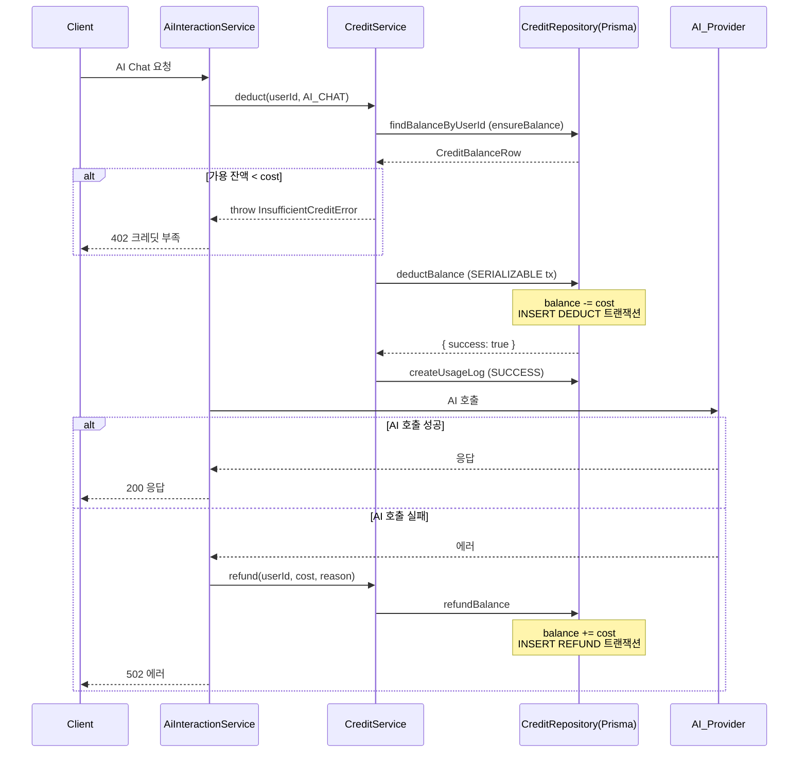
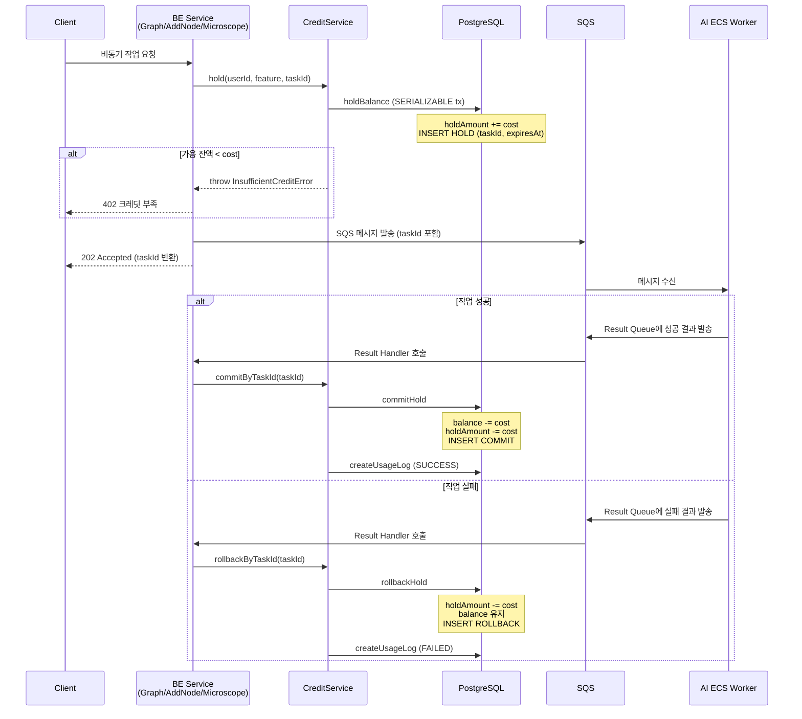
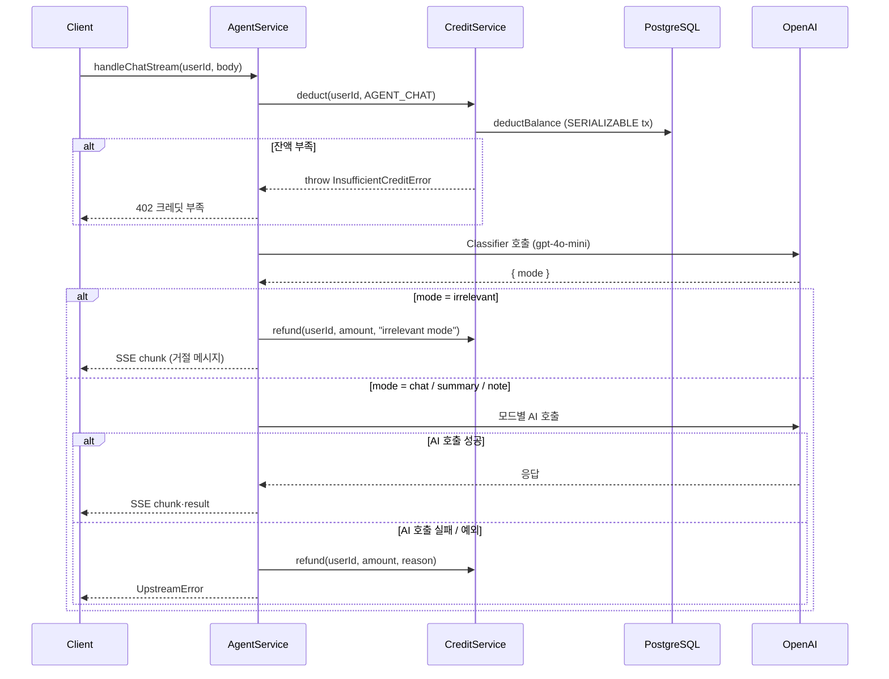
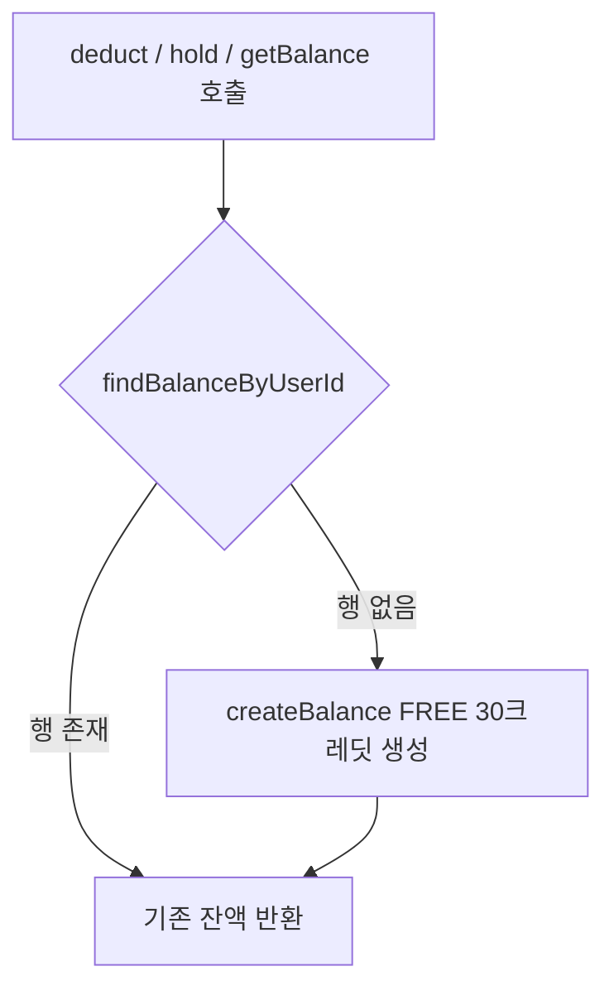
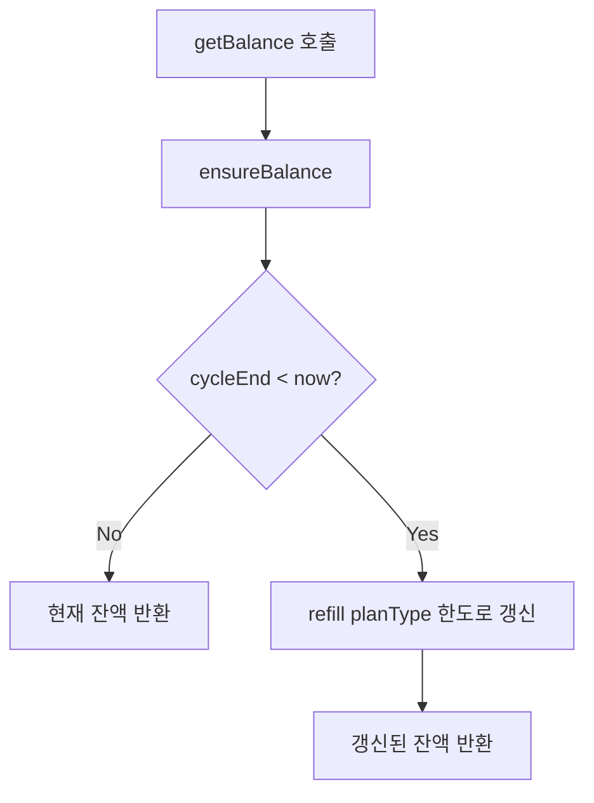
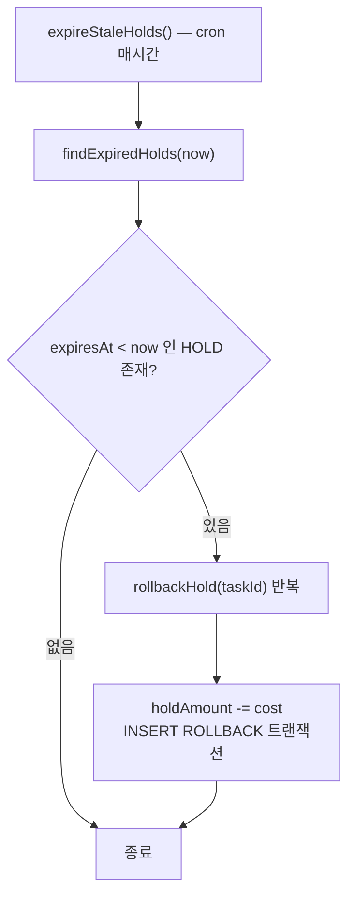

# 크레딧(토큰제) 소비 시스템

> 마지막 갱신: 2026-05-02 (Agent 과금 패턴 및 Tool 단위 과금 확장 설계 추가)

GraphNode의 구독형 크레딧 시스템 전체 설계, 로직 플로우, 확장 가이드를 정리합니다.

---

## 목차

1. [시스템 개요](#1-시스템-개요)
2. [데이터베이스 스키마](#2-데이터베이스-스키마)
3. [billing.config.ts 설계](#3-billingconfigts-설계)
4. [소비 패턴 A — 동기(AI Chat)](#4-소비-패턴-a--동기ai-chat)
5. [소비 패턴 B — 비동기(Graph / AddNode / Microscope)](#5-소비-패턴-b--비동기graph--addnode--microscope)
6. [소비 패턴 C — 동기(AgentService)](#6-소비-패턴-c--동기agentservice)
7. [Agent Tool 단위 과금 확장 설계](#7-agent-tool-단위-과금-확장-설계)
8. [잔액 관리 — Lazy Init · JIT Refill · 배치 Refill](#8-잔액-관리--lazy-init--jit-refill--배치-refill)
9. [Stale Hold 자동 만료](#9-stale-hold-자동-만료)
10. [레이어 구조 및 의존 관계](#10-레이어-구조-및-의존-관계)
11. [신입 개발자 수정 가이드](#11-신입-개발자-수정-가이드)

---

## 1. 시스템 개요

GraphNode는 **월간 구독형 크레딧** 시스템을 사용합니다.

- 사용자는 플랜(`FREE` / `PRO` / `ENTERPRISE`)에 따라 매 30일마다 크레딧을 지급받습니다.
- AI 기능을 사용할 때마다 크레딧이 소모됩니다.
- 크레딧이 부족하면 해당 기능이 즉시 차단됩니다 (`InsufficientCreditError`).

### 플랜별 월간 크레딧 한도

| 플랜 | 월간 크레딧 | 비고 |
|---|---|---|
| `FREE` | 30 | 신규 가입 기본값 |
| `PRO` | 500 | |
| `ENTERPRISE` | 9,999 | |

### 기능별 1회 소모량 (현재)

| 기능 (`CreditFeature`) | 소모 크레딧 | 처리 방식 | 담당 서비스 |
|---|---|---|---|
| `AI_CHAT` | 0 (임시) | 동기 (즉시 차감) | `AiInteractionService` |
| `GRAPH_GENERATION` | 0 (임시) | 비동기 (에스크로) | `GraphGenerationService` |
| `ADD_NODE` | 0 (임시) | 비동기 (에스크로) | `GraphEditorService` |
| `MICROSCOPE_INGEST` | 0 (임시) | 비동기 (에스크로) | `MicroscopeManagementService` |
| `AGENT_CHAT` | 0 (임시) | 동기 (즉시 차감) | `AgentService` |

> 비용 정책 변경은 `billing.config.ts`의 `FEATURE_COSTS`만 수정하면 됩니다. **서비스·핸들러 코드 변경 불필요.**

---

## 2. 데이터베이스 스키마

크레딧 시스템은 PostgreSQL(Prisma)의 세 테이블로 구성됩니다.

```
┌─────────────────────────────────┐
│         credit_balances         │  (사용자당 1행, 원장)
│  id, userId(unique)             │
│  balance      ← 실제 잔액       │
│  holdAmount   ← 에스크로 중 금액│
│  planType, cycleStart, cycleEnd │
└────────────┬────────────────────┘
             │ 1:N
             ▼
┌─────────────────────────────────┐
│       credit_transactions       │  (불변 이동 원장, append-only)
│  id, userId, type, feature      │
│  amount, taskId, expiresAt      │
│                                 │
│  type 종류:                     │
│    REFILL   — 월간 충전         │
│    DEDUCT   — 즉시 차감         │
│    HOLD     — 에스크로 예약     │
│    COMMIT   — 에스크로 확정     │
│    ROLLBACK — 에스크로 해제     │
│    REFUND   — 실패 시 환불      │
└─────────────────────────────────┘

┌─────────────────────────────────┐
│           usage_logs            │  (분석용 append-only)
│  id, userId, feature, taskId   │
│  creditUsed, status(SUCCESS/FAILED)│
└─────────────────────────────────┘
```

### ERD

```mermaid
erDiagram
    users ||--o| credit_balances : "1:1"
    credit_balances ||--o{ credit_transactions : "1:N"

    credit_balances {
        string   id          PK
        string   userId      UK
        int      balance
        int      holdAmount
        PlanType planType
        datetime cycleStart
        datetime cycleEnd
    }

    credit_transactions {
        string              id        PK
        string              userId    FK
        CreditTransactionType type
        CreditFeature       feature   nullable
        int                 amount
        string              taskId    nullable
        datetime            expiresAt nullable
    }

    usage_logs {
        string        id        PK
        string        userId
        CreditFeature feature
        string        taskId    nullable
        int           creditUsed
        string        status
    }
```

### 잔액 계산 공식

```
가용 잔액(availableBalance) = balance - holdAmount
```

- `balance`     : DB에 기록된 실제 잔액
- `holdAmount`  : 비동기 작업에 묶인 에스크로 금액 (아직 차감되지 않음)
- `availableBalance` : 사용자가 실제로 새 작업에 쓸 수 있는 금액

---

## 3. billing.config.ts 설계

> 파일 위치: `src/config/billing.config.ts`

모든 금액 정책이 **한 파일에 집중**되어 있습니다. 비용을 바꿀 때 다른 코드를 건드릴 필요가 없습니다.

### 전략 패턴 (CreditCostCalculator)

```
<<interface>>
CreditCostCalculator
  calculate(context?): number
        ▲
        │
 ┌──────┴──────────────────┐
 │                         │
FixedCostCalculator    TokenBasedCostCalculator
(현재 사용)             (향후 가변 요금제용 스텁)
```

| 클래스 | 설명 |
|---|---|
| `FixedCostCalculator` | 고정 크레딧. `new FixedCostCalculator(5)` → 항상 5 반환 |
| `TokenBasedCostCalculator` | 메시지 길이 기반 가변 계산. 현재는 미사용 스텁 |

### FEATURE_COSTS 맵

```typescript
export const FEATURE_COSTS: Record<CreditFeature, CreditCostCalculator> = {
  [CreditFeature.AI_CHAT]:            new FixedCostCalculator(1),
  [CreditFeature.GRAPH_GENERATION]:   new FixedCostCalculator(10),
  [CreditFeature.ADD_NODE]:           new FixedCostCalculator(5),
  [CreditFeature.MICROSCOPE_INGEST]:  new FixedCostCalculator(3),
};
```

`CreditService`는 기능별 비용을 `FEATURE_COSTS[feature].calculate(context)`로만 읽습니다.
새 기능을 추가할 때는 이 맵에 항목 1개만 추가하면 됩니다.

### 주요 상수

| 상수 | 값 | 역할 |
|---|---|---|
| `HOLD_EXPIRY_MS` | 2시간 (ms) | 비동기 HOLD 자동 만료 기준 |
| `BILLING_CYCLE_DAYS` | 30일 | 구독 주기 |
| `PLAN_CREDIT_LIMITS` | FREE:30 / PRO:500 / ENT:9999 | Refill 시 채워질 크레딧 |

---

## 4. 소비 패턴 A — 동기(AI Chat)

AI Chat은 HTTP 요청 스레드 안에서 즉시 응답하는 **동기 흐름**입니다.

### 원칙: Deduct-Before-Call + Refund-on-Failure

```
크레딧 차감 → AI 호출 → 성공이면 완료
                       ↓ 실패이면
                    크레딧 환불
```

### 상세 플로우



### 동시성 보호

`deductBalance`는 Postgres **SERIALIZABLE 트랜잭션**으로 실행됩니다.

동시 요청 2개가 같은 잔액을 읽어도, DB 레벨에서 잔액 검증을 재확인하여 하나만 성공합니다. 패배한 요청은 `{ success: false }`를 반환받고, `CreditService`가 `InsufficientCreditError`로 전환합니다.

---

## 5. 소비 패턴 B — 비동기(Graph / AddNode / Microscope)

무거운 AI 작업(그래프 생성, 노드 추가, Microscope 인제스트)은 **SQS 워커**로 위임됩니다.
결과가 언제 올지 모르므로 **에스크로(Hold → Commit | Rollback)** 패턴을 사용합니다.

### 원칙: Hold → (Commit | Rollback)

```
[BE] SQS 발송 전  : hold(userId, feature, taskId)
                     holdAmount += cost
                     HOLD 트랜잭션 기록 (taskId 포함)

[AI Worker 처리 중]

[BE] SQS 결과 수신 :
  - 성공  → commitByTaskId(taskId)
              balance -= cost, holdAmount -= cost
              COMMIT 트랜잭션 기록

  - 실패  → rollbackByTaskId(taskId)
              holdAmount -= cost (balance 유지)
              ROLLBACK 트랜잭션 기록
```

### 상세 플로우



### taskId가 에스크로의 상관관계 키

SQS 메시지 envelope에는 `taskId`가 포함됩니다. `hold()` 시 이 `taskId`를 `HOLD` 트랜잭션에 저장하고, 결과 핸들러에서 같은 `taskId`로 `commit` 또는 `rollback`을 찾습니다.

```
HOLD 트랜잭션 레코드
  taskId = "abc-123"  ← SQS envelope taskId 와 동일

Result Handler
  commitByTaskId("abc-123")  → DB에서 taskId="abc-123" HOLD를 찾아 처리
```

### Idempotency (멱등성)

SQS는 같은 메시지를 두 번 이상 전달할 수 있습니다. `commitByTaskId`/`rollbackByTaskId`는 이미 처리된 `taskId`에 대해 **no-op**을 수행합니다 (에러 없음).

---

## 6. 소비 패턴 C — 동기(AgentService)

AgentService는 AI Chat과 동일한 **동기 흐름(Deduct-Before-Call + Refund-on-Failure)** 을 따릅니다.
단, 요청 1건이 분류기(classifier) AI 호출과 모드별 처리(chat/summary/note) 호출을 순차적으로 실행하기 때문에, **분류기 진입 직전**에 단 1회 차감합니다.

### 차감 시점 정책

```
handleChatStream 진입
       │
       ▼
creditService.deduct(userId, AGENT_CHAT)   ← 단 1회 차감
       │
       ▼
Classifier AI 호출 (gpt-4o-mini)
       │
       ├─ mode = irrelevant  →  creditService.refund() 즉시 환불 후 종료
       │
       ├─ mode = chat        →  handleChatMode (Tool Calling ReAct 루프)
       │
       ├─ mode = summary     →  handleSummaryMode
       │
       └─ mode = note        →  handleNoteMode
              │
              ▼ (모든 모드 공통)
       예외 발생 시 catch → creditService.refund()
```

`irrelevant` 판정 시 AI 응답 생성이 없으므로 차감된 크레딧을 즉시 환불합니다. 실제 토큰이 소비되지 않는 케이스에서 사용자가 크레딧을 잃지 않도록 하기 위한 정책입니다.

### 상세 플로우



### AiInteractionService와의 차이

| 항목 | AiInteractionService | AgentService |
|---|---|---|
| 과금 기능 키 | `AI_CHAT` | `AGENT_CHAT` |
| 차감 시점 | AI Provider 호출 직전 | Classifier 호출 직전 |
| 환불 조건 | AI 호출 실패 | AI 호출 실패 + `irrelevant` 판정 |
| Tool 호출 | 무과금 (ReAct 포함) | 무과금 (기본값, Tool별 확장 가능) |

---

## 7. Agent Tool 단위 과금 확장 설계

현재 모든 Tool은 추가 과금 없이 실행됩니다. 향후 외부 API를 호출하거나 높은 연산 비용이 발생하는 Tool에 **Tool 단위 크레딧 과금**을 추가할 수 있는 확장 구조가 이미 코드에 반영되어 있습니다.

### 구현된 확장 포인트

#### 1. `IAgentTool.creditFeature` 필드

```typescript
// src/agent/types.ts
export interface IAgentTool {
  readonly definition: OpenAI.Chat.Completions.ChatCompletionTool;
  readonly name: string;

  /**
   * 이 도구 호출에 부과할 크레딧 기능 키 (선택적).
   * undefined이면 추가 과금 없음.
   */
  readonly creditFeature?: CreditFeature;

  execute(userId: string, args: any, deps: AgentServiceDeps, openai: OpenAI): Promise<string>;
}
```

#### 2. `ToolRegistry.execute`의 자동 과금 처리

```typescript
// src/agent/ToolRegistry.ts
async execute(
  name: string,
  userId: string,
  args: any,
  deps: AgentServiceDeps,
  openai: OpenAI,
  creditService?: ICreditService   // ← AgentService가 주입
): Promise<string> {
  const tool = this.tools.get(name);
  // ...
  const result = await tool.execute(userId, args, deps, openai);

  // Tool에 creditFeature가 지정된 경우 성공 후 자동 과금
  if (tool.creditFeature && creditService) {
    await creditService.deduct(userId, tool.creditFeature);
  }

  return result;
}
```

Tool 실행이 **성공한 이후에만** 과금합니다. 예외가 발생하면 `tool.execute()`에서 던진 에러가 그대로 전파되므로 `creditService.deduct()`는 호출되지 않습니다.

#### 3. `AgentServiceDeps.creditService` 경유 주입

`AgentService`는 `this.deps.creditService`를 `executeToolCall` → `ToolRegistry.execute`까지 전달합니다. 신규 Tool은 이 경로를 통해 `creditService`를 자동으로 받게 됩니다.

```
AgentService.deps.creditService
       │  (executeToolCall 호출 시 전달)
       ▼
ToolRegistry.execute(... creditService)
       │  (tool.creditFeature 존재 시 호출)
       ▼
creditService.deduct(userId, tool.creditFeature)
```

---

### Tool 단위 과금 활성화 방법

새 Tool에 크레딧을 부과하거나, 기존 Tool을 유료화하려면 다음 순서를 따릅니다.

#### Step 1 — `CreditFeature` enum 등록

새 Tool 전용 기능 키가 필요한 경우 `prisma/schema.prisma`와 `credit.persistence.ts`에 추가합니다. 기존 키(예: `AGENT_CHAT`)를 재사용할 수도 있습니다.

```prisma
// prisma/schema.prisma
enum CreditFeature {
  // ...기존 항목...
  AGENT_TOOL_EXTERNAL_SEARCH  // ← 신규 Tool 전용 키 예시
}
```

```typescript
// src/core/types/persistence/credit.persistence.ts
export const CreditFeature = {
  // ...기존 항목...
  AGENT_TOOL_EXTERNAL_SEARCH: 'AGENT_TOOL_EXTERNAL_SEARCH',
} as const;
```

#### Step 2 — `billing.config.ts`에 비용 등록

```typescript
// src/config/billing.config.ts
const AGENT_TOOL_EXTERNAL_SEARCH_COST = 2;

export const FEATURE_COSTS: Record<CreditFeature, CreditCostCalculator> = {
  // ...기존 항목...
  [CreditFeature.AGENT_TOOL_EXTERNAL_SEARCH]: new FixedCostCalculator(AGENT_TOOL_EXTERNAL_SEARCH_COST),
};
```

#### Step 3 — Tool 클래스에 `creditFeature` 선언

```typescript
// src/agent/tools/MyExternalSearchTool.ts
export class MyExternalSearchTool implements IAgentTool {
  readonly name = 'my_external_search';
  readonly creditFeature = CreditFeature.AGENT_TOOL_EXTERNAL_SEARCH; // ← 추가

  readonly definition: OpenAI.Chat.Completions.ChatCompletionTool = { /* ... */ };

  async execute(userId, args, deps, openai): Promise<string> {
    // 외부 API 호출 로직...
    return JSON.stringify(result);
  }
}
```

#### Step 4 — `ToolRegistry`에 등록

```typescript
// src/agent/ToolRegistry.ts
constructor() {
  // ...기존 Tool 등록...
  this.register(new MyExternalSearchTool());
}
```

#### Step 5 — Prisma 마이그레이션 (신규 키 추가 시)

```bash
infisical run -- npx prisma migrate dev --name add_agent_tool_external_search
```

---

### Tool 과금 설계 시 고려사항

#### 과금 타이밍: 성공 후(Post-execution) vs 시작 전(Pre-execution)

현재 구현은 **성공 후 과금(post-execution)** 방식입니다. Tool 실패 시 자동으로 무과금이 됩니다.

| 방식 | 장점 | 단점 | 현재 채택 |
|---|---|---|---|
| 성공 후 과금 | 실패 시 환불 로직 불필요, 구현 단순 | 잔액 부족 상태에서 Tool이 실행된 후 차감 실패 가능 | ✅ |
| 시작 전 차감 + 실패 환불 | `AiInteractionService` 패턴과 일관성 | Tool마다 try-catch 환불 로직 필요 | — |

고비용 Tool에서 잔액 부족 문제가 발생한다면 `ToolRegistry.execute`를 수정해 Tool 실행 **전에** `deduct`를 호출하고 실패 시 `refund`하는 방식으로 전환할 수 있습니다.

#### `CreditContext`를 활용한 가변 Tool 과금

`IAgentTool.execute`의 반환 타입을 확장해 컨텍스트 정보를 넘기거나, Tool 내부에서 `CreditContext`를 직접 구성해 전달하는 방식도 가능합니다. 현재 `ToolRegistry.execute`에서 `creditService.deduct(userId, feature)`를 호출할 때 `context`를 넘기지 않으므로 고정 비용만 지원됩니다. Tool 실행 비용이 인자에 따라 달라지는 경우(예: 검색 결과 수에 비례) 아래처럼 확장합니다.

```typescript
// 향후 확장 예시 — IAgentTool에 creditContext 반환 추가
export interface IAgentToolResult {
  content: string;
  creditContext?: CreditContext;  // Tool이 직접 컨텍스트 제공
}

// ToolRegistry.execute 내부
const toolResult = await tool.execute(userId, args, deps, openai);
if (tool.creditFeature && creditService) {
  await creditService.deduct(userId, tool.creditFeature, toolResult.creditContext);
}
```

#### 현재 과금이 없는 Tool 목록

| Tool 클래스 | 설명 | `creditFeature` |
|---|---|---|
| `SearchNotesTool` | 노트 키워드 검색 | `undefined` (무과금) |
| `GetRecentNotesTool` | 최근 노트 조회 | `undefined` |
| `GetNoteContentTool` | 특정 노트 전문 조회 | `undefined` |
| `SearchConversationsTool` | Graph RAG 대화 검색 | `undefined` |
| `GetRecentConversationsTool` | 최근 대화 조회 | `undefined` |
| `GetConversationMessagesTool` | 특정 대화 메시지 조회 | `undefined` |
| `GetGraphSummaryTool` | 그래프 통계·클러스터 조회 | `undefined` |

모두 내부 DB 조회만 수행하므로 현재는 무과금입니다. 외부 API를 호출하는 Tool이 추가되는 시점에 `creditFeature`를 지정합니다.

---

## 8. 잔액 관리 — Lazy Init · JIT Refill · 배치 Refill

### Lazy Init (신규 사용자)

`CreditBalance` 행은 회원 가입 시 즉시 생성되지 않습니다. 사용자가 **처음 크레딧이 필요한 순간** `ensureBalance()`가 호출되어 FREE 플랜으로 자동 생성됩니다.



### JIT Refill (cycleEnd 초과 시)

`getBalance()` 호출 시 `cycleEnd < now`이면 즉시 해당 플랜의 한도로 잔액을 갱신합니다. 별도 로그인 이벤트 없이 잔액 조회 시점에 자동 처리됩니다.



### 배치 Refill (월간 cron)

`refillAllActiveSubscribers()`는 `cycleEnd < now`인 모든 사용자를 배치로 갱신합니다. 외부 스케줄러(AWS EventBridge 등)에서 매일 또는 매시간 호출합니다.

---

## 9. Stale Hold 자동 만료

비동기 작업이 AI Worker에서 응답 없이 종료되거나 SQS 결과 메시지가 유실되면 `holdAmount`가 영구히 잠길 수 있습니다.

이를 방지하기 위해 `expireStaleHolds()`가 **시간당 cron**으로 실행됩니다.



HOLD 만료 기준: `HOLD_EXPIRY_MS = 2시간` (`billing.config.ts` 상수)

---

## 10. 레이어 구조 및 의존 관계

```
┌───────────────────────────────────────────────────────────┐
│  Presentation (Controllers / Workers / Result Handlers)   │
│  AiInteractionService, GraphGenerationService, ...        │
│  AddNodeResultHandler, GraphGenerationResultHandler, ...  │
│                                                           │
│  호출: creditService.deduct() / hold() /                  │
│         commitByTaskId() / rollbackByTaskId()             │
└────────────────────────┬──────────────────────────────────┘
                         │ 인터페이스(ICreditService)만 의존
                         ▼
┌──────────────────────────────────────────────────────────┐
│  Core (CreditService)                                    │
│  src/core/services/CreditService.ts                      │
│                                                          │
│  - billing.config.ts에서 비용 정책 읽기                  │
│  - ICreditRepository 포트를 통해 DB 접근                 │
└────────────────────────┬─────────────────────────────────┘
                         │ 인터페이스(ICreditRepository)만 의존
                         ▼
┌──────────────────────────────────────────────────────────┐
│  Infrastructure (CreditRepositoryPrisma)                 │
│  src/infra/repositories/CreditRepositoryPrisma.ts        │
│                                                          │
│  - Prisma 클라이언트 직접 사용                           │
│  - SERIALIZABLE 트랜잭션으로 동시성 보호                 │
└──────────────────────────────────────────────────────────┘
```

### 핵심 파일 위치

| 파일 | 역할 |
|---|---|
| `src/config/billing.config.ts` | 기능별 비용 · 플랜 한도 · 만료 상수 **유일한 정책 조정 포인트** |
| `src/core/ports/ICreditService.ts` | CreditService 공개 인터페이스 |
| `src/core/ports/ICreditRepository.ts` | DB 접근 포트 인터페이스 |
| `src/core/services/CreditService.ts` | 크레딧 비즈니스 로직 구현 |
| `src/infra/repositories/CreditRepositoryPrisma.ts` | Prisma 구현체 |
| `src/core/types/persistence/credit.persistence.ts` | 도메인 타입 (enum, record 타입) |
| `prisma/schema.prisma` | DB 스키마 (`CreditBalance`, `CreditTransaction`, `UsageLog`) |
| `tests/unit/CreditService.spec.ts` | 단위 테스트 |

---

## 11. 신입 개발자 수정 가이드

### Case 1 — 새 기능에 크레딧 소모 추가하기

**1단계**: `prisma/schema.prisma`의 `CreditFeature` enum에 항목 추가

```prisma
enum CreditFeature {
  AI_CHAT
  GRAPH_GENERATION
  ADD_NODE
  MICROSCOPE_INGEST
  MY_NEW_FEATURE   // ← 추가
}
```

**2단계**: `billing.config.ts`의 `FEATURE_COSTS`에 비용 추가

```typescript
export const FEATURE_COSTS: Record<CreditFeature, CreditCostCalculator> = {
  // ...기존 항목...
  [CreditFeature.MY_NEW_FEATURE]: new FixedCostCalculator(7), // ← 추가
};
```

**3단계**: 서비스에서 호출

- 동기 작업이면: `await creditService.deduct(userId, CreditFeature.MY_NEW_FEATURE)`
- 비동기(SQS) 작업이면: `await creditService.hold(userId, CreditFeature.MY_NEW_FEATURE, taskId)`

**4단계**: Prisma 마이그레이션 실행

```bash
infisical run -- npx prisma migrate dev --name add_my_new_feature
```

> `CreditService`, `CreditRepositoryPrisma` 코드는 변경 불필요.

---

### Case 2 — 기능 비용(크레딧 수) 변경하기

`billing.config.ts`의 `FEATURE_COSTS`에서 해당 `FixedCostCalculator` 인자만 수정합니다.

```typescript
// 변경 전
[CreditFeature.GRAPH_GENERATION]: new FixedCostCalculator(10),

// 변경 후
[CreditFeature.GRAPH_GENERATION]: new FixedCostCalculator(15),
```

> 다른 파일 수정 없음.

---

### Case 3 — 플랜 추가 또는 한도 변경

**플랜 한도 변경**: `PLAN_CREDIT_LIMITS` 수정

```typescript
export const PLAN_CREDIT_LIMITS: Record<PlanType, number> = {
  [PlanType.FREE]: 50,       // 30 → 50 으로 변경
  [PlanType.PRO]: 500,
  [PlanType.ENTERPRISE]: 9999,
};
```

**새 플랜 추가**: `prisma/schema.prisma`의 `PlanType` enum에 항목 추가 후 `PLAN_CREDIT_LIMITS`에도 추가, 그리고 마이그레이션 실행.

---

### Case 4 — 가변 요금제 전환 (길이/토큰 기반)

`billing.config.ts`에 `TokenBasedCostCalculator` 스텁이 이미 준비되어 있습니다.

```typescript
// AI_CHAT을 토큰 기반으로 전환하는 예시
[CreditFeature.AI_CHAT]: new TokenBasedCostCalculator(
  2,  // 입력 1K 토큰당 크레딧
  1   // 출력 1K 토큰당 크레딧
),
```

호출 측에서 `CreditContext`를 채워서 넘기면 됩니다:

```typescript
await creditService.deduct(userId, CreditFeature.AI_CHAT, {
  messageLength: userMessage.length,
});
```

---

### Case 5 — Agent Tool에 크레딧 부과하기

기존 Tool에 추가 과금을 붙이거나, 새 유료 Tool을 만들 때의 최소 작업입니다.

**1단계** (필요한 경우): `CreditFeature` 키 추가 — Case 1의 1·2단계와 동일.  
기존 `AGENT_CHAT` 등 공유 키를 재사용하는 경우 이 단계는 생략.

**2단계**: Tool 클래스에 `creditFeature` 프로퍼티 선언

```typescript
export class MyTool implements IAgentTool {
  readonly name = 'my_tool';
  readonly creditFeature = CreditFeature.MY_TOOL_FEATURE; // ← 이 한 줄만 추가

  // execute 구현은 그대로 유지
}
```

`ToolRegistry.execute`가 성공 후 자동으로 `creditService.deduct()`를 호출합니다. **다른 파일 수정 불필요.**

---

### Case 6 — Agent Tool 과금 방식을 시작 전 차감으로 전환하기

현재 Tool 과금은 성공 후 차감(post-execution)입니다. 잔액 부족 상태에서 Tool 실행 자체를 막아야 한다면 `ToolRegistry.execute`를 수정합니다.

```typescript
// src/agent/ToolRegistry.ts — 시작 전 차감 방식으로 전환 예시
async execute(..., creditService?: ICreditService): Promise<string> {
  const tool = this.tools.get(name);
  if (!tool) return JSON.stringify({ error: `Unknown tool: ${name}` });

  // ① Tool 실행 전 차감
  if (tool.creditFeature && creditService) {
    await creditService.deduct(userId, tool.creditFeature); // 잔액 부족 시 throw
  }

  try {
    return await tool.execute(userId, args, deps, openai);
  } catch (error: any) {
    // ② Tool 실패 시 환불
    if (tool.creditFeature && creditService) {
      const cost = FEATURE_COSTS[tool.creditFeature].calculate();
      await creditService.refund(userId, cost, `Tool ${name} failed: ${error.message}`);
    }
    return JSON.stringify({ error: error.message });
  }
}
```

---

### 주의사항

| 상황 | 올바른 처리 |
|---|---|
| 비동기 작업에서 hold 없이 commit/rollback 호출 | no-op (경고 로그만, 에러 없음) — 정상 동작 |
| SQS 메시지 중복 수신 | commitByTaskId / rollbackByTaskId 는 멱등 — 두 번 호출해도 안전 |
| hold 후 SQS 발송 실패 | SQS 발송 실패 시 rollbackByTaskId 직접 호출로 정리 필요 |
| 새 기능 비동기 추가 시 | hold → commit/rollback 쌍을 반드시 구현 (hold만 하고 commit 없으면 잔액 영구 잠김) |
| HOLD 만료 시간 조정 | `HOLD_EXPIRY_MS` 상수만 수정 (현재 2시간) |
| Agent Tool 과금 추가 시 | `ToolRegistry` 수정 없음 — Tool 클래스에 `creditFeature` 선언만으로 충분 |
| Agent `irrelevant` 모드 | 자동 환불 처리됨 — 별도 처리 불필요 |
