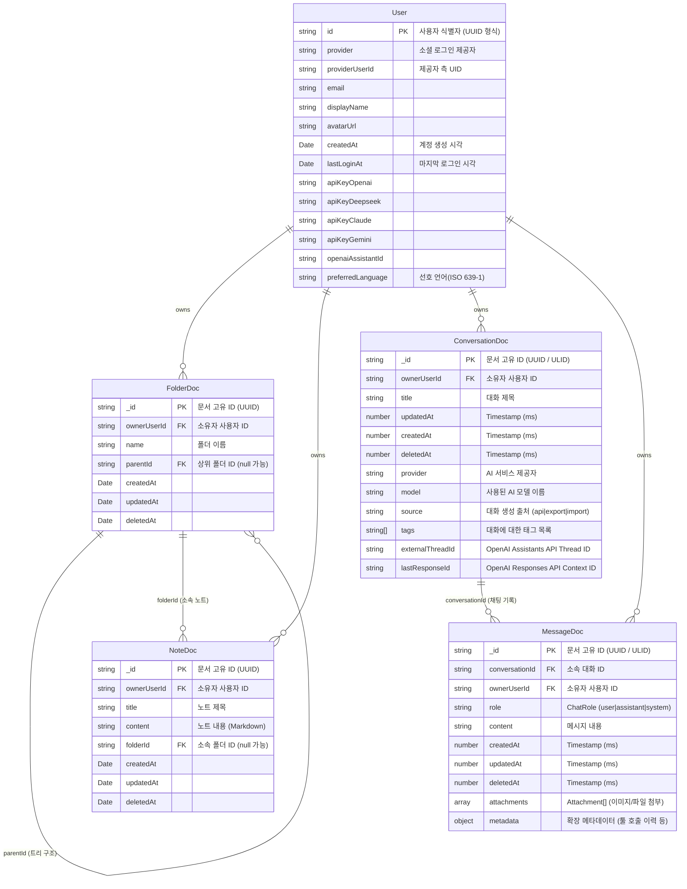
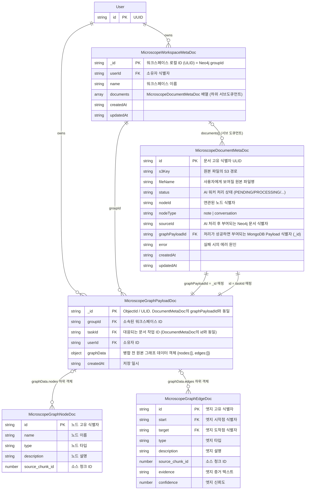
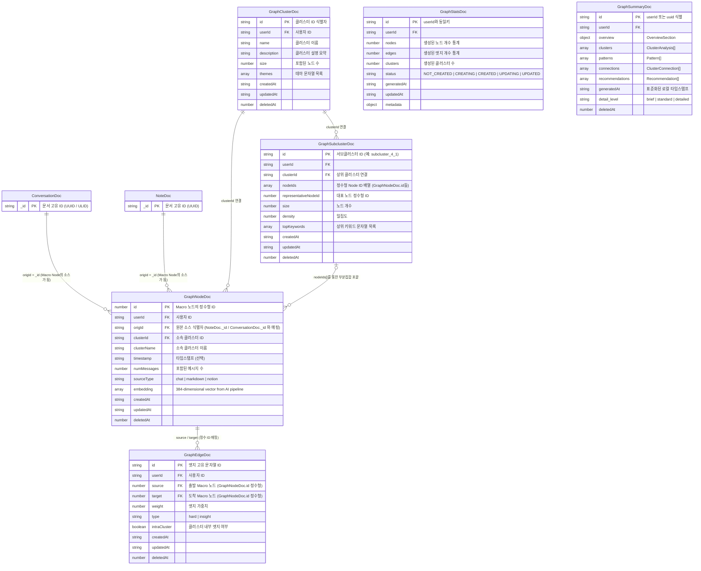
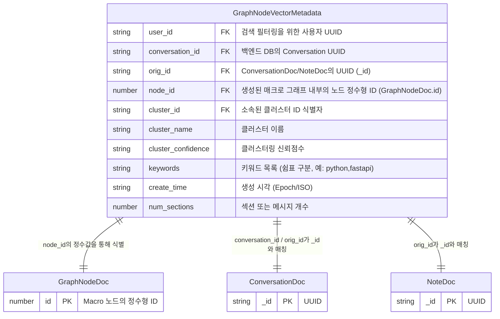

# 💾 Database Architecture (Detailed)

GraphNode Backend는 데이터의 특성에 따라 MySQL, MongoDB, Redis, Vector DB를 혼용하는 **Polyglot Persistence** 전략을 사용합니다. 본 문서는 각 데이터베이스의 스키마와 필드 정의를 상세히 기술합니다. 클라우드 기반 DB의 안정성을 위해 지수 백오프 기반의 [재시도 정책](retry-policy.md)이 전 계층에 적용되어 있습니다.

# GraphNode 데이터베이스 Entity-Relationship Diagram (ERD)

시스템 규모가 커짐에 따라(대형 서비스의 일반적인 방식), 도메인 컨텍스트(Bounded Context)별로 ERD를 분리하여 시각화합니다. 
이를 통해 다이어그램의 복잡도를 낮추고 각 도메인 내의 데이터 관계를 명확히 파악할 수 있습니다.

---

## 1. 코어 서비스 및 파일 시스템 (Core & Files)
사용자(User)를 중심으로 노트(Note)와 폴더(Folder), 그리고 AI와의 대화(Conversation) 이력을 관리하는 핵심 데이터 모델입니다.

---

## 2. Microscope (Micro Graph) 파이프라인
**Microscope**는 개별 문서나 개별 대화 단위로 텍스트에서 지식(Entity, Relationship)을 추출해 생성하는 상대적으로 작은 규모의 지엽적 그래프(Micro Graph) 처리를 담당합니다. 대용량(16MB 이상)의 원본 그래프 데이터를 `Payload` 컬렉션으로 분리하여 저장합니다.

---

## 3. Macro Graph 계층 (군집 및 시각화)
**Macro Graph**는 여러 문서, 대화들을 포괄하여 시간의 흐름상 만들어진 다차원적 지식 시각화 전용 그래프 엔진입니다. 

> **설계 참고(User ID)**: 
> 본질적으로 개인화(Local-first/Private-first) 서비스이기 때문에, Macro Graph에 속한 모든 도큐먼트들은 기본적으로 동일한 `userId`를 갖습니다. RDBMS라면 JOIN 성능 상 논리적 최상단(User)에만 FK를 두는 방식도 고려할 수 있으나, **NoSQL/Document DB 구조의 특성(샤딩 Key 및 쿼리 필터 최적화, 보안적 분리)**상 `userId`를 모든 컬렉션 도큐먼트 안에 비정규화(Denormalization)하여 중복 포함시키는 것이 대규모 서비스에서 가장 일반적인 최적화 패턴입니다. (보안 룰 적용 및 단일 컬렉션 빠른 인덱스 스캔 이점). 본 ERD에서도 실제 코드와 동일하게 `userId` 프로퍼티가 하위 엔티티 전체에 존재하도록 표현했습니다.

---

## 4. Vector DB (Search & Graph-Features)
AI 파이프라인에서 추출된 특징 정보(Vector Embeddings)와 이를 검색에 활용하기 위한 ChromaDB Payload 구성을 정의합니다. 

---

## 1. PostgreSQL (Relational Data)

사용자 계정, 인증 정보 등 높은 정합성이 요구되는 데이터는 PostgreSQL에 저장합니다. (Prisma ORM 사용)

### **Users Table**
- **Table Name**: `users` (managed by Prisma)
- **Source**: `src/core/types/persistence/UserPersistence.ts`

| Field | Type | Required | Description |
| :--- | :--- | :--- | :--- |
| **id** | `String` (UUID) | Yes | 내부 사용자 고유 식별자 (PK) |
| **provider** | `String` | Yes | 소셜 로그인 제공자 (`google`, `apple`, `dev`) |
| **providerUserId** | `String` | Yes | 제공자 측 사용자 식별자 (Subject ID) |
| **email** | `String` | No | 사용자 이메일 (Null 가능) |
| **displayName** | `String` | No | 표시 이름 |
| **avatarUrl** | `String` | No | 프로필 이미지 URL |
| **createdAt** | `DateTime` | Yes | 계정 생성 시각 (UTC) |
| **lastLoginAt** | `DateTime` | No | 마지막 로그인 시각 |
| **apiKeyOpenai** | `String` | No | (Encrypted) OpenAI API Key |
| **apiKeyDeepseek** | `String` | No | (Encrypted) DeepSeek API Key |
| **apiKeyClaude** | `String` | No | (Encrypted) Claude API Key |
| **apiKeyGemini** | `String` | No | (Encrypted) Gemini API Key |
| **openaiAssistantId**| `String` | No | OpenAI Assistants API ID |
| **preferredLanguage**| `String` | Yes | 선호 언어 (Default: 'en') |

---

## 2. MongoDB (Document Data)

비정형 컨텐츠(대화, 메시지, 노트)와 그래프 구조 데이터는 MongoDB에 저장합니다.

### A. Conversation Domain
`src/core/types/persistence/ai.persistence.ts`

#### **conversations** Collection
사용자의 대화 세션 정보입니다.

| Field | Type | Description |
| :--- | :--- | :--- |
| **_id** | `String` (UUID) | 대화 고유 ID (PK) |
| **ownerUserId** | `String` | 소유자 사용자 ID (Index) |
| **title** | `String` | 대화 제목 |
| **updatedAt** | `Number` (Timestamp)| 마지막 업데이트 시각 |
| **createdAt** | `Number` (Timestamp)| 생성 시각 |
| **deletedAt** | `Number` | 삭제 시각 (Soft Delete, Optional) |
| **provider** | `String` | 사용된 AI Provider (openai, gemini, claude 등) |
| **model** | `String` | 사용된 모델명 (gpt-4o, claude-3-5-sonnet 등) |
| **source** | `String` | 대화 생성 출처 (`api`, `export`, `import`) (Optional) |
| **tags** | `Array<String>` | 태그 목록 |
| **externalThreadId** | `String` | OpenAI Assistants API Thread ID (Optional) |
| **lastResponseId** | `String` | OpenAI Responses API Context ID (Optional) |

#### **messages** Collection
대화 내 개별 메시지입니다.

| Field | Type | Description |
| :--- | :--- | :--- |
| **_id** | `String` (UUID) | 메시지 고유 ID |
| **conversationId** | `String` | 소속 대화 ID (Index) |
| **ownerUserId** | `String` | 소유자 ID (역정규화, 쿼리 최적화용) |
| **role** | `String` | 역할 (`user`, `assistant`, `system`) |
| **content** | `String` | 메시지 본문 |
| **createdAt** | `Number` | 생성 시각 |
| **updatedAt** | `Number` | 수정 시각 |
| **deletedAt** | `Number` | 삭제 시각 (Soft Delete, Optional) |
| **attachments** | `Array<Attachment>` | 첨부 파일 정보 (id, type, url, name, mimeType, size) |
| **metadata** | `Object` | 확장 데이터 (Code Interpreter, File Search 등) |

### B. Graph Domain (Knowledge Graph)
`src/core/types/persistence/graph.persistence.ts`

#### **graph_nodes** Collection
AI가 추출한 지식 그래프의 노드입니다.

| Field | Type | Description |
| :--- | :--- | :--- |
| **id** | `Number` | 노드 ID (Auto Inc per User or Global) |
| **userId** | `String` | 소유자 ID |
| **origId** | `String` | 원본 출처 ID (NoteDoc._id 또는 ConversationDoc._id) |
| **clusterId** | `String` | 소속 클러스터 ID |
| **clusterName** | `String` | 소속 클러스터 이름 |
| **timestamp** | `String` | 타임스탬프 (null 가능) |
| **numMessages** | `Number` | 관련 메시지 수 |
| **sourceType** | `String` | 원본 소스 유형 (`chat`, `markdown`, `notion`) (Optional) |
| **embedding** | `Array<Number>` | (Optional) 384차원 벡터 임베딩 |
| **createdAt** | `String` | 생성 일시 |
| **updatedAt** | `String` | 수정 일시 |
| **deletedAt** | `Number` | 삭제 시각 (Soft Delete, Optional) |

#### **graph_edges** Collection
노드 간의 관계(엣지)입니다.

| Field | Type | Description |
| :--- | :--- | :--- |
| **id** | `String` | 엣지 고유 ID |
| **userId** | `String` | 소유자 ID |
| **source** | `Number` | 출발 노드 ID (GraphNodeDoc.id) |
| **target** | `Number` | 도착 노드 ID (GraphNodeDoc.id) |
| **weight** | `Number` | 관계 가중치 |
| **type** | `String` | `hard` (명시적), `insight` (AI 도출) |
| **intraCluster** | `Boolean` | 클러스터 내부 연결 여부 |
| **createdAt** | `String` | 생성 일시 |
| **updatedAt** | `String` | 수정 일시 |
| **deletedAt** | `Number` | 삭제 시각 (Soft Delete, Optional) |

#### **graph_clusters** Collection
노드들의 군집(Topic) 정보입니다.

| Field | Type | Description |
| :--- | :--- | :--- |
| **id** | `String` | 클러스터 ID |
| **userId** | `String` | 소유자 ID |
| **name** | `String` | 클러스터 이름 |
| **description** | `String` | 클러스터 설명 |
| **size** | `Number` | 포함된 노드 수 |
| **themes** | `Array<String>` | 주요 테마 키워드 |
| **createdAt** | `String` | 생성 일시 |
| **updatedAt** | `String` | 수정 일시 |
| **deletedAt** | `Number` | 삭제 시각 (Soft Delete, Optional) |

#### **graph_summaries** Collection
사용자의 지식 그래프 전체 요약 리포트입니다.

| Field | Type | Description |
| :--- | :--- | :--- |
| **id** | `String` | 요약 ID (userId 또는 UUID) |
| **userId** | `String` | 소유자 ID |
| **overview** | `Object` (OverviewSection) | 전체 개요 (text, sentiment 등) |
| **clusters** | `Array<ClusterAnalysis>` | 주요 클러스터 분석 |
| **patterns** | `Array<Pattern>` | 발견된 패턴 |
| **connections** | `Array<ClusterConnection>` | 클러스터 간 연결성 |
| **recommendations** | `Array<Recommendation>` | AI 추천 사항 |
| **generatedAt** | `String` | 표준화된 로컬 타임스탬프 (ISO 8601) |
| **detail_level** | `String` | 요약 상세 레벨 (`brief`, `standard`, `detailed`) |
| **deletedAt** | `Number` | 삭제 시각 (Soft Delete, Optional) |

### C. Note Domain
`src/core/types/persistence/note.persistence.ts`

#### **notes** Collection
| Field | Type | Description |
| :--- | :--- | :--- |
| **_id** | `String` (UUID) | 노트 고유 ID |
| **ownerUserId** | `String` | 소유자 ID |
| **title** | `String` | 제목 |
| **content** | `String` | 내용 (Markdown) |
| **folderId** | `String` | 소속 폴더 ID (Null=Root) |
| **createdAt** | `Date` | 생성 일시 |
| **updatedAt** | `Date` | 수정 일시 |
| **deletedAt** | `Date` | 삭제 일시 (Soft Delete, Optional) |

#### **folders** Collection
| Field | Type | Description |
| :--- | :--- | :--- |
| **_id** | `String` (UUID) | 폴더 고유 ID |
| **ownerUserId** | `String` | 소유자 ID |
| **name** | `String` | 폴더명 |
| **parentId** | `String` | 상위 폴더 ID (Null=Root) |
| **createdAt** | `Date` | 생성 일시 |
| **updatedAt** | `Date` | 수정 일시 |
| **deletedAt** | `Date` | 삭제 일시 (Soft Delete, Optional) |

### D. Microscope Domain
`src/core/types/persistence/microscope_workspace.persistence.ts`

다중 문서를 기반으로 분석하는 Microscope 파이프라인의 진행 상태 및 메타데이터를 저장합니다. 추출된 지식 그래프 데이터는 분석 완료 후 S3에 JSON 형태로 영속화되며, 웹 클라이언트에서 필요한 시점에 다운로드하여 시각화합니다. (Neo4j 의존성 제거됨)

#### **microscope_workspaces** Collection
| Field | Type | Description |
| :--- | :--- | :--- |
| **_id** | `String` (ULID) | 워크스페이스(그룹) ID. Neo4j의 `group_id`와 매핑됨 |
| **userId** | `String` | 소유자 ID |
| **name** | `String` | 워크스페이스 이름 |
| **documents** | `Array<Document>` | 업로드된 문서 목록 및 상태 (하단 참고) |
| **createdAt** | `String` | 생성 시각 (ISO 8601) |
| **updatedAt** | `String` | 수정 시각 (ISO 8601) |

**Document Object Structure within `documents` array:**
| Field | Type | Description |
| :--- | :--- | :--- |
| **id** | `String` (ULID) | 개별 문서 고유 ID (SQS taskId로 사용됨) |
| **s3Key** | `String` | 원본 파일 S3 경로 |
| **fileName** | `String` | 원본 파일명 |
| **status** | `String` | AI 워커 처리 상태 (`PENDING`, `PROCESSING`, `COMPLETED`, `FAILED`) |
| **nodeId** | `String` | (Optional) 연관된 노드 식별자 (NoteDoc._id 또는 ConversationDoc._id) |
| **nodeType** | `String` | (Optional) 노드 유형 (`note`, `conversation`) |
| **sourceId** | `String` | (Optional) AI 워커 성공 시 부여되는 고유 문서 식별자 |
| **graphPayloadId** | `String` | (Optional) 처리 성공 시 부여되는 Payload 문서 ID (MicroscopeGraphPayloadDoc._id) |
| **error** | `String` | (Optional) 실패 시 에러 사유 |
| **createdAt** | `String` | 등록 일시 |
| **updatedAt** | `String` | 상태 변경 일시 |

---

## 3. Vector Metadata (ChromaDB)

`src/core/types/vector/graph-features.ts`

Vector DB에 저장되는 임베딩과 함께 저장되는 메타데이터(`metadata`) 필드입니다. 키 네이밍은 Python 스타일(`snake_case`)을 따릅니다.

| Field | Type | Description |
| :--- | :--- | :--- |
| **user_id** | `String` | 사용자 ID (필터링 필수) |
| **conversation_id** | `String` | 원본 대화 ID (UUID) |
| **orig_id** | `String` | 원본 ID (ConversationDoc/NoteDoc의 _id) |
| **node_id** | `Number` | 그래프 노드 ID (GraphNodeDoc.id 정수형, Optional) |
| **cluster_id** | `String` | 클러스터 ID (Optional) |
| **cluster_name** | `String` | 클러스터 이름 (Optional) |
| **cluster_confidence** | `String` | 클러스터링 신뢰도 (Optional) |
| **keywords** | `String` | 검색용 키워드 (쉼표 구분 문자열, Optional) |
| **create_time** | `Number \| String` | 생성 시각 (Epoch 또는 ISO, Optional) |
| **num_sections** | `Number` | 섹션 또는 메시지 개수 (Optional) |

---

## 4. Object Storage (S3 JSON)

대용량 그래프 데이터 및 AI 분석 결과는 S3 버킷에 JSON 파일로 보관됩니다.

- **Payload Bucket**: AI 서버의 최종 분석 결과 (`standardized.json`, `graph_final.json` 등)
- **Log/Debug**: 파이프라인 진행 과정의 중간 산출물

분석 결과 데이터는 `MicroscopeManagementService` 또는 `GraphGenerationService`를 통해 사용자별로 관리되며, 클라우드 환경의 네트워크 지연에 대비해 `withRetry` 유틸리티를 통한 재시도가 적용됩니다.
