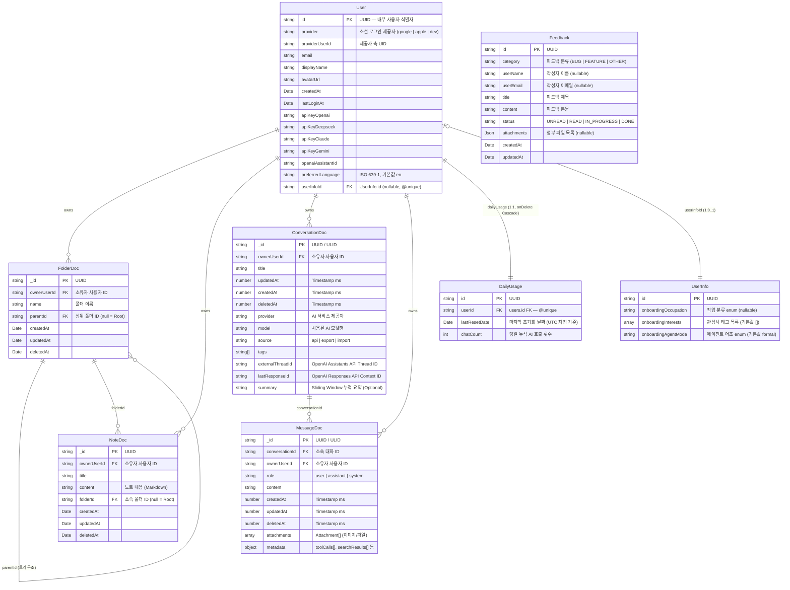
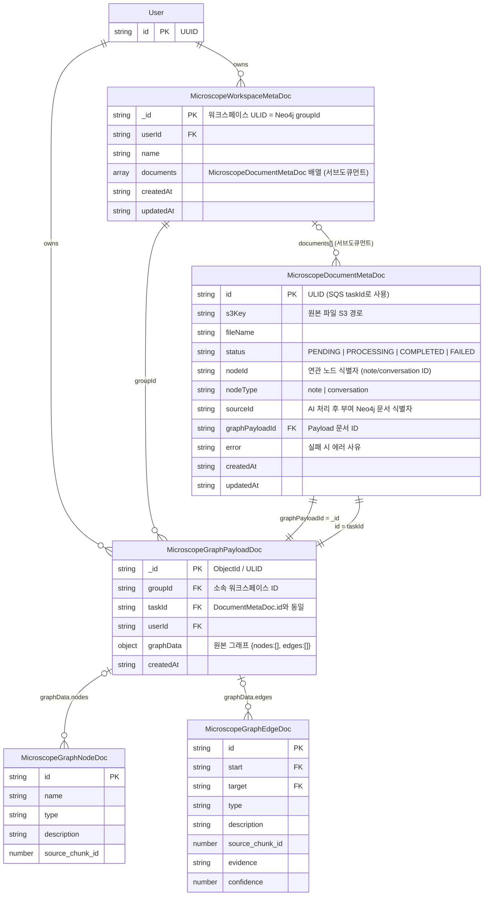
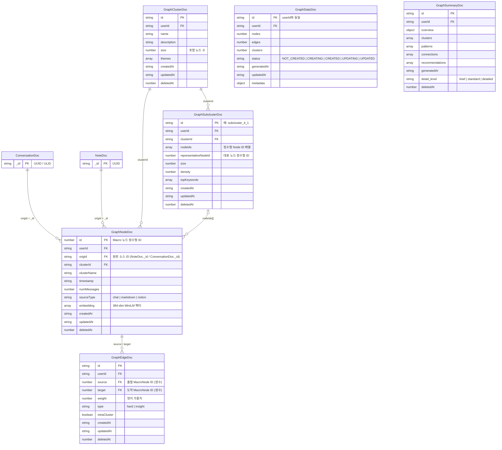
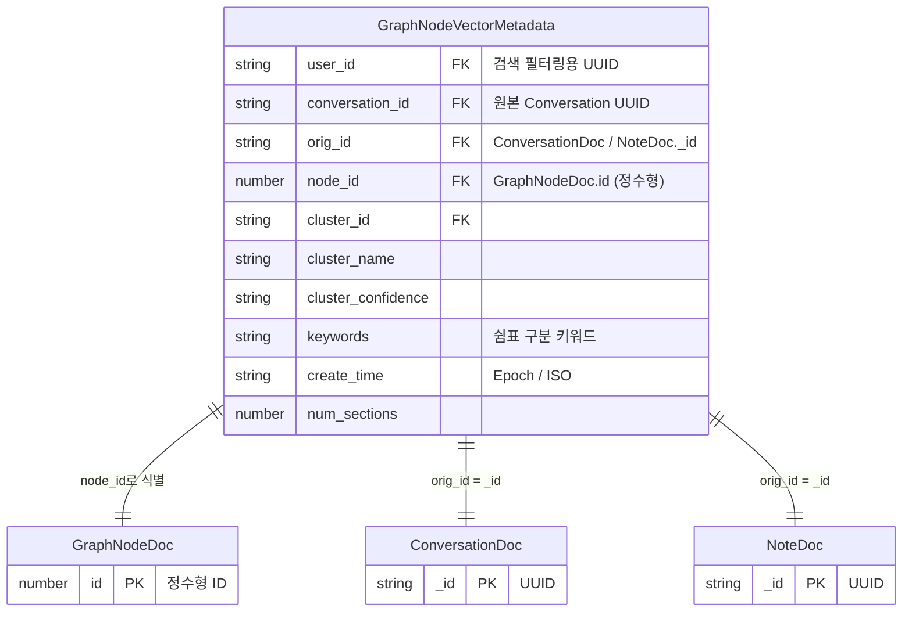

# Database ERD (Entity-Relationship Diagrams)

> 마지막 갱신: 2026-04-29

GraphNode의 전체 데이터 모델을 도메인 컨텍스트(Bounded Context)별로 분리하여 시각화합니다.  
각 다이어그램은 실제 저장소 구현(Prisma / Mongoose / Neo4j)을 기반으로 자동 동기화됩니다.

← 인덱스로 돌아가기: [`DATABASE.md`](DATABASE.md)

---

## 1. 코어 서비스 및 파일 시스템 (Core & Files)

사용자(User)를 중심으로 노트(Note), 폴더(Folder), AI 대화(Conversation) 이력을 관리하는 핵심 데이터 모델입니다.  
PostgreSQL(User, DailyUsage, UserInfo, Feedback)과 MongoDB(Note, Folder, Conversation, Message)에 분산 저장됩니다.

---

## 2. Microscope (Micro Graph) 파이프라인

개별 문서 단위로 텍스트에서 지식(Entity, Relationship)을 추출해 생성하는 상대적으로 작은 규모의 지엽적 그래프(Micro Graph) 처리를 담당합니다.  
대용량(16MB 이상)의 원본 그래프 데이터를 `Payload` 컬렉션으로 분리하여 저장합니다.

---

## 3. Macro Graph 계층 (군집 및 시각화)

여러 문서·대화를 포괄하는 다차원적 지식 시각화 전용 그래프 엔진입니다.  
이 계층의 데이터는 MongoDB 컬렉션에 더불어 **Neo4j**에도 Native Graph 구조로 미러링됩니다.  
Neo4j 상세 아키텍처 및 Graph RAG 활용은 [`DATABASE_NEO4J.md`](DATABASE_NEO4J.md)를 참조하세요.

> **userId 비정규화 설계**: 개인화 서비스 특성상 모든 하위 도큐먼트에 `userId`를 중복 포함합니다.  
> NoSQL 샤딩 키 최적화 및 보안 분리를 위한 일반적인 패턴입니다.

---

## 4. Vector DB (ChromaDB Seed 검색)

AI 파이프라인에서 추출한 384차원 MiniLM 임베딩을 ChromaDB에 저장합니다.  
Graph RAG 파이프라인에서 의미 유사도 기반 Seed 노드를 추출하는 데 활용됩니다.

> **컬렉션 이름**: `macro_node_all_minilm_l6_v2`  
> **임베딩 모델**: `all-MiniLM-L6-v2` (384차원, HuggingFace)  
> **필터 키**: `user_id` (사용자별 격리 필수)
