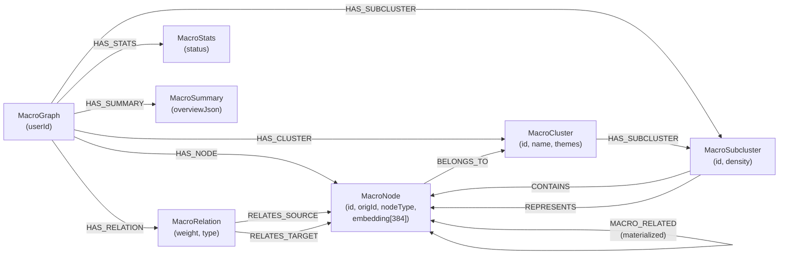

# Neo4j — Macro Graph 아키텍처 & Graph RAG

> 마지막 갱신: 2026-04-29

GraphNode의 Neo4j는 **Macro Graph**를 Native Graph 구조로 저장하고, **Graph RAG(Retrieval-Augmented Generation)** 파이프라인에서 의미 기반 이웃 탐색에 사용됩니다.

← 인덱스로 돌아가기: [`DATABASE.md`](DATABASE.md)

---

## 1. Neo4j 역할 요약

| 역할 | 세부 내용 |
|---|---|
| **Macro Graph 저장** | 지식 노드(MacroNode) · 클러스터 · 엣지를 Native 그래프 구조로 보관 |
| **Graph RAG 탐색** | ChromaDB Seed 노드에서 1홉/2홉 이웃을 `MACRO_RELATED` 관계로 탐색 |
| **그래프 집계** | 노드/엣지/클러스터 실시간 COUNT 집계 (Neo4j 관계 기반, MongoDB 비의존) |
| **Soft/Hard Delete** | `deletedAt` 타임스탬프 관리 및 복원 지원 |

**관련 소스 파일**:
- Port: `src/core/ports/MacroGraphStore.ts`
- Adapter: `src/infra/graph/Neo4jMacroGraphAdapter.ts`
- Cypher: `src/infra/graph/cypher/macroGraph.cypher.ts`
- Mapper: `src/infra/graph/mappers/macroGraphNeo4j.mapper.ts`

---

## 2. Neo4j 그래프 모델

### 2.1 노드 레이블 (Node Labels)

| 레이블 | 역할 | 주요 속성 |
|---|---|---|
| `MacroGraph` | 사용자별 그래프 루트 (1:1) | `userId`, `createdAt`, `updatedAt` |
| `MacroNode` | 지식 노드 (대화/노트 원본 1개에 대응) | `id`(정수), `userId`, `origId`, `nodeType`, `timestamp`, `numMessages`, `embedding`(384d), `deletedAt` |
| `MacroCluster` | 군집(Topic) 노드 | `id`, `userId`, `name`, `description`, `themes[]`, `deletedAt` |
| `MacroSubcluster` | 서브 군집 노드 | `id`, `userId`, `topKeywords[]`, `density`, `deletedAt` |
| `MacroRelation` | 엣지 메타데이터 노드 | `id`, `userId`, `weight`, `type`(hard\|insight), `intraCluster`, `deletedAt` |
| `MacroStats` | 그래프 통계 메타 노드 | `id`, `userId`, `status`, `generatedAt`, `metadataJson` |
| `MacroSummary` | AI 요약 노드 | `id`, `userId`, `overviewJson`, `clustersJson`, `patternsJson`, `connectionsJson`, `recommendationsJson`, `generatedAt`, `detailLevel`, `deletedAt` |

### 2.2 관계 타입 (Relationship Types)

```
MacroGraph ──HAS_NODE──────────► MacroNode
MacroGraph ──HAS_CLUSTER───────► MacroCluster
MacroGraph ──HAS_SUBCLUSTER────► MacroSubcluster
MacroGraph ──HAS_RELATION──────► MacroRelation
MacroGraph ──HAS_STATS─────────► MacroStats
MacroGraph ──HAS_SUMMARY───────► MacroSummary

MacroNode  ──BELONGS_TO────────► MacroCluster
MacroCluster──HAS_SUBCLUSTER───► MacroSubcluster
MacroSubcluster──CONTAINS──────► MacroNode
MacroSubcluster──REPRESENTS────► MacroNode   (대표 노드 1개)

MacroRelation──RELATES_SOURCE──► MacroNode   (source endpoint)
MacroRelation──RELATES_TARGET──► MacroNode   (target endpoint)

MacroNode  ──MACRO_RELATED─────► MacroNode   (materialized, Graph RAG 탐색용)
```

> **MACRO_RELATED (materialized)**: `MacroRelation` 노드를 경유하지 않고 노드 간에 직접 생성하는 관계입니다.  
> Graph RAG의 이웃 탐색 성능을 위해 존재하며 `weight`, `type`, `intraCluster`, `deletedAt` 속성을 보유합니다.

---

## 3. 그래프 ERD (Mermaid)



---

## 4. Graph RAG 파이프라인

Graph RAG는 **의미 유사도(ChromaDB)** + **그래프 구조(Neo4j)** 를 결합하여 더 풍부한 검색 컨텍스트를 구성합니다.

### 4.1 처리 흐름

```
사용자 키워드
    │
    ▼  [Phase 1] MiniLM 임베딩 변환 (384-dim)
    │       shared/utils/huggingface.ts :: generateMiniLMEmbedding()
    │
    ▼  [Phase 2] ChromaDB 벡터 유사도 검색 (Seed 추출)
    │       GraphVectorService.searchNodes()
    │       컬렉션: macro_node_all_minilm_l6_v2
    │       필터: user_id = userId
    │       반환: { origId, vectorScore }[]   ← Seed 노드
    │
    ▼  [Phase 3] Neo4j MACRO_RELATED 그래프 확장 (이웃 탐색)
    │       MacroGraphStore.searchGraphRagNeighbors()
    │       1홉: (seed)──MACRO_RELATED──►(neighbor)
    │       2홉: (seed)──MACRO_RELATED──►(mid)──MACRO_RELATED──►(neighbor)
    │       Seed는 결과에서 제외, soft-deleted 노드/엣지 필터링
    │
    ▼  [Phase 4] 스코어 결합 및 랭킹
    │
    ▼  최종 결과: GraphRagSearchResult
```

### 4.2 스코어 결합 공식

```
Seed (hopDistance = 0):
    combinedScore = vectorScore

1홉 이웃 (hopDistance = 1):
    combinedScore = maxSeedScore × 0.8 × avgEdgeWeight × (1 + 0.15 × (connectionCount - 1))

2홉 이웃 (hopDistance = 2):
    combinedScore = maxSeedScore × 0.5 × avgEdgeWeight × (1 + 0.15 × (connectionCount - 1))
```

- `maxSeedScore`: 해당 이웃과 연결된 Seed 중 최고 vectorScore
- `avgEdgeWeight`: Seed → 이웃 경로상 MACRO_RELATED 엣지들의 평균 가중치 (0~1)
- `connectionCount`: 이 이웃에 도달할 수 있는 Seed 노드 수 (클수록 중심성 높음)

### 4.3 관련 API 엔드포인트

| 방향 | 엔드포인트 | 설명 |
|---|---|---|
| 실제 API | `GET /v1/search/graph-rag?q={keyword}&limit={n}` | 인증 필요 (JWT) |
| 로컬 테스트 | `POST /dev/test/search/graph-rag` | 인증 없음, userId를 body로 전달 |

---

## 5. upsertGraph 전략 (Incremental Write vs Full Replace)

### 5.1 전체 교체 (Full Replace) — `upsertGraph`

```
Phase 1: purgeUserData     — 기존 사용자 연결 노드/관계 정리 (MacroGraph 루트 유지)
Phase 2: upsertGraphRoot   — MacroGraph 루트 upsert
Phase 3: 엔티티 upsert     — Nodes → Clusters → Subclusters → Relations → Stats → Summary
Phase 4: 관계 생성         — HAS_NODE, HAS_CLUSTER, BELONGS_TO, MACRO_RELATED 등
```

모두 단일 Neo4j write transaction 안에서 수행합니다.

### 5.2 증분 쓰기 (Incremental Write)

개별 엔티티를 독립적으로 upsert하는 메서드들:

| 메서드 | 용도 |
|---|---|
| `upsertNode / upsertNodes` | 단일/다수 노드 upsert |
| `upsertEdge / upsertEdges` | 단일/다수 엣지 upsert (MACRO_RELATED 포함) |
| `upsertCluster / upsertClusters` | 단일/다수 클러스터 upsert |
| `upsertSubcluster / upsertSubclusters` | 서브클러스터 upsert + 관계 생성 |
| `saveStats` | 통계 노드 upsert |
| `upsertGraphSummary` | 요약 노드 upsert |

> **주의**: `ensureGraphRoot`가 모든 Incremental Write 전처리로 자동 호출됩니다.

---

## 6. Soft/Hard Delete 정책

| 대상 | Soft Delete | Hard Delete |
|---|---|---|
| `MacroNode` | `deletedAt` 타임스탬프 설정 | `DETACH DELETE` |
| `MacroRelation` (MACRO_RELATED) | `deletedAt` 설정 | 물리 삭제 |
| `MacroCluster` | `deletedAt` 설정 | 물리 삭제 |
| `MacroSubcluster` | `deletedAt` 설정 | 물리 삭제 |
| `MacroSummary` | `deletedAt` 설정 | — |
| 사용자 전체 | `deleteAllGraphData(permanent=false)` | `deleteGraph()` |

복원: `restoreNode`, `restoreNodesByOrigIds`, `restoreAllGraphData`, `restoreGraphSummary` 등

---

## 7. 로컬 개발 환경

### Docker 설정

```yaml
# docker-compose.yml (발췌)
neo4j:
  image: neo4j:latest
  ports:
    - 7474:7474   # Neo4j Browser (시각화)
    - 7687:7687   # Bolt (드라이버 연결)
  environment:
    NEO4J_AUTH: neo4j/your_password_here
  volumes:
    - ./data/neo4j:/data
```

### 환경변수 (Infisical 주입)

```
NEO4J_URI=bolt://localhost:7687
NEO4J_USER=neo4j
NEO4J_PASSWORD=your_password_here
```

### 연결 초기화

`src/infra/db/neo4j.ts` — `initNeo4j()` 호출로 Singleton Driver 생성.  
`src/bootstrap/server.ts` — 앱 시작 시 ChromaDB와 함께 병렬 초기화.

### 시각화 및 디버깅

- Neo4j Browser: `http://localhost:7474` — Cypher 쿼리 직접 실행 가능
- 예시 쿼리: `MATCH (g:MacroGraph {userId: "xxx"})-[:HAS_NODE]->(n:MacroNode) RETURN n LIMIT 25`

---

## 8. 성능 고려사항

- **Connection Pool**: `neo4j-driver`가 내부적으로 관리. `Driver` 인스턴스는 전역 싱글톤 1개만 생성.
- **세션 관리**: `runRead / runWrite` 래퍼로 세션을 `try...finally`에서 반드시 `close()`.
- **1홉 + 2홉 병렬 실행**: `searchGraphRagNeighbors`에서 `Promise.all`로 동시 실행, IO 대기 최소화.
- **MACRO_RELATED materialized 관계**: 2홉 이상 Cypher 탐색 대신 직접 관계 탐색으로 쿼리 성능 보장.
- **Seed Fetch 배수**: Graph RAG에서 Seed를 `limit * 2`개 뽑아 그래프 확장 후 최종 `limit`으로 감소.
