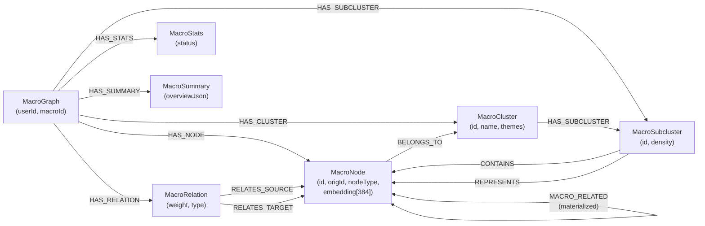

# Neo4j — Macro Graph 아키텍처 & Graph RAG

> 마지막 갱신: 2026-06-21

GraphNode의 Neo4j는 **Macro Graph**를 Native Graph 구조로 저장하고, **Graph RAG(Retrieval-Augmented Generation)** 파이프라인에서 의미 기반 이웃 탐색에 사용됩니다.

← 인덱스로 돌아가기: [`DATABASE.md`](DATABASE.md)

---

## 1. Neo4j 역할 요약

| 역할 | 세부 내용 |
|---|---|
| **Macro Graph 저장** | 지식 노드(MacroNode) · 클러스터 · 엣지를 Native 그래프 구조로 보관 |
| **Graph RAG 탐색** | ChromaDB Seed 노드에서 1홉/2홉 이웃을 `MACRO_RELATED` 관계로 탐색 |
| **그래프 집계** | 노드/엣지/클러스터 실시간 COUNT 집계 (Neo4j 관계 기반, MongoDB 비의존) |
| **Soft/Hard Delete** | `deletedAt` 타임스탬프 관리 및 복원 지원 |

**관련 소스 파일**:
- Port: `src/core/ports/MacroGraphStore.ts`
- Adapter: `src/infra/graph/Neo4jMacroGraphAdapter.ts`
- Cypher: `src/infra/graph/cypher/macroGraph.cypher.ts`
- Mapper: `src/infra/graph/mappers/macroGraphNeo4j.mapper.ts`

---

## 2. Neo4j 그래프 모델

### 2.1 노드 레이블 (Node Labels)

| 레이블 | 역할 | 고유 키 | 주요 속성 |
|---|---|---|---|
| `MacroGraph` | 사용자별 매크로 뷰 루트 (1:N) | `(userId, macroId)` | `userId`, `macroId`, `title?`, `description?`, `scopeJson?`, `createdAt`, `updatedAt`, `deletedAt` |
| `MacroNode` | 지식 노드 (대화/노트 원본 1개에 대응) | `(userId, macroId, id)` | `userId`, `macroId`, `id`(정수), `origId`, `nodeType`, `timestamp`, `numMessages`, `embedding`(384d), `deletedAt` |
| `MacroCluster` | 군집(Topic) 노드 | `(userId, macroId, id)` | `userId`, `macroId`, `id`, `name`, `description`, `themes[]`, `deletedAt` |
| `MacroSubcluster` | 서브 군집 노드 | `(userId, macroId, id)` | `userId`, `macroId`, `id`, `topKeywords[]`, `density`, `deletedAt` |
| `MacroRelation` | 엣지 메타데이터 노드 | `(userId, macroId, id)` | `userId`, `macroId`, `id`, `weight`, `type`(hard\|insight), `intraCluster`, `deletedAt` |
| `MacroStats` | 그래프 통계 메타 노드 | `(userId, macroId)` | `userId`, `macroId`, `id`, `status`, `generatedAt`, `metadataJson` |
| `MacroSummary` | AI 요약 노드 | `(userId, macroId)` | `userId`, `macroId`, `id`, `overviewJson`, `clustersJson`, `patternsJson`, `connectionsJson`, `recommendationsJson`, `generatedAt`, `detailLevel`, `deletedAt` |

> **1:N 격리**: 모든 하위 엔티티(MacroNode/Cluster/Subcluster/Relation/Stats/Summary)는 `(userId, macroId, id)` 복합 키로 유일하게 식별됩니다. **서로 다른 macroId를 가진 Macro View는 동일한 숫자 `id`를 가질 수 있습니다** (unique constraint는 `(userId, macroId, id)` 단위). 따라서 삭제/복원 Cypher는 반드시 `macroId` 조건을 포함해야 하며, `id`만으로 `MATCH`하면 다른 뷰의 노드가 오염됩니다. Clone 시 `newMacroId`로 독립 복제되며, 레거시 1:1 데이터는 `macroId = userId`로 backfill됩니다.

### 2.2 관계 타입 (Relationship Types)

```
MacroGraph ──HAS_NODE──────────► MacroNode
MacroGraph ──HAS_CLUSTER───────► MacroCluster
MacroGraph ──HAS_SUBCLUSTER────► MacroSubcluster
MacroGraph ──HAS_RELATION──────► MacroRelation
MacroGraph ──HAS_STATS─────────► MacroStats
MacroGraph ──HAS_SUMMARY───────► MacroSummary

MacroNode  ──BELONGS_TO────────► MacroCluster
MacroCluster──HAS_SUBCLUSTER───► MacroSubcluster
MacroSubcluster──CONTAINS──────► MacroNode
MacroSubcluster──REPRESENTS────► MacroNode   (대표 노드 1개)

MacroRelation──RELATES_SOURCE──► MacroNode   (source endpoint)
MacroRelation──RELATES_TARGET──► MacroNode   (target endpoint)

MacroNode  ──MACRO_RELATED─────► MacroNode   (materialized, Graph RAG 탐색용)
```

> **MACRO_RELATED (materialized)**: `MacroRelation` 노드를 경유하지 않고 노드 간에 직접 생성하는 관계입니다.  
> Graph RAG의 이웃 탐색 성능을 위해 존재하며 `weight`, `type`, `intraCluster`, `deletedAt` 속성을 보유합니다.

---

## 3. 그래프 ERD (Mermaid)


```mermaid
graph LR
    MG["MacroGraph\n(userId, macroId)"]

    MN["MacroNode\n(id, origId, nodeType,\nembedding[384])"]
    MC["MacroCluster\n(id, name, themes)"]
    MS["MacroSubcluster\n(id, density)"]
    MR["MacroRelation\n(weight, type)"]
    MST["MacroStats\n(status)"]
    MSM["MacroSummary\n(overviewJson)"]

    MG -->|HAS_NODE| MN
    MG -->|HAS_CLUSTER| MC
    MG -->|HAS_SUBCLUSTER| MS
    MG -->|HAS_RELATION| MR
    MG -->|HAS_STATS| MST
    MG -->|HAS_SUMMARY| MSM

    MN -->|BELONGS_TO| MC
    MC -->|HAS_SUBCLUSTER| MS
    MS -->|CONTAINS| MN
    MS -->|REPRESENTS| MN

    MR -->|RELATES_SOURCE| MN
    MR -->|RELATES_TARGET| MN

    MN <-->|"MACRO_RELATED\n(materialized)"| MN
```

---

## 4. Graph RAG 파이프라인

Graph RAG는 **의미 유사도(ChromaDB)** + **그래프 구조(Neo4j)** 를 결합하여 더 풍부한 검색 컨텍스트를 구성합니다.

### 4.1 처리 흐름

```
사용자 키워드
    │
    ▼  [Phase 1] MiniLM 임베딩 변환 (384-dim)
    │       shared/utils/huggingface.ts :: generateMiniLMEmbedding()
    │
    ▼  [Phase 2] ChromaDB 벡터 유사도 검색 (Seed 추출)
    │       GraphVectorService.searchNodes()
    │       컬렉션: macro_node_all_minilm_l6_v2
    │       필터: user_id = userId
    │       반환: { origId, vectorScore }[]   ← Seed 노드
    │
    ▼  [Phase 3] Neo4j MACRO_RELATED 그래프 확장 (이웃 탐색)
    │       MacroGraphStore.searchGraphRagNeighbors()
    │       1홉: (seed)──MACRO_RELATED──►(neighbor)
    │       2홉: (seed)──MACRO_RELATED──►(mid)──MACRO_RELATED──►(neighbor)
    │       Seed는 결과에서 제외, soft-deleted 노드/엣지 필터링
    │
    ▼  [Phase 4] 스코어 결합 및 랭킹
    │
    ▼  최종 결과: GraphRagSearchResult
```

### 4.2 스코어 결합 공식

```
Seed (hopDistance = 0):
    combinedScore = vectorScore

1홉 이웃 (hopDistance = 1):
    combinedScore = maxSeedScore × 0.8 × avgEdgeWeight × (1 + 0.15 × (connectionCount - 1))

2홉 이웃 (hopDistance = 2):
    combinedScore = maxSeedScore × 0.5 × avgEdgeWeight × (1 + 0.15 × (connectionCount - 1))
```

- `maxSeedScore`: 해당 이웃과 연결된 Seed 중 최고 vectorScore
- `avgEdgeWeight`: Seed → 이웃 경로상 MACRO_RELATED 엣지들의 평균 가중치 (0~1)
- `connectionCount`: 이 이웃에 도달할 수 있는 Seed 노드 수 (클수록 중심성 높음)

### 4.3 관련 API 엔드포인트

| 방향 | 엔드포인트 | 설명 |
|---|---|---|
| 실제 API | `GET /v1/search/graph-rag?q={keyword}&limit={n}` | 인증 필요 (JWT) |
| 로컬 테스트 | `POST /dev/test/search/graph-rag` | 인증 없음, userId를 body로 전달 |

---

## 5. upsertGraph 전략 (Incremental Write vs Full Replace)

### 5.1 전체 교체 (Full Replace) — `upsertGraph`

```
Phase 1: purgeUserData     — 기존 사용자 연결 노드/관계 정리 (MacroGraph 루트 유지)
Phase 2: upsertGraphRoot   — MacroGraph 루트 upsert
Phase 3: 엔티티 upsert     — Nodes → Clusters → Subclusters → Relations → Stats → Summary
Phase 4: 관계 생성         — HAS_NODE, HAS_CLUSTER, BELONGS_TO, MACRO_RELATED 등
```

모두 단일 Neo4j write transaction 안에서 수행합니다.

### 5.2 증분 쓰기 (Incremental Write)

개별 엔티티를 독립적으로 upsert하는 메서드들:

| 메서드 | 용도 |
|---|---|
| `upsertNode / upsertNodes` | 단일/다수 노드 upsert |
| `upsertEdge / upsertEdges` | 단일/다수 엣지 upsert (MACRO_RELATED 포함) |
| `upsertCluster / upsertClusters` | 단일/다수 클러스터 upsert |
| `upsertSubcluster / upsertSubclusters` | 서브클러스터 upsert + 관계 생성 |
| `saveStats` | 통계 노드 upsert |
| `upsertGraphSummary` | 요약 노드 upsert |

> **주의**: `ensureGraphRoot`가 모든 Incremental Write 전처리로 자동 호출됩니다.

---

## 6. Soft/Hard Delete 정책

### 6.1 엔티티별 삭제 방식

| 대상 | Soft Delete | Hard Delete | 격리 단위 |
|---|---|---|---|
| `MacroNode` | `deletedAt` 타임스탬프 설정 | `DETACH DELETE` | `(userId, macroId, id)` |
| `MacroRelation` (MACRO_RELATED) | `deletedAt` 설정 | 물리 삭제 | `(userId, macroId, id)` |
| `MacroCluster` | `deletedAt` 설정 | 물리 삭제 | `(userId, macroId, id)` |
| `MacroSubcluster` | `deletedAt` 설정 | 물리 삭제 | `(userId, macroId, id)` |
| `MacroSummary` | `deletedAt` 설정 | — | `(userId, macroId)` |
| `MacroGraph` (뷰 루트) | `deletedAt` 설정 | `deleteGraph()` 배치 삭제 | `(userId, macroId)` |

복원: `restoreNode`, `restoreNodesByOrigIds`, `restoreAllGraphData`, `restoreGraphSummary`, `restoreMacroView` 등

### 6.2 원본 데이터 삭제 시 전역 Cascade 정책

원본 데이터(Chat/Note/File 등)가 삭제·복원될 때 `deleteNodesByOrigIds` / `restoreNodesByOrigIds`를 통해 모든 뷰(macroId)에 걸쳐 cascade가 적용됩니다.

- **Cascade 대상**: `userId`에 속하는 모든 macroId의 뷰 — soft-deleted 뷰 포함
- **타입 매칭**: 원본이 soft delete → 노드도 soft delete, hard delete → 노드도 hard delete, restore → 노드도 restore
- **연결 엣지**: cascade 대상 노드에 연결된 `MacroRelation` 및 `MACRO_RELATED` 관계도 동일 타입으로 처리
- **구현**: `softDeleteNodesByOrigIds` / `hardDeleteNodesByOrigIds` / `restoreNodesByOrigIds` Cypher는 `macroId` 제한 없이 `userId + origId`로만 매칭하여 전 뷰 동시 처리

> **주의**: `deleteNodesByOrigIds`는 `findNodeIdsByOrigIds`로 숫자 `id` 목록을 먼저 추출한 뒤 `id`만으로 삭제하는 방식을 사용하지 않습니다. 이 방식은 1:N 환경에서 다른 뷰의 동일 `id` 노드를 오염시킬 수 있습니다. 반드시 `origId`를 끝까지 사용하는 전용 Cypher를 사용해야 합니다.

### 6.3 View(MacroGraph) Soft Delete 정책

MacroGraph 루트(`MacroGraph` 노드)를 Soft Delete하면 해당 뷰의 하위 데이터(MacroNode/Cluster/Relation 등)는 변경하지 않고 루트의 `deletedAt`만 설정합니다.

- **접근 차단**: 모든 read Cypher(`listNodes`, `findNode`, `listEdges`, `listClusters`, `listSubclusters`, `findCluster`, `findNodesByOrigIds`, `listNodesByCluster`)는 `g.deletedAt IS NULL` 조건을 포함하여 삭제된 뷰의 데이터 접근을 차단합니다.
- **Cascade 수신**: Soft-deleted 뷰도 원본 데이터 cascade의 대상입니다 (`restoreNodesByOrigIds` 등은 macroId 제한 없이 전 뷰 처리).
- **복원 후 상태**: 뷰를 복원(`restoreMacroView`)하면 하위 노드들은 마지막 cascade 상태를 그대로 반영합니다.
- **30일 경과**: `cleanupExpiredMacroViewsBatch`가 `deletedAt` 기준 30일 초과 뷰를 Hard Delete 처리합니다.

---

## 7. 로컬 개발 환경

### Docker 설정

```yaml
# docker-compose.yml (발췌)
neo4j:
  image: neo4j:latest
  ports:
    - 7474:7474   # Neo4j Browser (시각화)
    - 7687:7687   # Bolt (드라이버 연결)
  environment:
    NEO4J_AUTH: neo4j/your_password_here
  volumes:
    - ./data/neo4j:/data
```

### 환경변수 (Infisical 주입)

```
NEO4J_URI=bolt://localhost:7687
NEO4J_USER=neo4j
NEO4J_PASSWORD=your_password_here
```

### 연결 초기화

`src/infra/db/neo4j.ts` — `initNeo4j()` 호출로 Singleton Driver 생성.  
`src/bootstrap/server.ts` — 앱 시작 시 ChromaDB와 함께 병렬 초기화.

### 시각화 및 디버깅

- Neo4j Browser: `http://localhost:7474` — Cypher 쿼리 직접 실행 가능
- 예시 쿼리: `MATCH (g:MacroGraph {userId: "xxx"})-[:HAS_NODE]->(n:MacroNode) RETURN n LIMIT 25`

---

## 8. 성능 고려사항

- **Connection Pool**: `neo4j-driver`가 내부적으로 관리. `Driver` 인스턴스는 전역 싱글톤 1개만 생성.
- **세션 관리**: `runRead / runWrite` 래퍼로 세션을 `try...finally`에서 반드시 `close()`.
- **1홉 + 2홉 병렬 실행**: `searchGraphRagNeighbors`에서 `Promise.all`로 동시 실행, IO 대기 최소화.
- **MACRO_RELATED materialized 관계**: 2홉 이상 Cypher 탐색 대신 직접 관계 탐색으로 쿼리 성능 보장.
- **Seed Fetch 배수**: Graph RAG에서 Seed를 `limit * 2`개 뽑아 그래프 확장 후 최종 `limit`으로 감소.
