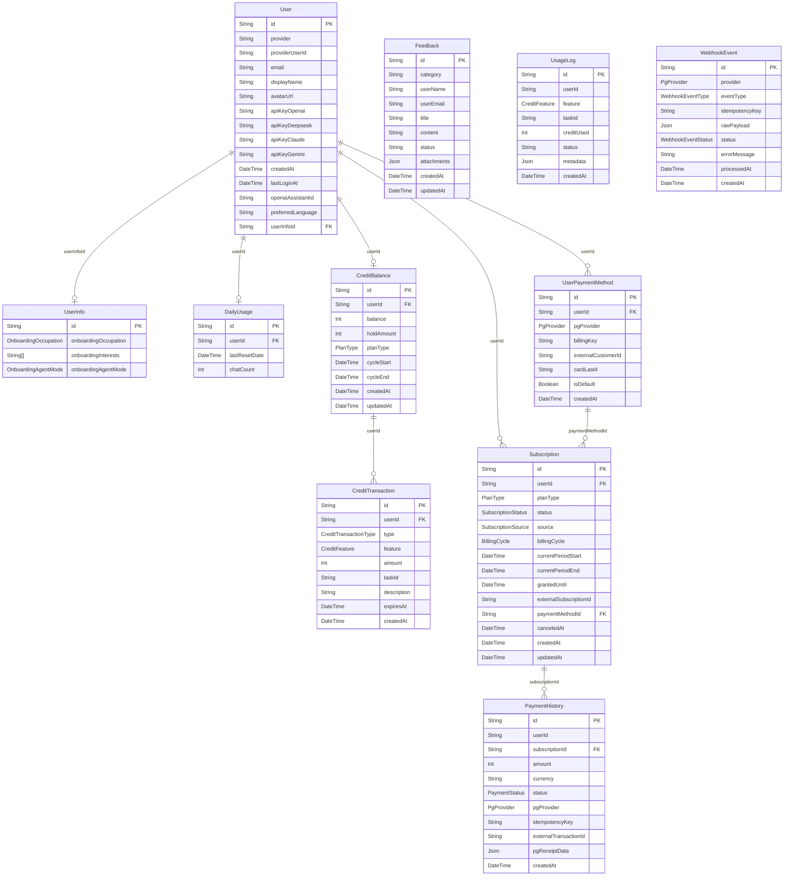

# PostgreSQL 스키마 (상세)

> 마지막 갱신: 2026-05-08

사용자 계정, 인증, 결제 등 높은 정합성이 요구되는 데이터를 PostgreSQL에 저장합니다.  
**Prisma ORM** 사용. 스키마 변경 시 `prisma/schema.prisma` 수정 후 이 문서를 즉시 동기화합니다.

← 인덱스로 돌아가기: [`DATABASE.md`](DATABASE.md)

---

## ERD (Entity Relationship Diagram)

---

## Users Table

- **테이블명**: `users`
- **소스**: `prisma/schema.prisma`, `src/core/types/persistence/UserPersistence.ts`

| 필드 | 타입 | 필수 | 설명 |
|---|---|---|---|
| **id** | `String` (UUID) | ✅ | 내부 사용자 고유 식별자 (PK) |
| **provider** | `String` | ✅ | 소셜 로그인 제공자 (`google`, `apple`, `dev`) |
| **providerUserId** | `String` | ✅ | 제공자 측 사용자 식별자 (Subject ID) |
| **email** | `String` | ❌ | 사용자 이메일 (Null 가능) |
| **displayName** | `String` | ❌ | 표시 이름 |
| **avatarUrl** | `String` | ❌ | 프로필 이미지 URL |
| **createdAt** | `DateTime` | ✅ | 계정 생성 시각 (UTC) |
| **lastLoginAt** | `DateTime` | ❌ | 마지막 로그인 시각 |
| **apiKeyOpenai** | `String` | ❌ | (Encrypted) OpenAI API Key |
| **apiKeyDeepseek** | `String` | ❌ | (Encrypted) DeepSeek API Key |
| **apiKeyClaude** | `String` | ❌ | (Encrypted) Claude API Key |
| **apiKeyGemini** | `String` | ❌ | (Encrypted) Gemini API Key |
| **openaiAssistantId** | `String` | ❌ | OpenAI Assistants API ID |
| **preferredLanguage** | `String` | ✅ | 선호 언어 (ISO 639-1, Default: `en`) |
| **userInfoId** | `String` (UUID) | ❌ | 온보딩 정보 FK → `user_info.id` (`@unique`) |

---

## DailyUsage Table

- **테이블명**: `daily_usages`
- **소스**: `src/core/types/persistence/usage.persistence.ts`
- **설계 전략**: Option B (1:1) — 유저당 단일 row. 날짜가 바뀌면 `lastResetDate`를 갱신하고 `chatCount`를 1로 재설정. cleanup job 불필요.
- **서비스 패턴**: AI 호출 직전 `checkLimit`(읽기)으로 한도 확인 → 응답 저장 완료 후 `incrementUsage`로 카운트 증가. 실패한 AI 호출은 카운트 소모 없음.

| 필드 | 타입 | 필수 | 설명 |
|---|---|---|---|
| **id** | `String` (UUID) | ✅ | 사용량 레코드 고유 식별자 (PK) |
| **userId** | `String` (UUID) | ✅ | 사용자 식별자 (FK → `users.id`, `@unique`, `onDelete: Cascade`) |
| **lastResetDate** | `DateTime` (Date only) | ✅ | `chatCount`가 마지막으로 초기화된 UTC 날짜 (시분초 없음, 자정 기준) |
| **chatCount** | `Int` | ✅ | `lastResetDate` 당일 누적 AI 대화 호출 횟수. 날짜가 바뀌면 1로 재설정. (Default: 0) |

> **날짜 판별 로직**: `lastResetDate`와 오늘(UTC 자정)을 비교. 날짜가 다르면 `chatCount`를 0으로 간주(논리적 reset). 실제 DB reset은 다음 `incrementUsage` 호출 시점에 upsert로 수행.  
> **일일 한도**: 환경변수 `DAILY_CHAT_LIMIT` (기본값 20회). 초과 시 `RateLimitError (HTTP 429)`.

---

## UserInfo Table

- **테이블명**: `user_info`
- **소스**: `prisma/schema.prisma`
- **설계 전략**: 온보딩 정보를 `User`와 분리한 1:0..1 관계. 온보딩 완료 전은 `User.userInfoId = null`.

| 필드 | 타입 | 필수 | 설명 |
|---|---|---|---|
| **id** | `String` (UUID) | ✅ | 레코드 고유 식별자 (PK) |
| **onboardingOccupation** | `OnboardingOccupation` (Enum) | ❌ | 직업 분류. 허용값: `developer`, `student`, `entrepreneur`, `researcher`, `creator`, `other` |
| **onboardingInterests** | `String[]` | ✅ | 관심사 태그 목록 (Default: `[]`) |
| **onboardingAgentMode** | `OnboardingAgentMode` (Enum) | ✅ | 에이전트 응답 어조 (Default: `formal`). 허용값: `formal`, `friendly`, `casual` |

---

## Feedback Table

- **테이블명**: `feedbacks`
- **소스**: `src/core/types/persistence/feedback.persistence.ts`
- **설계 전략**: 인증 없이도 제출 가능한 독립 엔티티. `User`와 FK 관계 없음 (익명 제출 지원). 첨부 파일은 JSONB 컬럼.
- **인덱스**: `createdAt` (`idx_feedback_created_at`)

| 필드 | 타입 | 필수 | 설명 |
|---|---|---|---|
| **id** | `String` (UUID) | ✅ | 피드백 고유 식별자 (PK) |
| **category** | `String` | ✅ | 피드백 분류. 예: `BUG`, `FEATURE`, `OTHER`. 최대 191자 |
| **userName** | `String` | ❌ | 작성자 이름 (익명 제출 시 null). 최대 191자 |
| **userEmail** | `String` | ❌ | 작성자 이메일 (익명 제출 시 null). 최대 191자 |
| **title** | `String` (Text) | ✅ | 피드백 제목. 최소 1자, 최대 1000자 |
| **content** | `String` (Text) | ✅ | 피드백 본문. 최소 1자, 최대 10000자 |
| **status** | `String` | ✅ | 처리 상태. 허용값: `UNREAD`, `READ`, `IN_PROGRESS`, `DONE`. 최대 32자 |
| **attachments** | `Json` | ❌ | 첨부 파일 목록 (`FeedbackAttachmentItem[]`). S3 키·파일명·MIME·크기 포함 |
| **createdAt** | `DateTime` | ✅ | 생성 시각 (DB 자동 설정) |
| **updatedAt** | `DateTime` | ✅ | 최종 수정 시각 (DB 자동 갱신, `@updatedAt`) |

---

## UserPaymentMethod Table

- **테이블명**: `user_payment_methods`
- **소스**: `prisma/schema.prisma`, `src/core/types/persistence/subscription.persistence.ts`
- **설계 전략**: PG사별 빌링키를 `Subscription`과 분리하여 저장. 빌링키는 PG사가 발급하는 비밀값이므로 구독 상태와 독립 관리. 사용자당 다중 카드 등록 지원 (`isDefault` 플래그로 기본 결제 수단 지정).
- **인덱스**: `(user_id, is_default)` → `idx_payment_method_user_default`

| 필드 | 타입 | 필수 | 설명 |
|---|---|---|---|
| **id** | `String` (UUID) | ✅ | 결제 수단 고유 식별자 (PK) |
| **userId** | `String` (VARCHAR 191) | ✅ | 사용자 ID (FK → `users.id`, `onDelete: Cascade`) |
| **pgProvider** | `PgProvider` (Enum) | ✅ | PG사 식별자. 허용값: `PORTONE`, `TOSS`, `STRIPE`, `GOOGLE`, `APPLE` |
| **billingKey** | `String` (VARCHAR 191) | ✅ | PG사 발급 빌링키. Portone: `customer_uid`, Toss: `billingKey`, Stripe: `paymentMethodId` |
| **externalCustomerId** | `String` (VARCHAR 191) | ❌ | PG사 고객 ID. Stripe: `cus_xxx`. Portone/Toss: null |
| **cardLast4** | `String` (VARCHAR 4) | ❌ | 카드 끝 4자리 (UI 표시용) |
| **isDefault** | `Boolean` | ✅ | 기본 결제 수단 여부 (Default: `false`) |
| **createdAt** | `DateTime` | ✅ | 생성 시각 (DB 자동 설정) |

---

## Subscription Table

- **테이블명**: `subscriptions`
- **소스**: `prisma/schema.prisma`, `src/core/types/persistence/subscription.persistence.ts`
- **설계 전략**: 구독 상태 원장. 결제 수단(`user_payment_methods`)과 분리. PENDING → ACTIVE → (CANCELED|EXPIRED) 상태 머신.
- **상태 머신**: `PENDING` → `ACTIVE` (PAYMENT_COMPLETED webhook) → `CANCELED` (사용자 취소) → `EXPIRED` (SUBSCRIPTION_CANCELED webhook 또는 PAYMENT_FAILED webhook)

| 필드 | 타입 | 필수 | 설명 |
|---|---|---|---|
| **id** | `String` (UUID) | ✅ | 구독 고유 식별자 (PK) |
| **userId** | `String` | ✅ | 사용자 ID (FK → `users.id`) |
| **planType** | `PlanType` (Enum) | ✅ | 구독 플랜. 허용값: `FREE`, `PRO`, `PREMIUM` 등 |
| **status** | `SubscriptionStatus` (Enum) | ✅ | 구독 상태. 허용값: `PENDING`, `ACTIVE`, `CANCELED`, `EXPIRED` |
| **source** | `SubscriptionSource` (Enum) | ✅ | 구독 발생 원인. 허용값: `PAYMENT`, `ADMIN_GRANT` |
| **billingCycle** | `BillingCycle` (Enum) | ❌ | 결제 주기. 허용값: `MONTHLY`, `YEARLY`. FREE/ADMIN_GRANT 시 null |
| **currentPeriodStart** | `DateTime` | ✅ | 현재 구독 기간 시작일 |
| **currentPeriodEnd** | `DateTime` | ✅ | 현재 구독 기간 종료일 |
| **grantedUntil** | `DateTime` | ❌ | Admin Grant 만료일. null이면 무기한 |
| **externalSubscriptionId** | `String` | ❌ | PG사 구독/스케줄 ID. Portone: schedule_id, Toss: 없음, Stripe: `sub_xxx` |
| **canceledAt** | `DateTime` | ❌ | 구독 취소 시각 |
| **createdAt** | `DateTime` | ✅ | 생성 시각 |
| **updatedAt** | `DateTime` | ✅ | 최종 수정 시각 |

---

## PaymentHistory Table

- **테이블명**: `payment_histories`
- **소스**: `prisma/schema.prisma`, `src/core/types/persistence/subscription.persistence.ts`
- **설계 전략**: 결제 성공/실패 원장. idempotencyKey로 중복 기록 방지. PG사 원본 영수증 데이터는 JSONB로 보관.

| 필드 | 타입 | 필수 | 설명 |
|---|---|---|---|
| **id** | `String` (UUID) | ✅ | 결제 기록 고유 식별자 (PK) |
| **userId** | `String` | ✅ | 사용자 ID |
| **subscriptionId** | `String` | ✅ | 구독 ID (FK → `subscriptions.id`) |
| **amount** | `Int` / `Decimal` | ✅ | 결제 금액 (최소 단위, 예: 원) |
| **currency** | `String` (VARCHAR 3) | ✅ | 통화 코드 (ISO 4217, 예: `KRW`, `USD`) |
| **status** | `PaymentStatus` (Enum) | ✅ | 결제 상태. 허용값: `SUCCESS`, `FAILED`, `REFUNDED` |
| **pgProvider** | `PgProvider` (Enum) | ✅ | 결제한 PG사 |
| **idempotencyKey** | `String` | ✅ | 중복 결제 방지 키 (Unique) |
| **externalTransactionId** | `String` | ❌ | PG사 트랜잭션 ID. Portone: `imp_uid`, Toss: `paymentKey`, Stripe: `pi_xxx` |
| **pgReceiptData** | `Json` | ❌ | PG사 원본 webhook payload (영수증 보관) |
| **createdAt** | `DateTime` | ✅ | 생성 시각 |

---

## NotionIntegration Table

- **테이블명**: `notion_integrations`
- **소스**: `prisma/schema.prisma`
- **설계 전략**: Notion Public Integration OAuth. 사용자 1명이 여러 Notion 워크스페이스를 연동할 수 있음 (1:N).

| 필드 | 타입 | 필수 | 설명 |
|---|---|---|---|
| **id** | `String` (UUID) | ✅ | PK |
| **userId** | `String` | ✅ | `users.id` FK (Cascade delete) |
| **notionWorkspaceId** | `String` | ✅ | Notion workspace_id |
| **notionWorkspaceName** | `String` | ❌ | 표시용 워크스페이스 이름 |
| **notionBotId** | `String` | ❌ | OAuth 응답 bot_id |
| **accessToken** | `String` (Text) | ✅ | Notion access_token (서버 전용, FE 노출 금지) |
| **refreshToken** | `String` (Text) | ❌ | refresh_token (있을 경우) |
| **tokenType** | `String` | ✅ | 기본 `bearer` |
| **tokenExpiresAt** | `DateTime` | ❌ | 만료 시각 |
| **createdAt** / **updatedAt** | `DateTime` | ✅ | |

Unique: `(userId, notionWorkspaceId)`

---

## WebhookEvent Table

- **테이블명**: `webhook_events`
- **소스**: `prisma/schema.prisma`, `src/core/types/persistence/subscription.persistence.ts`
- **설계 전략**: PG사 webhook 수신 원장. 서명 검증 통과 후 즉시 저장(RECEIVED). 비동기 처리 후 PROCESSED/FAILED로 갱신. idempotencyKey로 중복 처리 방지.

| 필드 | 타입 | 필수 | 설명 |
|---|---|---|---|
| **id** | `String` (UUID) | ✅ | webhook 이벤트 고유 식별자 (PK) |
| **provider** | `PgProvider` (Enum) | ✅ | webhook을 발송한 PG사 |
| **eventType** | `WebhookEventType` (Enum) | ✅ | 이벤트 종류. 허용값: `PAYMENT_COMPLETED`, `SUBSCRIPTION_RENEWED`, `SUBSCRIPTION_CANCELED`, `PAYMENT_FAILED` |
| **idempotencyKey** | `String` | ✅ | PG사 이벤트 고유 ID (Unique, 중복 수신 방지) |
| **rawPayload** | `Json` | ✅ | PG사 원본 webhook payload |
| **status** | `WebhookEventStatus` (Enum) | ✅ | 처리 상태. 허용값: `RECEIVED`, `PROCESSED`, `FAILED` |
| **errorMessage** | `String` | ❌ | 처리 실패 시 에러 메시지 (최대 500자) |
| **processedAt** | `DateTime` | ❌ | 처리 완료 시각 |
| **createdAt** | `DateTime` | ✅ | 수신 시각 |
