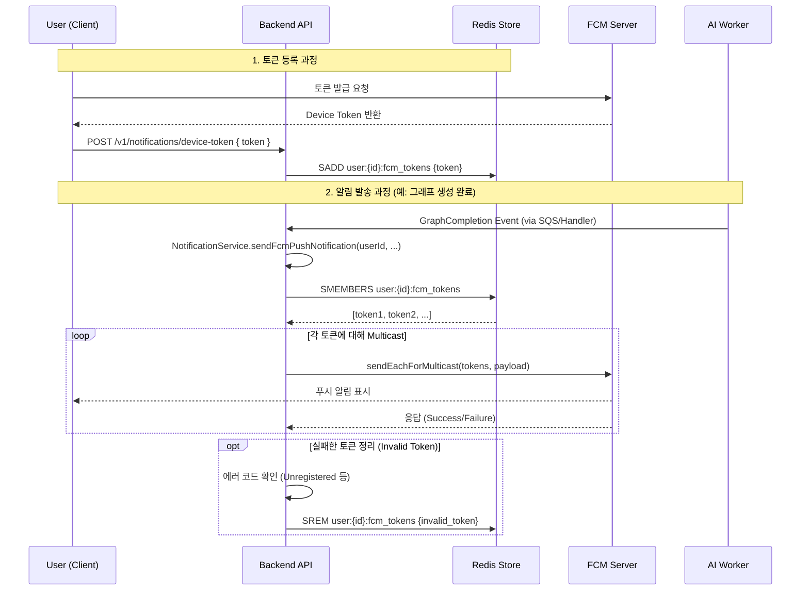

# 📱 FCM Notification Architecture

GraphNode Backend는 사용자에게 그래프 생성 완료 및 중요 이벤트를 알리기 위해 **Firebase Cloud Messaging (FCM)** 을 사용합니다.

## 1. Overview

기존의 **SSE(Server-Sent Events) 방식은 웹 브라우저가 열려있을 때만 수신 가능**하다는 한계가 있었습니다. 모바일 앱 지원과 오프라인 알림 수신을 위해 **FCM(Firebase Cloud Messaging)** 을 도입하였습니다.

### System Components
1. **Client (Mobile/Web)**: FCM SDK를 통해 디바이스 토큰을 발급받고 서버에 등록합니다.
2. **Backend (NotificationService)**: Redis를 사용하여 사용자 ID와 토큰을 매핑하고, FCM 서버로 발송 요청을 보냅니다.
3. **Redis (Token Store)**: 고성능 토큰 조회 및 관리를 담당합니다.
4. **FCM Server (Google)**: 실제 디바이스로 푸시 알림을 전송합니다.

---

## 2. Data Flow



---

## 3. Implementation Details

### **Token Management (Redis)**
- **Key Structure**: `user:{userId}:fcm_tokens` (Set Type)
- **TTL**: 60일 (앱 실행/로그인 시마다 갱신되므로 충분)
- **Logic**:
  - **등록**: `SADD` (중복 방지)
  - **조회**: `SMEMBERS`
  - **삭제**: `SREM` (로그아웃 또는 Invalid Token 발생 시)

### **Environment Setup**
`NotificationService`는 다음 순서로 자격 증명을 로드합니다.
1. **`FIREBASE_CREDENTIALS_JSON`** (Recommended): JSON 파일 내용을 통째로 환경변수에 저장 via Infisical.
2. **`GOOGLE_APPLICATION_CREDENTIALS`**: 로컬 파일 경로 지정.

### **Error Handling (Token Cleanup)**
FCM 발송 시 다음 에러가 발생하면, 해당 토큰이 만료되었거나 앱이 삭제된 것으로 간주하고 **즉시 Redis에서 삭제**합니다.
- `messaging/invalid-registration-token`
- `messaging/registration-token-not-registered`

## 4. Message Payload Structure

```json
{
  "notification": {
    "title": "Graph Ready",
    "body": "Your knowledge graph is ready!"
  },
  "data": {
    "type": "GRAPH_GENERATION_COMPLETED",
    "taskId": "task_12345",
    "click_action": "FLUTTER_NOTIFICATION_CLICK"
  }
}
```
