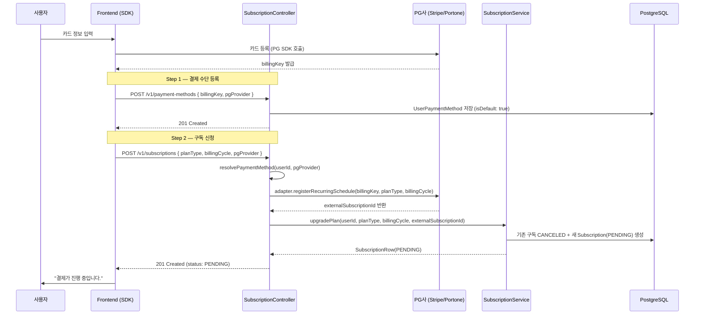
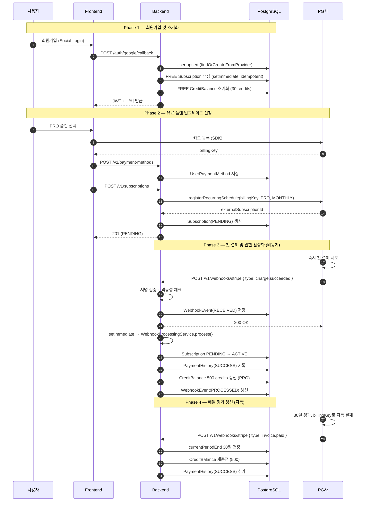
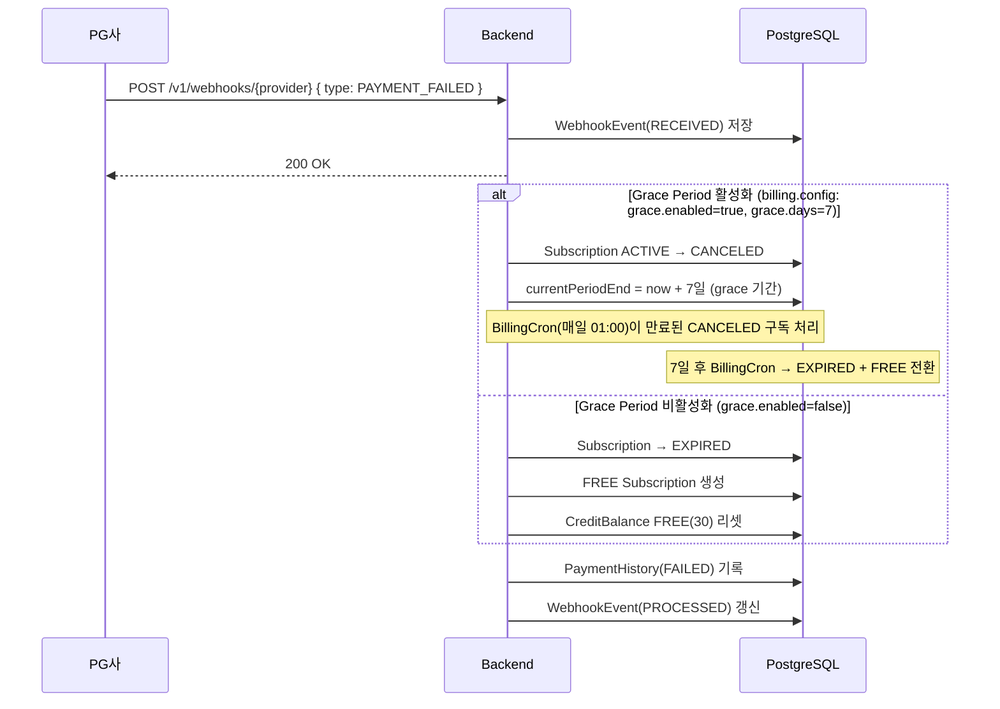
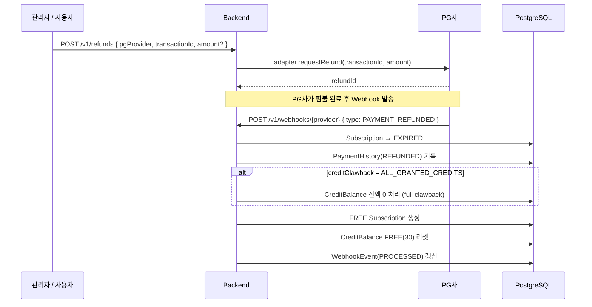
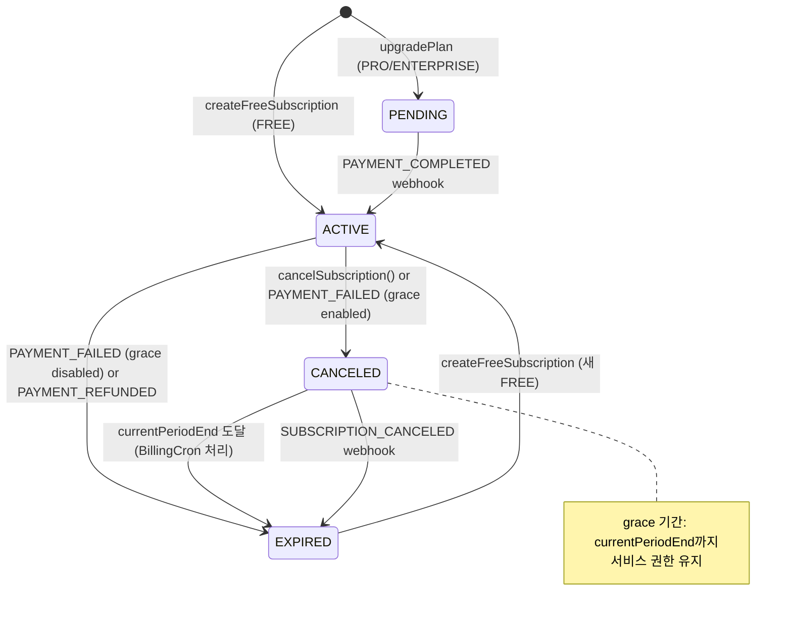
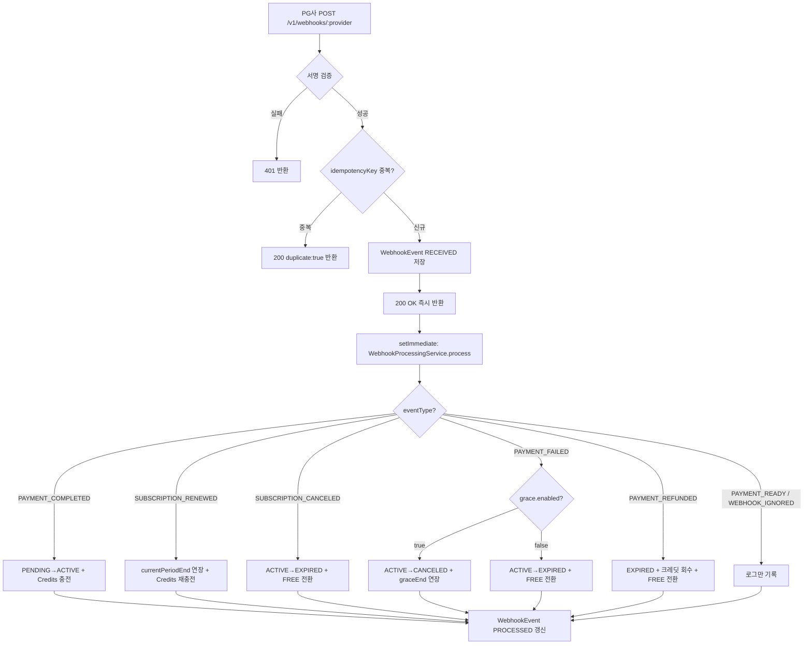

# GraphNode 결제 및 구독 시스템 설계 가이드

> 마지막 갱신: 2026-05-08

---

## 1. 시스템 설계 철학 (Design Philosophy)

1. **PG 위임형 스케줄링**: 자체 Cron 대신 PG사(Portone, Stripe 등)의 정기 결제 스케줄러를 활용하여 서버 부하를 줄이고 보안성을 높입니다.
2. **비동기 Webhook 처리**: 결제 결과 처리는 비동기로 수행하여 PG사 응답 지연이 서버 가용성에 영향을 주지 않도록 합니다.
3. **멱등성(Idempotency) 보장**: 동일한 결제·구독 이벤트가 중복 수신되더라도 `WebhookEvent` 원장의 `idempotencyKey`로 중복 처리를 방지합니다.
4. **상태 머신 기반 관리**: 구독 생명주기를 `PENDING → ACTIVE → CANCELED → EXPIRED` 로 엄격히 관리합니다.
5. **정책 중앙화**: Grace Period, 환불, 크레딧 회수 정책은 `billing.config.ts` 의 `DEFAULT_BILLING_OPERATION_POLICY` 에 집중 관리합니다.

---

## 2. 핵심 아키텍처 레이어

| 컴포넌트 | 역할 | 주요 책임 |
|---|---|---|
| `SubscriptionController` | API 진입점 | Zod 검증, PG 어댑터 호출(`registerRecurringSchedule`), SubscriptionService 위임 |
| `SubscriptionService` | 구독 비즈니스 로직 | FREE 초기화, PENDING 생성, CANCELED 처리, Admin Grant |
| `WebhookController` | Webhook 수신 | 서명 검증, 멱등성 체크, WebhookEvent 저장, 비동기 처리 트리거 |
| `WebhookProcessingService` | 이벤트 핸들러 | PG 이벤트 → 구독 상태 전이, PaymentHistory 기록, 크레딧 조정 |
| `StripeAdapter` / `PortoneAdapter` | PG 추상화 | `registerRecurringSchedule`, `cancelSubscription`, `verifyWebhookSignature` |
| `BillingConfig` | 정책 캡슐화 | Grace Period, 환불, 크레딧 회수, 재시도 정책 |
| `BillingCron` | 배치 처리 | 만료 HOLD rollback(매시간), 구독 크레딧 갱신(매일 01:00) |

---

## 3. 전체 프로세스 흐름 (End-to-End Flow)

### 3.1 카드 등록 및 구독 신청

> **설계 의도**: `SubscriptionController`가 PG 어댑터를 직접 호출한 뒤, 결과(`externalSubscriptionId`)를 `SubscriptionService.upgradePlan(PENDING)`에 전달합니다. Service 계층이 인프라 어댑터를 직접 호출하지 않도록 레이어 책임을 분리한 구조입니다.



### 3.2 전체 구독 생명주기 (Full Lifecycle)



### 3.3 결제 실패 및 Grace Period 흐름



### 3.4 환불 및 크레딧 회수 흐름



---

## 4. 구독 상태 머신 (State Machine)



**상태별 의미:**

| 상태 | 의미 | 서비스 접근 |
|---|---|---|
| `ACTIVE` | 결제 완료 및 기간 내 정상 구독 | ✅ 전체 권한 |
| `PENDING` | 구독 신청 완료, 첫 결제 대기 | ❌ 대기 중 |
| `CANCELED` | 취소 신청됨 (grace period 포함) | ✅ currentPeriodEnd까지 |
| `EXPIRED` | 기간 만료 또는 즉시 종료 | ❌ FREE 전환됨 |

---

## 5. Webhook 처리 파이프라인



**이벤트 타입 → PG사 원본 이벤트 매핑** (`webhookEventResolver.ts`):

| 내부 이벤트 | Stripe | PortOne | Toss |
|---|---|---|---|
| `PAYMENT_COMPLETED` | `charge.succeeded`, `invoice.paid` | `Transaction.PaidByVirtualAccount` | `DONE` |
| `SUBSCRIPTION_RENEWED` | `invoice.payment_succeeded` (renewal) | `BillingKey.Issued` renewal | — |
| `SUBSCRIPTION_CANCELED` | `customer.subscription.deleted` | `Schedule.Cancelled` | — |
| `PAYMENT_FAILED` | `invoice.payment_failed` | `Transaction.Failed` | `ABORTED`, `EXPIRED_UNSTORED` |
| `PAYMENT_REFUNDED` | `charge.refunded` | `Transaction.PartialCancelled` | — |

---

## 6. 정책 설정 (`billing.config.ts`)

```ts
export const DEFAULT_BILLING_OPERATION_POLICY: BillingOperationPolicy = {
  retry:        { maxAttempts: 3, intervalHours: 24 },
  grace:        { enabled: true, days: 7 },           // 결제 실패 유예 기간
  cancellation: { effective: 'PERIOD_END' },
  refund:       { allowPartial: true, creditClawback: 'REFUND_PERIOD_CREDITS' },
  creditGrant:  { grantOn: 'PAYMENT_CONFIRMED' },
  recovery:     { downgradePlan: PlanType.FREE, downgradeAfterFailedAttempts: true },
};
```

**`creditClawback` 정책별 동작:**

| 값 | 동작 |
|---|---|
| `NONE` | 크레딧 회수 없음. FREE 크레딧(30)으로 리셋. |
| `REFUND_PERIOD_CREDITS` | `refill(FREE)` 로 PRO 크레딧 잔액을 FREE 한도(30)로 교체. |
| `ALL_GRANTED_CREDITS` | 잔액 0 처리 후 FREE 크레딧(30)으로 리셋. |

---

## 7. 사용자 보정 (Reconciliation)

신규 가입 또는 레거시 유저가 FREE 구독 없이 로그인할 때를 대비하여, 모든 OAuth 로그인 완료 시점(`completeLogin`)에 `createFreeSubscription(userId)`를 비동기(`setImmediate`)로 호출합니다. 이미 ACTIVE 구독이 있으면 no-op이므로 안전합니다.

```
completeLogin()
  ├── User.findOrCreate()
  ├── JWT 발급 + 쿠키 설정
  ├── setImmediate → SubscriptionService.createFreeSubscription(userId)  ← 보정
  └── 200 OK
```

---

## 8. FE SDK 규약 (SDK Contract)

`z_npm_sdk` 의 `BillingApi` 를 통해 아래 순서로 결제 플로우를 완성합니다.

```ts
// 1. PG사 SDK로 billingKey 획득 (SDK 외부)
const billingKey = await portone.requestBillingKey({ /* card info */ });

// 2. 결제 수단 등록
await sdk.billing.registerPaymentMethod({
  pgProvider: 'PORTONE',
  billingKey,
  cardLast4: '1234',
});

// 3. 구독 신청
await sdk.billing.createSubscription({
  pgProvider: 'PORTONE',
  planType: 'PRO',
  billingCycle: 'MONTHLY',
});

// 4. 상태 폴링 (약 2~5초 후 ACTIVE 기대)
const { subscription } = await sdk.billing.getBillingStatus();
```

> `pgProvider`는 모든 결제 API 요청에서 **필수**입니다. 백엔드가 provider를 id 접두사로 추론하지 않도록 명시적으로 전달해야 합니다.

---

## 9. 관련 파일 맵

| 파일 | 역할 |
|---|---|
| `src/app/controllers/SubscriptionController.ts` | REST API 진입점, PG 어댑터 호출 |
| `src/app/controllers/WebhookController.ts` | Webhook 수신, 서명 검증, 멱등성 |
| `src/core/services/SubscriptionService.ts` | 구독 생명주기 비즈니스 로직 |
| `src/core/services/WebhookProcessingService.ts` | Webhook 이벤트 처리, 상태 전이 |
| `src/infra/payment/StripeAdapter.ts` | Stripe API 연동 |
| `src/infra/payment/PortoneAdapter.ts` | PortOne API 연동 |
| `src/infra/payment/TossAdapter.ts` | Toss Payments API 연동 |
| `src/infra/payment/webhookEventResolver.ts` | PG사 raw event → 내부 WebhookEventType 변환 |
| `src/config/billing.config.ts` | 크레딧 비용, 플랜 가격, 운영 정책 |
| `src/infra/cron/BillingCron.ts` | HOLD 만료 처리, 구독 크레딧 갱신 |
| `prisma/schema.prisma` | Subscription, PaymentHistory, WebhookEvent, UserPaymentMethod 스키마 |
| `z_npm_sdk/src/endpoints/billing.ts` | FE SDK BillingApi |
| `z_npm_sdk/src/types/billing.ts` | FE SDK 타입 정의 |

---

## 10. 후속 작업 목록 (2026-05-08 기준)

> 아래 항목들은 현재 코드베이스가 완성된 이후 **실제 사업자 등록 및 프로덕션 배포 전**에 반드시 완료해야 하는 작업들입니다.
> 다음 개발자 또는 AI Agent가 이어서 작업할 수 있도록 구체적인 실행 사항을 기술합니다.

---

### 10.1 관측성(Observability) 연동

#### Sentry — 에러 수집

- **목적**: 결제 실패, PG사 API 오류, Webhook 처리 예외 등을 실시간으로 포착하고 알림을 받기 위함.
- **필요 작업**:
  - [ ] `@sentry/node` 패키지 설치 및 `src/bootstrap/server.ts`에 `Sentry.init()` 추가
  - [ ] `WebhookProcessingService` 내 `catch` 블록에 `Sentry.captureException(err)` 호출 추가
  - [ ] `SubscriptionController`의 PG 어댑터 호출 실패 시 Sentry breadcrumb 기록
  - [ ] Sentry Release 설정으로 배포 버전과 에러를 연결
  - [ ] 결제 관련 에러에 `tags: { domain: 'billing', pgProvider }` 추가하여 필터링 가능하게 설정
- **환경변수 필요**: `SENTRY_DSN`

#### PostHog — 사용자 행동 데이터 수집

- **목적**: 구독 전환율, 플랜별 이탈률, 결제 실패 후 재시도율 등 비즈니스 핵심 지표 수집.
- **필요 작업**:
  - [ ] `posthog-node` 패키지 설치
  - [ ] 다음 이벤트 추적 추가:
    - `billing_payment_method_registered` — 결제 수단 등록 완료 시
    - `billing_subscription_created` — 구독 신청 시 (`{ planType, billingCycle, pgProvider }` 포함)
    - `billing_subscription_activated` — Webhook으로 ACTIVE 전환 시
    - `billing_subscription_canceled` — 구독 취소 시
    - `billing_payment_failed` — 결제 실패 Webhook 수신 시
    - `billing_refund_requested` — 환불 요청 시
  - [ ] FE SDK에서도 `posthog-js`로 UI 레벨 이벤트 추적 (결제 모달 열기, 플랜 선택 등)
- **환경변수 필요**: `POSTHOG_API_KEY`, `POSTHOG_HOST`

---

### 10.2 PG사별 실제 연동 작업

> ⚠️ 아래 작업은 **사업자 등록 완료 후 각 PG사 심사를 통과**해야 진행 가능합니다.

#### PortOne (구 아임포트) — 국내 정기 결제

- **사전 조건**: 사업자 등록증, 통신판매업 신고증, 법인 계좌 준비
- **필요 작업**:
  - [ ] [PortOne 콘솔](https://admin.portone.io)에서 스토어 생성 및 채널(카드사) 계약
  - [ ] **빌링키 발급 채널키** 발급 (`storeId`, `channelKey`) — FE PortOne SDK 초기화에 사용
  - [ ] **웹훅 URL 등록**: `https://api.graphnode.dev/v1/webhooks/portone`
  - [ ] **웹훅 서명 시크릿** 발급 및 `PORTONE_WEBHOOK_SECRET` 환경변수 설정
  - [ ] V2 API 시크릿 키 발급 → `PORTONE_API_SECRET` 환경변수 설정
  - [ ] `PortoneAdapter` 생성자의 `storeId` → `PORTONE_STORE_ID` 환경변수로 주입 확인
  - [ ] 결제 금액 테이블을 `billing.config.ts`에서 가져와 PortOne 콘솔 상품 등록과 일치 확인

#### Stripe — 글로벌 카드 결제

- **사전 조건**: 사업자 등록 및 Stripe 계정 비즈니스 인증 완료
- **필요 작업**:
  - [ ] [Stripe Dashboard](https://dashboard.stripe.com)에서 Product 및 Price 오브젝트 생성
    - PRO Monthly: `price_xxx_pro_monthly`
    - PRO Yearly: `price_xxx_pro_yearly`
    - ENTERPRISE Monthly: `price_xxx_enterprise_monthly`
  - [ ] 발급된 Price ID를 `container.ts`의 `stripePriceIds` 및 `billing.config.ts`에 반영
  - [ ] **웹훅 엔드포인트 등록**: `https://api.graphnode.dev/v1/webhooks/stripe`
    - 구독 이벤트: `customer.subscription.updated`, `customer.subscription.deleted`
    - 결제 이벤트: `invoice.paid`, `invoice.payment_failed`, `charge.succeeded`, `charge.refunded`
  - [ ] 웹훅 서명 시크릿 발급 → `STRIPE_WEBHOOK_SECRET` 환경변수 설정
  - [ ] `STRIPE_SECRET_KEY` (라이브 키 `sk_live_xxx`) 환경변수 설정
  - [ ] Stripe Tax 설정 (부가세 자동 계산, 국내 사업자의 경우 필수)

#### Toss Payments — 국내 대안 PG (선택)

- **사전 조건**: 토스 페이먼츠 파트너 계약 완료
- **필요 작업**:
  - [ ] [Toss 개발자 센터](https://developers.tosspayments.com)에서 API 키 발급
  - [ ] `TossAdapter` stub 구현 완성 (`registerRecurringSchedule`, `cancelSubscription`, `verifyWebhookSignature`)
  - [ ] 웹훅 URL 등록: `https://api.graphnode.dev/v1/webhooks/toss`
  - [ ] `TOSS_SECRET_KEY`, `TOSS_WEBHOOK_SECRET` 환경변수 설정
  - [ ] `webhookEventResolver.ts`의 Toss 이벤트 타입 매핑 완성 (현재 일부 `—` 항목)

---

### 10.3 환경변수 및 시크릿 관리 (Infisical / Secret Manager)

아래 환경변수들을 **Infisical** 또는 **AWS Secrets Manager** / **GCP Secret Manager**에 등록해야 합니다.

#### 결제 관련 필수 환경변수

| 변수명 | 용도 | 발급처 |
| :--- | :--- | :--- |
| `PORTONE_API_SECRET` | PortOne V2 API 호출 인증 | PortOne 콘솔 |
| `PORTONE_WEBHOOK_SECRET` | PortOne 웹훅 서명 검증 | PortOne 콘솔 |
| `PORTONE_STORE_ID` | PortOne 스토어 식별자 | PortOne 콘솔 |
| `STRIPE_SECRET_KEY` | Stripe API 호출 인증 (`sk_live_xxx`) | Stripe Dashboard |
| `STRIPE_WEBHOOK_SECRET` | Stripe 웹훅 서명 검증 (`whsec_xxx`) | Stripe Dashboard |
| `STRIPE_PRICE_ID_PRO_MONTHLY` | Stripe PRO 월간 Price ID | Stripe Dashboard |
| `STRIPE_PRICE_ID_PRO_YEARLY` | Stripe PRO 연간 Price ID | Stripe Dashboard |
| `STRIPE_PRICE_ID_ENTERPRISE_MONTHLY` | Stripe Enterprise 월간 Price ID | Stripe Dashboard |
| `TOSS_SECRET_KEY` | Toss Payments API 인증 | Toss 개발자 센터 |
| `TOSS_WEBHOOK_SECRET` | Toss 웹훅 서명 검증 | Toss 개발자 센터 |

#### 관측성 관련 환경변수

| 변수명 | 용도 |
| :--- | :--- |
| `SENTRY_DSN` | Sentry 에러 수집 엔드포인트 |
| `POSTHOG_API_KEY` | PostHog 이벤트 수집 키 |
| `POSTHOG_HOST` | PostHog 서버 URL (기본: `https://app.posthog.com`) |

> **Infisical 설정 가이드**: 위 변수들을 `Production` 환경에만 등록하고, `Development` 환경에는 테스트용 키(PortOne 테스트 모드, Stripe `sk_test_xxx`)를 별도로 등록합니다.

---

### 10.4 추가 개발 필요 항목

- [ ] **`TossAdapter` 구현 완성**: 현재 `webhookEventResolver.ts`에서 Toss 이벤트 일부가 `—`(미정)으로 남아있음. Toss Payments 공식 웹훅 문서 참조하여 이벤트 타입 매핑 완성 필요.
- [ ] **`BillingCron` 구현**: `docs/architecture/PAYMENT_SYSTEM_FLOW.md` 섹션 2에 명시된 `BillingCron.ts`가 아직 미구현. 만료 구독 처리(매시간) 및 크레딧 갱신(매일 01:00) Cron Job 작성 필요.
- [ ] **관리자 구독 강제 부여 API**: `SubscriptionService.adminGrant()` 메서드가 설계에는 있으나 API 엔드포인트 미노출. 내부 관리 도구 연동 시 필요.
- [ ] **Prisma 마이그레이션 파일 검토**: `prisma/migrations/20260508093000_payment_provider_event_hardening/` 디렉토리가 생성되어 있으나 프로덕션 배포 전 실제 SQL 검토 필요.
- [ ] **E2E 테스트**: PortOne/Stripe 웹훅 시뮬레이터를 사용한 `PAYMENT_COMPLETED → ACTIVE` 전환 E2E 테스트 작성.
- [ ] **결제 영수증 이메일**: `PaymentHistory`에 `SUCCESS` 기록 시 사용자에게 영수증 이메일 발송 로직 추가 (SMTP 또는 SendGrid 연동).
- [ ] **FE 결제 UI 연동**: `z_npm_sdk/docs/endpoints/billing.md`를 참고하여 FE 결제 모달 및 구독 관리 페이지 구현.

