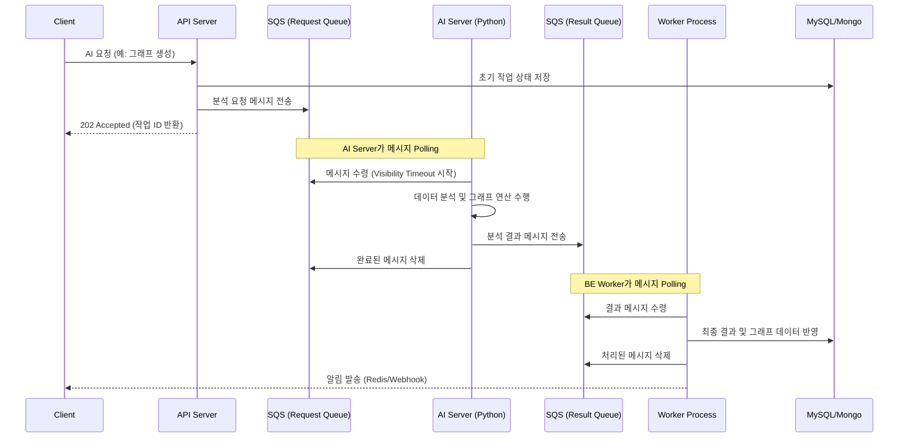

# SQS Messaging Flow

GraphNode는 BE 서버와 AI 서버 간의 통신을 위해 AWS SQS를 사용하여 **비동기 메시징 시스템**을 구현합니다. 이 문서는 요청부터 결과 반영까지의 전체 흐름을 설명합니다.

## 1. 개요 (Flow Summary)

## 2. 세부 단계 (Detail Steps)

### 2.1 요청 단계 (Producer: API Server)
- 사용자가 그래프 생성 등 시간이 걸리는 작업을 요청하면, API 서버는 `SQS_REQUEST_QUEUE_URL`로 메시지를 보냅니다.
- 메시지 페이로드에는 `userId`, `conversationId`, 그리고 분석에 필요한 데이터의 **S3 URI**가 포함됩니다.
- 보안을 위해 실제 대용량 데이터는 SQS에 직접 넣지 않고 S3를 경유합니다.

### 2.2 처리 단계 (Processor: AI Server)
- AI 서버는 `WaitTimeSeconds=20` (Long Polling) 설정을 통해 대기하다가 요청이 들어오면 즉시 가동됩니다.
- 작업을 마치면 `SQS_RESULT_QUEUE_URL`로 성공/실패 여부와 생성된 노드/엣지 정보를 보냅니다.

### 2.3 결과 반영 단계 (Consumer: BE Worker)
- `src/workers/index.ts`에서 구동되는 워커는 결과 큐를 감시합니다.
- 메시지가 도착하면 `src/workers/handlers/`의 핸들러를 호출하여 DB를 업데이트합니다.
- 성공적으로 업데이트된 후에만 메시지를 큐에서 삭제하여 **At-least-once (최소 한 번 배달)** 보장 정책을 유지합니다.

## 3. 안정성 조치 (Reliability)

- **Idempotency (멱등성)**: 네트워크 장애 등으로 동일한 결과 메시지가 두 번 전달되어도 DB에 중복 데이터가 생기지 않도록 `작업 ID` 또는 `Idempotency Key`를 사용하여 체크합니다.
- **DLQ (Dead Letter Queue)**: 5회 이상 처리 실패한 메시지는 자동으로 DLQ로 이동하여 개발자가 분석할 수 있도록 합니다.
- **Visibility Timeout**: 처리 중인 메시지가 다른 워커에게 보이지 않도록 적절한 타임아웃을 설정합니다 (현재 약 5~10분).

## 4. 관련 코드 위치
- **Producer**: `src/core/services/` 내의 AI 연동 서비스
- **Consumer Entry**: `src/workers/index.ts`
- **Result Handlers**: `src/workers/handlers/`
