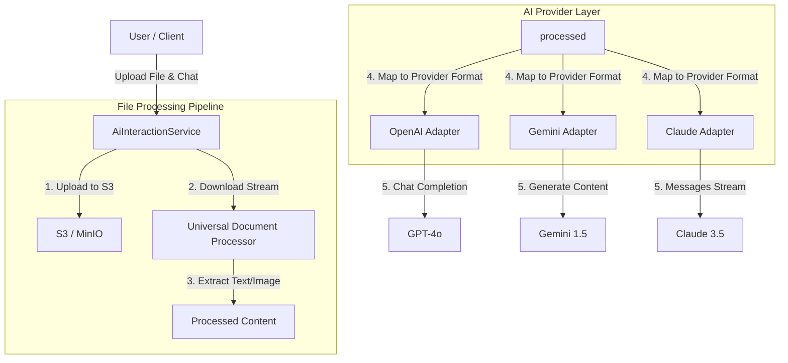

# AI Provider Architecture (Stateless & Universal File Support)

GraphNode의 AI 서비스는 **Stateless Architecture**를 기반으로 설계되어 있으며, **Universal Document Processor**를 통해 모든 주요 파일 형식을 일관된 방식으로 처리하여 LLM에 전달합니다.

## 1. Core Principles

1.  **Statelessness**: 백엔드 서버는 대화 상태를 메모리에 유지하지 않습니다. 매 요청마다 전체 대화 히스토리와 첨부파일(처리된 결과)을 Provider에게 전송합니다.
2.  **Provider Agnostic**: OpenAI, Gemini, Claude 등 어떤 모델을 사용하더라도 동일한 인터페이스(`IAiProvider`)와 파일 처리 로직을 공유합니다.
3.  **Universal File Support**: PDF, Excel, Word, PPT, Code 등 다양한 파일을 텍스트 또는 이미지로 변환하여 LLM이 이해할 수 있는 형태로 주입합니다.

---

## 2. Architecture Overview



---

## 3. Universal Document Processor

`src/shared/utils/documentProcessor.ts`는 모든 파일 처리를 담당하는 핵심 유틸리티입니다.

### 지원 파일 형식 및 처리 전략

| 파일 형식 | 확장자 | 처리 방식 | 사용 라이브러리 |
| :--- | :--- | :--- | :--- |
| **PDF** | `.pdf` | 텍스트 전체 추출 | `pdf-parse` |
| **Word** | `.docx` | Raw Text 추출 | `mammoth` |
| **Excel/CSV** | `.xlsx`, `.csv` | Markdown/CSV 텍스트 변환 | `xlsx` (SheetJS) |
| **PowerPoint** | `.pptx` | 슬라이드 텍스트 추출 | `officeparser` |
| **Code/Text** | `.js`, `.py`, `.md` 등 | UTF-8 텍스트 읽기 | Native `fs` |
| **Image** | `.png`, `.jpg` 등 | Base64 인코딩 | Native `Buffer` |

### 처리 흐름
1.  **Input**: 파일 `Buffer`, `MimeType`, `Filename`
2.  **Process**: 확장자 및 MIME 타입 기반으로 적절한 파서 선택
3.  **Output**: `ProcessedDocument` 객체 반환
    ```typescript
    interface ProcessedDocument {
      type: 'text' | 'image';
      content: string; // Text content or Base64 string
      metadata?: { ... };
    }
    ```

---

## 4. Provider Implementation Details

각 AI Provider는 `ProcessedDocument`를 자신의 API 규격에 맞게 변환하여 전송합니다.

### A. OpenAI (`openai.ts`)
*   **API**: Chat Completions API (`v1/chat/completions`)
*   **매핑 전략**:
    *   **Text**: `content: [{ type: "text", text: "..." }]`
    *   **Image**: `content: [{ type: "image_url", image_url: { url: "data:image/..." } }]`
*   **특징**: `text`와 `image_url` 파트를 순차적으로 배열에 담아 전송하면 모델이 이를 문맥으로 인식합니다.

### B. Gemini (`gemini.ts`)
*   **API**: Google Generative AI SDK (`generateContent`)
*   **매핑 전략**:
    *   **Text**: `parts: [{ text: "..." }]`
    *   **Image**: `parts: [{ inlineData: { mimeType: "...", data: "base64..." } }]`
*   **특징**: 시스템 메시지는 `systemInstruction`으로 분리하여 주입하며, 나머지 대화는 `Content[]` 배열로 변환합니다.

### C. Claude (`claude.ts`)
*   **API**: Anthropic SDK (`messages.stream`)
*   **매핑 전략**:
    *   **Text**: `content: [{ type: "text", text: "..." }]`
    *   **Image**: `content: [{ type: "image", source: { type: "base64", ... } }]`
*   **특징**: `stream.on('text')` 헬퍼 이벤트를 사용하여 안정적인 스트리밍을 지원합니다.

---

## 5. Adding a New Provider

새로운 AI Provider를 추가하려면 다음 단계를 따르세요.

1.  `src/shared/ai-providers/`에 새 파일 생성 (예: `mistral.ts`)
2.  `IAiProvider` 인터페이스 구현
3.  **Universal Document Processor 연동 필수**:
    *   `storageAdapter`로 파일 다운로드
    *   `documentProcessor.process()` 호출
    *   결과(`text` | `image`)를 해당 Provider API 규격에 매핑
4.  `src/shared/ai-providers/index.ts`의 `getAiProvider` 팩토리에 등록

---

## 6. Error Handling

*   **File Processing Error**: 특정 파일 처리에 실패하더라도 전체 요청을 중단하지 않습니다. 에러 로그를 남기고 해당 파일만 제외한 채 채팅을 진행합니다 (Fail-Safe).
*   **API Error**: Provider 호출 실패 시 `UpstreamError`로 래핑하여 클라이언트에 명확한 원인을 전달합니다. (Rate Limit, Auth Error 등 정규화)
