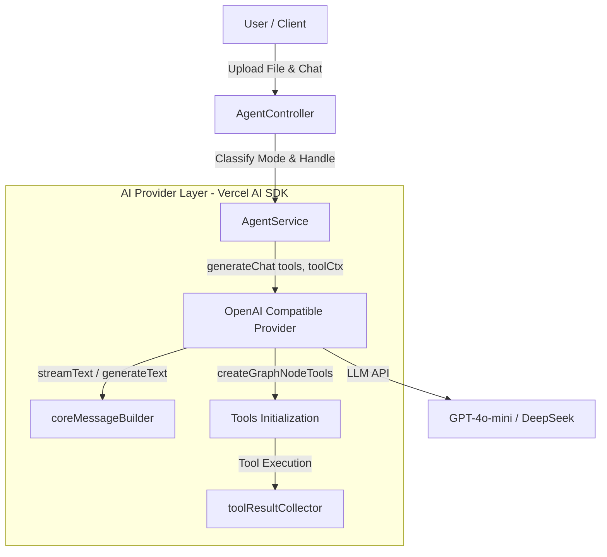

# AI Provider Architecture (Stateless & Vercel AI SDK Integration)

> **작성일자:** 2026-05-17
> **버전:** 2.0.0

GraphNode의 AI 서비스는 **Stateless Architecture**를 기반으로 설계되어 있으며, 최신 버전에서는 **Vercel AI SDK**를 도입하여 일관된 Tool Calling(Function Calling)과 ReAct 루프를 지원합니다. 

## 1. Core Principles

1.  **Statelessness**: 백엔드 서버는 대화 상태를 메모리에 유지하지 않습니다. 매 요청마다 전체 대화 히스토리와 컨텍스트를 Provider에게 전송합니다.
2.  **Vercel AI SDK 기반 통합**: `createOpenAI` 등 Vercel AI SDK를 사용하여 OpenAI 및 호환 모델(DeepSeek, Qwen 등)을 단일 인터페이스(`IAiProvider`)로 통합합니다.
3.  **Agent & Tool Calling (ReAct)**: `streamText` 및 `generateText` 내부에서 `maxSteps`(기본 5회)를 설정하여, AI가 스스로 도구를 호출하고 결과를 판단하는 자율적인 루프를 구성합니다.

---

## 2. Architecture Overview


```mermaid
graph TD
    User["User / Client"] -->|"Upload File & Chat"| AgentCtrl["AgentController"]
    AgentCtrl -->|"Classify Mode & Handle"| AgentSvc["AgentService"]
    
    subgraph AIProviderLayer ["AI Provider Layer - Vercel AI SDK"]
        AgentSvc -->|"generateChat tools, toolCtx"| Provider["OpenAI Compatible Provider"]
        Provider -->|"streamText / generateText"| CoreBuilder["coreMessageBuilder"]
        Provider -->|"createGraphNodeTools"| ToolInit["Tools Initialization"]
        
        ToolInit -->|"Tool Execution"| ToolResult["toolResultCollector"]
    end
    
    Provider -->|"LLM API"| LLM["GPT-4o-mini / DeepSeek"]
```

---

## 3. Provider Implementation Details

각 AI Provider는 `IAiProvider` 인터페이스를 구현하며, 주로 `src/shared/ai-providers/openai.ts`에서 통합 관리됩니다.

### A. OpenAI Compatible Provider (`openai.ts`)
*   **API**: Vercel AI SDK (`@ai-sdk/openai`)
*   **특징**:
    *   `createOpenAICompatibleProvider({ baseURL })` 팩토리를 통해 표준 OpenAI 뿐만 아니라, DeepSeek 등 커스텀 엔드포인트를 가지는 모델을 손쉽게 추가할 수 있습니다.
    *   `generateChat` 호출 시 `tools`와 `toolCtx`를 전달받아, 내부적으로 `createGraphNodeTools(params.toolCtx)`를 호출하여 AI SDK 호환 도구 객체로 변환합니다.
    *   `stepCountIs(5)`를 통해 최대 5번의 Tool Calling ReAct 루프를 자동 수행합니다.
*   **결과 수집 (`toolResultCollector.ts`)**:
    *   ReAct 루프(steps)가 종료된 후, 도구들이 반환한 결과 중 첨부파일(이미지)이나 검색 결과 메타데이터를 추출하여 `AiResponse` 객체의 `attachments`, `metadata`로 정규화합니다.

---

## 4. Context Window Management — Batched Sliding Window Strategy

> **구현 파일**: `src/core/services/AiInteractionService.ts` (또는 AgentService)
> **관련 메서드**: `buildContextMessages` 등

단순 히스토리 전부 전송은 토큰 비용이 선형으로 증가합니다. 반대로 매 호출마다 AI로 요약하면 요약 API 비용과 레이턴시가 발생합니다. 이를 위해 **Batched Sliding Window + Pending Buffer** 전략을 채택합니다.

### 4.1 핵심 상수
| 상수 | 기본값 | 의미 |
|---|---|---|
| `MAX_DIRECT_WINDOW` | **20** | 항상 그대로(verbatim) 전송되는 최신 메시지 수 |
| `SUMMARY_BATCH_TURNS` | **5** | 요약 갱신을 트리거하는 최소 expelled 대화 턴 수 |

### 4.2 컨텍스트 구성
```
┌──────────────────────────────────┐
│  [CONVERSATION MEMORY]           │  ← 고밀도 누적 요약 (system msg)
├──────────────────────────────────┤
│  Pending Expelled                │  ← 미요약 메시지 (0 ~ 4개)
├──────────────────────────────────┤
│  Direct Window                   │  ← 최신 MAX_DIRECT_WINDOW(20)개
├──────────────────────────────────┤
│  Current Message                 │  ← 현재 사용자 요청
└──────────────────────────────────┘
```

---

## 5. Adding a New Provider

새로운 호환 AI Provider를 추가하려면 다음 단계를 따르세요.
1. OpenAI API 규격을 지원하는 모델(예: DeepSeek)인 경우, `src/shared/ai-providers/openai.ts` 하단에 `createOpenAICompatibleProvider({ baseURL: '...' })` 형태로 인스턴스만 선언하면 됩니다.
2. 규격이 다른 모델(예: Claude)인 경우, `IAiProvider` 인터페이스를 직접 구현한 어댑터 파일을 생성하고, `generateChat` 내에서 Vercel AI SDK의 해당 Provider 구현체(예: `@ai-sdk/anthropic`)를 사용하도록 매핑해야 합니다.

---

## 6. Error Handling

*   **API Error**: Provider 호출 실패 시 `normalizeError` 함수를 통해 `unauthorized_key`, `insufficient_credit`, `rate_limited` 등의 표준 에러 코드로 변환하여 반환합니다.
*   **Tool Execution Error**: Tool 실행 중 발생한 오류는 JSON 문자열 형태로 반환되어, LLM이 오류 상황을 인지하고 사용자에게 자연스럽게 안내하거나 재시도할 수 있도록 합니다.
