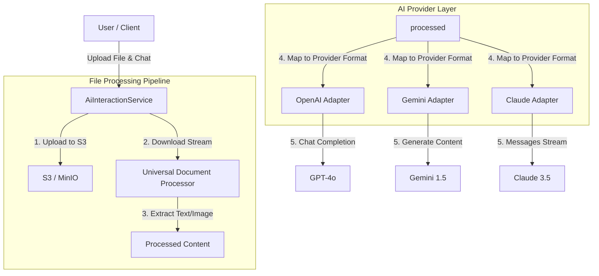
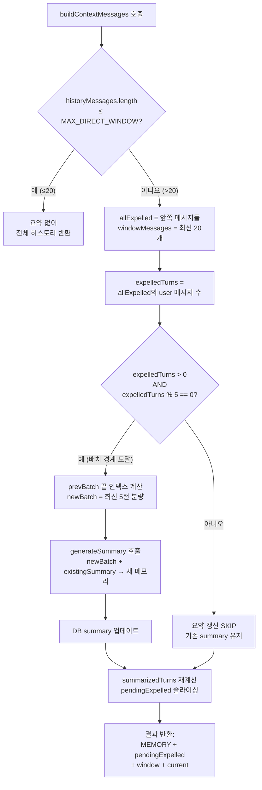

# AI Provider Architecture (Stateless & Universal File Support)

GraphNode의 AI 서비스는 **Stateless Architecture**를 기반으로 설계되어 있으며, **Universal Document Processor**를 통해 모든 주요 파일 형식을 일관된 방식으로 처리하여 LLM에 전달합니다.

## 1. Core Principles

1.  **Statelessness**: 백엔드 서버는 대화 상태를 메모리에 유지하지 않습니다. 매 요청마다 전체 대화 히스토리와 첨부파일(처리된 결과)을 Provider에게 전송합니다.
2.  **Provider Agnostic**: OpenAI, Gemini, Claude 등 어떤 모델을 사용하더라도 동일한 인터페이스(`IAiProvider`)와 파일 처리 로직을 공유합니다.
3.  **Universal File Support**: PDF, Excel, Word, PPT, Code 등 다양한 파일을 텍스트 또는 이미지로 변환하여 LLM이 이해할 수 있는 형태로 주입합니다.

---

## 2. Architecture Overview


```mermaid
graph TD
    User[User / Client] -->|Upload File & Chat| AI_Service[AiInteractionService]
    
    subgraph "File Processing Pipeline"
        AI_Service -->|1. Upload to S3| Storage[S3 / MinIO]
        AI_Service -->|2. Download Stream| DocProc[Universal Document Processor]
        DocProc -->|3. Extract Text/Image| Processed[Processed Content]
    end
    
    subgraph "AI Provider Layer"
        processed -->|4. Map to Provider Format| OpenAI[OpenAI Adapter]
        processed -->|4. Map to Provider Format| Gemini[Gemini Adapter]
        processed -->|4. Map to Provider Format| Claude[Claude Adapter]
    end
    
    OpenAI -->|5. Chat Completion| LLM_OpenAI[GPT-4o]
    Gemini -->|5. Generate Content| LLM_Gemini[Gemini 1.5]
    Claude -->|5. Messages Stream| LLM_Claude[Claude 3.5]
```

---

## 3. Universal Document Processor

`src/shared/utils/documentProcessor.ts`는 모든 파일 처리를 담당하는 핵심 유틸리티입니다.

### 지원 파일 형식 및 처리 전략

| 파일 형식 | 확장자 | 처리 방식 | 사용 라이브러리 |
| :--- | :--- | :--- | :--- |
| **PDF** | `.pdf` | 텍스트 전체 추출 | `pdf-parse` |
| **Word** | `.docx` | Raw Text 추출 | `mammoth` |
| **Excel/CSV** | `.xlsx`, `.csv` | Markdown/CSV 텍스트 변환 | `xlsx` (SheetJS) |
| **PowerPoint** | `.pptx` | 슬라이드 텍스트 추출 | `officeparser` |
| **Code/Text** | `.js`, `.py`, `.md` 등 | UTF-8 텍스트 읽기 | Native `fs` |
| **Image** | `.png`, `.jpg` 등 | Base64 인코딩 | Native `Buffer` |

### 처리 흐름
1.  **Input**: 파일 `Buffer`, `MimeType`, `Filename`
2.  **Process**: 확장자 및 MIME 타입 기반으로 적절한 파서 선택
3.  **Output**: `ProcessedDocument` 객체 반환
    ```typescript
    interface ProcessedDocument {
      type: 'text' | 'image';
      content: string; // Text content or Base64 string
      metadata?: { ... };
    }
    ```

---

## 4. Provider Implementation Details

각 AI Provider는 `ProcessedDocument`를 자신의 API 규격에 맞게 변환하여 전송합니다.

### A. OpenAI (`openai.ts`)
*   **API**: Chat Completions API (`v1/chat/completions`)
*   **매핑 전략**:
    *   **Text**: `content: [{ type: "text", text: "..." }]`
    *   **Image**: `content: [{ type: "image_url", image_url: { url: "data:image/..." } }]`
*   **특징**: `text`와 `image_url` 파트를 순차적으로 배열에 담아 전송하면 모델이 이를 문맥으로 인식합니다.

### B. Gemini (`gemini.ts`)
*   **API**: Google Generative AI SDK (`generateContent`)
*   **매핑 전략**:
    *   **Text**: `parts: [{ text: "..." }]`
    *   **Image**: `parts: [{ inlineData: { mimeType: "...", data: "base64..." } }]`
*   **특징**: 시스템 메시지는 `systemInstruction`으로 분리하여 주입하며, 나머지 대화는 `Content[]` 배열로 변환합니다.

### C. Claude (`claude.ts`)
*   **API**: Anthropic SDK (`messages.stream`)
*   **매핑 전략**:
    *   **Text**: `content: [{ type: "text", text: "..." }]`
    *   **Image**: `content: [{ type: "image", source: { type: "base64", ... } }]`
*   **특징**: `stream.on('text')` 헬퍼 이벤트를 사용하여 안정적인 스트리밍을 지원합니다.

---

## 5. Adding a New Provider

새로운 AI Provider를 추가하려면 다음 단계를 따르세요.

1.  `src/shared/ai-providers/`에 새 파일 생성 (예: `mistral.ts`)
2.  `IAiProvider` 인터페이스 구현
3.  **Universal Document Processor 연동 필수**:
    *   `storageAdapter`로 파일 다운로드
    *   `documentProcessor.process()` 호출
    *   결과(`text` | `image`)를 해당 Provider API 규격에 매핑
4.  `src/shared/ai-providers/index.ts`의 `getAiProvider` 팩토리에 등록

---

## 6. Error Handling

*   **File Processing Error**: 특정 파일 처리에 실패하더라도 전체 요청을 중단하지 않습니다. 에러 로그를 남기고 해당 파일만 제외한 채 채팅을 진행합니다 (Fail-Safe).
*   **API Error**: Provider 호출 실패 시 `UpstreamError`로 래핑하여 클라이언트에 명확한 원인을 전달합니다. (Rate Limit, Auth Error 등 정규화)

---

## 7. Context Window Management — Batched Sliding Window Strategy

> **구현 파일**: `src/core/services/AiInteractionService.ts`
> **관련 메서드**: `buildContextMessages`, `generateSummary`, `countUserTurns`, `indexAfterNUserTurns`

### 7.1 설계 배경

단순 히스토리 전부 전송은 토큰 비용이 선형으로 증가합니다. 반대로 초과분을 **매 호출마다** AI로 요약하면 요약 API 비용과 레이턴시가 별도로 발생합니다.

GraphNode는 두 문제를 동시에 해결하기 위해 **Batched Sliding Window + Pending Buffer** 전략을 채택합니다.

### 7.2 핵심 상수

| 상수 | 기본값 | 의미 |
|---|---|---|
| `MAX_DIRECT_WINDOW` | **20** | 항상 그대로(verbatim) 전송되는 최신 메시지 수 |
| `SUMMARY_BATCH_TURNS` | **5** | 요약 갱신을 트리거하는 최소 expelled 대화 턴 수 (user+assistant 쌍 5개 ≈ 10개 메시지) |

### 7.3 컨텍스트 구성

```
AI에게 전송되는 최종 메시지 배열:

┌──────────────────────────────────┐
│  [CONVERSATION MEMORY]           │  ← 고밀도 누적 요약 (system msg)
│  (DB summary 필드 내용)           │    없으면 생략
├──────────────────────────────────┤
│  Pending Expelled                │  ← 아직 요약되지 않은 expelled 메시지
│  (배치 경계 사이의 미요약 메시지)  │    0개 ~ BATCH_SIZE-1개
├──────────────────────────────────┤
│  Direct Window                   │  ← 최신 MAX_DIRECT_WINDOW(20)개
│  (가장 최근 20개 메시지)          │    항상 원문 그대로 포함
├──────────────────────────────────┤
│  Current Message                 │  ← 현재 사용자 요청
└──────────────────────────────────┘
```

### 7.4 요약 갱신 흐름


```mermaid
flowchart TD
    A[buildContextMessages 호출] --> B{historyMessages.length\n≤ MAX_DIRECT_WINDOW?}
    B -- "예 (≤20)" --> C[요약 없이\n전체 히스토리 반환]
    B -- "아니오 (>20)" --> D[allExpelled = 앞쪽 메시지들\nwindowMessages = 최신 20개]
    D --> E[expelledTurns =\nallExpelled의 user 메시지 수]
    E --> F{expelledTurns > 0\nAND\nexpelledTurns % 5 == 0?}
    F -- "아니오" --> G[요약 갱신 SKIP\n기존 summary 유지]
    F -- "예 (배치 경계 도달)" --> H[prevBatch 끝 인덱스 계산\nnewBatch = 최신 5턴 분량]
    H --> I[generateSummary 호출\nnewBatch + existingSummary → 새 메모리]
    I --> J[DB summary 업데이트]
    J --> K[summarizedTurns 재계산\npendingExpelled 슬라이싱]
    G --> K
    K --> L[결과 반환:\nMEMORY + pendingExpelled\n+ window + current]
```

### 7.5 턴 기반 카운팅

메시지 개수가 아닌 **user 메시지 수 = 대화 턴 수**를 기준으로 합니다.

- `countUserTurns(messages)` — user 역할 메시지 수 반환
- `indexAfterNUserTurns(messages, n)` — 첫 N개 user 턴이 끝나는 exclusive 인덱스 반환 (뒤따르는 assistant 응답 포함)

**이점**: user 한 번에 assistant가 여러 번 응답하는 Tool-Calling 흐름에서도 "턴" 경계가 올바르게 유지됩니다.

### 7.6 비용 절감 효과 (이론값)

| 시나리오 | 이전 방식 | 새 방식 |
|---|---|---|
| 메시지 21개 이후 매 호출 | **매 호출**마다 요약 API 실행 | expelled 5턴(≈10개)마다 **1회** |
| 100개 메시지 대화 | 요약 API 약 **80회** | 요약 API 약 **8회** |
| DB summary 업데이트 | 매 호출 | 5턴마다 1회 |

### 7.7 고밀도 요약 프롬프트 전략

`generateSummary`는 영문 시스템 프롬프트를 사용하며, 결과 언어는 원본 대화 언어(주로 한국어)와 일치합니다.

**정보 보존 우선순위**:
1. **결정 사항·선호도** — 사용자가 명시적으로 결정한 내용 (verbatim 보존)
2. **고유 식별자** — 제품명·버전·기술 키워드·고유명사 (절대 삭제 금지)
3. **액션 아이템·결론** — 합의된 다음 단계, 최종 답변
4. **배경·설명** — 공격적으로 압축, 위 항목에서 유추 가능하면 생략

**길이 정책**: 고정 제한 없음. 정보 밀도에 비례한 가변 길이. 패딩 금지.

### 7.8 RAG / Retry 호환성

| 핸들러 | Window 전략 |
|---|---|
| `handleAIChat` | `buildContextMessages` 적용 — Batched Sliding Window |
| `handleRetryAIChat` | `buildContextMessages` 적용 — 동일 전략 |
| `handleRagAIChat` | FE가 `recentMessages` 직접 제공 → 서버 측 Window 미적용 |
