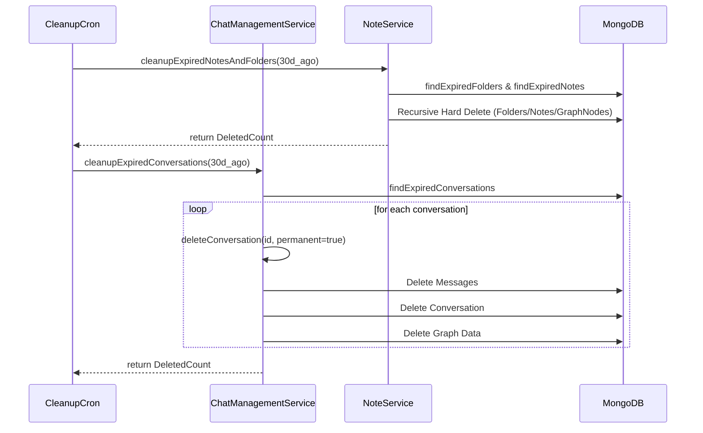

# Cleanup Mechanism

이 문서는 사용자가 삭제한 항목(대화, 노트, 폴더)을 30일 후에 자동으로 영구 삭제하는 백엔드 정리 메커니즘을 설명합니다.

## 개요

GraphNode는 사용자의 실수로 인한 데이터 손실을 방지하기 위해 **Soft Delete**(지연 삭제) 정책을 채용하고 있습니다. 삭제된 항목은 즉시 DB에서 제거되지 않고 `deletedAt` 필드가 마킹되어 '휴지통' 상태가 됩니다. 이 항목들은 30일 동안 보관되며, 그 이후에는 백엔드 크론 잡에 의해 물리적으로 영구 삭제(**Hard Delete**)됩니다.

## 구성 요소

### 1. CleanupCron (`src/infra/cron/CleanupCron.ts`)
- **실행 주기**: 매일 자정 (00:00).
- **역할**: `ChatManagementService`와 `NoteService`의 정리 메서드를 호출하여 만료된 항목들을 정리합니다.
- **기준**: `deletedAt`이 현재 시점으로부터 30일 이전인 데이터.

### 2. Service Layer (`Service` 기반 정리)
정리 작업은 단순히 Repository의 `deleteMany`를 호출하는 것이 아니라, 연관된 데이터의 무결성을 보장하기 위해 서비스 계층에서 수행됩니다.

#### ChatManagementService
- `cleanupExpiredConversations(expiredBefore)`를 통해 만료된 대화를 찾습니다.
- 각 대화에 대해 `deleteConversation(permanent=true)`를 호출하여 다음을 수행합니다:
  - 대화 본체 삭제.
  - 해당 대화의 모든 메시지 삭제.
  - 해당 대화 및 메시지와 연쇄된 지식 그래프 노드 및 엣지 삭제.

#### NoteService
- `cleanupExpiredNotesAndFolders(expiredBefore)`를 통해 만료된 노트와 폴더를 정리합니다.
- 폴더 삭제 시 해당 폴더 하위의 모든 항목을 재귀적으로 탐색하여 영구 삭제하며, 연관된 그래프 노드들도 함께 제거합니다.

## 정리 프로세스 흐름

## 제약 사항 및 주의사항
- **영구 삭제(Hard Delete)**된 데이터는 복구가 불가능합니다.
- 크론 잡은 서버 부트스트랩 시점에 `CleanupCron.start()`를 통해 활성화됩니다.
- 대량의 데이터를 삭제할 경우 이벤트 루프 블로킹을 방지하기 위해 트랜잭션 및 배치 처리가 고려되어 있습니다.
