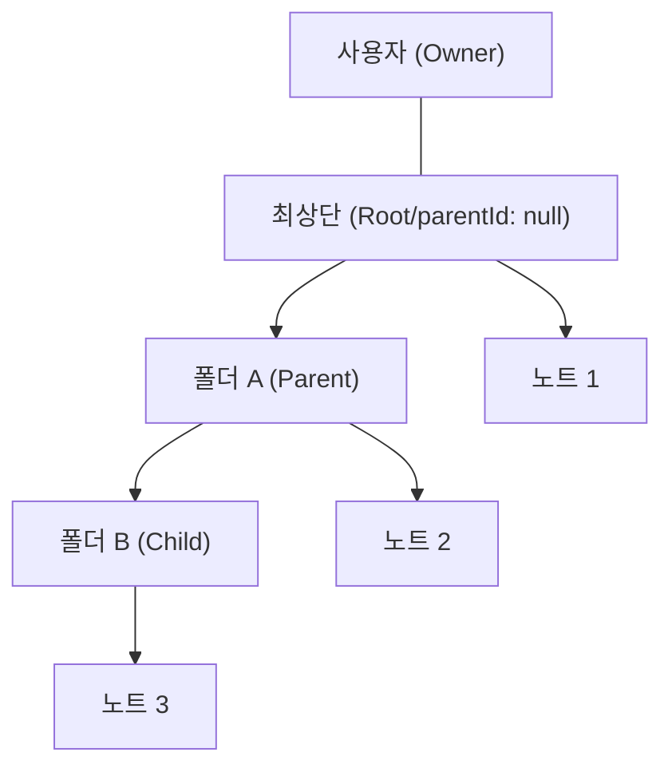
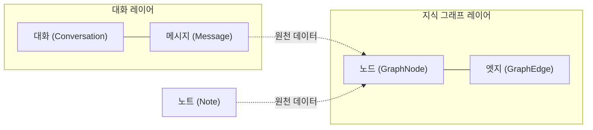

# Data Lifecycle & Business Logic Relationships

이 문서는 GraphNode의 핵심 데이터 구조 간의 비즈니스 로직 관계와, 삭제 및 복구 시 데이터 무결성을 유지하기 위한 설계 의도를 설명합니다. 신입 개발자가 데이터 간의 흐름과 종속성을 이해하는 데 도움을 주는 것을 목적으로 합니다.

## 1. 지식 관리 계층 (Note & Folder)

노트와 폴더는 사용자가 생성하는 지식의 기본 단위이며, 엄격한 계층 구조를 가집니다.

### 데이터 관계 (Hierarchy)
- **Folder**: 다른 폴더(Child)나 노트(Note)를 포함할 수 있는 컨테이너입니다.
- **Note**: 폴더 내에 존재하거나 최상단(Root)에 존재할 수 있는 개별 지식 엔티티입니다.

### 삭제 및 복구 로직 (Design Choice)

#### 연쇄 삭제 (Cascade Delete)
- **의도**: 부모 폴더를 삭제하면 그 안에 포함된 모든 지식 자산(하위 폴더, 노트)도 논리적으로 함께 사라져야 합니다.
- **동작**: 폴더 삭제 시 하위 트리를 재귀적으로 탐색하여 모든 항목의 `deletedAt`을 업데이트합니다. 영구 삭제 시에도 동일하게 연쇄 처리하여 데이터 고립을 방지합니다.

#### 계층형 복구 및 "Move to Root" 전략
- **요구사항**: 삭제된 폴더를 복구할 때, 원래의 부모 폴더가 이미 영구 삭제되었거나 여전히 휴지통에 있다면 복구된 폴더가 시스템에서 보이지 않게 되는 문제가 발생합니다.
- **해결책**:
    1. 복구 시 부모 폴더의 상태를 검사합니다.
    2. 부모가 유효하지 않으면 복구되는 대상 항목을 **최상단 루트(`parentId: null`)**로 강제 이동시킵니다.
    3. 하위 자식들은 원래의 부모(복구되는 항목)를 그대로 따르므로 계층 구조가 유지됩니다.

---

## 2. 대화 및 지식 추출 레이어 (Conversation & Graph)

대화 데이터는 시스템이 지식을 추출하는 원천(Source)이며, 그 결과물인 지식 그래프와 밀접하게 연동됩니다.

### 데이터 종속 관계
- **Conversation**: 사용자 간의 대화 세션입니다.
- **Message**: 대화 내의 개별 발화입니다.
- **Graph Data (Node, Edge)**: 대화(Message)나 노트(Note)에서 추출된 지식 엔티티들입니다.

### 연쇄 처리 설계 의도

#### 데이터 정합성 (Single Source of Truth)
- **설계 의도**: 지식 그래프 데이터는 그 자체로 존재하는 것이 아니라, 대화나 노트라는 '근거'가 있을 때만 유효합니다.
- **삭제 시 연쇄 반응**:
    - 대화(`Conversation`)가 삭제되면, 해당 대화에서 파생된 모든 메시지(`Message`)와 그래프 노드/엣지도 함께 삭제되어야 합니다.
    - 만약 대화만 지우고 그래프가 남는다면, 사용자는 근거를 알 수 없는 유령 지식을 보게 되어 시스템의 신뢰도가 떨어집니다.
- **복구 시 연쇄 반응**: 대화를 복구하면 사용자가 과거에 구축했던 지식 맥락을 즉시 되찾을 수 있도록 관련 메시지와 그래프 데이터도 함께 원복합니다.

---

## 3. 요약: 엔티티별 삭제 영향 범위

| 엔티티 | 삭제 시 (Soft) | 영구 삭제 시 (Hard) | 복구 시 |
| :--- | :--- | :--- | :--- |
| **폴더** | 하위 폴더/노트 일시 삭제 | 하위 트리 전체 물리 삭제 | 하위 트리 전체 복구 (부모 유실 시 루트 이동) |
| **노트** | 노트 및 관련 그래프 노드 일시 삭제 | 노트 및 관련 그래프 노드 물리 삭제 | 노트 및 그래프 데이터 복구 |
| **대화** | 메시지 및 관련 그래프 데이터 일시 삭제 | 메시지 및 관련 그래프 데이터 물리 삭제 | 메시지 및 그래프 데이터 복구 |

## 4. 개발자를 위한 가이드

- **트랜잭션**: 연쇄 삭제/복구는 여러 컬렉션을 동시에 건드리므로 반드시 `session`을 사용한 트랜잭션 내에서 실행해야 합니다.
- **Idempotency**: 삭제나 복구 요청이 중복해서 들어와도 데이터 상태가 일관되게 유지되도록 (예: 이미 삭제된 것을 다시 삭제해도 에러 미발생) Repository 수준에서 가드 로직을 갖추어야 합니다.
- **Traceability**: 모든 삭제 및 복구 동작은 Audit Log를 통해 추적 가능해야 하며, `updatedAt`이 항상 최신으로 유지되어야 클라이언트의 동기화(Sync)가 정확하게 작동합니다.
