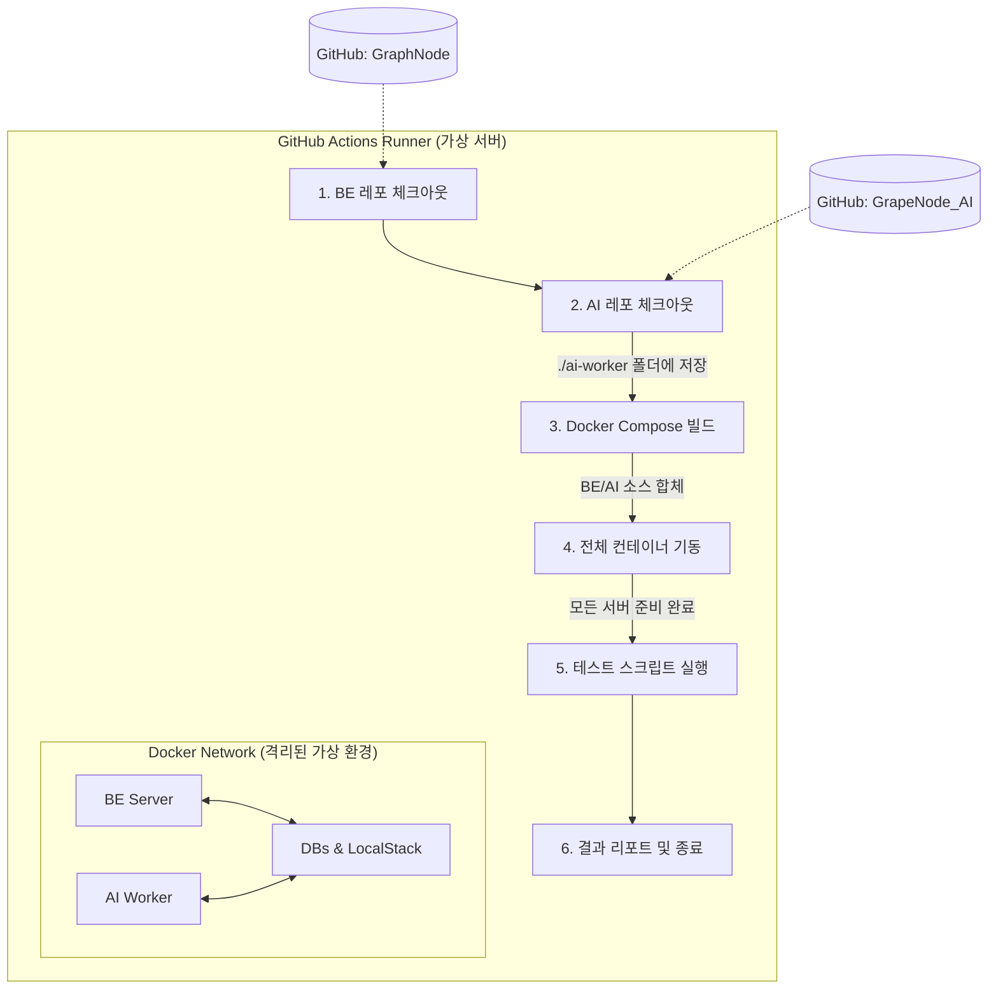

# 통합 테스트(E2E) 아키텍처 및 흐름 가이드

이 문서는 GraphNode와 AI Worker 간의 연동을 검증하기 위한 통합 테스트(End-to-End) 시스템의 구조와 동작 원리를 설명합니다.

## 1. 목적 및 필요성

- **연동 검증**: API 서버(BE)와 비동기 처리를 담당하는 Worker, 그리고 실제 분석을 수행하는 AI 서버 간의 데이터 흐름이 정상적인지 확인합니다.
- **인프라 테스트**: SQS, S3(LocalStack), MongoDB, MySQL 등 모든 미들웨어가 실제 환경과 유사하게 상호작용하는지 검증합니다.
- **배포 전 방어선**: 기능 개발 및 리팩토링 시 발생할 수 있는 통합 관점의 리그레션을 방지합니다.

## 2. 통합 테스트 워크플로우

### 상세 절차

1. **Source Sync**: BE와 AI 레포지토리를 동일 워커 노드에 체크아웃합니다.
2. **Infrastructure Up**: `docker-compose.test.yml`을 통해 전체 컨테이너를 기동합니다. 이때 `INTERNAL_SERVICE_TOKEN`이 주입되어 인증 우회가 가능해집니다.
3. **Data Seeding**: `db-seed.ts`가 실행되어 테스트에 필요한 기초 데이터를 MySQL 및 MongoDB에 강제 주입합니다.
4. **Scenario Execution**: Jest를 통해 작성된 4대 핵심 시나리오를 순차적으로 실행합니다.
    - **Graph Flow**: 전체 추출, 요약 생성, 노드 증분 추가 (Scenario 1, 2, 3)
    - **Microscope Flow**: 노드 기반 분석 인입 (Scenario 3)
5. **Log Collection**: 테스트 실패 시 `docker compose logs`를 통해 BE/AI/Worker의 로그를 아티팩트로 추출합니다.

## 3. 핵심 기술 요소

### 인증 우회 전략 (`internalOrSession`)

- 일반 로그인이 불가능한 CI 환경을 위해 `x-internal-token` 헤더를 통한 인증 우회를 허용합니다.
- [internal.ts](file:///c:/Users/hik88/Desktop/BIT_Uni/TACO%204/GraphNode/src/app/middlewares/internal.ts) 미들웨어가 이를 처리합니다.

### 데이터 격리

- 통합 테스트는 전용 데이터베이스 이름(`taco5_graphnode_test`)을 사용하여 개발/운영 데이터와 완전히 격리됩니다.
- 실행마다 `db-seed.ts`가 데이터를 초기화하므로 멱등성이 보장됩니다.

## 4. 관련 파일 위치

- **테스트 스펙**: `tests/e2e/specs/`
- **테스트 유틸**: `tests/e2e/utils/`
- **실행 스크립트**: `scripts/e2e-test.sh`
- **CI 워크플로우**: `.github/workflows/BE-AI-flow-test.yml`
