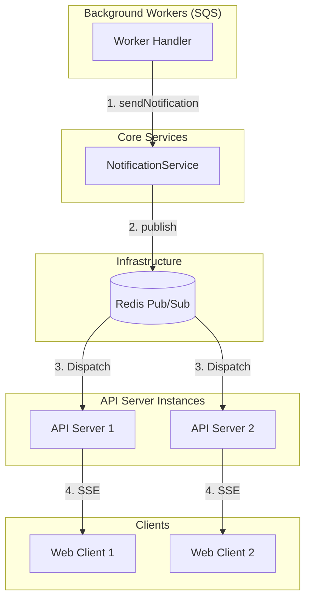

# Notification System Architecture (알림 시스템 아키텍처)

본 문서는 GraphNode 서비스의 실시간 알림 시스템 구조, 동작 흐름 및 설계 방식에 대해 설명합니다.

## 1. 개요 (Overview)
GraphNode의 알림 시스템은 사용자에게 작업 완료(그래프 생성 등) 및 시스템 이벤트를 실시간으로 전달하기 위해 설계되었습니다. 주요 기술 스택으로는 **SSE (Server-Sent Events)**와 **Redis Pub/Sub**, 그리고 **FCM (Firebase Cloud Messaging)**을 사용합니다.

## 2. 아키텍처 및 구성 요소 (Architecture Components)

### 2.1 주요 파일 및 역할
- **`NotificationService.ts`**: 알림 도메인의 핵심 비즈니스 로직을 담당합니다. SSE 발행/구독과 FCM 토큰 관리 및 발송 기능을 제공합니다.
- **`EventBusPort.ts`**: 메시지 버스의 인터페이스를 정의하여 인프라에 대한 의존성을 분리합니다.
- **`RedisEventBusAdapter.ts`**: Redis Pub/Sub을 사용하여 실시간 메시지 브로드캐스팅을 구현한 `EventBusPort`의 구현체입니다.
- **`NotificationController.ts`**: SSE 스트림 엔드포인트(`/v1/notifications/stream`) 및 FCM 토큰 등록 API를 제공합니다.
- **`workers/index.ts` & Handlers**: 백그라운드 작업(SQS Worker) 완료 시 `NotificationService`를 호출하여 알림을 트리거합니다.

### 2.2 시스템 구조도 (Flow)


## 3. 동작 흐름 (Operation Flow)

### 3.1 알림 발행 (Publishing)
1. 백그라운드 워커(예: `GraphGenerationResultHandler`)에서 작업이 완료되면 `NotificationService.sendNotification()`을 호출합니다.
2. `NotificationService`는 `EventBusPort.publish()`를 통해 Redis의 `notification:user:{userId}` 채널로 메시지를 발행합니다.

### 3.2 알림 구독 및 수신 (Subscription & SSE)
1. 클라이언트는 `GET /v1/notifications/stream` 엔드포인트로 연결을 시도합니다.
2. `NotificationController.stream`은 해당 사용자의 인증을 확인한 후 SSE 헤더를 설정하고 연결을 유지합니다.
3. 동시에 `NotificationService.subscribeToUserNotifications()`를 호출하여 Redis에서 해당 사용자의 채널을 구독합니다.
4. Redis 채널에 메시지가 도착하면 `RedisEventBusAdapter`가 이를 수신하여 등록된 콜백(SSE 전송 로직)을 실행합니다.
5. API 서버는 수신된 메시지를 JSON으로 직렬화하여 클라이언트와의 SSE 스트림에 기록합니다.

## 4. 실제 사용 예시 (Code Examples)

### 4.1 알림 전송 (Worker Side)
```typescript
// GraphGenerationResultHandler.ts
await notiService.sendNotification(userId, NotificationType.GRAPH_GENERATION_COMPLETED, {
  taskId,
  nodeCount: snapshot.nodes.length,
  timestamp: new Date().toISOString(),
});
```

### 4.2 SSE 스트림 연결 (Controller Side)
```typescript
// NotificationController.ts
await this.notificationService.subscribeToUserNotifications(userId, (message) => {
  res.write(`data: ${JSON.stringify(message)}\n\n`);
});
```

## 5. 현재 문제점 및 설계적 제약 (Known Issues & Constraints)

### 5.1 서버 인스턴스 중단 시 구독 유실
- **상태 유지의 한계**: SSE 연결은 특정 API 서버 인스턴스와 클라이언트 간의 물리적인 TCP 연결에 의존합니다. 만약 해당 서버 인스턴스가 배포나 장애로 인해 재시작되면, 해당 인스턴스에서 관리하던 모든 SSE 구독 정보가 소멸됩니다.
- **알림 유실**: Redis Pub/Sub은 "Fire and Forget" 방식입니다. 사용자가 서버 재시작이나 일시적인 네트워크 장애로 연결이 끊긴 사이에 발생한 알림은 다시 전달되지 않고 유실됩니다.

### 5.2 해결 방안 (제안)
- **알림 이력 저장**: 알림을 발행할 때 Redis Pub/Sub뿐만 아니라 DB(MongoDB 등)에 알림 이력을 저장해야 합니다.
- **Last-Event-ID 지원**: 클라이언트가 재연결 시 `Last-Event-ID` 헤더를 보내면, 서버는 연결이 끊겼던 시점 이후의 미수신 알림을 DB에서 조회하여 즉시 전송하는 로직이 필요합니다.
- **사용자 알림함 API**: 별도의 `/v1/notifications` API를 제공하여 사용자가 최근 알림 목록을 수동으로 조회하거나 '읽음' 처리를 할 수 있도록 해야 합니다.

## 6. 결론
현재 시스템은 Redis Pub/Sub와 SSE를 결합하여 다중 인스턴스 환경에서도 실시간 알림을 효율적으로 전달할 수 있는 구조를 갖추고 있습니다. 다만, 서비스의 신뢰성을 높이기 위해서는 알림 영속화(Persistence) 및 재연결 시 미수신 알림 복구 메커니즘을 추가로 도입할 것을 권장합니다.
