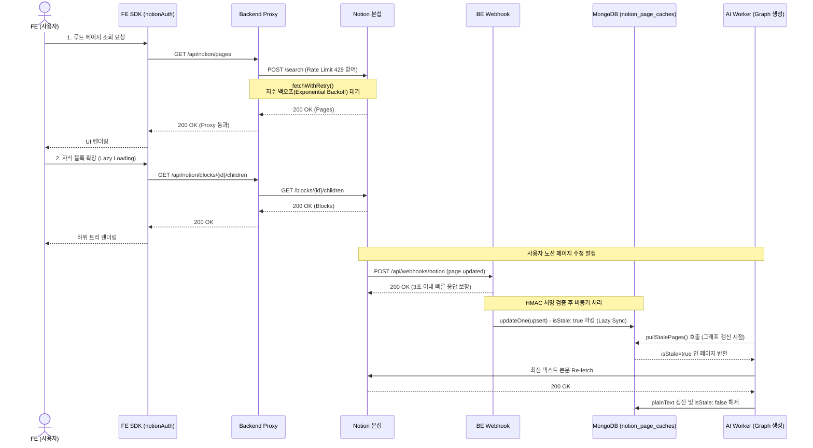

# Notion Integration Flow (노션 연동 및 지연 동기화 아키텍처)

> 작성자: 강현일  
> 갱신일: 2026-05-29  
> 버전: 1.0  

이 문서는 노션(Notion) OAuth 2.0 연동, 페이지 트리 프록시 조회(Lazy Loading), 그리고 노션 서버로부터 웹훅을 수신하여 캐시를 갱신하는 지연 동기화(Lazy Sync) 아키텍처를 시각화하고 설명합니다.

---

## 1. 아키텍처 다이어그램 (Sequence Flow)

---

## 2. 설계 원칙 및 전제 조건

### 2.1 프록시 서버 운용 원칙 (Real-time View)
사용자가 프론트엔드(FE)에서 자신의 노션 데이터를 열람할 때는 **절대 DB 캐시를 읽지 않고 백엔드를 통해 실시간으로 노션 본섭을 찌릅니다(Proxy)**. 
- **이유:** 노션 페이지의 구조적 트리(하위 페이지, DB 등)를 캐싱하고 동기화하는 것은 매우 무겁고 불일치 위험이 큽니다.
- **Lazy Loading 강제:** 노션 본섭을 찌르기 때문에, 무조건 페이지 진입 시 자식 노드 100개 단위로 끊어오는 **지연 로딩(Cursor Pagination)**을 사용하여 서버와 노션 간의 부하를 줄입니다.

### 2.2 지연 동기화 (Lazy Sync) 와 `isStale` 플래그
웹훅(`/api/webhooks/notion`)을 수신할 때 즉시 노션 API를 호출해 텍스트를 다운로드하지 않습니다. 
- **이유:** 노션에서 사용자가 글자 하나를 지울 때마다 웹훅이 날아오는데, 그때마다 API를 호출하면 노션 API Rate Limit(초당 3회)에 즉각 걸립니다.
- **Fail-Fast & Upsert:** 웹훅이 들어오면 서버는 3초 안에 200을 줘야 하므로, `MongoDB`의 `updateOne({ upsert: true })`를 사용해 해당 문서의 `isStale` 플래그만 `true`로 켜놓고 끝냅니다. (아직 DB에 없는 신규 페이지여도 빈 문서를 생성하며 플래그를 켭니다).
- **실제 동기화 시점:** 나중에 사용자가 "Graph AI 생성" 등을 요청하여 데이터 갱신이 *진짜로* 필요할 때만, 워커가 `isStale=true`인 페이지들만 선별해 노션에서 일괄 다운로드(Batch Pull)합니다.

### 2.3 Rate Limit (429) & Size Limit (400) 방어 정책
노션 API의 공식 제한을 방어하기 위해 `NotionApiClient.ts`의 내부 래퍼(`fetchWithRetry`)가 작동합니다.
- **반응형 지수 백오프 (Reactive Exponential Backoff):** 429 에러 발생 시, 각 요청 스레드는 큐(Queue) 대기열에 서지 않고 `Retry-After` 헤더 값만큼 비동기로 `Sleep`한 후 루프를 다시 돌며 자체 재시도합니다. (다중 서버 환경 대응)
- **복구 불가능 에러 처리:** 노션이 블록 초과 등으로 `400`을 반환하면 재시도하지 않고 즉시 `ValidationError` 도메인 에러를 Throw하여 시스템 무한 루프를 방지합니다.
