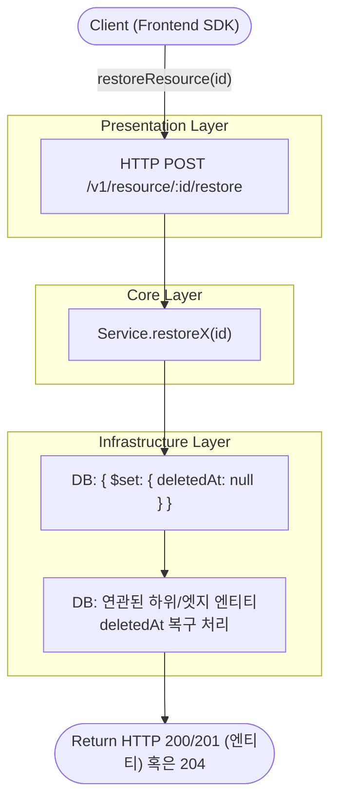

# 데이터 삭제 전략 및 아키텍처 가이드 (Soft/Hard Delete Flow)

**작성일**: 2026-02-26
**대상 엔티티**: Note, Folder, Conversation, Message, 및 Graph 데이터군(Node, Edge, Cluster, Summary 등)

이 문서는 GraphNode 백엔드에서 다루는 주요 엔티티의 삭제 메커니즘을 설명합니다. 사용자 실수로 인한 데이터 유실을 방지하고 추후 복원 기능을 완벽하게 지원하기 위해, **논리적 삭제(Soft Delete)를 기본(Default)으로 하되 완전 삭제(Hard Delete)와 복구(Restore) 옵션을 함께 제공**하는 통합 패턴으로 구현되어 있습니다.

---

## 1. 아키텍처 개요 및 설계 결정 (ADR)

*   **기본 동작 방식**: 모든 `DELETE` API와 SDK `delete()` 함수들은 기본적으로 **Soft Delete**로 작동합니다.
*   **완전 삭제 옵션**: 쿼리스트링 `?permanent=true` 파라미터(또는 SDK 옵션 `{ permanent: true }`)가 함께 전달될 경우 데이터베이스에서 완전히 삭제하는 **Hard Delete**가 수행됩니다.
*   **DB 은닉 처리**: Repository 계층 내부 모든 조회(GET/LIST) 쿼리에서 `{ deletedAt: { $in: [null, undefined] } }` 조건절을 항상 추가하여 휴지통 처리된 데이터가 클라이언트에게 실수로 노출되지 않도록 강제합니다.
*   **Cascade (연쇄) 통제**: Note가 삭제되면 속한 내용이, Graph Node나 Cluster가 삭제/복원되면 속하는 Edge가, Conversation이 삭제되면 Messages가 같이 Soft/Hard Delete 생명 주기를 공유하게 됩니다.

---

## 2. 삭제 패턴 데이터 흐름도 (Data Flow)

### 2.1. Soft Delete & Hard Delete 흐름 (Mermaid)

```mermaid
flowchart TD
    Client(["Client (Frontend SDK)"])
    
    subgraph "Presentation Layer (Controller/Router)"
        REST["HTTP DELETE /v1/resource/:id"]
        QueryCheck{"query parameter\n ?permanent=true"}
    end
    
    subgraph "Core Layer (Service)"
        Svc["Service / Usecase\n (e.g., NoteService, GraphMgmt)"]
    end
    
    subgraph "Infrastructure Layer (MongoDB / Prisma Repository)"
        DB_S["DB: updateOne\n $set: { deletedAt: Date.now() }"]
        DB_C_S["DB: updateMany (Cascade)\n 연관 데이터 deletedAt 일괄 수정"]
        
        DB_H["DB: deleteOne\n 영구 삭제 수행"]
        DB_C_H["DB: deleteMany (Cascade)\n 연관 데이터 영구 삭제"]
    end
    
    Client -->|deleteResource(id)| REST
    Client -->|deleteResource(id, { permanent: true })| REST
    
    REST --> QueryCheck
    QueryCheck -->|False (or undefined)| SoftPath[Soft Delete Request]
    QueryCheck -->|True| HardPath[Hard Delete Request]
    
    SoftPath --> Svc
    HardPath --> Svc
    
    Svc -->|permanent=false| DB_S
    DB_S --> DB_C_S
    
    Svc -->|permanent=true| DB_H
    DB_H --> DB_C_H
    
    DB_C_S --> End(["Return HTTP 204 No Content"])
    DB_C_H --> End
```

### 2.2. 복구(Restore) 흐름 (Mermaid)



---

## 3. 계층별 구현 방식 상세

### 3.1. Controller Layer

각 컨트롤러(`note.controller.ts`, `ai.ts`, `graph.ts`)는 `DELETE` 라우터에서 `permanent` 여부를 판단합니다.
```typescript
async deleteNote(req: Request, res: Response) {
  const userId = getUserIdFromRequest(req)!;
  const { id } = req.params;
  // 문자열로 들어오므로 'true' 와 비교하여 bool화 합니다.
  const permanent: boolean = req.query.permanent === 'true';

  await this.noteService.deleteNote(userId, id, permanent);
  res.status(204).send();
}
```

### 3.2. Service Layer

비즈니스 레이어에서는 하위 요소들에 대한 캐스케이드 삭제/복구를 트랜잭션 주입과 함께 지시하거나, 리포지토리 인터페이스에 위임합니다.
```typescript
async deleteNode(userId: string, id: number, permanent?: boolean, options?: RepoOptions): Promise<void> {
  // 권한 검증 등 공통 비즈니스 로직
  this.assertUser(userId);
  await this.repo.deleteNode(userId, id, permanent, options);
}
```

### 3.3. Repository Layer (MongoDB)

DB 쿼리를 담당합니다. 여기서 Soft Delete 방식과 영구 삭제 방식을 분기 처리합니다.
```typescript
async deleteNode(userId: string, id: number, permanent?: boolean, options?: RepoOptions): Promise<void> {
  const opts = { ...options, session: options?.session as any };
  if (permanent) {
    // 1. 하드 딜리트 트리: 엔티티 및 속한 Edge 통째로 물리 삭제
    await this.graphNodes_col().deleteOne({ id, userId } as any, opts);
    await this.graphEdges_col().deleteMany({ userId, $or: [{ source: id }, { target: id }] } as any, opts);
  } else {
    // 2. 소프트 딜리트 트리: 논리 삭제 위한 상태 마킹 타임스탬프 삽입 (Cascade 포함)
    const deletedAt = Date.now();
    await this.graphNodes_col().updateOne({ id, userId } as any, { $set: { deletedAt } }, opts);
    await this.graphEdges_col().updateMany(
      { userId, $or: [{ source: id }, { target: id }] } as any, 
      { $set: { deletedAt } }, 
      opts
    );
  }
}
```

조회(`findX`) 시에는 `deletedAt: { $in: [null, undefined] }` 필터를 의무적으로 끼워넣습니다.

### 3.4. SDK 연동 (`z_npm_sdk`)

모든 SDK `delete*` 펑션은 두 번째 인자로 `permanent` 플래그를 선택으로 허용하고, 복구를 위한 `restore*` 펑션을 탑재하고 있습니다.

```typescript
// 1. 기본 삭제 (휴지통 이동)
await client.note.deleteNote('note-123');

// 2. 영구 삭제
await client.note.deleteNote('note-123', true); // permanent 값 처리

// 3. 복구 (휴지통 복원)
await client.note.restoreNote('note-123');
```

---

## 4. 커버리지 및 데이터 지원 체크리스트

모든 주요 도메인 객체는 다음 정책을 준수합니다:
- [x] REST API 설계 (`?permanent=true` & `/restore`)
- [x] Service 레이어 & Repository 계층 연관 데이터 캐스케이딩(Cascade) 처리
- [x] NPM SDK `deleteX(..., permanent)` 및 `restoreX()` 매서드 타이핑 지원
- [x] API Contract 동기화 (`docs/api/openapi.yaml`) 및 템플릿 검증 통과

해당 지원이 완료된 도메인 엔티티는 다음과 같습니다:
* **Note Domain**: 
  - `Note` (노트 내용 전체 삭제 및 복구)
  - `Folder` (내장된 노트들의 캐스케이딩 처리)
* **Conversation Domain**: 
  - `Conversation` (대화방 및 속성, 하위 메시지 캐스케이딩 일괄)
  - `Message` (대화 내 단건 메세지 요소)
* **Graph Domain**: 
  - `GraphNode` (해당 노드가 붙어있는 연결망 Edge 일괄 처리)
  - `GraphEdge` (단일 연결망 처리)
  - `GraphCluster` / `GraphSubcluster` (해당 군집에 묶여있는 구성 데이터 일괄)
  - `GraphSummary`, `Entire Graph` (유저 데이터 전체 통합 및 서머리 등)

---

이 문서는 AI 기반 노트 서비스의 데이터 신뢰성 확보를 위한 아키텍처 결정(ADR) 문서의 역할도 겸합니다. 추가되는 리퀘스트의 데이터베이스 모델에도 이 `deletedAt` 기반 패턴을 필수로 반영해야 합니다.
