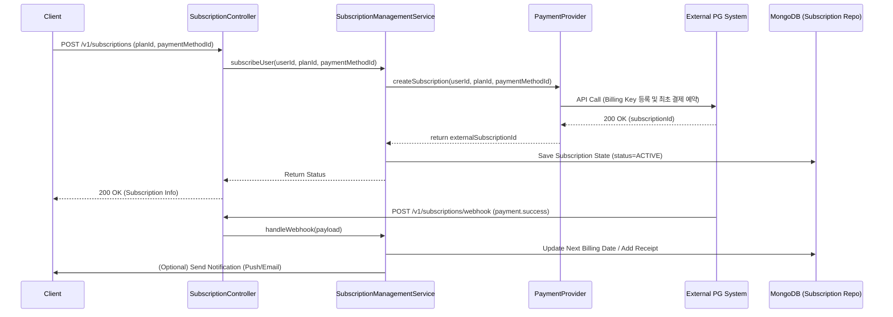

# 월정액 구독 결제 시스템 아키텍처 (Scaffolding)

이 문서는 월정액 구독 및 결제 관리 기능에 대한 아키텍처와 추후 구체화될 개발 계획을 서술합니다. 
현재는 PG(Payment Gateway)사 또는 결제 솔루션이 확정되지 않았으므로, 인터페이스 및 껍데기(Skeleton) 클래스만 미리 구현해 둔 상태입니다.

## 1. 아키텍처 다이어그램 (예상되는 데이터 흐름)

## 2. 디자인 관점 (Design Decision)

해당 시스템은 **의존성 역전 원칙(DIP)** 을 적용하여 설계되었습니다.
결제와 관련된 비즈니스 로직(예: 구독 만료 처리, 유저의 구독 등급 갱신 등)은 `SubscriptionManagementService`라는 도메인 서비스에 위치합니다. 
구체적인 카드사의 호출 및 PG 연동 상세 정보는 `PaymentProvider` 인터페이스에 의존하며, 향후 어느 PG(예: Toss Payments, Stripe, PortOne 등)를 사용하건 이 인터페이스를 구현하는 외부 어댑터(Adapter)만 갈아끼우면 되도록 모듈화했습니다.

## 3. 핵심 모듈 (Core Modules)

### 3.1 인터페이스 (Port)
- **`src/core/ports/PaymentProvider.ts`**
  PG사에 의존하는 행위를 추상화한 인터페이스.
  - `createSubscription`: 신규 반복 결제 등록
  - `cancelSubscription`: 반복 결제 취소
  - `verifyPayment`: 단건 또는 반복된 결제 내역의 무결성을 PG사에 질의
  - `getBillingHistory`: 유저의 결제 이력 조회

### 3.2 도메인 서비스 (Service)
- **`src/core/services/SubscriptionManagementService.ts`**
  구독 로직을 관장하는 서비스 레이어 클래스.
  - `subscribeUser`: `PaymentProvider`를 통해 빌링키/구독 정보를 등록하고 내부 DB 상태 갱신
  - `unsubscribeUser`: 외부 시스템에서 구독을 해지한 뒤 내부 상태를 "CANCELED"나 만료로 변경
  - `handleWebhook`: 외부 PG사 이벤트(결제 성공, 한도 초과 등)를 필터링하고 내부 DB/플랜에 반영
  - `getSubscriptionStatus`: 현 유저의 플랜 및 활성 여부 조회

### 3.3 컨트롤러 (Controller & Routes)
- **`src/app/controllers/SubscriptionController.ts` & `src/app/routes/subscription.routes.ts`**
  HTTP 기반 라우팅 및 요청/응답 변환 레이어.
  - `[POST] /v1/subscriptions`: 가입 요청
  - `[DELETE] /v1/subscriptions`: 정기구독 해지
  - `[GET] /v1/subscriptions/status`: 현 구독 정보 응답
  - `[POST] /v1/subscriptions/webhook`: PG사 웹훅 진입점

## 4. 향후 작업 사항 (Next Steps)
- PG 솔루션이 결정되면 `PaymentProvider` 인터페이스를 구현한 클래스(예: `TossPaymentAdapter`) 작성.
- 내부 상태 연동을 위한 `SubscriptionRepository` MongoDB 레포지토리 제작 (스키마 디자인 수반, `userId`, `planType`, `status`, `expiresAt` 등 포함).
- OpenAPI(`openapi.yaml`)에 위의 `v1/subscriptions` 스펙 등재, JSON Schema와 에러 응답 규격 정의.
