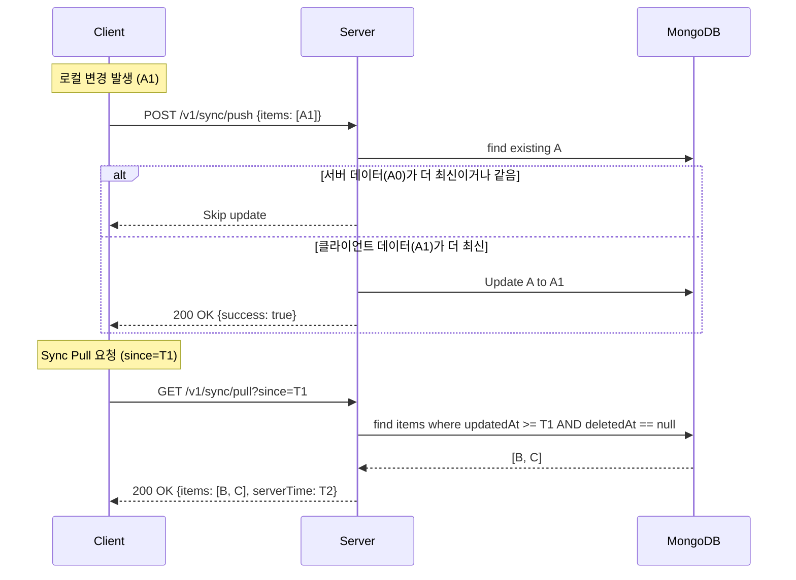

# Sync Architecture (LWW Logic)

## 개요

GraphNode의 동기화 시스템은 **LWW (Last Write Wins)** 정책을 기반으로 하는 타임스탬프 방식의 동기화 모델을 사용합니다. 이 문서는 현재 구현된 동기화 로직의 구조, 동작 원리 및 알려진 제약 사항을 설명합니다.

## 동기화 모델: LWW (Last Write Wins)

시스템은 모든 데이터 엔티티에 `updatedAt` 필드를 유지하며, 서버와 클라이언트 간의 데이터 충돌 발생 시 **가장 최근에 수정된(updatedAt이 큰) 데이터**를 최종 상태로 채택합니다.

### 주요 동작 흐름

## 상세 구현 정책

### 1. 삭제 처리 (Soft Delete)
- 모든 동기화 대상 데이터는 `deletedAt` 필드를 통한 **소프트 삭제**를 기본으로 합니다.
- **Pull 필터링**: `sync/pull` 요청 시, 서버는 `deletedAt`이 `null`인 데이터만 반환합니다. 이는 클라이언트가 휴지통 데이터를 별도의 API로 관리한다는 전제하에 일반 동기화 대역폭을 최적화하기 위함입니다.

### 2. 통합 및 개별 동기화 API

부하 분산 및 정밀한 제어를 위해 두 가지 방식의 Pull API를 제공합니다.

- **통합 Pull (`/v1/sync/pull`)**: 대화, 메시지, 노트, 폴더를 한 번에 동기화.
- **개별 Pull**:
  - `/v1/sync/pull/conversations`: 대화 및 메시지만 동기화.
  - `/v1/sync/pull/notes`: 노트 및 폴더만 동기화.

### 3. `since` 파라미터 동작
- `since` 값이 누락되거나 빈 값으로 전달될 경우, 서버는 내부적으로 `new Date(0)` (1970-01-01)을 기준으로 삼습니다.
- 결과적으로 **사용자의 모든 활성 데이터**를 반환하게 되므로, 클라이언트가 처음 앱을 설치하거나 데이터를 초기화한 경우 유용합니다.

### 4. Push 트랜잭션 및 원자성
- `/v1/sync/push` 요청은 하나의 **MongoDB 세션 트랜잭션** 내에서 실행됩니다.
- 전송된 모든 항목(Notes, Folders, Conversations, Messages) 중 하나라도 실패하거나 유효하지 않은 경우 전체 작업이 롤백되어 데이터 일관성을 유지합니다.
- 각 항목에 대해 소유권(ownerUserId) 검증을 수행하여 보안을 강화합니다.

## 현재 구현의 제약 사항 및 향후 과제 (Remains)

### 1. Deletion Sync Gap
- 서버에서 **하드 삭제(Hard Delete)**가 발생하거나, 휴지통 데이터 유효기간(Tombstone)이 만료되어 물리적으로 삭제될 경우, 해당 시점 이후에 동기화를 시도하는 클라이언트는 삭제 사실을 인지하지 못하고 로컬에 데이터를 유지하게 될 수 있습니다.

### 2. 시퀀스 보장 부재
- 현재는 타임스탬프에만 의존하므로, 서버와 클라이언트 간의 시각 차이(Clock Skew)가 발생할 경우 데이터 순서가 뒤바뀔 위험이 미세하게 존재합니다. (향후 Sequential Marker 도입 검토 가능)

### 3. 하위 노드 전파
- 폴더 삭제 시 하위 노트들의 `updatedAt`이 갱신되지 않으면, 클라이언트에서 폴더는 사라지지만 하위 노트들이 고아(Orphan) 상태로 남을 수 있습니다.

## 관련 문서 가이드
- [BE 상세 구현 가이드](../guides/Daily/20260306-sync-logic-refactor.md)
- [FE SDK 사용 가이드](../guides/Daily/20260306-fe-sdk-sync-update.md)
