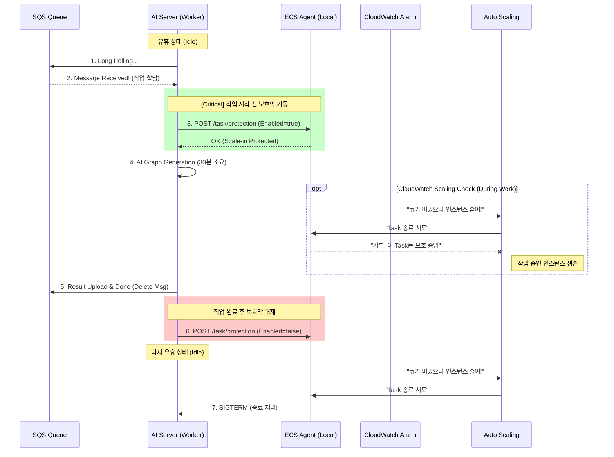

# AWS SQS 기반 비동기 그래프 생성 아키텍처 가이드

## 1. 아키텍처 개요 및 도입 배경

### 1.1 도입 배경 (Why SQS?)

기존의 HTTP 요청/응답 방식(Synchronous)은 AI 생성 시간이 길어질수록 HTTP Connection 타임아웃 위험이 있고, 사용자가 급증할 때 백엔드/AI 서버가 요청을 모두 받아내지 못해 서버가 다운될 위험이 있었습니다.

이를 해결하기 위해 **완전한 비동기 이벤트 기반 아키텍처**를 도입했습니다.

- **버퍼링**: 트래픽 폭주 시 SQS가 요청을 받아두고(Buffer), 처리가능한 만큼만 가져가므로 서버가 죽지 않습니다.
- **오토 스케일링**: 대기열에 쌓인 작업 수(Queue Depth)에 따라 AI 서버를 자동으로 증설합니다.
- **느슨한 결합**: BE 서버와 AI 서버가 서로의 존재를 알 필요가 없습니다(Decoupling).

### 1.2 전체 아키텍처 다이어그램

```mermaid
flowchart TD
    Client(User Client) -->|1. POST /gen (HTTP)| API[BE API Server]

    subgraph "Producer (Node.js)"
        API -->|2. Upload JSON| S3[(S3 Bucket)]
        API -->|3. Send Task Msg| SQS_REQ[AWS SQS\nRequest Queue]
    end

    subgraph "Consumer (Python/FastAPI Cluster)"
        SQS_REQ -->|4. Poll based Auto Scaling| AI_WORKER[AI GPU Server\n(ECS Service)]
        AI_WORKER -->|5. Download Payload| S3
        AI_WORKER -->|6. Upload Result| S3
    end

    subgraph "Result Handler (Node.js Worker)"
        AI_WORKER -->|7. Send Done Msg| SQS_RES[AWS SQS\nResult Queue]
        SQS_RES -->|8. Poll Msg| BE_WORKER[BE Worker Process]
        BE_WORKER -->|9. Persist Graph| DB[(MySQL/Mongo)]
        BE_WORKER -->|10. Pub Event| REDIS[Redis]
    end

    REDIS -->|11. SSE Push| Client
```

---

## 2. 핵심 파일 및 구현 위치

SQS 기능을 유지보수하거나 확장할 때 다음 파일들을 참고해야 합니다.

### 2.1 Backend (Node.js)

| 역할             | 파일 경로                        | 설명                                                                           |
| ---------------- | -------------------------------- | ------------------------------------------------------------------------------ |
| **Worker Entry** | `src/workers/index.ts`           | **워커 프로세스의 시작점**. API 서버와 별도로 실행되며 SQS 폴링 루프를 돕니다. |
| **Strategy**     | `src/workers/handlers/*.ts`      | 메시지 타입(`taskType`)별 처리 로직. (예: `GraphGenerationResultHandler.ts`)   |
| **DI Setup**     | `src/bootstrap/container.ts`     | 워커도 API 서버와 동일한 DB/Redis 연결을 쓰므로, 이 컨테이너를 재사용합니다.   |
| **Infra**        | `src/infra/aws/AwsSqsAdapter.ts` | AWS SDK를 이용해 메시지를 보내고 삭제하는 저수준 구현체.                       |
| **Infra**        | `src/infra/aws/AwsS3Adapter.ts`  | 대용량 JSON 페이로드를 S3에 스트림으로 업로드/다운로드하는 구현체.             |

### 2.2 Shared Types (Payload Contract)

Producer(API)와 Consumer(Worker)가 주고받는 메시지 형식이 정의되어 있습니다.

- 파일: `src/shared/dtos/queue.ts`
- **Claim Check Pattern**: SQS 메시지 크기 제한(256KB) 때문에 실제 데이터는 S3에 넣고, SQS에는 `s3Key`만 담아 보냅니다.

---

## 3. AWS 인프라 구성 및 스케일링 전략

AWS Console에서 설정된 주요 항목과 개발자가 건드려야 할 부분입니다.

### 3.1 SQS Queues

- **Request Queue (`graph-req-queue`)**: 백엔드가 작업을 넣는 곳. AI 서버가 리스닝합니다.
- **Result Queue (`graph-res-queue`)**: AI가 결과를 넣는 곳. 백엔드 Worker가 리스닝합니다.
- **설정**: `VisibilityTimeout`은 AI 작업 예상 시간보다 길게 설정(예: 5분)해야 중복 처리를 막을 수 있습니다.

### 3.2 Auto Scaling & ECS Task Protection (핵심 전략)

우리의 목표는 **"작업 중인 인스턴스는 절대 죽이지 않고, 일이 끝나면 즉시 종료"**하는 것입니다. 이를 위해 **CloudWatch Alarm**과 **ECS Task Protection**을 결합하여 사용합니다.

#### 1) 작동 원리 (Mechanism)

이 전략은 "스케일링 트리거(Trigger)"와 "종료 방지(Safety)"의 역할 분담으로 동작합니다. Isolate & Conqer.

- **Trigger (CloudWatch)**: "큐에 메시지가 없네? (Queue=0) 서버 수를 0개로 줄여!"라고 무자비하게 명령합니다.
- **Safety (EC2/ECS Protection)**: 작업 중인 AI 서버는 스스로에게 "보호막(Protection)"을 켭니다. ECS는 보호막이 켜진 인스턴스는 종료 명령이 와도 죽이지 못합니다.

#### 2) 흐름도 (Flow Diagram)



#### 3) 구현 가이드 (AWS Console)

1.  **Metric**: CloudWatch `ApproximateNumberOfMessagesVisible`.
2.  **Alarm (Scale In)**: "메시지 수 == 0" 인 상태가 지속되면 `DesiredCount`를 0으로 설정.
3.  **ECS Service 설정**:
    - **Service 생성 시 `Task scale-in protection` 옵션을 반드시 켜야 합니다.** (이게 켜져 있어야 코드로 제어 가능)

---

## 4. Worker 프로세스 배포 가이드 (DevOps)

백엔드 Worker는 API 서버와 **동일한 코드베이스(Docker Image)**를 사용하지만, **실행 명령(CMD)**이 다릅니다.

### ECS Service 구성

API 서버와 Worker를 각각 독립된 ECS Service로 띄워야 합니다.

| 설정 항목              | API Service (기존)          | Worker Service (신규)              |
| :--------------------- | :-------------------------- | :--------------------------------- |
| **Cluster**            | `graph-node-cluster`        | `graph-node-cluster` (공유)        |
| **Docker Image**       | `graph-node-backend:latest` | `graph-node-backend:latest` (동일) |
| **Command (Override)** | (기본값) `npm start`        | **`node dist/workers/index.js`**   |
| **CPU/Memory**         | 트래픽에 따라 설정          | 메시지 처리 부하에 따라 설정       |
| **Load Balancer**      | 연결됨 (Port 80/3000)       | **필요 없음** (외부 통신 안함)     |
| **Auto Scaling**       | CPU/Memory 기반             | **Result Queue 깊이** 기반 (권장)  |

### 로컬 개발 시 실행

로컬에서는 터미널을 하나 더 열고 다음 명령어를 실행하면 됩니다.

```bash
# 개발 모드 (ts-node)
npx tsx src/workers/index.ts
```

---

## 5. 트러블슈팅 Checklist

기능 수정 시 다음을 확인하세요.

1.  **메시지가 안 줄어듬**: Worker가 에러를 뱉고 `throw err`를 하는지 확인하세요(재시도 중일 수 있음). 로그에 `Error handling message`가 찍히는지 봅니다.
2.  **중복 알림**: SQS의 `VisibilityTimeout`이 너무 짧아서, 처리가 안 끝났는데 다른 워커가 또 가져가는 경우입니다. 시간을 늘리세요.
3.  **데이터 누락**: S3 키가 올바른지, `AwsS3Adapter` 권한이 있는지 확인하세요.
