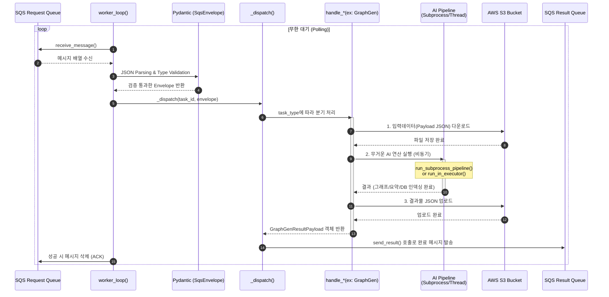

# Python AI 서버 Worker (`worker.py`) 분석 및 가이드

이 문서는 다른 Node.js, Spring 등의 백엔드 개발자가 Python AI 모듈의 `worker.py` 구조를 쉽게 파악하고 유지보수할 수 있도록 돕기 위해 작성되었습니다.

---

## 🏗️ 1. 전체 아키텍처 및 흐름도 (Mermaid)

`worker.py`는 AWS SQS에서 메시지를 꺼내어 각각 알맞은 AI 파이프라인(매크로, 현미경 등)으로 연결해주고, 그 결과를 다시 SQS 결과 큐로 넣어주는 **"우체국(Dispatcher)이자 감독관"** 역할을 합니다. 

---

## 🛠️ 2. 핵심 개념 이해하기

### A. Pydantic (파이단틱)
* **무엇인가요?**: 파이썬에서 가장 널리 쓰이는 데이터 검증(Data Validation) 및 설정 관리 라이브러리입니다. TypeScript의 `Zod`나 `class-validator`와 역할이 동일합니다.
* **사용 이유**: `body = json.loads(msg)` 로 가져온 단순한 파이썬 Dictionary가 우리가 원하는 필수 키(`type`, `payload` 등)를 제대로 가지고 있는지, 타입이 스트링이나 인티저가 맞는지 런타임에 빠르고 안전하게 검증하기 위해서 씁니다. 만약 값이 없거나 타입이 다르면 여기서 곧바로 에러(Exception)를 던지기 때문에 엉뚱한 로직이 실행되는 것을 막아줍니다.

### B. asyncio (비동기 I/O)
* **무엇인가요?**: Node.js의 Event Loop와 똑같이 동작하는 파이썬의 비동기 프로그래밍 모델입니다. `async def` 와 `await` 키워드를 사용합니다.
* **사용 이유**: 파일 다운로드 대기(S3), SQS 응답 대기 같은 I/O 대기 시간 동안 스레드가 멈추지 않고 다른 일을 할 수 있게 해줍니다. 

### C. `run_subprocess_pipeline` vs `run_in_executor`
AI 연산은 메모리와 CPU를 극도로 많이 소모하며 몇 분씩 걸리기도 합니다. 만약 메인 `worker_loop` 안에서 동기 방식(`time.sleep()`이나 일반 함수)으로 이를 호출하면 파이썬 전체가 멈춥니다! 이를 막기 위해 두 가지 방식을 씁니다.
1. **`asyncio.create_subprocess_exec`**: 완전히 별개의 OS 프로세스(명령어 창)를 열어서 `python -m insights.summarize` 같은 명령어를 백그라운드로 실행시킵니다.
2. **`run_in_executor`**: 파이썬 코드를 직접 임포트해서 써야 할 경우, 별도의 스레드 풀(Thread Pool)에 작업을 던져버려서 메인 루프를 방해하지 않게 만듭니다.

---

## 📝 3. 주요 함수/로직 설명

1. **`worker_loop()`**: 무한 `while True` 루프를 돌며 SQS를 찔러서(`Long Polling`) 메시지가 들어오는지 확인합니다. 메시지가 있으면 에러 처리를 위한 트라이캐치를 걸고, Pydantic으로 포맷 검증 후 `_dispatch`로 넘깁니다. 
2. **`_dispatch(task_id, envelope)`**: 일종의 `switch-case` 문입니다. 메세지 안에 든 `type` (`GRAPH_GENERATION_REQUEST` 등) 을 까보고 그에 매칭되는 `handle_*` 함수로 넘겨줍니다. 끝나면 `send_result`를 호출합니다.
3. **`handle_graph_generation(task_id, payload)` (핸들러 예시)**: 
   - `s3.download_file`로 입력 JSON을 S3로부터 로컬 하드에 저장.
   - `python src/run_pipeline.py` 스크립트를 Subprocess로 실행하여 AI 추출 파이프라인 시작.
   - 추출된 노드 데이터(임베딩)를 ChromaDB(Vector DB)에 저장(`run_in_executor` 활용).
   - 최종적으로 생성된 `graph_final.json`을 S3에 업로드하고 완료되었다는 성공 객체를 리턴.

---
*(이어서 다음 작업을 통해 `worker.py` 파일 내부에 직접 주석을 반영하겠습니다.)*
