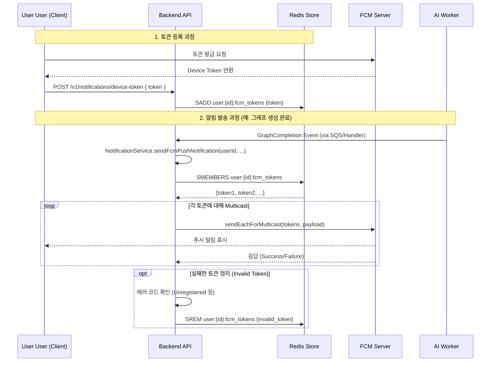

# FCM Notification Architecture & Flow Guide

> **개요**: GraphNode의 모바일 및 웹 푸시 알림을 위한 FCM(Firebase Cloud Messaging) 통합 구조와 흐름을 설명합니다.

---

## 1. 아키텍처 개요

기존의 **SSE(Server-Sent Events) 방식은 웹 브라우저가 열려있을 때만 수신 가능**하다는 한계가 있었습니다. 모바일 앱 지원과 오프라인 알림 수신을 위해 **FCM(Firebase Cloud Messaging)**을 도입하였습니다.

### 주요 컴포넌트

1.  **Client (Mobile/Web)**
    *   FCM SDK를 통해 디바이스 토큰(Registration Token)을 발급받습니다.
    *   로그인 시 백엔드 API (`POST /v1/notifications/device-token`)로 토큰을 전송합니다.
2.  **Backend (NotificationService)**
    *   `Redis`를 사용하여 사용자 ID와 FCM 토큰을 매핑하여 저장합니다.
    *   `firebase-admin` SDK를 통해 Google FCM 서버로 메시지 발송 요청을 보냅니다.
3.  **Redis (Token Store)**
    *   Key: `user:{userId}:fcm_tokens` (Set 구조)
    *   TTL: 60일 (앱 접속 시마다 갱신)
4.  **FCM Server (Google)**
    *   실제 디바이스로 푸시 알림을 전송합니다.
    *   토큰 유효성 검증 결과를 백엔드로 반환하여, 만료된 토큰을 정리할 수 있게 합니다.

---

## 2. 데이터 흐름 (Data Flow)

---

## 3. 구현 상세 (Implementation)

### A. 환경 변수 설정 (권장: Infisical / Secret Manager)
운영 환경(Infisical, AWS Secrets Manager)에서는 파일 관리보다 **JSON 문자열 자체를 환경변수로 주입**하는 것이 안전하고 편리합니다.

*   **Option 1 (Recommended)**: `FIREBASE_CREDENTIALS_JSON`
    *   서비스 계정 키 JSON 파일의 **내용(Content)**을 그대로 환경변수에 복사해 넣습니다.
    *   Infisical 사용 시: Secret Value에 JSON 전체를 붙여넣으세요.
*   **Option 2 (File Path)**: `GOOGLE_APPLICATION_CREDENTIALS`
    *   키 파일이 저장된 **경로**를 지정합니다. (로컬 개발용)
    *   예: `/app/secrets/service-account.json`

> `NotificationService.ts`는 `FIREBASE_CREDENTIALS_JSON`이 있으면 이를 우선 파싱하여 사용하고, 없으면 `GOOGLE_APPLICATION_CREDENTIALS` 경로의 파일을 찾습니다.

### B. 주요 엔드포인트
*   `POST /v1/notifications/device-token`: 토큰 등록. 로그인 직후 또는 토큰 갱신 시 호출.
*   `DELETE /v1/notifications/device-token`: 토큰 삭제. 로그아웃 시 호출.

### C. 에러 처리
`NotificationService`는 FCM 전송 후 응답을 분석하여 다음 에러 코드가 발생한 토큰을 **자동으로 Redis에서 삭제**합니다:
*   `messaging/invalid-registration-token`
*   `messaging/registration-token-not-registered`

---

## 4. 레거시 시스템 호환성
*   기존 `/v1/notifications/stream` (SSE) 엔드포인트는 유지되지만, **웹 프론트엔드 전용** 또는 **실시간성(지연 없는)**이 매우 중요한 기능(예: 채팅 타이핑 인디케이터)에만 제한적으로 사용하는 것을 권장합니다.
*   일반적인 알림(작업 완료, 채팅 수신 등)은 FCM으로 통합하는 것이 확장성 면에서 유리합니다.
