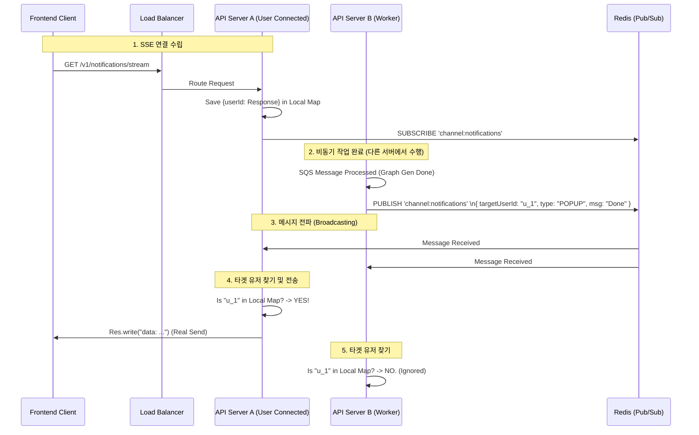

# SSE (Server-Sent Events) 아키텍처 및 구현 가이드

## 1. 개요

Server-Sent Events(SSE)는 서버에서 클라이언트로 실시간 데이터를 전송하기 위한 단방향 통신 프로토콜입니다. 웹소켓보다 가볍고 HTTP 표준을 준수하므로, "작업 완료 알림"과 같은 서버 주도형 이벤트에 적합합니다.

본 프로젝트에서는 **그래프 생성 완료 알림** 및 **AI 에이전트 스트리밍**에 SSE를 사용합니다.

---

## 2. 확장성을 고려한 아키텍처 (Gateway Pattern)

단일 서버 환경에서는 메모리에 연결(Response 객체)을 저장해도 되지만, **AWS Autocaling (수평 확장)** 환경에서는 사용자가 어느 서버에 연결되어 있는지 알 수 없습니다. 이를 해결하기 위해 **Redis Pub/Sub**을 활용한 브로드캐스팅 방식을 채택합니다.

### 아키텍처 다이어그램



### 주요 컴포넌트 역할

1.  **NotificationService (Core/Infra)**
    - **역할**: SSE 연결 관리 및 이벤트 전송의 허브.
    - **Local Map**: `Map<UserId, Express.Response>` 형태로 현재 이 서버 인스턴스에 물리적으로 연결된 사용자 관리.
    - **Redis Subscriber**: Redis 채널을 구독하고 있다가, 메시지가 오면 Local Map을 검색하여 실제 전송 수행.
    - **Zombie Connection 방지**: 클라이언트 연결이 끊기면(`req.on('close')`) 즉시 Map에서 제거하여 메모리 누수 방지.

2.  **Redis Pub/Sub**
    - **역할**: 서버 간 메시지 버스(Message Bus).
    - 모든 서버 인스턴스는 동일한 `notification` 채널을 구독합니다.
    - 알림을 보내고 싶은 서버(Worker)는 Redis에 **Publish**만 하면 됩니다.

---

## 3. FE 협업 가이드 (Front-end Integration)

### 3.1 연결 방법

클라이언트는 `EventSource` API를 사용하여 연결합니다.

```javascript
// 연결 (쿠키 인증 포함)
const eventSource = new EventSource('/v1/notifications/stream', {
  withCredentials: true,
});

eventSource.onopen = () => {
  console.log('SSE 연결 성공');
};

eventSource.onerror = (err) => {
  console.error('SSE 연결 끊김, 재연결 시도 중...');
  // EventSource는 자동으로 재연결을 시도합니다.
};
```

### 3.2 이벤트 수신

서버는 표준 포맷 (`event: ... \n data: ...`)으로 메시지를 보냅니다. 특정 이벤트 타입(`completed`, `error` 등)을 리스닝해야 합니다.

```javascript
// 1. 작업 완료 알림 (그래프 생성 등)
eventSource.addEventListener('job_completed', (e) => {
  const data = JSON.parse(e.data);
  // data: { type: 'GRAPH_GEN', status: 'success', taskId: '...', timestamp: 123456789 }

  showPopup(`그래프 생성이 완료되었습니다!`);
  refreshGraphData(); // 데이터 새로고침
});

// 2. 일반 알림
eventSource.addEventListener('message', (e) => {
  // 기본 메시지 처리
});
```

### 3.3 주의 사항

- **재연결(Reconnection)**: 네트워크 불안정 등으로 연결이 끊기면 브라우저가 자동 재접속을 시도합니다. 이때 서버는 인증을 다시 수행합니다.
- **Heartbeat**: 서버는 연결 유지를 위해 주기적으로(예: 30초) 빈 주석(`: keep-alive`)을 보낼 수 있습니다. 이는 무시해도 됩니다.
