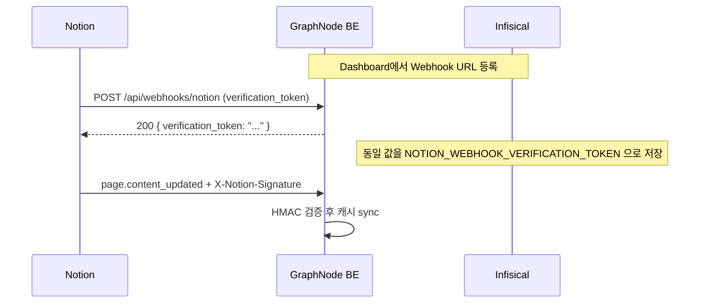
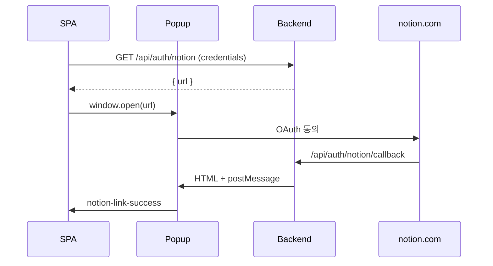

# Notion 연동 — FE 팀 핸드오프

> **이 문서 하나로 시작하세요.**  
> API 계약·스키마·BE 운영 문서로 바로 이동할 수 있도록 링크를 모았습니다.  
> 마지막 갱신: 2026-05-27

---

## 목차

1. [한 줄 요약](#1-한-줄-요약)
2. [문서·리소스 맵](#2-문서리소스-맵)
3. [FE가 할 일 / 하지 말 일](#3-fe가-할-일--하지-말-일)
4. [환경 변수 — FE vs BE](#4-환경-변수--fe-vs-be)
5. [웹훅 토큰 (`NOTION_WEBHOOK_VERIFICATION_TOKEN`)](#5-웹훅-토큰-notion_webhook_verification_token)
6. [연결 플로우 (OAuth)](#6-연결-플로우-oauth)
7. [API 레퍼런스](#7-api-레퍼런스)
8. [그래프·UI 필드](#8-그래프ui-필드)
9. [에러 처리](#9-에러-처리)
10. [제한·미구현 (갭)](#10-제한미구현-갭)
11. [QA 체크리스트](#11-qa-체크리스트)
12. [BE 로컬 검증 상태](#12-be-로컬-검증-상태)
13. [문의·담당](#13-문의담당)

---

## 1. 한 줄 요약

| 항목 | 내용 |
|------|------|
| **FE SDK** | **없음** — `@notionhq/client`·Notion API Key를 FE에 넣지 않습니다 |
| **연동 방식** | 로그인 후 `GET /api/auth/notion` → 팝업 OAuth → `postMessage` |
| **데이터 반영** | Notion 페이지 수정 → **BE 웹훅** → Mongo 캐시 → `POST /v1/graph-ai/generate` 시 자동 포함 |
| **웹훅·시크릿** | **BE(Infisical) 전용** — FE env에 Notion 시크릿 불필요 |

---

## 2. 문서·리소스 맵

### FE 필수

| 문서 | 설명 |
|------|------|
| **이 문서** | 통합 핸드오프 (목차·env·웹훅·API) |
| [notion-fe-integration.md](./notion-fe-integration.md) | 구현 상세·코드 스니펫·시퀀스 다이어그램 |
| [OpenAPI Redoc](../../api/openapi.html) | 브라우저 API 탐색 — 검색: `notion` |
| [openapi.yaml](../../api/openapi.yaml) | 계약 원본 — `/api/auth/notion`, `/api/webhooks/notion` |
| [ERRORS.md](../../architecture/ERRORS.md) | RFC 9457 Problem Details |

### 스키마·예시

| 리소스 | 용도 |
|--------|------|
| [graph-node.json](../../schemas/graph-node.json) | 노드 `sourceType`: `"chat"` \| `"markdown"` \| `"notion"` |
| [graph-summary.json](../../schemas/graph-summary.json) | `overview.total_notions` |
| [notion-oauth-start.json](../../api/examples/notion-oauth-start.json) | `GET /api/auth/notion` 응답 예시 |
| [notion-oauth-callback-ok.json](../../api/examples/notion-oauth-callback-ok.json) | callback JSON 디버그 예시 |

### BE·운영 (참고만)

| 문서 | FE가 볼 섹션 |
|------|----------------|
| [notion-integration.md](./notion-integration.md) | [§5 환경 변수](./notion-integration.md#5-환경-변수), [§6 Notion Dashboard](./notion-integration.md#6-notion-developer-dashboard), [§9 제한](./notion-integration.md#9-제한-현재-페이즈) |
| [integrations README](./README.md) | 연동 인덱스·공식 Notion 문서 링크 |
| [20260524 데일리](../Daily/20260524-notion-oauth-webhook-cache.md) | BE 변경 이력 |

### OAuth UX 참고 (Google과 동일 패턴)

| 문서 | 설명 |
|------|------|
| [AUTH_JWT.md](../../architecture/AUTH_JWT.md) | 소셜 로그인·쿠키 — Notion **연동**은 로그인 후 별도 플로우 |

### Notion 공식 (BE가 호출, FE는 참고)

| 링크 | 내용 |
|------|------|
| [Authorization](https://developers.notion.com/docs/authorization) | Public Integration OAuth |
| [Webhooks](https://developers.notion.com/reference/webhooks) | 구독·서명·`verification_token` |
| [My Integrations](https://www.notion.so/my-integrations) | Dashboard (BE 팀이 URL 등록) |

---

## 3. FE가 할 일 / 하지 말 일

### ✅ FE가 구현

- GraphNode **로그인 완료** 후 “Notion 연결” UI
- `fetch(..., { credentials: 'include' })` 로 `GET /api/auth/notion`
- `window.open(url)` 팝업 + `postMessage` (`notion-link-success` / `oauth-error`)
- 그래프 생성·조회 UI에서 `sourceType: "notion"`, `total_notions` 표시

### ❌ FE가 하지 않음

| 하지 말 것 | 이유 |
|------------|------|
| `@notionhq/client` / Notion REST 직접 호출 | 토큰·웹훅은 BE만 보유 |
| `POST /api/webhooks/notion` 호출 | Notion 서버 → BE 전용 |
| FE `.env`에 `OAUTH_NOTION_*`, `NOTION_WEBHOOK_*` | 서버 시크릿 유출 위험 |
| `/dev/test/notion/*` | 로컬 BE QA 전용 |

---

## 4. 환경 변수 — FE vs BE

### FE `.env` / Infisical

**Notion 관련 변수 없음.**  
기존처럼 `API_BASE`(또는 프록시)만 있으면 됩니다.

### BE Infisical / 서버 (FE는 값을 몰라도 됨)

| 변수 | 필수 | 설명 |
|------|------|------|
| `OAUTH_NOTION_CLIENT_ID` | OAuth 시 | Notion Public Integration Client ID |
| `OAUTH_NOTION_CLIENT_SECRET` | OAuth 시 | Client secret |
| `OAUTH_NOTION_REDIRECT_URI` | OAuth 시 | 예: `https://api.<domain>/api/auth/notion/callback` — Dashboard와 **완전 일치** |
| `NOTION_WEBHOOK_VERIFICATION_TOKEN` | 프로덕션 웹훅 | [§5](#5-웹훅-토큰-notion_webhook_verification_token) 참고 |

> 세 변수(`OAUTH_NOTION_*`)가 하나라도 비어 있으면 `/api/auth/notion` 라우트가 **마운트되지 않아** FE는 **404**를 받습니다 → “준비 중” UI 처리.

참고: [notion-integration.md §5](./notion-integration.md#5-환경-변수), [`.env.example`](../../../.env.example) (레포 루트)

---

## 5. 웹훅 토큰 (`NOTION_WEBHOOK_VERIFICATION_TOKEN`)

### FE가 알아둘 것

- 웹훅은 **Notion → GraphNode BE** 직통입니다. **FE 코드·FE env와 무관**합니다.
- 로컬 E2E에서 `NOTION_WEBHOOK_VERIFICATION_TOKEN 없음 — skip` 로그가 나오는 것은 **시크릿 미설정 시 개발용** 동작입니다. **스테이징/프로덕션에서는 BE가 반드시 설정**합니다.

### BE 팀이 하는 설정 (1회)



| 단계 | 주체 | 작업 |
|------|------|------|
| 1 | BE | [Notion My Integrations](https://www.notion.so/my-integrations) → Webhooks → URL: `https://api.<domain>/api/webhooks/notion` |
| 2 | Notion | 구독 생성·Verify 시 **`verification_token` 1회** 전달 |
| 3 | BE | Infisical에 `NOTION_WEBHOOK_VERIFICATION_TOKEN=<그 값>` 저장 |
| 4 | Notion | 이후 이벤트마다 `X-Notion-Signature: sha256=<hmac>` |

### 토큰 종류 정리 (헷갈림 방지)

| 이름 | 어디에 | 누가 씀 |
|------|--------|---------|
| `verification_token` (body, 1회) | Notion → BE (구독 활성화) | BE가 echo — FE 무관 |
| `NOTION_WEBHOOK_VERIFICATION_TOKEN` | BE env | HMAC 서명 검증 |
| OAuth `access_token` | PostgreSQL `notion_integrations` | BE가 Notion API 호출 — **FE 노출 없음** |

OpenAPI: [POST /api/webhooks/notion](../../api/openapi.yaml) (FE 구현 불필요, 계약 참고용)

---

## 6. 연결 플로우 (OAuth)

상세 다이어그램·스니펫: [notion-fe-integration.md §2](./notion-fe-integration.md#2-연결-플로우-권장-팝업--postmessage)



### postMessage 성공 payload

```json
{
  "type": "notion-link-success",
  "ok": true,
  "integrationId": "uuid",
  "notionWorkspaceId": "workspace-uuid",
  "notionWorkspaceName": "My Workspace"
}
```

### 최소 구현 스니펫

```ts
const res = await fetch(`${API_BASE}/api/auth/notion`, { credentials: 'include' });
if (res.status === 401) { /* 로그인 유도 */ }
if (res.status === 404) { /* Notion 미설정 — 준비 중 */ }
const { url } = await res.json();
window.open(url, 'notion-oauth', 'width=500,height=700');

window.addEventListener('message', (event) => {
  if (event.data?.type === 'notion-link-success') {
    const { integrationId, notionWorkspaceId, notionWorkspaceName } = event.data;
    // 연결됨 UI
  }
  if (event.data?.type === 'oauth-error') {
    // 기존 Google/Apple과 동일
  }
});
```

---

## 7. API 레퍼런스

### FE가 호출하는 API

| 메서드 | 경로 | 인증 | 문서 |
|--------|------|------|------|
| `GET` | `/api/auth/notion` | 쿠키 `access_token` | [OpenAPI](../../api/openapi.yaml) · [예시](../../api/examples/notion-oauth-start.json) |
| `GET` | `/api/auth/notion/callback` | Notion redirect (팝업) | [OpenAPI](../../api/openapi.yaml) · [예시](../../api/examples/notion-oauth-callback-ok.json) |
| `POST` | `/v1/graph-ai/generate` | 쿠키 | Notion body **없음** — BE가 캐시 자동 포함 |

**Query**

| API | Query | 설명 |
|-----|-------|------|
| `/api/auth/notion` | `redirect=true` | JSON 대신 302 → Notion |

### FE가 호출하지 않는 API

| 메서드 | 경로 | 비고 |
|--------|------|------|
| `POST` | `/api/webhooks/notion` | Notion → BE — [OpenAPI](../../api/openapi.yaml) 참고만 |

---

## 8. 그래프·UI 필드

| API / 모델 | 필드 | 스키마 |
|------------|------|--------|
| Graph node | `sourceType: "notion"` | [graph-node.json](../../schemas/graph-node.json) |
| Graph summary `overview` | `total_notions: number` | [graph-summary.json](../../schemas/graph-summary.json) |
| Generate | (body에 Notion 필드 없음) | 캐시 1건 이상이면 Notion만으로도 생성 가능 |

연결 후 데이터가 그래프에 보이기까지: Notion 페이지 수정 → 웹훅·캐시 갱신(수 분 지연 가능) → 사용자가 **그래프 재생성**.

---

## 9. 에러 처리

| HTTP | 의미 | FE 처리 |
|------|------|---------|
| `401` | 미로그인 | 로그인 페이지 |
| `404` | `OAUTH_NOTION_*` 미설정 | “Notion 연동 준비 중” |
| `400` | state/code 오류 | 연결 재시도 |
| `502` | Notion upstream | 토스트 + 재시도 |

형식: [ERRORS.md](../../architecture/ERRORS.md) (RFC 9457)

---

## 10. 제한·미구현 (갭)

| 항목 | 상태 |
|------|------|
| 연동 목록 조회 API | **없음** — 연결 직후 `postMessage`로만 확인 |
| 연동 해제 API | **없음** — 필요 시 BE에 요청 |
| 페이지 → 캐시 | 웹훅 기반, **지연 가능** |
| 이미지·파일 블록 | 텍스트만; **S3 미디어 미러 없음** |

BE 상세: [notion-integration.md §9](./notion-integration.md#9-제한-현재-페이즈)

---

## 11. QA 체크리스트

- [ ] 비로그인 `GET /api/auth/notion` → `401`
- [ ] 로그인 후 연결 → `notion-link-success` postMessage
- [ ] 모든 BE 요청에 `credentials: 'include'`
- [ ] `OAUTH_NOTION_*` 없는 환경 → `404` “준비 중”
- [ ] Notion 페이지 수정 후 (수 분) 그래프 재생성 → `sourceType: "notion"` 또는 `total_notions > 0`

---

## 12. BE 로컬 검증 상태

| 항목 | 스크립트 / API | 상태 (2026-05-27) |
|------|----------------|-------------------|
| OAuth + PG | 수동 / `notion-integration-test.sh` | ✅ |
| 웹훅 → 캐시 | `scripts/notion-webhook-e2e.sh` | ✅ |
| `notions.json` 번들 | `scripts/notion-graph-generation-e2e.sh` | ✅ (`source_type: notion`) |
| 실제 SQS generate | `POST /v1/graph-ai/generate` + 워커 | 스테이징에서 별도 검증 |

---

## 13. 문의·담당

| 주제 | 담당 |
|------|------|
| Notion Dashboard Redirect / Webhook URL | BE 팀 |
| Infisical `OAUTH_NOTION_*`, `NOTION_WEBHOOK_VERIFICATION_TOKEN` | BE / DevOps |
| API 계약 변경 | `openapi.yaml` PR → FE changelog |

---

## 빠른 링크 모음

| | |
|---|---|
| 📘 FE 구현 상세 | [notion-fe-integration.md](./notion-fe-integration.md) |
| 🔧 BE·운영 | [notion-integration.md](./notion-integration.md) |
| 📑 연동 인덱스 | [integrations/README.md](./README.md) |
| 🌐 OpenAPI UI | [openapi.html](../../api/openapi.html) |
| 📄 OpenAPI YAML | [openapi.yaml](../../api/openapi.yaml) |
| ⚠️ 에러 스펙 | [ERRORS.md](../../architecture/ERRORS.md) |
| 📊 graph-node | [graph-node.json](../../schemas/graph-node.json) |
| 📊 graph-summary | [graph-summary.json](../../schemas/graph-summary.json) |
