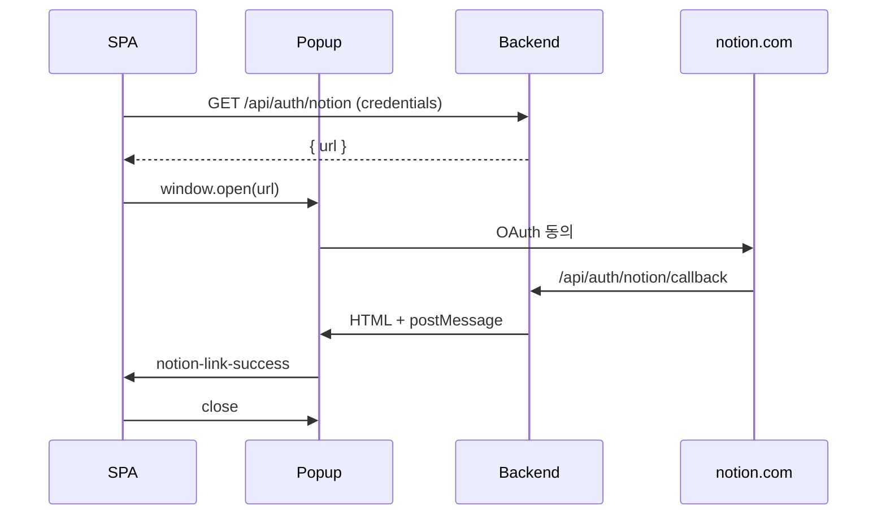

# Notion 연동 — 프론트엔드 가이드

> **📌 FE 팀 시작 문서 (링크·env·웹훅 통합):** [notion-fe-handoff.md](./notion-fe-handoff.md)  
> 이 문서는 구현 상세·스니펫 위주입니다. BE·DB·웹훅: [notion-integration.md](./notion-integration.md)

## 변경 요약 (구 Internal Token 방식 → OAuth)

| 이전 (FE 직접) | 현재 (BE 주도) |
|----------------|----------------|
| 사용자가 Notion Integration Secret 붙여넣기 | **로그인 후** “Notion 연결” 버튼 |
| FE가 Notion API 직접 호출 | BE가 OAuth·웹훅·캐시 처리 |
| — | 그래프 생성 시 `sourceType: "notion"` 노드 자동 반영 |

**FE에 Notion API Key / `@notionhq/client` 를 넣지 마세요.**

---

## 1. 필수 선행 조건

- 사용자는 **GraphNode 로그인 완료** (`access_token` HttpOnly 쿠키)
- 모든 BE 요청: `fetch(..., { credentials: 'include' })`
- 배포 환경에 BE 팀이 `OAUTH_NOTION_*` 설정 완료 (없으면 `/api/auth/notion` → 404)

---

## 2. 연결 플로우 (권장: 팝업 + postMessage)

Google OAuth와 동일한 UX 패턴입니다.



### Step A — authorize URL 받기

```http
GET /api/auth/notion
Cookie: access_token=...
```

**200 OK**

```json
{
  "url": "https://api.notion.com/v1/oauth/authorize?..."
}
```

| Query | 설명 |
|-------|------|
| `redirect=true` | JSON 대신 **302**로 Notion으로 바로 이동 (전체 페이지 리다이렉트용) |

### Step B — 팝업 열기

```ts
const res = await fetch(`${API_BASE}/api/auth/notion`, { credentials: 'include' });
const { url } = await res.json();
const popup = window.open(url, 'notion-oauth', 'width=500,height=700');
```

### Step C — postMessage 수신

Callback 기본 응답은 **HTML** (Google OAuth와 동일). 팝업이 닫히며 opener에 메시지를 보냅니다.

```ts
window.addEventListener('message', (event) => {
  if (event.data?.type === 'notion-link-success') {
    const { integrationId, notionWorkspaceId, notionWorkspaceName } = event.data;
    // UI: "연결됨: {notionWorkspaceName}"
  }
  if (event.data?.type === 'oauth-error') {
    // 공통 에러 핸들러 (기존 Google/Apple과 동일 패턴)
  }
});
```

**postMessage payload 예시**

```json
{
  "type": "notion-link-success",
  "ok": true,
  "integrationId": "uuid",
  "notionWorkspaceId": "workspace-uuid",
  "notionWorkspaceName": "My Workspace"
}
```

디버깅용 JSON만 필요하면:  
`GET /api/auth/notion/callback?...&format=json` (브라우저 수동 호출용, 일반 UI에서는 사용 안 함)

### Step D — 연결 후 데이터 반영 시점

- Notion에서 페이지를 수정하면 BE 웹훅이 **수 분 내** 캐시를 갱신합니다 (Notion aggregation 참고).
- 사용자가 **그래프 생성** (`POST /v1/graph-ai/generate`)을 실행하면 캐시된 Notion 페이지가 bundle에 포함됩니다.
- 그래프 조회 API의 노드 `sourceType` 에 `"notion"` 이 포함될 수 있습니다 ([graph-node 스키마](../../schemas/graph-node.json)).

---

## 3. 에러 처리 (RFC 9457)

| HTTP | 의미 | FE 처리 |
|------|------|---------|
| `401` | 미로그인 | 로그인 페이지로 |
| `404` | Notion 미설정 서버 | “준비 중” 안내 |
| `400` | state/code 오류 | 연결 재시도 |
| `502` | Notion API upstream | 토스트 + 재시도 |

Problem Details 형식: [ERRORS.md](../../architecture/ERRORS.md)

---

## 4. 그래프·요약 UI

| API | Notion 관련 필드 |
|-----|------------------|
| `POST /v1/graph-ai/generate` | 별도 body 없음 — BE가 캐시 자동 포함 |
| Graph summary `overview` | `total_notions` (number) — [graph-summary.json](../../schemas/graph-summary.json) |
| Graph node | `sourceType: "notion"` — [graph-node.json](../../schemas/graph-node.json) |

Notion만 있고 대화/노트/파일이 없어도 그래프 생성이 **가능**합니다 (캐시 1건 이상).

---

## 5. OpenAPI · 예시

통합 링크: [notion-fe-handoff.md §2](./notion-fe-handoff.md#2-문서리소스-맵)

| 문서 | 링크 |
|------|------|
| **OpenAPI Redoc** | [openapi.html](../../api/openapi.html) → `Notion` 검색 |
| **openapi.yaml** | [openapi.yaml](../../api/openapi.yaml) — `/api/auth/notion` |
| **예시 JSON** | [notion-oauth-start.json](../../api/examples/notion-oauth-start.json), [notion-oauth-callback-ok.json](../../api/examples/notion-oauth-callback-ok.json) |

---

## 6. FE가 보지 않아도 되는 것

- `POST /api/webhooks/notion` — Notion 서버 → BE 전용
- `notion_integrations` / `notion_page_caches` — DB 직접 접근 없음
- Notion REST API / SDK — BE 내부 (`NotionApiClient`)

---

## 7. 체크리스트 (QA)

- [ ] 로그인 없이 `/api/auth/notion` → 401
- [ ] 로그인 후 연결 → postMessage `notion-link-success`
- [ ] Notion 페이지 편집 후 (수 분 대기) 그래프 재생성 → `notion` 노드 또는 `total_notions > 0`
- [ ] 쿠키 `credentials: 'include'` 누락 시 실패하지 않는지 확인

---

## 8. 로컬에서 BE 기능 테스트 (백엔드·QA)

프론트 없이 OAuth·캐시만 검증:

```bash
npm run db:up
# .env: OAUTH_NOTION_* + ENABLE_TEST_LOGIN=true
npx prisma migrate deploy
npm run dev   # 다른 터미널

export NOTION_PAGE_ID=<연동한-Notion-페이지-UUID>
bash scripts/notion-integration-test.sh
```

웹훅 없이 페이지 동기화: `POST /dev/test/notion/sync-page` (개발 전용).  
상세: [notion-integration.md](./notion-integration.md) § 로컬 테스트.

---

## 9. 문의

- Redirect URI / Webhook URL / Integration 생성 권한: **BE 팀장**
- API 계약 변경: `docs/api/openapi.yaml` PR + FE에 changelog 공유
