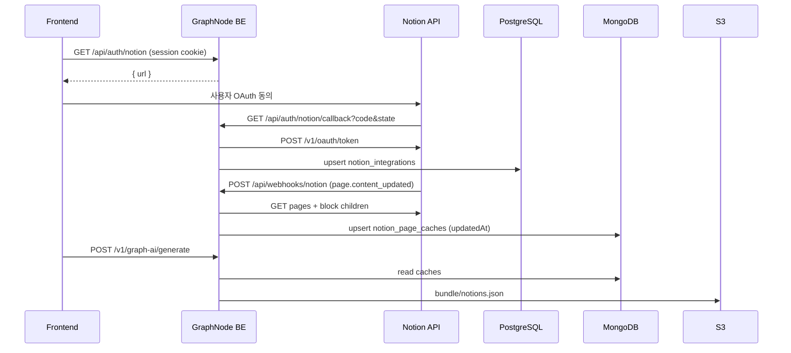

# Notion 연동 — 백엔드·운영 가이드

> 마지막 갱신: 2026-05-24  
> FE 연동: [notion-fe-handoff.md](./notion-fe-handoff.md) · [notion-fe-integration.md](./notion-fe-integration.md)

## 1. 아키텍처



## 2. 데이터 저장소

| 저장소 | 테이블/컬렉션 | 용도 |
|--------|----------------|------|
| PostgreSQL | `notion_integrations` | 워크스페이스별 `access_token` (1 user : N workspace) |
| MongoDB | `notion_page_caches` | 페이지 블록 트리·`plainText`·`updatedAt` |
| S3 | `graph-generation/{taskId}/notions.json` | Macro AI 입력 (캐시 스냅샷) |

스키마 상세: `prisma/schema.prisma` (`NotionIntegration`), `src/core/types/persistence/notion_cache.persistence.ts`.

## 3. HTTP API (서버 구현)

| 메서드 | 경로 | 인증 |
|--------|------|------|
| `GET` | `/api/auth/notion` | 로그인 쿠키 (`access_token`) |
| `GET` | `/api/auth/notion/callback` | Notion redirect (state HMAC) |
| `POST` | `/api/webhooks/notion` | `X-Notion-Signature` (선택) |

OpenAPI: `docs/api/openapi.yaml` — 위 경로 검색.

## 4. 코드 맵 (BE)

| 역할 | 경로 |
|------|------|
| OAuth URL / token | `src/infra/notion/NotionApiClient.ts` |
| 웹훅·캐시·트리 | `src/core/services/NotionService.ts` |
| 텍스트 블록 파서 | `src/core/services/notion/NotionBlockParser.ts` |
| Graph bundle | `src/core/services/GraphGenerationService.ts` (`streamNotionPages`) |
| 라우터 | `src/app/routes/AuthNotionRouter.ts`, `NotionWebhookRouter.ts` |
| DI | `src/bootstrap/modules/notion.module.ts`, `container.ts` |

## 5. 환경 변수

```env
OAUTH_NOTION_CLIENT_ID=
OAUTH_NOTION_CLIENT_SECRET=
OAUTH_NOTION_REDIRECT_URI=https://api.<domain>/api/auth/notion/callback
NOTION_WEBHOOK_VERIFICATION_TOKEN=
```

미설정 시 Notion 라우트는 **마운트되지 않습니다**.

## 6. Notion Developer Dashboard

1. [My Integrations](https://www.notion.so/my-integrations) → Public integration
2. **OAuth Domain & URIs** — `OAUTH_NOTION_REDIRECT_URI` 와 동일하게 등록
3. **Webhooks** — `https://api.<domain>/api/webhooks/notion`, 이벤트 `page.content_updated` 등
4. 구독 생성 시 수신한 `verification_token` → `NOTION_WEBHOOK_VERIFICATION_TOKEN`
5. Integration 권한·워크스페이스 접근은 **팀 정책에 따라 BE 팀장과 협의**

## 7. 공식 API 참고 (우리가 호출하는 엔드포인트)

| 용도 | Notion API |
|------|------------|
| OAuth authorize | `GET https://api.notion.com/v1/oauth/authorize` |
| Token exchange | `POST https://api.notion.com/v1/oauth/token` (Basic auth) |
| Page | `GET /v1/pages/{page_id}` |
| Blocks | `GET /v1/blocks/{block_id}/children` (페이지네이션) |
| Webhook 검증 | [Webhooks reference](https://developers.notion.com/reference/webhooks) |

헤더: `Authorization: Bearer <access_token>`, `Notion-Version: 2022-06-28`

## 8. 마이그레이션

```bash
npx prisma migrate deploy
# 로컬: npx prisma migrate dev
```

`prisma/migrations/20260524120000_notion_integration/`

## 9. 제한 (현재 페이즈)

- 블록 파싱: **텍스트 계열**만 (paragraph, heading, list, quote, callout, toggle 등)
- **이미지·파일·PDF·embed 블록**: 본문 텍스트로 넣지 않음. **Notion 미디어 S3 미러링은 범위 밖(구현 안 함)**
- FE용 “연동 목록 조회” API: 아직 없음 (callback `postMessage` payload로 1회성 확인)

## 10. 로컬 테스트

### 사전 준비

1. [Notion My Integrations](https://www.notion.so/my-integrations)에서 Public integration 생성
2. `.env` 설정:

```env
OAUTH_NOTION_CLIENT_ID=...
OAUTH_NOTION_CLIENT_SECRET=...
OAUTH_NOTION_REDIRECT_URI=http://localhost:3000/api/auth/notion/callback
NOTION_WEBHOOK_VERIFICATION_TOKEN=...   # 웹훅 테스트 시
ENABLE_TEST_LOGIN=true
TEST_LOGIN_SECRET=test-login-secret-for-local-dev-only-min-32chars
```

3. Notion 대시보드 Redirect URI에 `http://localhost:3000/api/auth/notion/callback` 등록

### 자동 스크립트

```bash
npm run db:up
npx prisma migrate deploy
npm run dev

# 연동할 Notion 페이지 ID (URL의 UUID)
export NOTION_PAGE_ID=xxxxxxxx-xxxx-xxxx-xxxx-xxxxxxxxxxxx
bash scripts/notion-integration-test.sh
```

### 개발 전용 API (`NODE_ENV !== production`)

| 메서드 | 경로 | 용도 |
|--------|------|------|
| `GET` | `/dev/test/notion/env` | env·라우트 활성 여부 |
| `GET` | `/dev/test/notion/integrations/:userId` | 연동된 워크스페이스 목록 |
| `POST` | `/dev/test/notion/sync-page` | `{ userId, pageId }` — 웹훅 없이 캐시 upsert |
| `GET` | `/dev/test/notion/cache/:userId/:pageId` | Mongo 캐시 메타 조회 |
| `POST` | `/dev/test/notion/simulate-webhook` | `{ workspaceId, pageId, type? }` — 서비스 레이어 웹훅 처리 |
| `GET` | `/dev/test/notion/notions-bundle/:userId` | `notions.json` payload 미리보기 (generate 시 S3 업로드 전과 동일 JSON) |

### E2E 스크립트

```bash
export NOTION_TEST_USER_ID=<oauth-완료-userId>
export NOTION_PAGE_ID=<page-uuid>
infisical run -- bash scripts/notion-webhook-e2e.sh
infisical run -- bash scripts/notion-graph-generation-e2e.sh
```

웹훅: Notion에서 페이지 수정 후 `notion-webhook-e2e.sh` 실행 시 `updatedAt` 변화 확인.  
그래프: `notion-graph-generation-e2e.sh`는 macro용 `source_type: notion` JSON만 검증 (S3 별도 테스트 아님).  
ngrok 실구독은 웹훅 스크립트 하단 안내 참고.

### 웹훅 로컬 테스트 (선택)

Notion은 HTTPS 공개 URL이 필요합니다.

```bash
ngrok http 3000
# Dashboard Webhook URL: https://<ngrok>/api/webhooks/notion
```

### FE 팝업 테스트

1. 로그인된 SPA에서 `GET /api/auth/notion` → `window.open(url)`
2. 연동 완료 후 `postMessage` `notion-link-success` 수신 확인

---

## 11. 관련 데일리 로그

- [20260524-notion-oauth-webhook-cache.md](../Daily/20260524-notion-oauth-webhook-cache.md)
