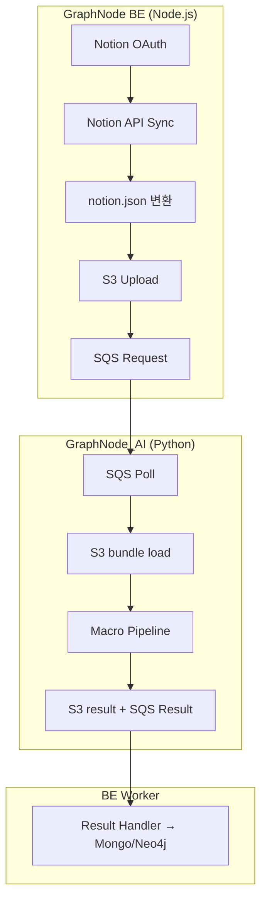
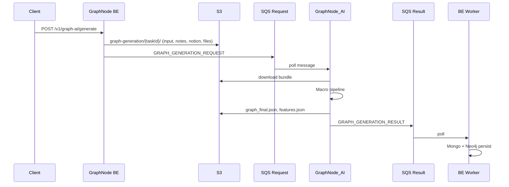

# Notion 연동 — AI 팀 통합 작업 가이드

> **작성일**: 2026-05-31  
> **작성**: Backend (GraphNode_BE)  
> **대상**: AI 팀 (GraphNode_AI / `worker.py` Macro·AddNode 파이프라인)  
> **버전**: v1.0 — AI 팀 단일 참조 문서 (입력·출력·SQS·스키마·체크리스트 통합)

---

## 0. AI 팀 Quick Start (30초 요약)

```
1. SQS Request Queue에서 GRAPH_GENERATION_REQUEST 수신
2. payload.s3Key prefix에서 S3 bundle 다운로드
3. notion.json 있으면 source_nodes[] 로드 (없으면 Notion 0건 — 정상)
4. chat(input.json) + markdown(notes.json) + notion source_nodes → Macro loader 합류
5. graph_final.json / features.json 업로드 + GRAPH_GENERATION_RESULT SQS 발행
6. orig_id = source_nodes[].id (Notion page UUID) 절대 변경 금지, source_type = "notion"
```

| AI 팀이 할 일 | AI 팀이 하지 않을 일 |
|---|---|
| S3 `notion.json` 파싱 + Macro 파이프라인 통합 | Notion OAuth / Notion API 직접 호출 |
| `source_type: "notion"` 노드 출력 | BE HTTP API (`/v1/notion/*`) 호출 |
| `orig_id` 보존 | `notion_1_xxx` 등 ID 재생성 |

**BE 구현 상태 (2026-05-31)**: Notion sync·`notion.json` S3 업로드 **미구현**.  
AI 팀은 **§13 샘플 `notion.json`** 으로 선행 개발 가능. BE `notion_pages` + resolver 완료 전 E2E는 Notion 노드 저장 실패 가능.

---

## 1. 역할 분담 (BE vs AI)



| 책임 | BE | AI |
|---|---|---|
| Notion OAuth·access token | ✅ | ❌ |
| Notion API 호출 (search, pages, markdown) | ✅ | ❌ |
| `tree.nodes[]` + `source_nodes[]` 생성 | ✅ | ❌ |
| S3 `notion.json` 업로드 | ✅ (예정) | ❌ |
| SQS `GRAPH_GENERATION_REQUEST` 발행 | ✅ | ❌ |
| S3 bundle 다운로드·`notion.json` 파싱 | ❌ | ✅ |
| 그래프 생성·임베딩·클러스터링 | ❌ | ✅ |
| `graph_final.json` / `features.json` 업로드 | ❌ | ✅ |
| SQS `GRAPH_GENERATION_RESULT` 발행 | ❌ | ✅ |
| `orig_id` / `source_type` 규칙 준수 | 검증 | **생성** |

---

## 2. Notion API 참고 (BE sync — AI는 호출 안 함)

Notion에는 **워크스페이스 전체를 한 번에 export하는 단일 API가 없습니다**.  
BE가 아래 API를 조합해 `notion.json`을 만듭니다. AI 팀은 **최종 JSON 형식만** 알면 됩니다.

| 목적 | Notion API | 비고 |
|---|---|---|
| 연동된 page/DB 목록 | `POST /v1/search` | query `{}`, cursor 페이지네이션 |
| 페이지 메타 (title, parent) | `GET /v1/pages/{page_id}` | Tree `parent_id` 등 |
| **페이지 본문 (권장)** | `GET /v1/pages/{page_id}/markdown` | BE → `sections[]` 분할 |
| 페이지 본문 (legacy) | `GET /v1/blocks/{page_id}/children` | 1 depth, `has_children` 재귀 |
| DB row | `POST /v1/databases/{id}/query` | row = page object |

**BE sync 알고리즘 (참고)**:

```
OAuth token
  → POST /v1/search (next_cursor 반복)     → page/database ID 목록
  → 각 page: GET /pages/{id}               → tree.nodes[] 메타
  → 각 page: GET /pages/{id}/markdown      → source_nodes[].sections[]
  → database: query rows → page 반복
  → parent_id로 adjacency list 조립
  → S3 notion.json
```

공식 문서:
- [Search](https://developers.notion.com/reference/post-search)
- [Retrieve page as markdown](https://developers.notion.com/reference/retrieve-page-markdown)
- [Working with page content](https://developers.notion.com/guides/data-apis/working-with-page-content)

---

## 3. 데이터 수신 — SQS + S3 (Claim Check)

### 3.1 End-to-end 흐름



### 3.2 수신 경로 비교

| # | 경로 | Notion | AI 수신 방법 | v1 |
|---|---|---|---|---|
| ① | Macro Graph Generation | 예정 | SQS → S3 prefix bundle → `notion.json` | **주 경로** |
| ② | AddNode 배치 | 예정 | SQS → S3 payload `notionPages[]` | 증분 |
| ③ | Microscope Ingest | ❌ | `node_type: note \| conversation` 만 | 해당 없음 |
| ④ | BE REST API | ❌ | `/v1/notion/*` 없음 | 해당 없음 |
| ⑤ | Mongo 직접 | ❌ | `notion_pages` 컬렉션 없음 | 해당 없음 |

### 3.3 SQS Request — `GRAPH_GENERATION_REQUEST`

Source of truth: `src/shared/dtos/queue.ts` (`GraphGenRequestPayload`)

```json
{
  "taskId": "task_user123_01JXXXXXXXXXXXXXXXXXXXXXX",
  "taskType": "GRAPH_GENERATION_REQUEST",
  "timestamp": "2026-05-31T12:00:00.000Z",
  "payload": {
    "userId": "user-12345",
    "s3Key": "graph-generation/task_user123_01JXXXXXXXXXXXXXXXXXXXXXX/",
    "bucket": "graphnode-payload-bucket",
    "includeSummary": true,
    "summaryLanguage": "ko",
    "language": "ko",
    "inputType": "auto",
    "minClusters": 3,
    "maxClusters": 8
  }
}
```

| 필드 | 규칙 |
|---|---|
| `payload.s3Key` | **반드시 `/`로 끝나는 prefix** |
| `payload.inputType` | `"auto"` — prefix 아래 json·files 자동 탐색 |
| `payload.extraS3Keys` | **사용 안 함** (legacy) |
| Notion 전용 taskType | **없음** — 기존 타입 재사용 |

### 3.4 S3 Bundle 구조

```
s3://{bucket}/graph-generation/{taskId}/
├── input.json       # chat — 대화 JSON 배열
├── notes.json       # markdown — {"source_nodes":[...]}
├── notion.json      # notion — 본 문서 §5~§7 (optional, BE 업로드 예정)
└── files/           # user_files 원본
    └── {userFileId}_{displayName}
```

### 3.5 AI Worker 로더 (의사코드)

```python
def load_macro_bundle(bucket: str, prefix: str) -> MacroInputs:
    prefix = prefix if prefix.endswith("/") else prefix + "/"

    chats = download_json(bucket, prefix + "input.json")           # list
    notes_payload = download_json(bucket, prefix + "notes.json")   # dict
    note_nodes = notes_payload.get("source_nodes", [])

    notion_raw = try_download_json(bucket, prefix + "notion.json")  # None OK
    notion_nodes = []
    notion_tree = []
    if notion_raw:
        assert notion_raw.get("schema_version") == "1.0"
        notion_nodes = notion_raw.get("source_nodes", [])
        notion_tree = notion_raw.get("tree", {}).get("nodes", [])

    all_source_nodes = note_nodes + notion_nodes
    # chats → existing conversation loader
    # all_source_nodes → unified SourceNodeLoader (markdown + notion)
    # notion_tree → optional hard-edge / context hint
    return MacroInputs(chats=chats, source_nodes=all_source_nodes, notion_tree=notion_tree)
```

**규칙**:
- `notion.json` **없음** → Notion 0건, 에러 아님
- `notion.json` **있지만 `source_nodes` 빈 배열** → Notion 0건

### 3.6 SQS Result — AI → BE

**성공** (`GraphGenResultPayload`):

```json
{
  "taskId": "task_user123_01JXXXXXXXXXXXXXXXXXXXXXX",
  "taskType": "GRAPH_GENERATION_RESULT",
  "timestamp": "2026-05-31T12:30:00.000Z",
  "payload": {
    "userId": "user-12345",
    "status": "COMPLETED",
    "resultS3Key": "graph-results/.../graph_final.json",
    "featuresS3Key": "graph-results/.../features.json",
    "summaryIncluded": true,
    "summaryS3Key": "graph-results/.../summary.json"
  }
}
```

**실패**:

```json
{
  "taskType": "GRAPH_GENERATION_RESULT",
  "payload": { "userId": "...", "status": "FAILED", "error": "..." }
}
```

**진행률 (선택)** — `GRAPH_GENERATION_PROGRESS`:

```json
{
  "taskType": "GRAPH_GENERATION_PROGRESS",
  "payload": {
    "userId": "...",
    "currentStage": "[2단계] Notion source_nodes 로딩 완료",
    "progressPercent": 35,
    "etaSeconds": 120
  }
}
```

### 3.7 AddNode 배치 (증분, 예정)

SQS: `ADD_NODE_REQUEST`  
S3 payload 확장 (`AiAddNodeBatchRequest`):

```json
{
  "userId": "user-12345",
  "existingClusters": [],
  "conversations": [],
  "notes": [],
  "notionPages": [
    {
      "id": "notion-page-uuid",
      "title": "Updated Page",
      "source_type": "notion",
      "sections": [{ "id": "s0", "content": "..." }],
      "create_time": 1716000000,
      "update_time": 1717100000
    }
  ]
}
```

> AddNode 출력은 현재 `sourceType` 미포함 → BE fallback `chat`. Notion 지원 시 `sourceType: "notion"` 반환 필요.

---

## 4. 입력 스키마 — `notion.json`

### 4.1 최상위

```json
{
  "schema_version": "1.0",
  "integration_id": "550e8400-e29b-41d4-a716-446655440000",
  "workspace_id": "notion-workspace-uuid",
  "workspace_name": "My Workspace",
  "synced_at": "2026-05-31T12:00:00.000Z",
  "tree": { "nodes": [] },
  "source_nodes": []
}
```

| 필드 | 타입 | 필수 | 설명 |
|---|---|:---:|---|
| `schema_version` | string | ✅ | `"1.0"` |
| `integration_id` | string | ✅ | GraphNode Notion 연동 레코드 ID |
| `workspace_id` | string | ✅ | Notion workspace ID |
| `workspace_name` | string | ⬜ | 표시용 |
| `synced_at` | ISO 8601 UTC | ✅ | BE sync 완료 시각 |
| `tree.nodes` | array | ✅ | 계층 메타 (본문 없음) |
| `source_nodes` | array | ✅ | 그래프 ingest 본문 |

### 4.2 `tree.nodes[]` — Adjacency List

Notion sidebar 계층. **본문 없음**, parent-child 맥락용.

```typescript
interface NotionTreeNode {
  id: string;                    // Notion page/database UUID
  object_type: 'page' | 'database';
  title: string;
  parent_id: string | null;
  parent_type: 'workspace' | 'page' | 'database' | 'block';
  url?: string;
  create_time: number;           // Unix seconds
  update_time: number;
  has_children: boolean;
  archived: boolean;             // true → source_nodes 제외
  database_id?: string;         // DB row일 때
}
```

**포함 규칙**:

| tree.nodes | source_nodes |
|---|---|
| page (일반) | ✅ |
| page (DB row) | ✅ |
| database (container) | ❌ (tree만) |
| archived page | ❌ |

### 4.3 `source_nodes[]` — 그래프 ingest 단위

Markdown 노트와 **동일 DTO**, `source_type: "notion"` 고정.

```typescript
interface AiInputSection {
  id: string;
  content: string;
  role?: string;
  section_title?: string;
}

interface AiInputSourceNode {
  id: string;              // = Notion page UUID = orig_id
  title?: string;
  sections: AiInputSection[];
  source_type: 'notion';
  create_time?: number;
  update_time?: number;
}
```

**1 page = 1 source_node = 1 graph node (orig_id)**

BE가 Notion markdown → sections 변환 (AI 무관):

| Notion | sections 처리 |
|---|---|
| heading_1/2/3 | 새 section, `section_title` |
| paragraph, list, quote, callout | content append |
| code | fenced block |
| child_page | 별도 source_node (embed 금지) |
| image/file | v1: `[attachment: filename]` placeholder |

### 4.4 소스별 비교 (chat / markdown / notion)

| | Chat | Markdown | Notion |
|---|---|---|---|
| S3 파일 | `input.json` | `notes.json` | `notion.json` |
| Hierarchy | `mapping` tree | 없음 | `tree.nodes` |
| 본문 단위 | conversation | note | page |
| `source_type` | (chat loader) | `markdown` | `notion` |
| AI `orig_id` | conversation `_id` | note `_id` | **Notion page UUID** |

---

## 5. 출력 스키마 — AI → BE

### 5.1 `graph_final.json` 노드 (snake_case)

```json
{
  "id": 42,
  "orig_id": "bbb-222",
  "title": "API Spec",
  "cluster_id": "cluster_3",
  "cluster_name": "Backend",
  "num_sections": 2,
  "source_type": "notion",
  "timestamp": "2026-05-31T12:00:00.000Z",
  "keywords": [{ "term": "oauth", "score": 0.87 }],
  "top_keywords": ["oauth", "api"]
}
```

Source of truth: `src/shared/dtos/ai_graph_output.ts` (`AiGraphNodeOutput`)

### 5.2 AI 필수 규칙 (Critical)

| # | 규칙 | 위반 시 |
|---|---|---|
| 1 | `orig_id` = BE `source_nodes[].id` (Notion page UUID) **그대로** | BE `unresolvedOrigIds` → 저장 실패 |
| 2 | `notion_1_xxx`, `md_1_xxx` 등 **prefix 재생성 금지** | UI origId 매핑 불가 |
| 3 | `source_type` = `"notion"` | 통계·Neo4j nodeType 오류 |
| 4 | `num_sections` = section 수 | metadata 불일치 |
| 5 | `features.json`에도 동일 `orig_id` / `source_type` | Vector DB 불일치 |

### 5.3 BE 저장 매핑 (참고)

| AI 출력 | Mongo `graph_nodes` | Neo4j `MacroNode` |
|---|---|---|
| `orig_id` | `origId` | `origId` |
| `source_type: "notion"` | `sourceType: "notion"` | `nodeType: "notion"` |
| `num_sections` | `numMessages` | `numMessages` |

그래프 노드에 **본문 저장 안 함** — 원문은 향후 `notion_pages` (BE).

### 5.4 Graph Gen vs AddNode 출력 차이

| | Graph Generation | AddNode |
|---|---|---|
| casing | snake_case | camelCase |
| section count | `num_sections` | `numMessages` |
| `source_type` | ✅ 포함 | ❌ **미포함** (BE fallback `chat`) |
| Notion | `source_type: "notion"` | 향후 `sourceType: "notion"` 필요 |

상세: `docs/guides/Daily/20260227-ai-pipeline-output-comparison.md`

---

## 6. BE 구현 상태 & AI 선행 개발

### 6.1 구현됨 (AI 출력 수용 준비)

- `source_type: "notion"` enum (입력·출력·JSON Schema)
- Neo4j `nodeType: "notion"` 매핑
- `overview.total_notions` 집계
- SQS/S3 Macro bundle 인프라 (chat + markdown 동작 중)

### 6.2 미구현 (BE TODO)

| 항목 | AI 영향 |
|---|---|
| Notion OAuth / API sync | `notion.json` S3 업로드 없음 → 샘플 JSON으로 개발 |
| `GraphGenerationService.streamNotion()` | bundle에 `notion.json` 미포함 |
| Mongo `notion_pages` | BE origId lookup 실패 가능 |
| `sourceTypeResolver` notion 분기 | Notion 노드 저장 시 실패 가능 |

### 6.3 AI 선행 개발 가능 범위

✅ **지금 가능**:
- bundle loader에 `notion.json` optional load
- `source_nodes` (source_type=notion) → Macro loader 통합
- `tree.nodes` optional hard-edge hint
- `graph_final.json` / `features.json` notion 노드 출력
- §12 샘플 JSON 단위 테스트

⏳ **BE 완료 후 E2E**:
- 실제 Notion sync → bundle → DB persist → FE origId 클릭

---

## 7. AI 팀 구현 체크리스트

### Phase 1 — Loader (필수)

- [ ] `GRAPH_GENERATION_REQUEST` 수신 시 prefix bundle 로드
- [ ] `{prefix}notion.json` optional — 404/NoSuchKey → Notion 0건
- [ ] `schema_version === "1.0"` 검증
- [ ] `source_nodes` (notion) + `notes.json` source_nodes (markdown) 합류
- [ ] `notion.json` 없을 때 기존 chat+notes-only **회귀 테스트**

### Phase 2 — Pipeline (필수)

- [ ] `source_type === "notion"` → markdown loader 재사용 또는 `SourceNodeLoader` 공통화
- [ ] `orig_id` = `source_nodes[].id` 보존 (변형·prefix 금지)
- [ ] `features.json`에 `source_type: "notion"` 포함
- [ ] multi-source (chat + markdown + notion) 동시 처리 테스트

### Phase 3 — Optional

- [ ] `tree.nodes` same-parent sibling hard edge (weight ≤ 0.3)
- [ ] `GRAPH_GENERATION_PROGRESS` Notion 단계 메시지
- [ ] AddNode `notionPages[]` 지원

### Phase 4 — E2E (BE 연동 후)

- [ ] BE 실제 `notion.json` bundle 통합 테스트
- [ ] BE Worker `unresolvedOrigIds` 없음 확인
- [ ] `total_notions` summary 정합성

---

## 8. FAQ

**Q. Notion API로 전체 문서를 한 번에 가져오는 API가 있나요?**  
A. 없습니다. BE가 `search` + `pages/{id}/markdown` (또는 blocks 재귀)를 조합합니다. AI는 `notion.json`만 받습니다.

**Q. AI Worker가 Notion API를 직접 호출해야 하나요?**  
A. v1 **아님**. OAuth token은 BE 전용. AI는 S3 JSON만 소비.

**Q. `notion.json`이 없으면 실패하나요?**  
A. **아님**. Notion 미연동 사용자는 chat+notes만 처리.

**Q. Database container도 graph node가 되나요?**  
A. **아님**. `tree.nodes`에만 있고, DB **row(page)** 가 source_node.

**Q. `orig_id`를 AI가 새로 만들어도 되나요?**  
A. **절대 안 됨**. BE/FE가 Notion page UUID로 원문 lookup. 과거 `md_1_xxx` 이슈 재발.

**Q. AddNode에서 Notion은?**  
A. 예정 (`notionPages[]`). 현재 AddNode 출력에 `sourceType` 없음 — 별도 합의 필요.

**Q. BE HTTP API로 Notion 데이터를 pull?**  
A. `/v1/notion/*` **없음**. OpenAPI `/v1/graph-ai/*`는 FE 트리거용.

**Q. E2E 전 AI만 테스트하려면?**  
A. §12 샘플 `notion.json`을 로컬 S3 bundle에 넣고 Macro pipeline 실행.

---

## 9. Open Questions (AI ↔ BE)

| # | 질문 | BE 초안 | AI |
|---|---|---|---|
| 1 | DB property를 section metadata로? | v1: 본문만 | |
| 2 | tree 기반 hard edge 자동 생성? | optional, weight ≤ 0.3 | |
| 3 | Notion comment 포함? | v1: 제외 | |
| 4 | page cap / sync | 500 pages (TBD) | |
| 5 | sections[].content max | 512KB/page (TBD) | |
| 6 | AddNode `sourceType: notion` 반환? | BE resolver vs AI 출력 | |

---

## 10. 샘플 `notion.json` (로컬 테스트용)

```json
{
  "schema_version": "1.0",
  "integration_id": "int-001",
  "workspace_id": "ws-abc",
  "workspace_name": "GraphNode Team",
  "synced_at": "2026-05-31T12:00:00.000Z",
  "tree": {
    "nodes": [
      {
        "id": "page-root",
        "object_type": "page",
        "title": "Engineering Wiki",
        "parent_id": null,
        "parent_type": "workspace",
        "create_time": 1716000000,
        "update_time": 1717100000,
        "has_children": true,
        "archived": false
      },
      {
        "id": "page-child",
        "object_type": "page",
        "title": "Notion Integration Design",
        "parent_id": "page-root",
        "parent_type": "page",
        "create_time": 1716100000,
        "update_time": 1717200000,
        "has_children": false,
        "archived": false
      }
    ]
  },
  "source_nodes": [
    {
      "id": "page-root",
      "title": "Engineering Wiki",
      "source_type": "notion",
      "create_time": 1716000000,
      "update_time": 1717100000,
      "sections": [
        {
          "id": "page-root#s0",
          "section_title": "Intro",
          "content": "팀 엔지니어링 위키 루트 페이지입니다."
        }
      ]
    },
    {
      "id": "page-child",
      "title": "Notion Integration Design",
      "source_type": "notion",
      "create_time": 1716100000,
      "update_time": 1717200000,
      "sections": [
        {
          "id": "page-child#s0",
          "section_title": "OAuth Flow",
          "content": "Public integration OAuth 2.0 ..."
        },
        {
          "id": "page-child#s1",
          "section_title": "Data Model",
          "content": "tree.nodes + source_nodes dual format ..."
        }
      ]
    }
  ]
}
```

**기대 Macro 출력**: Notion source_node 2개 → graph node 2개, `orig_id` = `page-root`, `page-child`.

---

## 11. SQS TaskType 전체 참조

| taskType | 방향 | Notion |
|---|---|---|
| `GRAPH_GENERATION_REQUEST` | BE → AI | bundle에 `notion.json` (예정) |
| `GRAPH_GENERATION_RESULT` | AI → BE | `graph_final.json` notion 노드 |
| `GRAPH_GENERATION_PROGRESS` | AI → BE | optional |
| `GRAPH_SUMMARY_REQUEST` | BE → AI | — |
| `GRAPH_SUMMARY_RESULT` | AI → BE | `total_notions` |
| `ADD_NODE_REQUEST` | BE → AI | `notionPages[]` (예정) |
| `ADD_NODE_RESULT` | AI → BE | sourceType 합의 필요 |
| `MICROSCOPE_INGEST_FROM_NODE_REQUEST` | BE → AI | ❌ |

Source: `src/shared/dtos/queue.ts`

---

## 12. 관련 코드·문서 레퍼런스

| 구분 | 경로 |
|---|---|
| **SQS 계약** | `src/shared/dtos/queue.ts` |
| **AI 입력 DTO** | `src/shared/dtos/ai_input.ts` |
| **AI 출력 DTO** | `src/shared/dtos/ai_graph_output.ts` |
| **sourceType enum** | `src/shared/dtos/graph.source-types.ts` |
| **Graph JSON Schema** | `docs/schemas/graph-node.json` |
| **S3 bundle (BE)** | `src/core/services/GraphGenerationService.ts` |
| **Result Handler** | `src/workers/handlers/GraphGenerationResultHandler.ts` |
| **sourceType resolver** | `src/workers/utils/sourceTypeResolver.ts` (notion TODO) |
| **SQS 가이드** | `docs/guides/AWS_SQS.md` |
| **SQS Flow** | `docs/architecture/SQS_FLOW.md` |
| **S3 bundle 정렬** | `docs/guides/Daily/20260520-macro-s3-bundle-graph-generation.md` |
| **Multi-source / origId** | `docs/guides/Daily/20260227-backend-multi-source-prep.md` |
| **Output schema 비교** | `docs/guides/Daily/20260227-ai-pipeline-output-comparison.md` |
| **OpenAPI (FE용, Notion API 없음)** | `docs/api/openapi.yaml` — `/v1/graph-ai/*` |

---

## 13. 변경 이력

| 버전 | 날짜 | 변경 |
|---|---|---|
| v1.0 | 2026-05-31 | AI 팀 통합 가이드 — Quick Start, 역할 분담, Notion API 참고, FAQ, 체크리스트 재구성 |
| v0.2 | 2026-05-31 | §4 AI 데이터 수신 경로 추가 |
| v0.1 | 2026-05-31 | Tree + source_nodes dual format 초안 |
