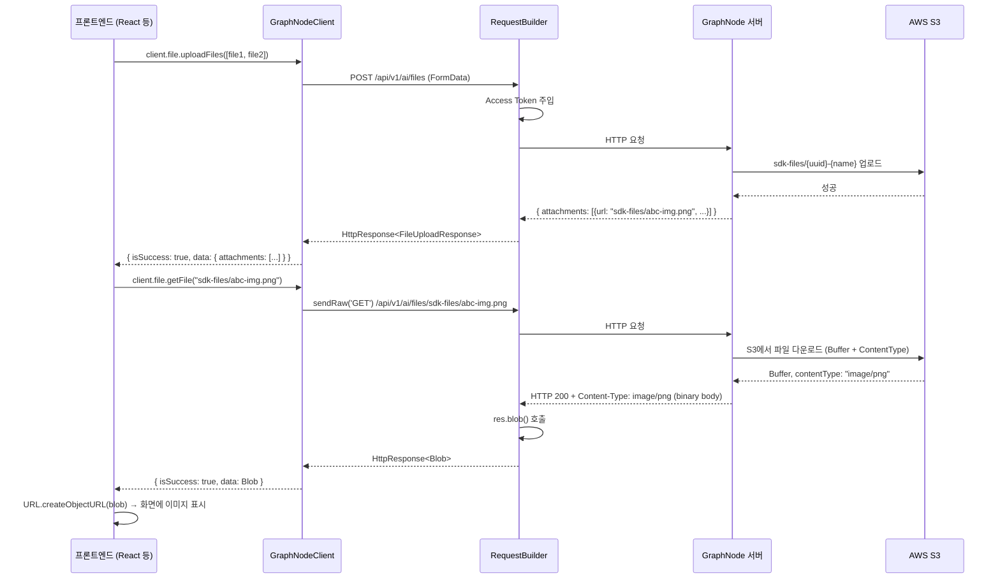

# GraphNode FE SDK 구조 및 설계 원리 가이드

> **대상 독자**: 이 SDK를 처음 접하는 초보 개발자 또는 내부 기여자  
> **목적**: SDK의 핵심 파일 역할, 내부 설계 원리, 각 동작 흐름을 완벽히 이해할 수 있도록 설명합니다.

---

## 1. SDK 전체 구조 한눈에 보기

```
z_npm_sdk/
└── src/
    ├── index.ts         ← 📦 SDK의 "정문(Barrel)" - 외부로 내보낼 것들을 선언
    ├── client.ts        ← 🏗️ 사용자가 실제로 쓰는 SDK 클라이언트 (시작점)
    ├── config.ts        ← ⚙️ 서버 Base URL 설정
    ├── http-builder.ts  ← 🔧 HTTP 요청 실행 엔진 (핵심 로직)
    ├── endpoints/       ← 📡 API 그룹별 메서드 모음
    │   ├── ai.ts           (AI 채팅)
    │   ├── file.ts         (파일 업로드/다운로드)
    │   ├── conversations.ts
    │   ├── graph.ts
    │   └── ...
    └── types/           ← 📋 TypeScript 타입 정의
        ├── file.ts
        ├── conversation.ts
        └── ...
```

---

## 2. 핵심 파일별 역할 설명

### 2-1. `index.ts` — SDK의 "정문(Barrel Export)"

**역할**: npm 패키지에서 외부로 공개할 클래스, 함수, 타입을 한 곳에서 명시합니다.

```typescript
// 예시 (실제 코드 요약)
export { createGraphNodeClient, GraphNodeClient } from './client.js';
export { FileApi } from './endpoints/file.js';
export type { FileAttachment, FileUploadResponse } from './types/file.js';
```

**왜 이렇게 하나요?**  
이 파일이 없으면, 사용자는 내부 파일 경로를 모두 알아야 합니다.  
예: `import { FileApi } from '@taco/sdk/src/endpoints/file'` — 너무 복잡합니다.  
Barrel Export 덕분에: `import { FileApi } from '@taco/sdk'` — 깔끔합니다.

---

### 2-2. `client.ts` — 사용자가 쓰는 진입점

**역할**: `GraphNodeClient`라는 하나의 객체에 모든 API 그룹을 묶어 제공합니다.

```typescript
// 사용 예시
const client = createGraphNodeClient({ accessToken: '...' });

await client.ai.chat(...);         // AI 채팅
await client.file.uploadFiles([]); // 파일 업로드
await client.graph.getSnapshot();  // 그래프 조회
```

**내부 구조 이해**:
```typescript
export class GraphNodeClient {
  readonly ai: AiApi;
  readonly file: FileApi;
  readonly graph: GraphApi;
  // ...

  constructor(opts: GraphNodeClientOptions) {
    // 1. fetch 함수 결정 (브라우저 or Node.js)
    // 2. RequestBuilder 생성 (HTTP 엔진)
    // 3. 각 API 그룹에 RequestBuilder 주입
    this.ai = new AiApi(this.rb);
    this.file = new FileApi(this.rb);
  }
}
```

**왜 이렇게 설계했나요?**  
- **단일 진입점**: 사용자는 `client` 하나만 알면 됩니다.
- **의존성 주입(DI)**: `RequestBuilder`를 모든 API 클래스에 주입해 공유합니다. 따라서 `setAccessToken()` 한 번 호출로 모든 API의 인증이 동시에 갱신됩니다.

---

### 2-3. `http-builder.ts` — HTTP 요청 실행 엔진 (가장 중요)

**역할**: 실제 HTTP 요청을 만들고 보내는 핵심 로직입니다. **Fluent Builder 패턴**을 사용합니다.

#### Fluent Builder란?
메서드를 연속으로 체이닝하여 URL을 조합하는 방식입니다:
```typescript
// 이렇게 URL이 쌓입니다:
rb.path('/v1/ai')          // → /v1/ai
  .path('/conversations')  // → /v1/ai/conversations
  .query({ limit: 10 })   // → /v1/ai/conversations?limit=10
  .get()                   // → GET 요청 실행
```

#### 핵심 메서드 구조

| 메서드 | 설명 |
|--------|------|
| `path(p)` | URL 경로 조각 추가 |
| `query(params)` | 쿼리 파라미터 추가 |
| `get<T>()` | GET 요청 → JSON 파싱 → `HttpResponse<T>` 반환 |
| `post<T>(body)` | POST 요청 (JSON 또는 FormData 자동 판별) |
| `sendRaw(method)` | **raw fetch Response 반환** (Blob, 스트림 처리용) |

#### 응답 타입 설계 (`HttpResponse<T>`)

SDK는 에러를 `throw`하지 않습니다. 대신 모든 결과를 타입으로 구분합니다:

```typescript
type HttpResponse<T> =
  | { isSuccess: true;  data: T; statusCode: number }
  | { isSuccess: false; error: { statusCode: number; message: string; body?: unknown } };
```

**왜 throw 대신 이 방식을 쓰나요?**  
- `try/catch`를 강제하지 않아 사용 편의성이 높아집니다.
- TypeScript 타입 추론이 완벽하게 동작합니다 (`isSuccess`로 narrowing).
- 네트워크 오류와 API 오류를 동일한 방식으로 처리할 수 있습니다.

```typescript
// 사용 예시
const res = await client.file.getFile('sdk-files/abc.png');
if (res.isSuccess) {
  console.log(res.data); // Blob - 타입이 자동으로 Blob으로 좁혀짐
} else {
  console.log(res.error.statusCode); // 404, 401 등
}
```

#### 자동 Access Token 주입

```typescript
// RequestBuilder 내부 (sendRaw 메서드)
if (this.accessToken) {
  const token = typeof this.accessToken === 'function'
    ? this.accessToken()  // 🔑 함수면 호출 (최신 토큰 반영!)
    : this.accessToken;
  headers['Authorization'] = `Bearer ${token}`;
}
```

`accessToken`을 함수로 받는 이유: `GraphNodeClient`가 `setAccessToken()`으로
토큰을 나중에 바꾸어도 RequestBuilder가 항상 **최신 토큰**을 참조할 수 있습니다.

#### 401 자동 갱신 로직

```
요청 → 401 응답
       ↓
   /auth/refresh 자동 호출
       ↓
   성공: 원래 요청 재시도
   실패: 원래 401 응답 반환
```

FE는 이 처리를 신경 쓸 필요 없습니다. SDK가 자동으로 처리합니다.

#### FormData 자동 감지

```typescript
if (body instanceof FormData) {
  init.body = body; // Content-Type 헤더 자동 설정 안 함 (브라우저가 boundary 처리)
} else {
  headers['Content-Type'] = 'application/json';
  init.body = JSON.stringify(body);
}
```

파일 업로드 시 `FormData`를 그대로 넘기면 됩니다. `Content-Type`을 수동으로 설정하면 `multipart/form-data`의 `boundary`가 빠져 오류가 납니다. SDK가 이를 방지합니다.

---

### 2-4. `endpoints/file.ts` — 파일 API

**`uploadFiles(files)`**:
1. `FormData`를 생성하고 파일들을 추가
2. `RequestBuilder.post(formData)` 호출
3. 서버가 S3에 업로드 후 `FileAttachment[]` 반환
4. 반환된 `attachment.url`이 파일 `key`

**`getFile(key)`**:
1. `sendRaw('GET')` 호출 — raw Response 획득
2. `res.ok` 확인 후 에러면 body를 읽어 에러 응답 반환
3. 성공이면 `res.blob()` 호출 → `Blob` 반환
4. FE는 `URL.createObjectURL(blob)`으로 이미지 표시 또는 강제 다운로드 가능

> **왜 `sendRaw`를 쓰나요?**  
> 기본 `get<T>()`는 응답을 `JSON.parse()` 합니다. 그러나 파일은 JSON이 아니라  
> 바이너리(PNG, PDF 등)입니다. `sendRaw`로 raw fetch Response를 얻어야 `.blob()`으로 처리할 수 있습니다.

---

## 3. 데이터 흐름 다이어그램



---

## 4. 자주 묻는 질문 (FAQ)

**Q: 왜 `fetch`를 직접 쓰지 않고 SDK를 씁니까?**  
A: 인증 토큰 자동 주입, 401 자동 갱신, 에러 정규화, 타입 안전성을 SDK가 모두 처리합니다.

**Q: Node.js 환경에서도 쓸 수 있나요?**  
A: 네. Node.js 18+ 기본 내장 `fetch`를 자동으로 사용합니다. 구버전은 `node-fetch`를 주입할 수 있습니다.

**Q: `res.data`와 `res.error`는 동시에 접근 가능한가요?**  
A: 아닙니다. `isSuccess`로 분기해야만 TypeScript가 타입을 좁혀줍니다.

**Q: 파일 다운로드 후 어떻게 사용하나요?**  
```typescript
// 이미지 표시
const blobUrl = URL.createObjectURL(res.data);
img.src = blobUrl;
// 사용 후 반드시 해제
URL.revokeObjectURL(blobUrl);

// 강제 다운로드
const a = document.createElement('a');
a.href = URL.createObjectURL(res.data);
a.download = '파일명.pdf';
a.click();
```

---

## 5. 파일 키(key) 네이밍 규칙

| 접두어 | 사용 주체 | 설명 |
|--------|-----------|------|
| `chat-files/` | 서버 내부 | AI 채팅 중 업로드된 파일 |
| `sdk-files/` | FE SDK | `client.file.uploadFiles()` 사용 시 |

형식: `{접두어}/{UUID}-{원본파일명}`  
예: `sdk-files/f47ac10b-58cc-4372-a567-0e02b2c3d479-report.pdf`
