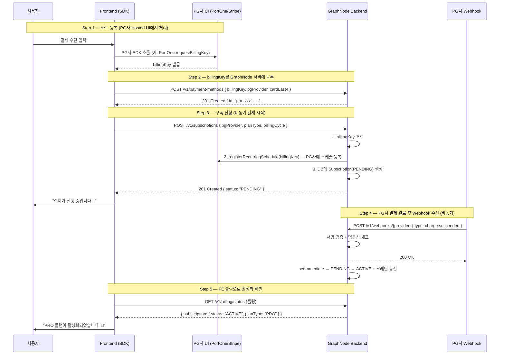

# Billing API Reference (`client.billing`)

구독 결제 수단 등록, 유료 구독 신청·취소, 환불, 결제 상태 조회를 담당합니다.
GraphNode의 결제 시스템은 **PG사(PortOne, Stripe, Toss)의 정기 결제 스케줄러에 위임하는 비동기 방식**으로 설계되어 있습니다.
FE는 결제 완료를 기다리지 않고, `201 Created` 수신 후 폴링으로 활성화 여부를 확인해야 합니다.

> **관련 문서**: BE 아키텍처 전체 흐름 → `docs/architecture/PAYMENT_SYSTEM_FLOW.md`

---

## ⚠️ 필수 전제 사항 (반드시 숙지)

> [!IMPORTANT]
> **카드 정보는 절대 이 SDK를 통해 전달하지 마십시오.**
> 카드 번호, CVV, 유효기간 등 민감 정보는 항상 PG사 공식 Hosted UI(PortOne SDK, Stripe Elements 등)에서
> 처리한 뒤, PG사가 발급한 `billingKey` 또는 `paymentMethodId`만 이 SDK로 전달해야 합니다.

> [!IMPORTANT]
> **`pgProvider`는 모든 결제 API에서 필수 파라미터입니다.**
> 백엔드는 ID 접두사(`sub_xxx`, `billingkey_xxx`) 등으로 PG사를 추론하지 않습니다.
> 결제 수단 등록, 구독 신청, 취소, 환불 모두 동일한 `pgProvider`를 명시적으로 전달해야 합니다.

> [!NOTE]
> **구독 신청(`createSubscription`) 후 상태는 즉시 `ACTIVE`가 되지 않습니다.**
> 실제 결제는 PG사 스케줄러가 비동기로 처리하며, 결제 완료 웹훅 수신 후 서버가 `PENDING → ACTIVE`로 전환합니다.
> FE는 `getBillingStatus()` 또는 `client.me.getCredits()`를 폴링하여 활성화 여부를 확인하세요.

---

## Summary

| 메서드 | 엔드포인트 | 설명 | 상태 코드 |
| :--- | :--- | :--- | :--- |
| `registerPaymentMethod(body)` | `POST /v1/payment-methods` | PG사 billingKey 등록 | 201, 400, 401, 409 |
| `createSubscription(body)` | `POST /v1/subscriptions` | 유료 구독 신청 (PENDING) | 201, 400, 401, 409 |
| `confirmPayment(body)` | `POST /v1/payments/confirm` | 단건 결제 결과 검증 | 200, 400, 401, 502 |
| `cancelSubscription(body)` | `POST /v1/subscriptions/cancel` | 구독 취소 신청 | 200, 400, 401, 404, 502 |
| `requestRefund(body)` | `POST /v1/refunds` | 전액/부분 환불 요청 | 202, 400, 401, 422, 502 |
| `getBillingStatus()` | `GET /v1/billing/status` | 구독 및 결제 수단 현황 조회 | 200, 401 |

### 공통 에러 상태 코드

| 코드 | 의미 | 재시도 |
| :--- | :--- | :--- |
| `400 Bad Request` | 필수 파라미터 누락 또는 Zod 검증 실패 | 불가 (요청 수정 필요) |
| `401 Unauthorized` | 로그인 세션 없음 또는 만료 | 불가 (재로그인 필요) |
| `404 Not Found` | 지정한 결제 수단/구독이 존재하지 않음 | 불가 |
| `409 Conflict` | 이미 동일한 자원이 존재 (중복 구독 등) | 불가 |
| `422 Unprocessable Entity` | 환불 불가 상태 (이미 환불됨 등) | 불가 |
| `502 Bad Gateway` | PG사 API 호출 실패 | 가능 (잠시 후 재시도) |

---

## 전체 결제 플로우 다이어그램



---

## Methods

### `registerPaymentMethod(body)`

PG사 공식 UI에서 발급받은 `billingKey`(결제 수단 참조값)를 GraphNode 서버에 등록합니다.
등록된 billingKey는 이후 구독 신청(`createSubscription`) 시 자동으로 사용됩니다.

> [!WARNING]
> 이 API를 호출하기 **전에** 반드시 PG사 공식 SDK(PortOne JS SDK, Stripe.js 등)로 카드 정보를 처리하고
> `billingKey`만 전달받아야 합니다. 카드 번호를 직접 이 API로 전달하는 것은 PCI-DSS 위반입니다.

- **Usage Example**

  ```typescript
  // PortOne Hosted UI에서 billingKey 발급 후
  const billingKey = await PortOne.requestBillingKey({
    storeId: 'store-xxx',
    channelKey: 'channel-key-xxx',
    billingKeyMethod: 'CARD',
  });

  // GraphNode 서버에 등록
  const res = await client.billing.registerPaymentMethod({
    pgProvider: 'PORTONE',
    billingKey: billingKey.billingKey,
    cardLast4: '1234',       // UI 표시용 (선택)
    isDefault: true,
  });

  if (res.isSuccess) {
    console.log('결제 수단 등록 완료:', res.data);
    // { id: 'pm_xxx', pgProvider: 'PORTONE', cardLast4: '1234', isDefault: true, ... }
  }
  ```

- **Request Body**

  ```typescript
  interface RegisterPaymentMethodRequest {
    pgProvider: 'PORTONE' | 'TOSS' | 'STRIPE'; // 필수
    billingKey: string;                          // PG사에서 발급받은 billingKey — 필수
    cardLast4?: string;                          // 카드 끝 4자리 (UI 표시용)
    externalCustomerId?: string;                 // Stripe customerId 등 PG사별 고객 ID
    isDefault?: boolean;                         // 기본 결제 수단 여부 (기본 true)
  }
  ```

- **Example Response Data**

  ```json
  {
    "id": "pm_abc123",
    "userId": "user-uuid",
    "pgProvider": "PORTONE",
    "billingKey": "billingkey_xxxx",
    "cardLast4": "1234",
    "isDefault": true,
    "createdAt": "2026-05-08T10:00:00.000Z"
  }
  ```

- **Status Codes**
  - `201 Created`: 결제 수단 등록 성공
  - `400 Bad Request`: `billingKey` 또는 `pgProvider` 누락 / 형식 오류
  - `401 Unauthorized`: 로그인 세션 없음
  - `409 Conflict`: 동일한 `billingKey`가 이미 등록됨

---

### `createSubscription(body)`

등록된 결제 수단을 사용하여 유료 구독을 신청합니다.

> [!IMPORTANT]
> 이 API 호출 즉시 결제가 완료되는 것이 **아닙니다**.
> 서버는 PG사 스케줄러에 정기 결제를 등록한 뒤 `PENDING` 상태의 구독을 반환합니다.
> 실제 결제 완료 후 PG사 Webhook을 통해 서버가 `ACTIVE`로 전환하고 크레딧을 충전합니다.
> **반드시 이후 `getBillingStatus()` 폴링으로 `ACTIVE` 전환을 확인하세요.**

- **Usage Example**

  ```typescript
  // 구독 신청
  const subscribeRes = await client.billing.createSubscription({
    pgProvider: 'PORTONE',
    planType: 'PRO',
    billingCycle: 'MONTHLY',
    // paymentMethodId를 생략하면 해당 pgProvider의 기본 결제 수단이 자동 사용됩니다
  });

  if (subscribeRes.isSuccess) {
    // status: 'PENDING' — 아직 결제 완료 대기 중
    console.log('구독 신청 완료 (결제 처리 중...):', subscribeRes.data.status);

    // 폴링: 2~5초 간격으로 ACTIVE 전환 확인
    let attempts = 0;
    const poll = setInterval(async () => {
      const statusRes = await client.billing.getBillingStatus();
      if (statusRes.data?.subscription?.status === 'ACTIVE' || attempts > 10) {
        clearInterval(poll);
        if (statusRes.data?.subscription?.status === 'ACTIVE') {
          showToast('PRO 플랜이 활성화되었습니다! 🎉');
        }
      }
      attempts++;
    }, 3000);
  }
  ```

- **Request Body**

  ```typescript
  interface CreateSubscriptionRequest {
    pgProvider: 'PORTONE' | 'TOSS' | 'STRIPE';       // 필수
    planType: 'PRO' | 'ENTERPRISE';                    // 필수 (FREE는 불가)
    billingCycle: 'MONTHLY' | 'YEARLY';                // 필수
    paymentMethodId?: string;                          // 미지정 시 기본 수단 자동 사용
  }
  ```

- **Example Response Data**

  ```json
  {
    "id": "sub_abc123",
    "userId": "user-uuid",
    "planType": "PRO",
    "status": "PENDING",
    "billingCycle": "MONTHLY",
    "currentPeriodStart": "2026-05-08T10:00:00.000Z",
    "currentPeriodEnd": "2026-06-08T10:00:00.000Z",
    "externalSubscriptionId": "portone_schedule_xxx"
  }
  ```

- **Status Codes**
  - `201 Created`: 구독 신청 완료 (`PENDING` 상태)
  - `400 Bad Request`: 필수 파라미터 누락 또는 `FREE` planType 지정 시도
  - `401 Unauthorized`: 로그인 세션 없음
  - `404 Not Found`: 지정한 `pgProvider`의 결제 수단이 등록되지 않음
  - `409 Conflict`: 이미 `ACTIVE` 또는 `PENDING` 구독이 존재함

---

### `confirmPayment(body)`

PG사 Hosted/Modal/Redirect 결제 UI 완료 후, 단건 결제 결과를 서버에 검증 요청합니다.
정기 구독이 아닌 **일회성 결제** 완료 확인 시 사용합니다.

- **Usage Example**

  ```typescript
  // PortOne 결제 후 imp_uid를 받았을 때
  const res = await client.billing.confirmPayment({
    pgProvider: 'PORTONE',
    transactionId: 'imp_uid_abc123',
  });

  if (res.isSuccess) {
    console.log('결제 검증 완료:', res.data.result);
  } else if (res.error?.statusCode === 502) {
    // PG사 검증 API 호출 실패 — 잠시 후 재시도 가능
    showToast('결제 검증에 실패했습니다. 잠시 후 다시 시도해주세요.');
  }
  ```

- **Request Body**

  ```typescript
  interface ConfirmPaymentRequest {
    pgProvider: 'PORTONE' | 'TOSS' | 'STRIPE'; // 필수
    transactionId: string;                       // 필수
    // PortOne: imp_uid / Toss: paymentKey / Stripe: PaymentIntent ID
  }
  ```

- **Status Codes**
  - `200 OK`: 결제 검증 성공
  - `400 Bad Request`: `transactionId` 누락 또는 PG사 검증 실패
  - `401 Unauthorized`: 로그인 세션 없음
  - `502 Bad Gateway`: PG사 검증 API 호출 실패 — 재시도 가능

---

### `cancelSubscription(body)`

현재 활성 구독을 취소합니다.

> [!NOTE]
> **즉시 서비스가 종료되지 않습니다.**
> Grace Period 정책(`billing.config.ts`)이 활성화된 경우,
> 취소 후에도 `currentPeriodEnd`까지는 서비스가 유지됩니다.
> 기간 만료 후 BillingCron이 `EXPIRED`로 전환하고 FREE 플랜으로 강등합니다.

- **Usage Example**

  ```typescript
  const res = await client.billing.cancelSubscription({
    pgProvider: 'PORTONE', // 구독 신청 시 사용한 PG사와 동일해야 합니다
  });

  if (res.isSuccess) {
    // status: 'CANCELED'
    console.log('구독 취소 완료:', res.data.status, res.data.currentPeriodEnd);
    showToast(`${res.data.currentPeriodEnd} 까지 서비스를 계속 이용하실 수 있습니다.`);
  } else if (res.error?.statusCode === 404) {
    showToast('취소할 활성 구독이 없습니다.');
  }
  ```

- **Request Body**

  ```typescript
  interface CancelSubscriptionRequest {
    pgProvider: 'PORTONE' | 'TOSS' | 'STRIPE'; // 필수 — 구독 신청 시와 동일한 PG사
  }
  ```

- **Status Codes**
  - `200 OK`: 구독 취소 신청 완료 (`CANCELED` 상태)
  - `400 Bad Request`: `pgProvider` 누락
  - `401 Unauthorized`: 로그인 세션 없음
  - `404 Not Found`: 취소할 활성 구독이 없음
  - `502 Bad Gateway`: PG사 취소 API 호출 실패 — 재시도 가능

---

### `requestRefund(body)`

결제 건에 대한 전액 또는 부분 환불을 요청합니다.

> [!CAUTION]
> 환불 완료 시 PG사 Webhook을 통해 서버가 구독을 `EXPIRED`로 전환하고 크레딧을 회수합니다.
> `billing.config.ts`의 `creditClawback` 정책에 따라 부여된 크레딧이 전액 회수될 수 있습니다.
> 이 동작은 되돌릴 수 없습니다.

- **Usage Example**

  ```typescript
  // 전액 환불
  const res = await client.billing.requestRefund({
    pgProvider: 'PORTONE',
    transactionId: 'imp_uid_abc123',
  });

  // 부분 환불 (5,000원)
  const partialRes = await client.billing.requestRefund({
    pgProvider: 'PORTONE',
    transactionId: 'imp_uid_abc123',
    amount: 5000,
    reason: '서비스 불만족으로 인한 부분 환불 요청',
  });

  if (partialRes.isSuccess) {
    console.log('환불 요청 완료, 환불 ID:', partialRes.data.refundId);
    // 실제 환불 처리는 PG사 → Webhook → 서버 순서로 비동기 처리됩니다
  } else if (partialRes.error?.statusCode === 422) {
    showToast('이미 환불된 결제건입니다.');
  }
  ```

- **Request Body**

  ```typescript
  interface RequestRefundRequest {
    pgProvider: 'PORTONE' | 'TOSS' | 'STRIPE'; // 필수
    transactionId: string;                       // 환불 대상 거래 ID — 필수
    amount?: number;                             // 부분 환불 금액 (원 단위). 미지정 시 전액
    reason?: string;                             // 환불 사유 (최대 500자)
  }
  ```

- **Example Response Data**

  ```json
  {
    "pgProvider": "PORTONE",
    "transactionId": "imp_uid_abc123",
    "refundId": "cancel_id_xyz789"
  }
  ```

- **Status Codes**
  - `202 Accepted`: 환불 요청 접수 완료 (실제 환불 처리는 PG사에서 비동기 진행)
  - `400 Bad Request`: `transactionId` 또는 `pgProvider` 누락
  - `401 Unauthorized`: 로그인 세션 없음
  - `422 Unprocessable Entity`: 환불 불가 상태 (이미 환불됨, 환불 기간 초과 등)
  - `502 Bad Gateway`: PG사 환불 API 호출 실패 — 재시도 가능

---

### `getBillingStatus()`

현재 로그인한 사용자의 구독 정보와 등록된 결제 수단 목록을 조회합니다.
`createSubscription()` 호출 후 `ACTIVE` 전환 여부를 폴링할 때 주로 사용합니다.

- **Usage Example**

  ```typescript
  const res = await client.billing.getBillingStatus();

  if (res.isSuccess) {
    const { subscription, paymentMethods } = res.data;

    if (!subscription) {
      console.log('구독 없음 — FREE 사용자');
    } else {
      console.log('현재 플랜:', subscription.planType); // 'FREE' | 'PRO' | 'ENTERPRISE'
      console.log('구독 상태:', subscription.status);   // 'ACTIVE' | 'PENDING' | 'CANCELED'
      console.log('만료일:', subscription.currentPeriodEnd);
    }

    console.log('등록된 결제 수단:', paymentMethods.length, '개');
  }
  ```

- **Response Type**

  ```typescript
  interface BillingStatusResponse {
    subscription: SubscriptionRow | null; // 활성 구독 없으면 null
    paymentMethods: UserPaymentMethodRow[]; // 없으면 빈 배열 []
  }

  // 구독 상태값 참고
  // status: 'ACTIVE' | 'PENDING' | 'CANCELED' | 'EXPIRED'
  // planType: 'FREE' | 'PRO' | 'ENTERPRISE'
  ```

- **Example Response Data**

  ```json
  {
    "subscription": {
      "id": "sub_abc123",
      "planType": "PRO",
      "status": "ACTIVE",
      "billingCycle": "MONTHLY",
      "currentPeriodStart": "2026-05-08T10:00:00.000Z",
      "currentPeriodEnd": "2026-06-08T10:00:00.000Z",
      "canceledAt": null
    },
    "paymentMethods": [
      {
        "id": "pm_abc123",
        "pgProvider": "PORTONE",
        "cardLast4": "1234",
        "isDefault": true
      }
    ]
  }
  ```

  **구독이 없는 경우 (FREE 사용자):**
  ```json
  {
    "subscription": null,
    "paymentMethods": []
  }
  ```

- **Status Codes**
  - `200 OK`: 조회 성공 (구독 없는 경우에도 200, `subscription: null` 반환)
  - `401 Unauthorized`: 로그인 세션 없음

---

## 구독 상태 참조표

| 상태 | 의미 | 서비스 접근 | FE 처리 가이드 |
| :--- | :--- | :--- | :--- |
| `ACTIVE` | 정상 활성 구독 | ✅ 전체 권한 | 정상 서비스 제공 |
| `PENDING` | 구독 신청 완료, 첫 결제 대기 | ❌ 대기 중 | "결제 처리 중" 표시 후 폴링 |
| `CANCELED` | 취소 신청됨 (grace period) | ✅ `currentPeriodEnd`까지 | 만료일 안내 표시 |
| `EXPIRED` | 기간 만료 / 결제 실패 | ❌ FREE 전환됨 | 업그레이드 유도 UI 표시 |

---

## 완전한 구독 플로우 예시 코드

```typescript
import { createGraphNodeClient } from '@taco_tsinghua/graphnode-sdk';

const client = createGraphNodeClient({ baseUrl: 'https://api.graphnode.dev' });

async function subscribeToPro(cardInfo: { billingKey: string; cardLast4: string }) {
  // Step 1: 결제 수단 등록
  const pmRes = await client.billing.registerPaymentMethod({
    pgProvider: 'PORTONE',
    billingKey: cardInfo.billingKey,
    cardLast4: cardInfo.cardLast4,
    isDefault: true,
  });
  if (!pmRes.isSuccess) throw new Error(`결제 수단 등록 실패: ${pmRes.error?.message}`);

  // Step 2: 구독 신청
  const subRes = await client.billing.createSubscription({
    pgProvider: 'PORTONE',
    planType: 'PRO',
    billingCycle: 'MONTHLY',
  });
  if (!subRes.isSuccess) throw new Error(`구독 신청 실패: ${subRes.error?.message}`);
  
  console.log('구독 신청 완료 — 결제 처리 중 (PENDING)');

  // Step 3: ACTIVE 전환 폴링 (최대 30초, 3초 간격)
  for (let i = 0; i < 10; i++) {
    await new Promise((r) => setTimeout(r, 3000));
    const statusRes = await client.billing.getBillingStatus();
    if (statusRes.data?.subscription?.status === 'ACTIVE') {
      console.log('🎉 PRO 플랜 활성화 완료!');
      return statusRes.data.subscription;
    }
  }

  throw new Error('결제 처리 시간이 초과되었습니다. 결제 현황을 확인해주세요.');
}
```

---

## Remarks

> [!TIP]
> **폴링 주기 권장**: `createSubscription()` 후 2~3초 간격으로 최대 10회 폴링을 권장합니다.
> 네트워크 상태에 따라 PG사 Webhook 도달까지 수 초 소요될 수 있습니다.

> [!TIP]
> **크레딧 잔액으로 활성화 확인**: 구독 상태 대신 `client.me.getCredits()`로 `planType`과 `balance` 변화를 확인하는 방법도 있습니다. PRO 활성화 시 `balance`가 500으로 증가합니다.

> [!NOTE]
> **FREE 구독 자동 생성**: 신규 가입 또는 구독이 없는 기존 사용자가 로그인하면, 서버가 자동으로 FREE 구독을 생성합니다 (비동기, idempotent). FE에서 별도로 FREE 구독을 신청할 필요가 없습니다.

> [!WARNING]
> **pgProvider 일관성**: 결제 수단 등록, 구독 신청, 취소 시 **동일한 `pgProvider`를 사용**해야 합니다. PortOne으로 등록한 billingKey를 Stripe pgProvider로 구독 신청할 수 없습니다.
