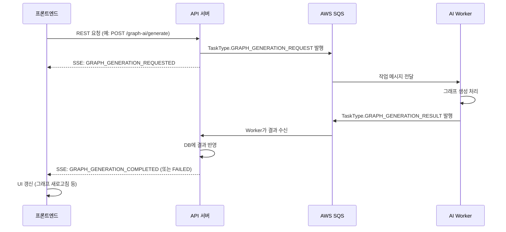

# 실시간 알림 이벤트 타입 (Notification & TaskType)

> **대상 독자:** GraphNode SDK를 사용하는 프론트엔드 개발자  
> **핵심 질문에 대한 답변:** "서버로부터 어떤 알림이 오고, 그 데이터는 어떻게 생겼는가?"

---

## 개요: 두 가지 타입의 역할

GraphNode 백엔드에는 두 가지 비동기 이벤트 식별자가 존재합니다.

| 타입 | 위치 | 누가 씀 | 목적 |
| --- | --- | --- | --- |
| **`TaskType`** | `types/notification` | 서버 내부 (SQS) | API ↔ AI Worker 간의 작업 메시지 분류자 |
| **`NotificationType`** | `types/notification` | FE ← 서버 (SSE) | FE에 실시간으로 Push되는 이벤트 이름 |

**FE 개발자가 직접 사용하는 것은 `NotificationType`** 입니다.  
`TaskType`은 SDK에 정의되어 있으나, 주로 어떤 작업이 어떤 알림을 발생시키는지 이해하기 위한 참조용입니다.

---

## 아키텍처 플로우



---

## TaskType 상세

SQS 파이프라인의 내부 메시지 식별자입니다. FE는 직접 사용할 일이 거의 없지만, 어떤 작업이 어떤 알림을 유발하는지 이해하는 데 유용합니다.

```typescript
import { TaskType } from '@taco_tsinghua/graphnode-sdk';
```

| 값 | 방향 | 설명 |
| --- | --- | --- |
| `GRAPH_GENERATION_REQUEST` | API → AI | 전체 그래프 최초 생성 요청 |
| `GRAPH_GENERATION_RESULT` | AI → Worker | 그래프 생성 결과 반환 |
| `GRAPH_SUMMARY_REQUEST` | API → AI | 그래프 AI 요약 생성 요청 |
| `GRAPH_SUMMARY_RESULT` | AI → Worker | 그래프 요약 결과 반환 |
| `ADD_NODE_REQUEST` | API → AI | 새 대화를 기존 그래프에 추가 요청 |
| `ADD_NODE_RESULT` | AI → Worker | AddNode 결과 반환 |
| `MICROSCOPE_INGEST_FROM_NODE_REQUEST` | API → AI | Microscope 문서 분석 요청 |
| `MICROSCOPE_INGEST_FROM_NODE_RESULT` | AI → Worker | Microscope 분석 결과 반환 |

### TaskType과 NotificationType 매핑

```text
TaskType.GRAPH_GENERATION_REQUEST 발행 시
  → (즉시)  NotificationType.GRAPH_GENERATION_REQUESTED
  → (완료)  NotificationType.GRAPH_GENERATION_COMPLETED
  → (실패)  NotificationType.GRAPH_GENERATION_FAILED

TaskType.GRAPH_SUMMARY_REQUEST 발행 시
  → (즉시)  NotificationType.GRAPH_SUMMARY_REQUESTED
  → (완료)  NotificationType.GRAPH_SUMMARY_COMPLETED
  → (실패)  NotificationType.GRAPH_SUMMARY_FAILED

TaskType.ADD_NODE_REQUEST 발행 시
  → (즉시)  NotificationType.ADD_CONVERSATION_REQUESTED
  → (완료)  NotificationType.ADD_CONVERSATION_COMPLETED
  → (실패)  NotificationType.ADD_CONVERSATION_FAILED

TaskType.MICROSCOPE_INGEST_FROM_NODE_REQUEST 발행 시
  → (즉시)  NotificationType.MICROSCOPE_INGEST_REQUESTED
  → (완료)  NotificationType.MICROSCOPE_DOCUMENT_COMPLETED
  → (실패)  NotificationType.MICROSCOPE_DOCUMENT_FAILED
  → (전체 완료) NotificationType.MICROSCOPE_WORKSPACE_COMPLETED
```

---

## NotificationType 상세

FE가 SSE 스트림에서 실제로 수신하는 이벤트 이름입니다.

```typescript
import { NotificationType, NotificationTypeValue } from '@taco_tsinghua/graphnode-sdk';
```

### 그래프 생성 관련

| 이벤트 값 | 발생 시점 | Payload 타입 |
| --- | --- | --- |
| `GRAPH_GENERATION_REQUESTED` | 요청이 서버에 정상 접수됨 | `GraphGenerationRequestedPayload` |
| `GRAPH_GENERATION_REQUEST_FAILED` | 요청 접수 자체가 실패 | `GraphGenerationRequestFailedPayload` |
| `GRAPH_GENERATION_COMPLETED` | AI가 그래프 생성 완료 + DB 반영 완료 | `GraphGenerationCompletedPayload` |
| `GRAPH_GENERATION_FAILED` | AI 생성 실패 또는 DB 반영 실패 | `GraphGenerationFailedPayload` |

### 그래프 요약 관련

| 이벤트 값 | 발생 시점 | Payload 타입 |
| --- | --- | --- |
| `GRAPH_SUMMARY_REQUESTED` | 요약 요청 접수 | `GraphSummaryRequestedPayload` |
| `GRAPH_SUMMARY_REQUEST_FAILED` | 요약 요청 접수 실패 | `GraphSummaryRequestFailedPayload` |
| `GRAPH_SUMMARY_COMPLETED` | AI가 요약 생성 완료 | `GraphSummaryCompletedPayload` |
| `GRAPH_SUMMARY_FAILED` | 요약 생성 실패 | `GraphSummaryFailedPayload` |

### 대화 추가(Add Node) 관련

| 이벤트 값 | 발생 시점 | Payload 타입 |
| --- | --- | --- |
| `ADD_CONVERSATION_REQUESTED` | 대화 추가 요청 접수 | `AddConversationRequestedPayload` |
| `ADD_CONVERSATION_REQUEST_FAILED` | 대화 추가 요청 실패 | `AddConversationRequestFailedPayload` |
| `ADD_CONVERSATION_COMPLETED` | 새 대화가 그래프에 추가 완료 | `AddConversationCompletedPayload` |
| `ADD_CONVERSATION_FAILED` | 대화 추가 실패 | `AddConversationFailedPayload` |

### Microscope 문서 분석 관련

| 이벤트 값 | 발생 시점 | Payload 타입 |
| --- | --- | --- |
| `MICROSCOPE_INGEST_REQUESTED` | 문서 분석 요청 접수 | `MicroscopeIngestRequestedPayload` |
| `MICROSCOPE_INGEST_REQUEST_FAILED` | 분석 요청 접수 실패 | `MicroscopeIngestRequestFailedPayload` |
| `MICROSCOPE_DOCUMENT_COMPLETED` | 단일 문서 분석 완료 | `MicroscopeDocumentCompletedPayload` |
| `MICROSCOPE_DOCUMENT_FAILED` | 단일 문서 분석 실패 | `MicroscopeDocumentFailedPayload` |
| `MICROSCOPE_WORKSPACE_COMPLETED` | 워크스페이스 전체 Ingest 완료 | `MicroscopeWorkspaceCompletedPayload` |

---

## Payload 타입 상세

모든 Payload는 `BaseNotificationPayload`를 상속합니다.

```typescript
interface BaseNotificationPayload {
  taskId: string;    // 작업 고유 ID (요청 시 받은 taskId와 동일)
  timestamp: string; // ISO 8601 이벤트 발생 시각
}
```

### `AddConversationCompletedPayload` (추가 필드 있음)

```typescript
interface AddConversationCompletedPayload extends BaseNotificationPayload {
  nodeCount: number; // 새로 추가된 노드 수
  edgeCount: number; // 새로 추가된 엣지 수
}
```

### `MicroscopeDocumentCompletedPayload` (추가 필드 있음)

```typescript
interface MicroscopeDocumentCompletedPayload extends BaseNotificationPayload {
  sourceId?: string;    // 분석 완료된 문서의 Neo4j 소스 노드 ID
  chunksCount?: number; // 문서에서 추출된 청크 수
}
```

### 실패 Payload (공통 패턴)

```typescript
interface *FailedPayload extends BaseNotificationPayload {
  error: string; // 실패 원인 메시지
}
```

---

## SDK 사용 예제

### 기본 알림 스트림 수신

```typescript
import {
  NotificationType,
  type NotificationEvent,
} from '@taco_tsinghua/graphnode-sdk';

const closeStream = client.notification.stream((event: NotificationEvent) => {
  switch (event.type) {
    case NotificationType.GRAPH_GENERATION_COMPLETED:
      // 그래프 생성 완료 → 데이터 새로고침
      await refreshGraphData();
      showToast('그래프가 생성되었습니다!', 'success');
      break;

    case NotificationType.GRAPH_GENERATION_FAILED:
      showToast(`그래프 생성 실패: ${event.payload.error}`, 'error');
      break;

    case NotificationType.ADD_CONVERSATION_COMPLETED:
      const { nodeCount, edgeCount } = event.payload;
      showToast(`${nodeCount}개 노드, ${edgeCount}개 엣지 추가 완료`, 'success');
      break;

    case NotificationType.MICROSCOPE_DOCUMENT_COMPLETED:
      console.log('문서 분석 완료. 소스 ID:', event.payload.sourceId);
      break;
  }
});

// 컴포넌트 언마운트 시 스트림 종료
onUnmount(() => closeStream());
```

### 타입 가드 패턴 (고급)

```typescript
import {
  NotificationType,
  type AddConversationCompletedPayload,
  type NotificationEvent,
} from '@taco_tsinghua/graphnode-sdk';

function isAddCompleted(
  event: NotificationEvent
): event is { type: typeof NotificationType.ADD_CONVERSATION_COMPLETED; payload: AddConversationCompletedPayload } {
  return event.type === NotificationType.ADD_CONVERSATION_COMPLETED;
}

client.notification.stream((event) => {
  if (isAddCompleted(event)) {
    // event.payload.nodeCount 타입 안전하게 사용 가능
    console.log(event.payload.nodeCount);
  }
});
```

---

## 관련 링크

- [Notification API 엔드포인트](../endpoints/notification.md)
- [Graph AI API](../endpoints/graphAi.md)
- [Microscope API](../endpoints/microscope.md)
- [타입 전체 목록](./overview.md)
