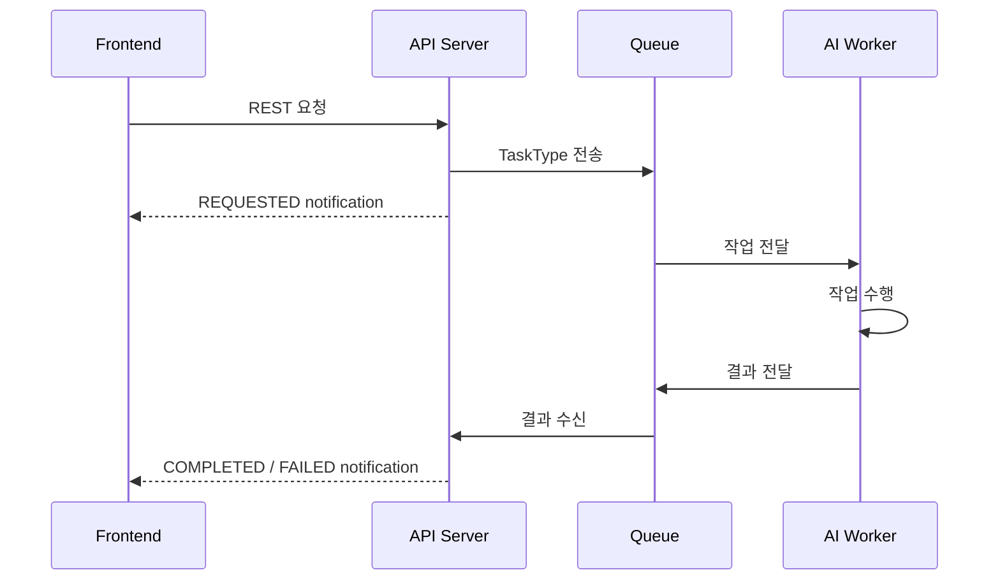

# 알림 타입 문서 (Notification & TaskType)

> **대상 독자:** GraphNode SDK를 사용하는 프론트엔드 개발자
> **핵심 질문:** "어떤 notification 이벤트가 오고, 각 이벤트의 payload는 무엇이며, FE에서는 어떤 타입을 써야 하나?"

---

## 개요: 두 종류의 타입

GraphNode 알림 시스템에는 역할이 다른 두 축의 타입이 있습니다.

| 타입 | 위치 | 사용하는 쪽 | 의미 |
| --- | --- | --- | --- |
| `TaskType` | `types/notification` | 서버, 워커, 큐 | API와 Worker 사이에서 주고받는 작업 식별자 |
| `NotificationType` | `types/notification` | 프론트엔드 | SSE/WebSocket으로 FE에 전달되는 알림 이벤트 종류 |

FE에서는 일반적으로 `NotificationType`과 notification event 타입만 사용하면 됩니다.

---

## 흐름



---

## TaskType

```typescript
import { TaskType } from '@taco_tsinghua/graphnode-sdk';
```

| 값 | 방향 | 설명 |
| --- | --- | --- |
| `GRAPH_GENERATION_REQUEST` | API -> AI | 그래프 생성 요청 |
| `GRAPH_GENERATION_PROGRESS` | AI -> API | 그래프 생성 중간 진행률(result SQS) |
| `GRAPH_GENERATION_RESULT` | AI -> API | 그래프 생성 결과 |
| `GRAPH_SUMMARY_REQUEST` | API -> AI | 그래프 요약 요청 |
| `GRAPH_SUMMARY_RESULT` | AI -> API | 그래프 요약 결과 |
| `ADD_NODE_REQUEST` | API -> AI | 새 대화를 그래프에 반영하는 요청 |
| `ADD_NODE_RESULT` | AI -> API | Add node 결과 |
| `MICROSCOPE_INGEST_FROM_NODE_REQUEST` | API -> AI | Microscope ingest 요청 |
| `MICROSCOPE_INGEST_FROM_NODE_RESULT` | AI -> API | Microscope ingest 결과 |

### TaskType와 NotificationType의 관계

```text
GRAPH_GENERATION_REQUEST
  -> GRAPH_GENERATION_REQUESTED
  -> GRAPH_GENERATION_PROGRESS_UPDATED (여러 번)
  -> GRAPH_GENERATION_COMPLETED | GRAPH_GENERATION_FAILED

GRAPH_SUMMARY_REQUEST
  -> GRAPH_SUMMARY_REQUESTED
  -> GRAPH_SUMMARY_COMPLETED | GRAPH_SUMMARY_FAILED

ADD_NODE_REQUEST
  -> ADD_CONVERSATION_REQUESTED
  -> ADD_CONVERSATION_COMPLETED | ADD_CONVERSATION_FAILED

MICROSCOPE_INGEST_FROM_NODE_REQUEST
  -> MICROSCOPE_INGEST_REQUESTED
  -> MICROSCOPE_DOCUMENT_COMPLETED | MICROSCOPE_DOCUMENT_FAILED
  -> MICROSCOPE_WORKSPACE_COMPLETED
```

---

## NotificationType

```typescript
import { NotificationType, type NotificationTypeValue } from '@taco_tsinghua/graphnode-sdk';
```

### 그래프 생성 이벤트

| 이벤트 | 설명 | Payload 타입 | 완성형 Event 타입 |
| --- | --- | --- | --- |
| `GRAPH_GENERATION_REQUESTED` | 그래프 생성 요청이 접수됨 | `GraphGenerationRequestedPayload` | `GraphGenerationRequestedNotificationEvent` |
| `GRAPH_GENERATION_REQUEST_FAILED` | 그래프 생성 요청 접수 자체가 실패 | `GraphGenerationRequestFailedPayload` | `GraphGenerationRequestFailedNotificationEvent` |
| `GRAPH_GENERATION_COMPLETED` | 그래프 생성과 저장이 완료됨 | `GraphGenerationCompletedPayload` | `GraphGenerationCompletedNotificationEvent` |
| `GRAPH_GENERATION_FAILED` | 그래프 생성 또는 저장이 실패함 | `GraphGenerationFailedPayload` | `GraphGenerationFailedNotificationEvent` |
| `GRAPH_GENERATION_PROGRESS_UPDATED` | 그래프 생성 진행률 중간 이벤트 | `GraphGenerationProgressPayload` | `GraphGenerationProgressNotificationEvent` |

### 그래프 요약 이벤트

| 이벤트 | 설명 | Payload 타입 | 완성형 Event 타입 |
| --- | --- | --- | --- |
| `GRAPH_SUMMARY_REQUESTED` | 그래프 요약 요청이 접수됨 | `GraphSummaryRequestedPayload` | `GraphSummaryRequestedNotificationEvent` |
| `GRAPH_SUMMARY_REQUEST_FAILED` | 그래프 요약 요청 접수 자체가 실패 | `GraphSummaryRequestFailedPayload` | `GraphSummaryRequestFailedNotificationEvent` |
| `GRAPH_SUMMARY_COMPLETED` | 그래프 요약 생성이 완료됨 | `GraphSummaryCompletedPayload` | `GraphSummaryCompletedNotificationEvent` |
| `GRAPH_SUMMARY_FAILED` | 그래프 요약 생성이 실패함 | `GraphSummaryFailedPayload` | `GraphSummaryFailedNotificationEvent` |

### 대화 추가 이벤트

| 이벤트 | 설명 | Payload 타입 | 완성형 Event 타입 |
| --- | --- | --- | --- |
| `ADD_CONVERSATION_REQUESTED` | 새 대화 추가 요청이 접수됨 | `AddConversationRequestedPayload` | `AddConversationRequestedNotificationEvent` |
| `ADD_CONVERSATION_REQUEST_FAILED` | 새 대화 추가 요청 접수 자체가 실패 | `AddConversationRequestFailedPayload` | `AddConversationRequestFailedNotificationEvent` |
| `ADD_CONVERSATION_COMPLETED` | 새 대화가 그래프에 반영 완료됨 | `AddConversationCompletedPayload` | `AddConversationCompletedNotificationEvent` |
| `ADD_CONVERSATION_FAILED` | 새 대화 반영이 실패함 | `AddConversationFailedPayload` | `AddConversationFailedNotificationEvent` |

### Microscope 이벤트

| 이벤트 | 설명 | Payload 타입 | 완성형 Event 타입 |
| --- | --- | --- | --- |
| `MICROSCOPE_INGEST_REQUESTED` | ingest 요청이 접수됨 | `MicroscopeIngestRequestedPayload` | `MicroscopeIngestRequestedNotificationEvent` |
| `MICROSCOPE_INGEST_REQUEST_FAILED` | ingest 요청 접수 자체가 실패 | `MicroscopeIngestRequestFailedPayload` | `MicroscopeIngestRequestFailedNotificationEvent` |
| `MICROSCOPE_DOCUMENT_COMPLETED` | 단일 문서 ingest가 완료됨 | `MicroscopeDocumentCompletedPayload` | `MicroscopeDocumentCompletedNotificationEvent` |
| `MICROSCOPE_DOCUMENT_FAILED` | 단일 문서 ingest가 실패함 | `MicroscopeDocumentFailedPayload` | `MicroscopeDocumentFailedNotificationEvent` |
| `MICROSCOPE_WORKSPACE_COMPLETED` | 워크스페이스 ingest가 완료됨 | `MicroscopeWorkspaceCompletedPayload` | `MicroscopeWorkspaceCompletedNotificationEvent` |

---

## Payload 타입

모든 payload는 `BaseNotificationPayload`를 상속합니다.

```typescript
interface BaseNotificationPayload {
  taskId: string;
  timestamp: string;
}
```

### 실패 계열 payload

아래 이벤트들은 공통적으로 `error: string`을 가집니다.

- `GRAPH_GENERATION_REQUEST_FAILED`
- `GRAPH_GENERATION_FAILED`
- `GRAPH_SUMMARY_REQUEST_FAILED`
- `GRAPH_SUMMARY_FAILED`
- `ADD_CONVERSATION_REQUEST_FAILED`
- `ADD_CONVERSATION_FAILED`
- `MICROSCOPE_INGEST_REQUEST_FAILED`
- `MICROSCOPE_DOCUMENT_FAILED`

```typescript
interface FailedPayload extends BaseNotificationPayload {
  error: string;
}
```

### 추가 필드가 있는 payload

```typescript
interface GraphGenerationProgressPayload extends BaseNotificationPayload {
  currentStage: string;
  progressPercent: number;
  etaSeconds: number | null;
}

interface AddConversationCompletedPayload extends BaseNotificationPayload {
  nodeCount: number;
  edgeCount: number;
}

interface MicroscopeDocumentCompletedPayload extends BaseNotificationPayload {
  sourceId?: string;
  chunksCount?: number;
}
```

---

## Event 타입 계층

SDK에는 세 층의 notification event 타입이 있습니다.

| 타입 | 의미 | 사용 시점 |
| --- | --- | --- |
| `NotificationEvent` | raw event 공통 형태 | 서버 응답 원형을 그대로 다룰 때 |
| `TypedNotificationEvent` | 모든 이벤트의 discriminated union | FE에서 `switch (event.type)`로 처리할 때 권장 |
| `NotificationEventByType<T>` | 특정 `NotificationType` 하나에 대응하는 이벤트 | 특정 이벤트 핸들러 시그니처를 만들 때 |

### `NotificationPayloadMap`

`NotificationType`과 payload 타입의 연결 테이블입니다.

```typescript
type Payload = NotificationPayloadMap[typeof NotificationType.ADD_CONVERSATION_COMPLETED];
// AddConversationCompletedPayload
```

### `TypedNotificationEvent`

모든 완성형 이벤트를 합친 discriminated union입니다.

```typescript
import {
  NotificationType,
  type TypedNotificationEvent,
} from '@taco_tsinghua/graphnode-sdk';

client.notification.stream((event: TypedNotificationEvent) => {
  switch (event.type) {
    case NotificationType.ADD_CONVERSATION_COMPLETED:
      console.log(event.payload.nodeCount, event.payload.edgeCount);
      break;

    case NotificationType.GRAPH_GENERATION_PROGRESS_UPDATED:
      console.log(event.payload.progressPercent);
      break;

    case NotificationType.GRAPH_GENERATION_FAILED:
      console.error(event.payload.error);
      break;
  }
});
```

### `NotificationEventByType<T>`

특정 이벤트 전용 핸들러 타입을 만들 때 사용합니다.

```typescript
import {
  NotificationType,
  type NotificationEventByType,
} from '@taco_tsinghua/graphnode-sdk';

type AddConversationCompletedEvent =
  NotificationEventByType<typeof NotificationType.ADD_CONVERSATION_COMPLETED>;

function handleAddConversationCompleted(event: AddConversationCompletedEvent) {
  console.log(event.payload.nodeCount);
}
```

### 이벤트별 완성형 interface 타입

필요하면 이벤트별 interface를 직접 가져다 쓸 수도 있습니다.

| 이벤트 | 타입 |
| --- | --- |
| `GRAPH_GENERATION_REQUESTED` | `GraphGenerationRequestedNotificationEvent` |
| `GRAPH_GENERATION_REQUEST_FAILED` | `GraphGenerationRequestFailedNotificationEvent` |
| `GRAPH_GENERATION_COMPLETED` | `GraphGenerationCompletedNotificationEvent` |
| `GRAPH_GENERATION_FAILED` | `GraphGenerationFailedNotificationEvent` |
| `GRAPH_GENERATION_PROGRESS_UPDATED` | `GraphGenerationProgressNotificationEvent` |
| `GRAPH_SUMMARY_REQUESTED` | `GraphSummaryRequestedNotificationEvent` |
| `GRAPH_SUMMARY_REQUEST_FAILED` | `GraphSummaryRequestFailedNotificationEvent` |
| `GRAPH_SUMMARY_COMPLETED` | `GraphSummaryCompletedNotificationEvent` |
| `GRAPH_SUMMARY_FAILED` | `GraphSummaryFailedNotificationEvent` |
| `ADD_CONVERSATION_REQUESTED` | `AddConversationRequestedNotificationEvent` |
| `ADD_CONVERSATION_REQUEST_FAILED` | `AddConversationRequestFailedNotificationEvent` |
| `ADD_CONVERSATION_COMPLETED` | `AddConversationCompletedNotificationEvent` |
| `ADD_CONVERSATION_FAILED` | `AddConversationFailedNotificationEvent` |
| `MICROSCOPE_INGEST_REQUESTED` | `MicroscopeIngestRequestedNotificationEvent` |
| `MICROSCOPE_INGEST_REQUEST_FAILED` | `MicroscopeIngestRequestFailedNotificationEvent` |
| `MICROSCOPE_DOCUMENT_COMPLETED` | `MicroscopeDocumentCompletedNotificationEvent` |
| `MICROSCOPE_DOCUMENT_FAILED` | `MicroscopeDocumentFailedNotificationEvent` |
| `MICROSCOPE_WORKSPACE_COMPLETED` | `MicroscopeWorkspaceCompletedNotificationEvent` |

---

## SDK 사용 예시

### 권장 방식: `TypedNotificationEvent`

```typescript
import {
  NotificationType,
  type TypedNotificationEvent,
} from '@taco_tsinghua/graphnode-sdk';

const close = client.notification.stream((event: TypedNotificationEvent) => {
  switch (event.type) {
    case NotificationType.GRAPH_GENERATION_COMPLETED:
      refreshGraph();
      break;

    case NotificationType.ADD_CONVERSATION_COMPLETED:
      showToast(`${event.payload.nodeCount}개 노드 추가 완료`);
      break;

    case NotificationType.MICROSCOPE_DOCUMENT_FAILED:
      showErrorToast(event.payload.error);
      break;
  }
});
```

### raw `NotificationEvent`를 좁혀 쓰는 방식

```typescript
import {
  NotificationType,
  type NotificationEvent,
  type NotificationEventByType,
} from '@taco_tsinghua/graphnode-sdk';

function isAddCompleted(
  event: NotificationEvent
): event is NotificationEventByType<typeof NotificationType.ADD_CONVERSATION_COMPLETED> {
  return event.type === NotificationType.ADD_CONVERSATION_COMPLETED;
}
```

---

## 관련 문서

- [Notification API](../endpoints/notification.md)
- [Graph AI API](../endpoints/graphAi.md)
- [Microscope API](../endpoints/microscope.md)
- [타입 개요](./overview.md)
